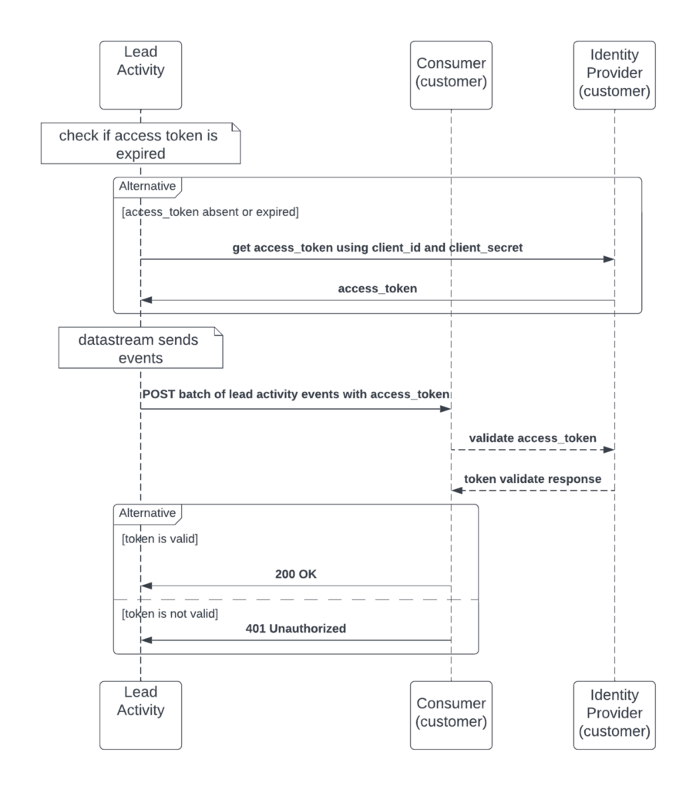

# Datenströme

>[!NOTE]
> Aktuelle Informationen zu Datenströmen finden Sie jetzt unter [Verwenden von Datenströmen](https://developer.adobe.com/events/docs/guides/using/marketo/marketo-data-streams/).
>

Die Marketing-Organisationen unserer Kunden verlassen sich auf rechtzeitige und fokussierte Marketing-Kampagnen, um über ihr Geschäft auf dem Laufenden zu bleiben und wettbewerbsfähig zu sein. Um schnelle Entscheidungen zu unterstützen und strategische Änderungen schnell zu ermöglichen, ist es wichtig, über Daten zu verfügen, die die wichtigen Entscheidungen unterstützen und vorantreiben, die zielgerichtete und zielgerichtete Kampagnen liefern. Es gibt auch einige Kundinnen und Kunden, die Marketing-Maßnahmen auf der Ebene ihrer Kundensegmente sowohl innerhalb als auch außerhalb von Marketo Engage durchführen. Um diese verschiedenen Bemühungen zu unterstützen, hat Marketo die Möglichkeit geschaffen, große Datenmengen nahezu in Echtzeit über Datenströme zu erfassen.

Neben den Vorteilen von nahezu Echtzeitdaten gibt es produktbezogene Vorteile:

- Beseitigt den Engpass bei API-Beschränkungen, da stattdessen Streaming verwendet wird.
- Verringert das Szenario von API-Beschränkungen und erzeugt weniger Warnmeldungen.
- Aufgrund der Data Streaming-Funktion muss keine Massenexporte durchführen, um Daten zu extrahieren.

Datenströme stehen denjenigen zur Verfügung, die ein [Marketo Engage-Leistungspaket erworben ](https://nation.marketo.com/t5/product-documents/marketo-engage-performance-tiers/ta-p/328835).

## Übersicht über den Lead-Aktivitäts-Datenstrom

Lead Activity Data Stream bietet nahezu in Echtzeit Streaming von Audit-Tracking-Lead-Aktivitäten, bei denen große Mengen an Lead-Aktivitäten an das externe System eines Kunden gesendet werden können. Streams ermöglichen es Kundinnen und Kunden, Lead-bezogene Ereignisse und Nutzungsmuster effektiv zu prüfen, Ansichten zu Lead-Änderungen sowie Trigger-Prozesse und -Workflows bereitzustellen, die auf den verschiedenen Arten von Lead-Ereignissen basieren. Es gibt über 144 Aktivitätstypen, die über den Stream abonniert und gesendet werden können.

Typen von gestreamten Lead-Daten:

1. Lead-Änderungen - alle Änderungen in allen Feldern und neuen Leads
1. Lead-Aktivitäten : Alle im Dokument beschriebenen Lead-Aktivitätstypen
1. Gelöschte Leads
1. Alle benutzerdefinierten Objekte auf dem Lead (falls angefordert). Es ist alles oder nichts zu dieser Zeit.

Durch die Bereitstellung von Ansichten zu Lead-Änderungen können Kundinnen und Kunden so schneller Entscheidungen über ihre gesamten Marketing-Strategien treffen und zielgerichtetere Kampagnen erstellen. Einige gängige Anwendungsfälle wären:

- Benutzerdefinierte Warnhinweise: Wenn bestimmte Leads mit inkonsistenten Bedingungen gefunden werden, können sie zur Liste hinzugefügt werden. Aktivitäts-Streams können diese aufnehmen und die Aktivität „Zu Liste hinzufügen“ für Kunden per Push an jede Folgeaktion senden.
- Unterstützung von ML-Modellen: Einige Kunden planen, Scoring-Modelle zu erstellen, die Aktivitätserkenntnisse verwenden und sie zurück an Marketo leiten oder nach Bedarf in ihren eigenen internen Scoring-Modellen verwenden. Durch die Bewertung eines Leads können Kunden dann Marketo darüber informieren, Kunden zu Kampagnen des Typs „Pflege“ hinzuzufügen, um ihr Scoring zu erhöhen.

Liste der gestreamten Aktivitäten:

| AchieveGoalInReferral | ClickPredictiveContent | ReceivedForwardToFriendEmail |
|--- |--- |--- |
| AddToList | ClickRTPCallToAction | ReceiveSalesEmail |
| AddToNurture | ClickSalesEmail | ReferenzToSocial-App |
| AddToOpportunity | ClickSharedLink | RemoveFromList |
| AddToSalesCampaign | Lead konvertieren | RemoveFromOpportunity |
| CallWebhook | Lead löschen | Kampagne anfordern |
| ChangeDataValue | Verlosung von Gewinnspielen | SalesEmailBounced |
| ChangeLeadPartition | EarnEntryInSocialApp | Warnhinweis senden |
| ChangeNurtureCadence | E-Mail gebounct | SendEmail |
| ChangeNurtureTrack | EmailBouncedSoft | SendSalesEmail |
| Besitzer ändern | EmailDelivered | SendForwardToFriendEmail |
| Programmdaten ändern | EnrichWithDataDotCom | SFDCActivity |
| ChangeProgramMemberData | Eintritt in Gewinnspiele | Inhalt freigeben |
| ChangeRevenueStage | FacebookLeadAdsForm ausfüllen | FürEmpfehlungAngebot anmelden |
| ChangeRevenueStageManuell | Formular ausfüllen | SyncLeadToMicrosoft |
| ChangeScore | Interessanter Moment | SyncLeadToSFDC |
| Segment ändern | Zusammenführen von Leads | UnsubscribeEmail |
| ChangeStatusInProgression | Neuer Lead | Opportunity aktualisieren |
| ChangeStatusInSalesCampaign | OpenEmail | VisitWebPage |
| ClickEmail | OpenSalesEmail | StimmeInPoll |
| ClickLink | PushLeadToMarketo | WinSweepstakes |

Wenn benutzerdefinierte Objekte gestreamt werden sollen, müssen alle Lead-bezogenen benutzerdefinierten Objekte sein. Es gibt derzeit keine Möglichkeit, die gewünschten auszuwählen.

## Übersicht über den Benutzer-Audit-Datenstrom

User Audit Data Stream bietet nahezu in Echtzeit das Tracking von Asset-Änderungen durch Benutzer&#x200B;. Auf diese Weise kann ein Kunde Asset-Ereignisse effektiv prüfen, einen Überblick über Benutzeränderungen geben und Trigger-Prozesse oder -Workflows basierend auf verschiedenen Arten von Audit-Ereignissen erstellen. Asset-Änderungen werden nahezu in Echtzeit über Adobe I/O-Ereignisse an einen konfigurierbaren Endpunkt gesendet. Audit-Ereignisse werden nach Asset-Typ aufgeschlüsselt und können für sie wichtige Audit-Ereignisse abonnieren.

Ein guter Anwendungsfall für das Abonnieren dieses Streams wäre:

- Tracking von Änderungen bei der Verwendung mehrerer Marketing-Systeme: Es gibt einige Kunden, die auch einige Marketing-Aktivitäten in einem anderen System wie einem CRM-System wie Salesforce durchführen und dann den Lead an Marketo weiterleiten. Der Lead wird gelegentlich aktualisiert und hin und her synchronisiert, sodass es wichtig ist zu verfolgen, welches System die letzten Änderungen vorgenommen hat.

Liste der gestreamten Benutzerüberwachungsereignisse:

| KOMPONENTE | EREIGNISTYP-LISTE |
|--- |--- |
| Standardprogramm | Klonen, erstellen, löschen, Kanal bearbeiten, exportieren, Programmeinrichtung ändern, Programm-Token ändern, umbenennen |
| E-Mail | Genehmigen, klonen, erstellen, löschen, bearbeiten, verschieben, umbenennen, Genehmigung aufheben |
| E-Mail-Stapelprogramm | Genehmigen, untergeordnet aktualisieren, klonen, erstellen, löschen, bearbeiten, Kanal bearbeiten, Programmzeitplan ändern, Programmeinrichtung ändern, Programm-Token ändern, umbenennen, Genehmigung aufheben |
| E-Mail-Vorlage | Genehmigen, klonen, erstellen, löschen, entwurfErstellen, entwurfVerwerfen, bearbeiten, umbenennen, Genehmigung aufheben |
| Interaktionsprogramm | Klonen, Erstellen, Löschen, Kanal bearbeiten, Programmeinrichtung ändern, Programmstream ändern, Programm-Token ändern, umbenennen |
| Veranstaltungsprogramm | Klonen, Erstellen, Löschen, Kanal bearbeiten, Programmzeitplan ändern, Programmeinrichtung ändern, Programm-Token ändern, umbenennen |
| Ordner | Erstellen, Löschen, Bearbeiten, Umbenennen |
| Formular | Genehmigen, klonen, erstellen, löschen, Entwurf erstellen, bearbeiten, verschieben, umbenennen |
| Formular -> Landingpage-Formular | Erstellen, klonen, bearbeiten, löschen, genehmigen, umbenennen |
| Landingpage | Genehmigen, klonen, erstellen, löschen, Entwurf verwerfen, bearbeiten, umbenennen, Genehmigung aufheben |
| Landingpage-Vorlage | Genehmigen, klonen, erstellen, löschen, entwurfErstellen, entwurfVerwerfen, bearbeiten, umbenennen, Genehmigung aufheben |
| Intelligente Liste | Klonen, Erstellen, Löschen, Bearbeiten, Exportieren, Ändern der Smart-Listen-Einrichtung, Umbenennen |
| Marketingordner | Erstellen, Bearbeiten, Löschen |
| Nurturing-Programm | Klonen, erstellen, löschen, Kanal bearbeiten, Programmeinrichtung ändern, Programmstream ändern, Programm-Token ändern, umbenennen |
| Segment | Erstellen, Löschen, Bearbeiten, Umbenennen |
| Segmentierung | genehmigen, erstellen, löschen, draftCreated, draftDiscard, umbenennen, Genehmigung aufheben |
| Intelligente Kampagne | Abbrechen, Aktivieren, Klonen, Erstellen, Deaktivieren, Löschen, Bearbeiten, Ändern des Kampagnenplans, Ändern der Flussschritt-Aktion, Ändern der Einrichtung der Smart-Liste, Verschieben, Umbenennen |
| Ausschnitt | Genehmigen, Mit Nicht-Entwurf genehmigen, klonen, erstellen, löschen, bearbeiten, umbenennen, Genehmigung aufheben |
| Admin-Benutzeroberfläche -> Launchpoint -> Integration | Erstellen, Löschen, Bearbeiten |
| Admin-Benutzeroberfläche -> Benutzer | Erstellen, Bearbeiten, Löschen (nur für Benutzer mit API identisch) |
| Admin-Anmeldung -> Benutzer | Anmeldung erfolgreich, Anmeldung fehlgeschlagen |
| Programm -> E-Mail-Batch-Programm | Asset-API bearbeiten (zum Ändern der ausgewählten E-Mail-Adresse) |
| Programm -> Marketing-Programm | Erstellen, Klonen |

Beispiel eines Benutzerüberwachungsereignisses:

```json
{
    "event_id": "a1b2c3d4-zyxw-9876-9z8y-a1b2c3d4e5f6",
    "event": {
        "specversion": "1.0",
        "id": "b77c743a-8e28-40f2-8aab-9541bbc85e68",
        "type": "com.adobe.platform.marketo.audit.user.email",
        "source": "https://www.marketo.com",
        "time": "2020-05-28T19:20:47.28Z",
        "datacontenttype": "application/json",
        "dataschema": "V1.0",
        "data": {
            "componentId": 232459,
            "componentType": "Email",
            "eventAction": "approve",
            "munchkinId": "123-ABC-456",
            "imsOrgId": "ADOBEORGID@AdobeOrg",
            "user": 253,
            "userId": "example@marketo.com"
        }
    }
}
```

## Übersicht über den Benachrichtigungsdatenstrom

Der Benachrichtigungsdatenstrom ist als Teil der Leistungsstufenangebote von Marketo Engage verfügbar.

Derzeit kann das Benachrichtigungszentrum in Marketo so konfiguriert werden, dass Benachrichtigungen an eine E-Mail-Adresse gesendet werden. Benachrichtigungsdatenstrom ermöglicht das direkte Senden der Benachrichtigungen über Adobe I/O-Ereignisse an einen konfigurierbaren Endpunkt. Benachrichtigungen werden heute über die Benutzeroberfläche bereitgestellt und können durch die orangefarbene Glocke oben rechts im Bildschirm referenziert werden. Dieser Stream nimmt diese Benachrichtigungen und sendet sie über einen Stream.

Liste der Benachrichtigungsereignisse:

| KOMPONENTE | EREIGNISTYP-LISTE |
|--- |--- |
| Benachrichtigung | Kampagnenabbruch, Kampagnenfehler, Pflege (Programm erschöpft), Salesforce-Synchronisierungsfehler, Testgruppe (A/B-Testergebnis), Web-Services (tägliches Kontingent) |

Beispiel für ein Benachrichtigungsereignis:

```json
{
    "event_id": "a1b2c3d4-zyxw-9876-9z8y-a1b2c3d4e5f6",
    "event": {
        "specversion": "1.0",
        "type": "com.adobe.platform.marketo.notification.campaign_abort",
        "source": "https://www.marketo.com",
        "time": "2021-05-27T10:22:37.489-5:00",
        "datacontenttype": "application/json",
        "dataschema": "V1.0",
        "data": {
            "componentType": "campaign_abort",
            "subType": "user_campaign_abort",
            "eventAction": {
                "campaignId":1234,
                "userId":"example@marketo.com",
            }
            "imsOrgId":"ADOBEORGID@AdobeOrg",
            "munchkinId":"123-ABC-456"
        }
    }
}
```

## Technische Details

Dieser Abschnitt enthält Richtlinien dazu, was erforderlich ist und wie Streaming-Daten für die einzelnen Streams verbunden und empfangen werden. Es ist jeweils ein gewisses Maß an Codierung und Einrichtung erforderlich.

### Lead-Aktivitätsdatenstrom

Der Lead-Aktivitäts-Stream bietet nahezu in Echtzeit Streaming von Marketo-Lead-Aktivitätsereignissen und sendet abonnierte Aktivitätstypänderungen mit konfigurierbaren Attributen:

- Die Häufigkeit der Datenübertragungen beträgt standardmäßig alle 2 Sekunden.
- Batches von 100 bis 500 pro Abonnement.
- Die maximale Wartezeit für den Kunden-REST-Service beträgt 20 Sekunden, wobei alle 3 Minuten drei erneute Versuche erfolgen und bei Erfolg automatisch aktiviert werden. Andernfalls werden sie danach angehalten. Nach der Pause versucht der Service alle 3 Minuten erneut, die Bereitstellung erneut zu aktivieren, es sei denn, die Bereitstellung wird manuell aufgehoben.
- Datenspeicherung in einer Warteschlange für bis zu 7 Tage.

Um den Lead-Aktivitäts-Datenstrom zu implementieren, führen Kunden folgende Schritte aus:

1. Zeigen Sie einen HTTP-Endpunkt an, der POST-Anfragen mit einem JSON-Text aus dem öffentlichen Internet empfangen kann. Der Aktivitäts-Push-Datenstrom sendet Anfragen an:
1. Geben Sie Adobe Folgendes:
   1. Marketo Munchkin-ID für ihr Abonnement
   1. Die URL des Endpunkts in Schritt 1
   1. Die Aktivitätstypen, die sie erhalten möchten (vollständige Liste oben)
   1. Eine Authentifizierungsmethode, mit der der Kunde überprüfen kann, ob die Anfragen rechtmäßig sind. Entweder:
      1. Eine Identitätsanbieter-URL, Client-ID und ein Client-Geheimnis für die OAuth-Authentifizierung [Client-Anmeldeinformationen](https://www.oauth.com/oauth2-servers/access-tokens/client-credentials/)
      1. Ein API-Token, das in Anfragen enthalten sein kann, die vom Lead-Aktivitätsdatenstrom in einer Autorisierungs-HTTP-Kopfzeile gesendet werden

Adobe aktiviert dann den Daten-Stream, sodass Kunden ab diesem Zeitpunkt Daten empfangen können.

UML-Diagramm eines typischen Lead Activity-Datenstrom-Aufrufs:



Beispiel für die Erstellung eines URL-Endpunkts:

```javascript
/*
Copyright 2022 Adobe
All Rights Reserved.

NOTICE: Adobe permits you to use, modify, and distribute this file in
accordance with the terms of the Adobe license agreement accompanying
it.
*/
constexpress=require('express')
constwinston=require('winston');
constport=3000

constapp=express().use(express.json())

constlogger=winston.createLogger({
  level: 'info',
  format: winston.format.json(),
  defaultMeta: {service: 'activity-stream-consumer-example'},
  transports: [
    // - Write all logs with level `error` and below to `error.log`
    newwinston.transports.File({filename: 'error.log',level: 'error'}),
    // - Write all logs with level `info` and below to `combined.log`
    newwinston.transports.File({filename: 'combined.log'}),
    newwinston.transports.Console({format: winston.format.simple()})
  ],
});

app.get('/',(req,res)=>{
  logger.info(JSON.stringify(req.query))
  res.sendStatus(200)
})

app.post('/',(req,res)=>{
  logger.info(JSON.stringify(req.body))
  res.sendStatus(200)
})

app.listen(port,()=>{
  logger.info(`app listening on port ${port}`)
})
```

Ein Codebeispiel für eine Anwendung, die den Marketo-Lead-Aktivitäts-Datenstrom verwendet, finden Sie [hier](https://github.com/ihgrant/activity-stream-consumer-example).

### Benutzer-Audit-Datenstrom und Benachrichtigungsdatenstrom

Benutzerüberwachungsereignisse werden an Adobe I/O gesendet und können durch Anmeldung mit einer Adobe ID genutzt werden. Die folgenden Schritte sind zu befolgen:

1. Kunden bieten Adobe Folgendes:
   1. Adobe ID
   1. Marketo Munchkin-ID für ihr Abonnement
1. Der Kunde stellt einen REST-Endpunkt bereit, um Ereignisse zu nutzen, die normalerweise in Form eines Webhooks auftreten.
1. Sobald dies bereitgestellt ist, aktiviert Adobe den Stream für das Abonnement des Kunden.
1. Der Kunde richtet dann den Stream in Adobe IO ein (Anweisungen bereitzustellen)
   1. Dieser Schritt erfordert eine Adobe-Organisation
   1. Erfordert, dass der Adobe-Organisationsbenutzer die Rolle „Entwickler“ oder „Systemadministrator“ hat

Informationen zum Einrichten von Adobe IO finden [ unter „Einrichten von Marketo User Audit Data Streams mit Adobe IO](https://developer.adobe.com/events/docs/guides/using/marketo/marketo-user-audit-data-stream-setup/) im Abschnitt zur öffentlichen Dokumentation.

### Einrichten des User Audit-Datenstroms in Marketo

Der User Audit-Datenstrom ist derzeit als Teil der Leistungspakete zusammen mit den anderen drei Datenströmen verfügbar. Weitere Informationen zu den Packages finden Sie auf der [ „Produktbeschreibungsseite](https://helpx.adobe.com/legal/product-descriptions/adobe-marketo-engage---product-description.html) für Produktbeschränkungen und Funktionen.

### Einrichten von Adobe I/O

[Siehe Erste Schritte mit Adobe I/O Events](https://developer.adobe.com/runtime/docs/guides/getting-started/)

Grundlegende Anweisungen für diesen Anwendungsfall, beginnend bei [console.adobe.io](https://developer.adobe.com/console):

Wählen Sie bei Aufforderung entweder **[!UICONTROL Neues Projekt erstellen]** oder **[!UICONTROL Ereignis hinzufügen]**.

### Erste Schritte mit Ihrem neuen Projekt

Um mit der Verwendung von Adobe-Services zu beginnen, fügen Sie eine API, Ereignisse oder Laufzeit hinzu, lesen Sie unsere [Dokumentation](https://developer.adobe.com/runtime/docs/).

## Öffentliche Dokumentation

- [Marketo-Datenströme](https://developer.adobe.com/events/docs/guides/using/marketo/marketo-data-streams/)
- [Einführung in Adobe IO-Events und Webhooks](https://developer.adobe.com/events/docs/guides/)
- [Blog zu Datenströmen](https://blog.developer.adobe.com/introducing-the-adobe-marketo-engage-data-streams-61198b567fbb)
