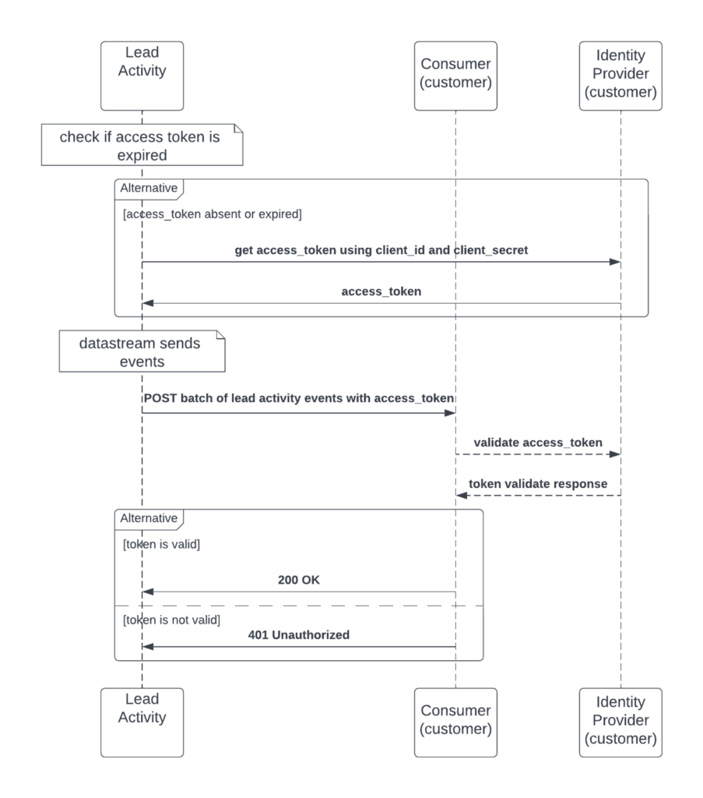

# Datenströme

>[!NOTE]
>
>Aktuelle Informationen zu Datenströmen finden Sie jetzt unter [Verwenden von Datenströmen](https://developer.adobe.com/events/docs/guides/using/marketo/marketo-data-streams#).
>

Datenströme liefern große Mengen an Marketo Engage-Daten nahezu in Echtzeit an externe Systeme. Verwenden Sie gestreamte Daten, um zeitnahe Entscheidungen, zielgerichtete Kampagnen, externe Marketing-Prozesse und Auditing zu unterstützen.

Datenströme bieten die folgenden Vorteile:

- Verringern Sie die Abhängigkeit von API-Anfragen mit begrenzter Rate.
- Warnhinweise für API-Beschränkungen reduzieren
- Bereitstellen von Daten ohne Massenexporte.

Datenströme stehen denjenigen zur Verfügung, die ein [Marketo Engage-Leistungspaket erworben ](https://nation.marketo.com/t5/product-documents/marketo-engage-performance-tiers/ta-p/328835).

## Übersicht über den Lead-Aktivitäts-Datenstrom

Lead Activity Data Stream sendet große Mengen an Lead-Aktivitätsdaten nahezu in Echtzeit an ein externes System. Verwenden Sie den Stream, um Lead-Ereignisse und Nutzungsmuster zu prüfen, Lead-Änderungen anzuzeigen und Trigger-Workflows aus Lead-Ereignissen zu erstellen.

Sie können mehr als 144 Aktivitätstypen abonnieren.

Der Stream kann Folgendes enthalten:

1. Änderungen an allen Lead-Feldern und neu erstellten Leads.
1. Alle dokumentierten Lead-Aktivitätstypen
1. Leads gelöscht.
1. Alle benutzerdefinierten Lead-Objekte, wenn angefordert. Sie können keine einzelnen benutzerdefinierten Objekte auswählen.

Häufige Anwendungsfälle sind:

- Benutzerdefinierte Warnhinweise: Hinzufügen von Leads mit inkonsistenten Bedingungen zu einer Liste. Der Stream sendet die Aktivität Zu Liste hinzufügen an einen Folgeprozess.
- Modelle für maschinelles Lernen: Verwenden Sie Aktivitätserkenntnisse in externen Bewertungsmodellen und senden Sie dann Bewertungen an Marketo, um Kampagnen oder andere Prozesse zu beeinflussen.

Liste der gestreamten Aktivitäten:

| AchieveGoalInReferral | ClickPredictiveContent | ReceivedForwardToFriendEmail |
| --- | --- | --- |
| AddToList | ClickRTPCallToAction | ReceiveSalesEmail |
| AddToNurture | ClickSalesEmail | ReferenzToSocial-App |
| AddToOpportunity | ClickSharedLink | RemoveFromList |
| AddToSalesCampaign | Lead konvertieren | RemoveFromOpportunity |
| CallWebhook | Lead löschen | Kampagne anfordern |
| ChangeDataValue | Verlosung von Gewinnspielen | SalesEmailBounced |
| ChangeLeadPartition | EarnEntryInSocialApp | Warnhinweis senden |
| ChangeNurtureCadence | E-Mail gebounct | SendEmail |
| ChangeNurtureTrack | EmailBouncedSoft | SendSalesEmail |
| Besitzer ändern | EmailDelivered | SendForwardToFriendEmail |
| Programmdaten ändern | EnrichWithDataDotCom | SFDCActivity |
| ChangeProgramMemberData | Eintritt in Gewinnspiele | Inhalt freigeben |
| ChangeRevenueStage | FacebookLeadAdsForm ausfüllen | FürEmpfehlungAngebot anmelden |
| ChangeRevenueStageManuell | Formular ausfüllen | SyncLeadToMicrosoft |
| ChangeScore | Interessanter Moment | SyncLeadToSFDC |
| Segment ändern | Zusammenführen von Leads | UnsubscribeEmail |
| ChangeStatusInProgression | Neuer Lead | Opportunity aktualisieren |
| ChangeStatusInSalesCampaign | OpenEmail | VisitWebPage |
| ClickEmail | OpenSalesEmail | StimmeInPoll |
| ClickLink | PushLeadToMarketo | WinSweepstakes |

Schließen Sie beim Streaming von benutzerdefinierten Objekten alle Lead-bezogenen benutzerdefinierten Objekte ein. Sie können keine einzelnen benutzerdefinierten Objekte auswählen.

## Übersicht über den Benutzer-Audit-Datenstrom

User Audit Data Stream verfolgt Benutzeränderungen an Assets nahezu in Echtzeit. Verwenden Sie ihn, um Asset-Ereignisse zu prüfen, Benutzeränderungen anzuzeigen und Trigger-Prozesse aus Audit-Ereignissen zu ermitteln.

Adobe I/O Events sendet die Änderungen an einen konfigurierbaren Endpunkt. Abonnieren Sie die für jeden Asset-Typ erforderlichen Ereignistypen.

Ein Anwendungsfall ist:

- Tracking von Änderungen in Marketing-Systemen: Wenn ein CRM-System oder ein anderes System Leads mit Marketo austauscht, verwenden Sie Audit-Ereignisse, um zu ermitteln, welches System die letzte Änderung vorgenommen hat.

Liste der gestreamten Benutzerüberwachungsereignisse:

| KOMPONENTE | EREIGNISTYP-LISTE |
| --- | --- |
| Standardprogramm | Klonen, erstellen, löschen, Kanal bearbeiten, exportieren, Programmeinrichtung ändern, Programm-Token ändern, umbenennen |
| E-Mail | Genehmigen, klonen, erstellen, löschen, bearbeiten, verschieben, umbenennen, Genehmigung aufheben |
| E-Mail-Stapelprogramm | Genehmigen, untergeordnet aktualisieren, klonen, erstellen, löschen, bearbeiten, Kanal bearbeiten, Programmzeitplan ändern, Programmeinrichtung ändern, Programm-Token ändern, umbenennen, Genehmigung aufheben |
| E-Mail-Vorlage | Genehmigen, klonen, erstellen, löschen, entwurfErstellen, entwurfVerwerfen, bearbeiten, umbenennen, Genehmigung aufheben |
| Interaktionsprogramm | Klonen, Erstellen, Löschen, Kanal bearbeiten, Programmeinrichtung ändern, Programmstream ändern, Programm-Token ändern, umbenennen |
| Veranstaltungsprogramm | Klonen, Erstellen, Löschen, Kanal bearbeiten, Programmzeitplan ändern, Programmeinrichtung ändern, Programm-Token ändern, umbenennen |
| Ordner | Erstellen, Löschen, Bearbeiten, Umbenennen |
| Formular | Genehmigen, klonen, erstellen, löschen, Entwurf erstellen, bearbeiten, verschieben, umbenennen |
| Formular -> Landingpage-Formular | Erstellen, klonen, bearbeiten, löschen, genehmigen, umbenennen |
| Landingpage | Genehmigen, klonen, erstellen, löschen, Entwurf verwerfen, bearbeiten, umbenennen, Genehmigung aufheben |
| Landingpage-Vorlage | Genehmigen, klonen, erstellen, löschen, entwurfErstellen, entwurfVerwerfen, bearbeiten, umbenennen, Genehmigung aufheben |
| Intelligente Liste | Klonen, Erstellen, Löschen, Bearbeiten, Exportieren, Ändern der Smart-Listen-Einrichtung, Umbenennen |
| Marketingordner | Erstellen, Bearbeiten, Löschen |
| Nurturing-Programm | Klonen, erstellen, löschen, Kanal bearbeiten, Programmeinrichtung ändern, Programmstream ändern, Programm-Token ändern, umbenennen |
| Segment | Erstellen, Löschen, Bearbeiten, Umbenennen |
| Segmentierung | genehmigen, erstellen, löschen, draftCreated, draftDiscard, umbenennen, Genehmigung aufheben |
| Intelligente Kampagne | Abbrechen, Aktivieren, Klonen, Erstellen, Deaktivieren, Löschen, Bearbeiten, Ändern des Kampagnenplans, Ändern der Flussschritt-Aktion, Ändern der Einrichtung der Smart-Liste, Verschieben, Umbenennen |
| Ausschnitt | Genehmigen, Mit Nicht-Entwurf genehmigen, klonen, erstellen, löschen, bearbeiten, umbenennen, Genehmigung aufheben |
| Admin-Benutzeroberfläche -> Launchpoint -> Integration | Erstellen, Löschen, Bearbeiten |
| Admin-Benutzeroberfläche -> Benutzer | Erstellen, Bearbeiten, Löschen (nur für Benutzer mit API identisch) |
| Admin-Anmeldung -> Benutzer | Anmeldung erfolgreich, Anmeldung fehlgeschlagen |
| Programm -> E-Mail-Batch-Programm | Asset-API bearbeiten (zum Ändern der ausgewählten E-Mail-Adresse) |
| Programm -> Marketing-Programm | Erstellen, Klonen |

Beispiel eines Benutzerüberwachungsereignisses:

```json
{
    "event_id": "a1b2c3d4-zyxw-9876-9z8y-a1b2c3d4e5f6",
    "event": {
        "specversion": "1.0",
        "id": "b77c743a-8e28-40f2-8aab-9541bbc85e68",
        "type": "com.adobe.platform.marketo.audit.user.email",
        "source": "https://www.marketo.com",
        "time": "2020-05-28T19:20:47.28Z",
        "datacontenttype": "application/json",
        "dataschema": "V1.0",
        "data": {
            "componentId": 232459,
            "componentType": "Email",
            "eventAction": "approve",
            "munchkinId": "123-ABC-456",
            "imsOrgId": "ADOBEORGID@AdobeOrg",
            "user": 253,
            "userId": "example@marketo.com"
        }
    }
}
```

## Übersicht über den Benachrichtigungsdatenstrom

Der Benachrichtigungsdatenstrom ist als Teil der Leistungsstufenangebote von Marketo Engage verfügbar.

Das Marketo-Benachrichtigungszentrum kann Benachrichtigungen an eine E-Mail-Adresse senden. Der Benachrichtigungsdatenstrom sendet diese Benachrichtigungen auch über Adobe I/O Events an einen konfigurierbaren Endpunkt. Hierbei handelt es sich um dieselben Benachrichtigungen, die auch über das Glockensymbol in der Marketo-Benutzeroberfläche verfügbar sind.

Liste der Benachrichtigungsereignisse:

| KOMPONENTE | EREIGNISTYP-LISTE |
| --- | --- |
| Benachrichtigung | Kampagnenabbruch, Kampagnenfehler, Pflege (Programm erschöpft), Salesforce-Synchronisierungsfehler, Testgruppe (A/B-Testergebnis), Web-Services (tägliches Kontingent) |

Beispiel für ein Benachrichtigungsereignis:

```json
{
    "event_id": "a1b2c3d4-zyxw-9876-9z8y-a1b2c3d4e5f6",
    "event": {
        "specversion": "1.0",
        "type": "com.adobe.platform.marketo.notification.campaign_abort",
        "source": "https://www.marketo.com",
        "time": "2021-05-27T10:22:37.489-5:00",
        "datacontenttype": "application/json",
        "dataschema": "V1.0",
        "data": {
            "componentType": "campaign_abort",
            "subType": "user_campaign_abort",
            "eventAction": {
                "campaignId":1234,
                "userId":"example@marketo.com",
            }
            "imsOrgId":"ADOBEORGID@AdobeOrg",
            "munchkinId":"123-ABC-456"
        }
    }
}
```

## Technische Details

In den folgenden Abschnitten wird die Konfiguration beschrieben, die zum Empfangen von Daten aus jedem Stream erforderlich ist. Jeder Stream erfordert die Einrichtung von Endpunkten und Integrations-Code.

### Lead-Aktivitätsdatenstrom

Lead-Aktivitäts-Stream sendet abonnierte Lead-Aktivitätsereignisse mit den folgenden Service-Merkmalen:

- Standardmäßig werden die Daten alle zwei Sekunden übertragen.
- Jedes Abonnement verwendet Batches mit 100-500 Datensätzen.
- Der REST-Service für Kunden verfügt über eine Zeitüberschreitung von 20 Sekunden und drei erneute Versuche in Intervallen von drei Minuten. Ein erfolgreicher erneuter Versuch aktiviert den Service automatisch. Nach drei Fehlern pausiert der Service und versucht es alle drei Minuten erneut, es sei denn, die Bereitstellung wird manuell aufgehoben.
- Daten in der Warteschlange werden bis zu sieben Tage lang aufbewahrt.

Implementieren des Lead-Aktivitätsdatenstroms:

1. Zeigen Sie einen HTTP-Endpunkt an, der POST-Anfragen mit einem JSON-Text aus dem öffentlichen Internet empfangen kann. Der Aktivitäts-Push-Datenstrom sendet Anfragen an:
1. Geben Sie Adobe Folgendes:
   1. Marketo Munchkin-ID für ihr Abonnement
   1. Die URL des Endpunkts in Schritt 1
   1. Die Aktivitätstypen, die sie erhalten möchten (vollständige Liste oben)
   1. Eine Authentifizierungsmethode, mit der der Kunde überprüfen kann, ob die Anfragen rechtmäßig sind. Entweder:
      1. Eine Identitätsanbieter-URL, Client-ID und ein Client-Geheimnis für die OAuth-Authentifizierung [Client-Anmeldeinformationen](https://www.oauth.com/oauth2-servers/access-tokens/client-credentials/)
      1. Ein API-Token, das in Anfragen enthalten sein kann, die vom Lead-Aktivitätsdatenstrom in einer Autorisierungs-HTTP-Kopfzeile gesendet werden

Adobe aktiviert den Datenstrom, nachdem es die erforderlichen Informationen erhalten hat. Der Endpunkt beginnt dann mit dem Empfang von Daten.

UML-Diagramm eines typischen Lead Activity-Datenstrom-Aufrufs:



Beispiel für die Erstellung eines URL-Endpunkts:

```javascript
/*
Copyright 2022 Adobe
All Rights Reserved.

NOTICE: Adobe permits you to use, modify, and distribute this file in
accordance with the terms of the Adobe license agreement accompanying
it.
*/
constexpress=require('express')
constwinston=require('winston');
constport=3000

constapp=express().use(express.json())

constlogger=winston.createLogger({
  level: 'info',
  format: winston.format.json(),
  defaultMeta: {service: 'activity-stream-consumer-example'},
  transports: [
    // - Write all logs with level `error` and below to `error.log`
    newwinston.transports.File({filename: 'error.log',level: 'error'}),
    // - Write all logs with level `info` and below to `combined.log`
    newwinston.transports.File({filename: 'combined.log'}),
    newwinston.transports.Console({format: winston.format.simple()})
  ],
});

app.get('/',(req,res)=>{
  logger.info(JSON.stringify(req.query))
  res.sendStatus(200)
})

app.post('/',(req,res)=>{
  logger.info(JSON.stringify(req.body))
  res.sendStatus(200)
})

app.listen(port,()=>{
  logger.info(`app listening on port ${port}`)
})
```

Siehe [Beispiel für einen Lead Activity Data Stream Consumer](https://github.com/ihgrant/activity-stream-consumer-example) für Beispiel-Anwendungs-Code.

### Benutzer-Audit-Datenstrom und Benachrichtigungsdatenstrom

Benutzerüberwachungsereignisse werden über Adobe I/O gesendet. So verwenden Sie sie mit einer Adobe ID:

1. Geben Sie Adobe die folgenden Informationen:
   1. Adobe ID
   1. Marketo Munchkin-ID für ihr Abonnement
1. Anzeigen eines REST-Endpunkts, normalerweise eines Webhooks, zur Verwendung von Ereignissen
1. Nachdem Adobe die Endpunktinformationen erhalten hat, aktiviert es den Stream für das Abonnement.
1. Konfigurieren des Streams in Adobe I/O.
   1. Dieser Schritt erfordert eine Adobe-Organisation
   1. Erfordert, dass der Adobe-Organisationsbenutzer die Rolle „Entwickler“ oder „Systemadministrator“ hat

Informationen zum Konfigurieren von Adobe I/O finden [ unter „Einrichten von Marketo User Audit-Datenströmen mit Adobe I/O](https://developer.adobe.com/events/docs/guides/using/marketo/marketo-user-audit-data-stream-setup#).

### Einrichten des User Audit-Datenstroms in Marketo

Der User Audit-Datenstrom ist derzeit als Teil der Leistungspakete zusammen mit den anderen drei Datenströmen verfügbar. Weitere Informationen zu den Packages finden Sie auf der [ „Produktbeschreibungsseite](https://helpx.adobe.com/de/legal/product-descriptions/adobe-marketo-engage---product-description.html) für Produktbeschränkungen und Funktionen.

### Einrichten von Adobe I/O

[Siehe Erste Schritte mit Adobe I/O Events](https://developer.adobe.com/runtime/docs/guides/getting-started/)

Grundlegende Anweisungen für diesen Anwendungsfall, beginnend bei [console.adobe.io](https://developer.adobe.com/console):

Wählen Sie bei Aufforderung entweder **[!UICONTROL Neues Projekt erstellen]** oder **[!UICONTROL Ereignis hinzufügen]**.

### Erste Schritte mit Ihrem neuen Projekt

Um mit der Verwendung von Adobe-Services zu beginnen, fügen Sie eine API, Ereignisse oder Laufzeit hinzu, lesen Sie unsere [Dokumentation](https://developer.adobe.com/runtime/docs/).

## Öffentliche Dokumentation

- [Marketo-Datenströme](https://developer.adobe.com/events/docs/guides/using/marketo/marketo-data-streams/)
- [Einführung in Adobe IO-Events und Webhooks](https://developer.adobe.com/events/docs/guides/)
- [Blog zu Datenströmen](https://blog.developer.adobe.com/introducing-the-adobe-marketo-engage-data-streams-61198b567fbb)
