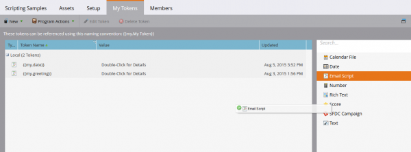
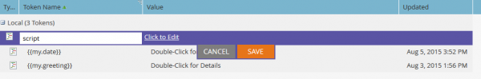
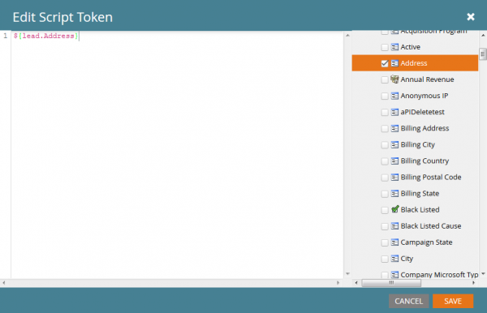
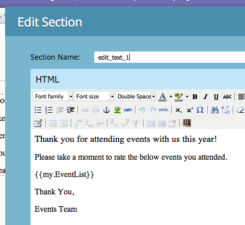
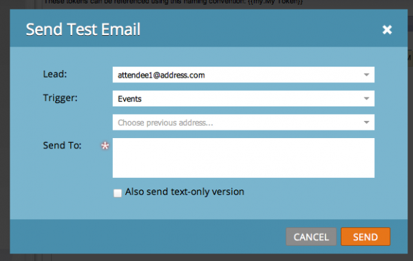
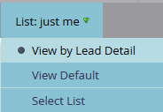

# E-Mail-Skripterstellung

Eine ausführliche Erläuterung [&#x200B; Verhaltens der Velocity](https://velocity.apache.org/engine/devel/user-guide.html)Vorlagensprache finden Sie im Velocity-Benutzerhandbuch .

[Apache Velocity](https://velocity.apache.org/) ist eine Java-basierte Sprache für die Vorlage und Skripterstellung von HTML-Inhalten. Verwenden Sie Velocity in E-Mail-Skript-Token von Marketo, um auf Daten zuzugreifen, die in Opportunities und benutzerdefinierten Objekten gespeichert sind, und um dynamische E-Mail-Inhalte zu erstellen.

Velocity bietet `if`/`else`, `for` und `foreach` Steuerungsfluss für bedingte und iterative Inhalte.

## Variablen

Variablen mit dem Präfix `$`. Erstellen oder aktualisieren Sie sie mit `#set`:

```velocity
#set($variable = "value")
```

Abrufen von Variablenwerten mit Verweistypen, die unterschiedliche Verhaltensweisen aufweisen:

```text
$variable ##outputs 'value'
$variablename ##outputs '$variablename'
${variable}name ##outputs 'valuename'
```


Die Notation für stille Verweise enthält `!` nach der `$`. Standardmäßig lässt Velocity die Referenzzeichenfolge an Ort und Stelle, wenn eine Referenz nicht definiert ist. Eine stille Referenz gibt keinen Wert aus, wenn sie nicht definiert ist:

```velocity
##Defined Reference

#set($foo = "bar")
$foo ##outputs "bar"

##Undefined Reference

##normal
$baz ##outputs "$baz"

##quiet
$!baz ##outputs nothing
```

Weitere Informationen zum Referenzieren von Variablen finden Sie im [Apache-Benutzerhandbuch](https://velocity.apache.org/engine/devel/user-guide.html#formal-reference-notation).

## Velocity-Tools

Das Apache Velocity-Projekt stellt [Velocity-Tools](https://velocity.apache.org/tools/devel/apidocs/overview-summary.html) bereit. Diese Wrapper stellen Java-Objektmethoden über globale Variablen zur Verfügung, die für alle Skripte verfügbar sind.

- [Drehstromlichtmaschine](https://velocity.apache.org/tools/devel/apidocs/org/apache/velocity/tools/generic/AlternatorTool.html)
- [ComparisonDateTool](https://velocity.apache.org/tools/devel/apidocs/org/apache/velocity/tools/generic/ComparisonDateTool.html)
- [Konvertierungswerkzeug](https://velocity.apache.org/tools/devel/apidocs/org/apache/velocity/tools/generic/ConversionTool.html)
- [DateTool](https://velocity.apache.org/tools/devel/apidocs/org/apache/velocity/tools/generic/DateTool.html)
- [DisplayTool](https://velocity.apache.org/tools/devel/apidocs/org/apache/velocity/tools/generic/DisplayTool.html)
- [Mathematisches Tool](https://velocity.apache.org/tools/devel/apidocs/org/apache/velocity/tools/generic/MathTool.html)
- [Zahlenwerkzeug](https://velocity.apache.org/tools/devel/apidocs/org/apache/velocity/tools/generic/NumberTool.html)
- [Escape-Tool](https://velocity.apache.org/tools/devel/apidocs/org/apache/velocity/tools/generic/EscapeTool.html)
- [LoopTool](https://velocity.apache.org/tools/devel/apidocs/org/apache/velocity/tools/generic/LoopTool.html)

Um beispielsweise eine Methode aus `ComparisonDateTool` zu verwenden, greifen Sie über die Variable `$date` in einem Skript-Token darauf zu:

```velocity
#set($birthday = $convert.parseDate("2015-08-07","yyyy-MM-dd"))
##use whenIs to determine how many days away it is
$date.whenIs($birthday).days ##outputs 1
```

## Erstellen eines Skript-Tokens

Hinzufügen von Velocity-Skripten zu E-Mails mit E-Mail-Skript-Token. Erstellen Sie ein Token in Marketing-Aktivitäten in einem Marketing-Ordner oder -Programm.

Um ein Token verwenden zu können, muss die E-Mail ein untergeordnetes Element des Programms sein, dem das Token gehört, oder von einem Marketing-Ordner erben. Wechseln Sie zu einem Ordner oder Programm und wählen Sie die Registerkarte [!UICONTROL Meine Token] aus. Ziehen Sie die Option E-Mail-Skript aus dem rechten Menü in die Token-Liste.



Bearbeiten Sie den Token-Namen und wählen Sie dann [!UICONTROL Zum Bearbeiten klicken] aus, um den Editor zu öffnen:



Erstellen Sie im Editor ein Skript, das auf Variablen in Objekten zugreift, auf die über ein Skript zugegriffen werden kann. Um einen Objektfeldverweis hinzuzufügen, ziehen Sie ihn aus der rechten Struktur in das Skript:



## Einbetten und Testen von Skripten

Nachdem Sie das Skript in einem „Mein Token“-Programm definiert haben, verweisen Sie im E-Mail-Editor von Marketo darauf aus einer E-Mail.



Testen Sie das Skript mit der Aktion [!UICONTROL Beispiel-E-Mail senden] im E-Mail-Designer von Marketo. Wählen Sie einen vorhandenen Lead im Feld [!UICONTROL Lead] aus, damit das Skript ordnungsgemäß verarbeitet wird.

Wählen Sie beim Testen von `$TriggerObject` das auslösende Objekt mit dem Parameter [!UICONTROL Trigger &#x200B;] aus. Marketo verwendet das zuletzt aktualisierte Objekt dieses Typs als `$TriggerObject`.



Sie können auch mit [!UICONTROL E-Mail-Vorschau] testen. Wählen **[!UICONTROL Anzeigen als: Lead-Detail]** und wählen Sie dann einen Lead aus einer statischen Liste aus. Die Vorschau zeigt auch Ausnahmen von der Skriptausführung an:



## Bewährte Methoden

Die Gesamtlänge aller E-Mail-Skript-Token in einer bestimmten E-Mail darf 100.000 Byte nicht überschreiten. Diese Begrenzung bezieht sich auf die Gesamtlänge der Token-Zeichenfolgen selbst (nicht auf die Gesamtlänge nach dem Erweitern von Token).

- Die Variablen, auf die im E-Mail-Skript verwiesen wird, müssen in Marketo in einem der für das Skript verfügbaren Objekte vorhanden sein.
- Sie können auf benutzerdefinierte Objekte der ersten und zweiten Ebene verweisen, die aus Ihrem nativ integrierten CRM stammen und direkt mit dem Lead oder Kontakt verbunden sind, jedoch keine benutzerdefinierten Objekte der dritten Ebene. Benutzerdefinierte Objekte sind möglicherweise nicht dem Lead oder dem Unternehmen übergeordnet
- Bei benutzerdefinierten Marketo-Objekten können Sie benutzerdefinierte Objekte zweiter Ebene mit einer hierarchischen Beziehung referenzieren. Beispiel `Lead <- Parent <- Child`. Sie können keine benutzerdefinierten Objekte zweiter Ebene mit einer Edge-Bridge-Beziehung referenzieren. Beispiel: `Lead <- Bridge -> Edge`
- Sie können auf benutzerdefinierte Objekte verweisen, die mit einem Lead, Kontakt oder Konto verbunden sind, jedoch nicht mit mehr als einem.
- Benutzerdefinierte Objekte können nur über eine einzige Verbindung, einen Lead, einen Kontakt oder ein Konto referenziert werden
- Aktivieren Sie das Kontrollkästchen im Skript-Editor für die Felder, die Sie verwenden oder nicht verarbeiten
- Für jedes benutzerdefinierte Objekt sind die zehn zuletzt aktualisierten Datensätze pro Person/Kontakt zur Laufzeit verfügbar. Die Datensätze werden vom zuletzt aktualisierten Index bei Index 0 zum ältesten bei Index 9 sortiert. Sie können die Anzahl der verfügbaren Datensätze erhöhen, indem Sie [Anweisungen befolgen](https://experienceleague.adobe.com/de/docs/marketo/using/product-docs/administration/email-setup/change-custom-object-retrieval-limits-in-velocity-scripting).
- Wenn Sie mehr als ein E-Mail-Skript in eine E-Mail einbeziehen, werden diese von oben nach unten ausgeführt. Der Umfang der Variablen, die im ersten auszuführenden Skript definiert sind, ist in nachfolgenden Skripten verfügbar.
- Tools-Referenz: [https://velocity.apache.org/tools/2.0/index.html](https://velocity.apache.org/tools/2.0/index.html)
- Ein Hinweis zu Token, die Zeilenumbruchzeichen &quot;\n“ oder &quot;\r\n“ enthalten. Wenn eine E-Mail über das Versandbeispiel oder eine Batch-Kampagne gesendet wird, werden Zeilenumbruchzeichen in Token durch Leerzeichen ersetzt. Wenn E-Mails über Trigger Campaign gesendet werden, bleiben Zeilenumbruchzeichen unberührt.
- Um ein korrektes URL-Parsing sicherzustellen, legen Sie den vollständigen Pfad als Variable fest und drucken Sie ihn dann. Drucken Sie keine Variablen innerhalb von URL-Verweisen. Schließen Sie das Protokoll (`http://` oder `https://`) getrennt vom Rest der URL ein. Geben Sie ein vollständiges Anker-Tag (`<a>`) aus, damit Links verfolgt werden können. Links, die von einer `for`- oder `foreach`-Schleife ausgegeben werden, werden nicht verfolgt.

```html
<!-- Correct -->
#set($url = "www.example.com/${object.id}")
<a href="http://${url}">Link Text</a>

<!-- Correct -->
<a href="http://www.example.com/${object.id}">Link Text</a>

<!-- Incorrect -->
<a href="${url}">Link Text</a>

<!-- Incorrect -->
<a href="{{my.link}}">Link Text</a>

<!-- Incorrect -->
<a href="http://{{my.link}}">Link Text</a>
```
