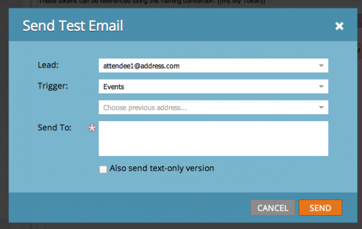

# E-Mail-Skripterstellung

HINWEIS: Es wird dringend empfohlen, das [Velocity-Benutzerhandbuch](https://velocity.apache.org/engine/devel/user-guide.html) zu lesen, um einen tiefen Einblick in das Verhalten der Velocity-Vorlagensprache zu erhalten.

[Apache Velocity](https://velocity.apache.org/) ist eine Sprache, die auf Java basiert und für die Erstellung von Vorlagen und Skripten für HTML-Inhalte entwickelt wurde. Marketo ermöglicht die Verwendung im Kontext von E-Mails mithilfe von Skript-Token. Dadurch erhalten Sie Zugriff auf Daten, die in Opportunities und benutzerdefinierten Objekten gespeichert sind, und können dynamische Inhalte in E-Mails erstellen. Velocity bietet standardmäßige Steuerungsabläufe auf hoher Ebene mit if/else, for und for each, um eine bedingte und iterative Manipulation der Inhalte zu ermöglichen. Im Folgenden finden Sie ein einfaches Beispiel zum Drucken einer Begrüßung mit der richtigen Anrede:

```java
//check if the lead is male
if(${lead.MarketoSocialGender} == "Male")
    if the lead is male, use the salutation 'Mr.'
    set($greeting = "Dear Mr. ${lead.LastName},")
//check is the lead is female
elseif(${lead.MarketoSocialGender} == "Female")
    if female, use the salutation 'Ms.'
    set($greeting = "Dear Ms. ${lead.LastName},")
else
    //otherwise, use the first name
    set($greeting = "Dear ${lead.FirstName},")
end
print the greeting and some content
${greeting}

    Lorem ipsum dolor sit amet...
```

## Variablen

Variablen sind immer mit dem Präfix &quot;$&quot; versehen und werden mithilfe von #set festgelegt und aktualisiert:

```
#set($variable = "value")
```

Ihre Werte können dann über mehrere verschiedene Verweistypen mit unterschiedlichen Verhaltensweisen abgerufen werden:

```
$variable ##outputs 'value'
$variablename ##outputs '$variablename'
${variable}name ##outputs 'valuename'
```

Es gibt auch eine ruhige Referenznotation, bei der nach der `$` ein `!` enthalten ist. Wenn die Geschwindigkeit auf eine undefinierte Referenz trifft, bleibt die Zeichenfolge, die die Referenz darstellt, normalerweise an Ort und Stelle. Bei ruhiger Referenznotation wird kein Wert ausgegeben, wenn ein undefinierter Verweis gefunden wird:

```
##Defined Reference

#set($foo = "bar")
$foo ##outputs "bar"

##Undefined Reference

##normal
$baz ##outputs "$baz"

##quiet
$!baz ##outputs nothing
```

Weitere Informationen zum Referenzieren von Variablen finden Sie im [Apache-Benutzerhandbuch](https://velocity.apache.org/engine/devel/user-guide.html#formal-reference-notation).

## Velocity-Tools

Das Apache Velocity Project stellt Funktionen über die Verwendung von [Velocity-Tools](https://velocity.apache.org/tools/devel/apidocs/overview-summary.html) zur Verfügung. Hierbei handelt es sich lediglich um Wrapper für Java-Objekte. Sie stellen ihre Methoden über globale Variablen zur Verfügung, die für alle Skripte verfügbar sind.

- [AlternatorTool](https://velocity.apache.org/tools/devel/apidocs/org/apache/velocity/tools/generic/AlternatorTool.html)
- [ComparisonDateTool](https://velocity.apache.org/tools/devel/apidocs/org/apache/velocity/tools/generic/ComparisonDateTool.html)
- [ConversionTool](https://velocity.apache.org/tools/devel/apidocs/org/apache/velocity/tools/generic/ConversionTool.html)
- [DateTool](https://velocity.apache.org/tools/devel/apidocs/org/apache/velocity/tools/generic/DateTool.html)
- [DisplayTool](https://velocity.apache.org/tools/devel/apidocs/org/apache/velocity/tools/generic/DisplayTool.html)
- [MathTool](https://velocity.apache.org/tools/devel/apidocs/org/apache/velocity/tools/generic/MathTool.html)
- [NumberTool](https://velocity.apache.org/tools/devel/apidocs/org/apache/velocity/tools/generic/NumberTool.html)
- [EscapeTool](https://velocity.apache.org/tools/devel/apidocs/org/apache/velocity/tools/generic/EscapeTool.html)
- [LoopTool](https://velocity.apache.org/tools/devel/apidocs/org/apache/velocity/tools/generic/LoopTool.html)

Um beispielsweise eine Methode aus `ComparisonDateTool` zu verwenden, greifen Sie in einem Skript-Token über die Variable `$date` auf if zu:

```
#set($birthday = $convert.parseDate("2015-08-07","yyyy-MM-dd"))
##use whenIs to determine how many days away it is
$date.whenIs($birthday).days ##outputs 1
```

## Erstellen eines Skript-Tokens

Das Geschwindigkeitsskript wird mithilfe von E-Mail-Skript-Token in E-Mails eingeschlossen. Diese können in Marketing-Aktivitäten in einem Marketing-Ordner oder einem Programm erstellt werden. Damit ein Token in einer E-Mail verwendet werden kann, muss die E-Mail einem Programm untergeordnet sein, das entweder Eigentümer des Tokens ist oder das Token von einem Marketing-Ordner erbt. Um ein Token zu erstellen, navigieren Sie zu einem Ordner oder Programm und wählen Sie die Registerkarte [!UICONTROL Meine Token] aus. Ziehen Sie aus dem Menü rechts die Option „E-Mail-Script“ in die Token-Liste


Von hier aus können Sie den Namen des Tokens bearbeiten und den Editor über die Option [!UICONTROL Zum Bearbeiten klicken] öffnen:


Sobald Sie sich im Editor befinden, können Sie ein Skript mit Zugriff auf alle Variablen in Objekten erstellen, auf die über ein Skript zugegriffen werden kann. Um einen Feldverweis aus einem Objekt zu erhalten, ziehen Sie ihn aus der rechten Struktur in Ihr Skript:


## Einbetten und Testen von Skripten

Nachdem Sie Ihr Skript in einem „Mein Programm-Token“ definiert haben, können Sie es in einer bestimmten E-Mail mit dem Marketo-E-Mail-Editor referenzieren.


Sie können Ihr Skript mit der E-Mail-Aktion [!UICONTROL Beispiel senden] im E-Mail-Designer von Marketo testen. Damit das Skript ordnungsgemäß verarbeitet werden kann, müssen Sie im Feld „Lead“ einen vorhandenen Lead auswählen[!UICONTROL &#x200B; für den stellvertretend agiert &#x200B;]. Wenn Sie mit `$TriggerObject` testen, können Sie das auslösende Objekt über den Parameter [!UICONTROL Trigger &#x200B;] auswählen. Hierbei werden die Daten aus dem zuletzt aktualisierten Objekt dieses Typs als `$TriggerObject` verwendet.



Sie können auch die E[!UICONTROL Mail-Vorschau verwenden] um Ihr Skript zu testen. Wählen Sie dazu **[!UICONTROL Anzeigen als: Lead-Detail]** und wählen Sie einen Lead aus einer verfügbaren statischen Liste aus. Dies hat den zusätzlichen Vorteil, dass alle Ausnahmen ausgegeben werden, die während der Skriptausführung aufgetreten sind:


## Nützliche Hinweise

Die Gesamtlänge aller E-Mail-Skript-Token in einer bestimmten E-Mail darf 100.000 Byte nicht überschreiten. Diese Begrenzung bezieht sich auf die Gesamtlänge der Token-Zeichenfolgen selbst (nicht auf die Gesamtlänge nach dem Erweitern von Token).

- Die Variablen, auf die im E-Mail-Skript verwiesen wird, müssen in Marketo in einem der für das Skript verfügbaren Objekte vorhanden sein.
- Sie können auf benutzerdefinierte Objekte der ersten und zweiten Ebene verweisen, die aus Ihrem nativ integrierten CRM stammen und direkt mit dem Lead oder Kontakt verbunden sind, jedoch keine benutzerdefinierten Objekte der dritten Ebene. Benutzerdefinierte Objekte sind möglicherweise nicht dem Lead oder dem Unternehmen übergeordnet
- Bei benutzerdefinierten Marketo-Objekten können Sie benutzerdefinierte Objekte zweiter Ebene mit einer hierarchischen Beziehung referenzieren. Beispiel: `Lead <- Parent <- Child`. Sie können keine benutzerdefinierten Objekte zweiter Ebene mit einer Edge-Bridge-Beziehung referenzieren. z. B. `Lead <- Bridge -> Edge`
- Sie können auf benutzerdefinierte Objekte verweisen, die mit einem Lead, Kontakt oder Konto verbunden sind, jedoch nicht mit mehr als einem.
- Benutzerdefinierte Objekte können nur über eine einzige Verbindung, einen Lead, einen Kontakt oder ein Konto referenziert werden
- Sie müssen das Kontrollkästchen im Skript-Editor für die Felder aktivieren, die Sie verwenden, da sie sonst nicht verarbeitet werden
- Für jedes benutzerdefinierte Objekt sind die zehn zuletzt aktualisierten Datensätze pro Person/Kontakt zur Laufzeit verfügbar und werden von der zuletzt aktualisierten Version (bei 0) zur ältesten aktualisierten Version (bei 9) sortiert. Sie können die Anzahl der verfügbaren Datensätze erhöhen, indem Sie [den Anweisungen) ](https://experienceleague.adobe.com/de/docs/marketo/using/product-docs/administration/email-setup/change-custom-object-retrieval-limits-in-velocity-scripting).
- Wenn Sie mehr als ein E-Mail-Skript in eine E-Mail einbeziehen, werden diese von oben nach unten ausgeführt. Der Variablenumfang, der im ersten auszuführenden Skript definiert ist, steht in nachfolgenden Skripten zur Verfügung.
- Tools-Referenz: [https://velocity.apache.org/tools/2.0/index.html](https://velocity.apache.org/tools/2.0/index.html)
- Ein Hinweis zu Token, die Zeilenumbruchzeichen &quot;\\n“ oder &quot;\\r\\n“ enthalten. Wenn eine E-Mail über das Versandbeispiel oder eine Batch-Kampagne gesendet wird, werden Zeilenumbruchzeichen in Token durch Leerzeichen ersetzt. Wenn E-Mails über Trigger Campaign gesendet werden, bleiben Zeilenumbruchzeichen unberührt.
- Um ein korrektes Parsen von URLs sicherzustellen, sollte der gesamte Pfad als Variable festgelegt und dann gedruckt werden. Außerdem sollte die Variable nicht in URL-Verweisen gedruckt werden. Das Protokoll (http:// oder https://) muss eingeschlossen und vom Rest der URL getrennt sein. Die URL muss auch Teil eines vollständig geformten Anker-Tags (<a>) sein. Das Skript muss ein vollständig geformtes Anker-Tag ausgeben, damit Links verfolgt werden können. Links werden nicht verfolgt, wenn sie innerhalb einer for- oder foreach-Schleife ausgegeben werden.

```html
<!-- Correct -->
#set($url = "www.example.com/${object.id}")
<a href="http://${url}">Link Text</a>

<!-- Correct -->
<a href="http://www.example.com/${object.id}">Link Text</a>

<!-- Incorrect -->
<a href="${url}">Link Text</a>

<!-- Incorrect -->
<a href="{{my.link}}">Link Text</a>

<!-- Incorrect -->
<a href="http://{{my.link}}">Link Text</a>
```
