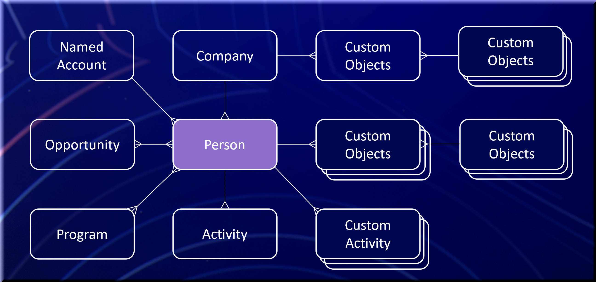

# Erste Schritte

Marketo Engage ist eine Marketing-Automatisierungsplattform für die Verwaltung personalisierter Multi-Channel-Programme und -Kampagnen für Interessenten und Kunden. Sie können die Plattform durch ihre Integrationspunkte erweitern.

Auf dieser Seite werden die wichtigsten Marketo Engage-Entitäten und ihre Beziehungen vorgestellt.

>[!NOTE]
>
>Die SOAP-API wird nicht mehr unterstützt und ist nach dem 31. Juli 2026 nicht mehr verfügbar. Verwenden Sie die Marketo [REST-API](./rest-api/rest-api.md) für alle neuen Entwicklungen. Migrieren Sie bestehende Services bis zu diesem Datum, um Service-Unterbrechungen zu vermeiden. Wenn ein Service die SOAP-API verwendet, lesen Sie den Abschnitt zur SOAP[API (Migrationshandbuch](./soap-api/migration.md).
>

Wenn entweder die native SFDC- oder MS Dynamics CRM-Verbindung in einer Marketo Engage-Instanz aktiviert ist, sind diese Objekte schreibgeschützt:

- Unternehmen
- Opportunity
- Opportunity-Rolle
- Verkäufer

## Person (Leads)

Menschen sind die Grundlage der Marketing-Automatisierung. Marketo bezieht sich auf alle Nicht-Vertriebspersonen-Datensätze als Leads, unabhängig davon, ob der Vertrieb sie als Leads, Interessenten, Verdächtige oder Kontakte betrachtet.

Das Lead-Objekt enthält Standardfelder wie E-Mail, Vorname und Nachname. Sie können Felder hinzufügen, um andere Informationen zu speichern, und Sie können benutzerdefinierte Attribute auf dieselbe Weise lesen und schreiben wie Standardfelder. Die vollständige Feldliste finden Sie unter **[!UICONTROL Admin]** > **[!UICONTROL Feldverwaltung]** in Marketo.

Marketo identifiziert Leads eindeutig anhand des ID-Felds. Sie müssen andere eindeutige Schlüssel außerhalb des Systems erzwingen.

Verwandte APIs: [REST](https://developer.adobe.com/marketo-apis/api/mapi#tag/Leads), [JavaScript](javascript-api/lead-tracking.md#lead-tracking-api)

## Aktivitäten

Leads können mit Ihrem Unternehmen auf verschiedene Weise interagieren, z. B. indem sie eine Web-Seite besuchen, an einer Messe teilnehmen oder ein Whitepaper herunterladen. Marketo erfasst diese Aktionen als Aktivitäten, damit Marketing-Experten verstehen können, was ein Lead getan hat und wann er aufgetreten ist.

Aktivitäten sind immer mit Leads nach Lead-ID verbunden.

Sie können auch benutzerdefinierte Aktivitäten definieren. Nachdem Sie eine benutzerdefinierte Aktivität erstellt und veröffentlicht haben, können Sie Instanzen davon über die Marketo-API hinzufügen. Weitere Informationen finden Sie unter [Grundlagen zu benutzerdefinierten Aktivitäten](https://experienceleague.adobe.com/en/docs/marketo/using/product-docs/administration/marketo-custom-activities/understanding-custom-activities).

Verwandte APIs: [REST](https://developer.adobe.com/marketo-apis/api/mapi#tag/Activities), [JavaScript](javascript-api/lead-tracking.md#munchkin-behavior)

## Programme und Kampagnen

Ein Programm organisiert die entsprechenden Marketing-Maßnahmen eines Marketing-Experten an einem Ort. Ein E-Mail-Versand kann beispielsweise ein Programm sein.

Ein Lead kann mehrere Aktionen oder Aktivitäten ausführen, die mit einem Programm verbunden sind. Dieser Prozess wird als Lead-Progression bezeichnet. Bei E-Mail-Blastprogrammen kann der Fortschritt aufzeichnen, wann Marketo die E-Mail sendet, wann die Person sie öffnet und ob die Person auf einen Link klickt.

Eine Kampagne erfüllt einen bestimmten Zweck und ein bestimmtes Ziel innerhalb eines Programms. Beispielsweise kann eine Kampagne eine Gruppe von Leads auswählen und eine E-Mail-Nachricht senden. Eine andere Kampagne kann einen Vertriebsmitarbeiter benachrichtigen, wenn ein Lead auf einen Link in der E-Mail-Nachricht klickt.

Verwandte APIs: [REST](https://developer.adobe.com/marketo-apis/api/mapi#tag/Campaigns)

## Tags

Tags gruppieren und kategorisieren Programmdaten für das Reporting. Verwenden Sie Tags, um die Effektivität und den ROI des Programms zu messen.

Als Marketo-Administrator können Sie erforderliche und optionale Tag-Typen erstellen, die Benutzende beim Erstellen eines Programms auswählen. Sie definieren die möglichen Werte für jeden Tag-Typ auf der Grundlage der Berichtsanforderungen Ihres Unternehmens.

Erstellen Sie beispielsweise einen benutzerdefinierten Tag-Typ „Region“ mit Werten wie Nordost und Südost, um zu analysieren, welche Region die meisten Leads generiert. Erstellen Sie einen Tag-Typ „Verantwortlicher“, um zu vergleichen, welche Programm-Verantwortlichen (wie Maria, David oder John) die größte Auswirkung auf die Erstellung von Leads und Opportunities haben. Weitere Informationen finden Sie unter [&#x200B; von Tags](https://experienceleague.adobe.com/en/docs/marketo/using/product-docs/core-marketo-concepts/programs/working-with-programs/understanding-tags).

Verwandte APIs: [REST](https://developer.adobe.com/marketo-apis/api/asset)

## Listen

In Listen werden Lead-Sammlungen organisiert. Marketo bietet zwei Typen:

- Eine statische Liste ist eine feste Sammlung, aus der Marketing-Experten Leads hinzufügen oder entfernen können.
- Eine Smart-Liste ist eine dynamische Sammlung, die auf definierten Merkmalen basiert.

Beispielsweise wächst eine Smart-Liste mit dem Namen „Alle Leads, die die Preisseite auf unserer Website besucht haben“ weiter, je mehr Leads diese Seite besuchen. Weitere Informationen finden Sie in der Dokumentation zu [Marketo Engage](https://experienceleague.adobe.com/de/docs/marketo/using/home).

Verwandte APIs: [REST](https://developer.adobe.com/marketo-apis/api/asset#tag/Static-Lists)

## Opportunitys

Eine Opportunity stellt einen potenziellen Verkaufsabschluss dar, den Marketing-Experten an den Vertrieb senden. In Marketo ist eine Opportunity mit einem Lead oder Kontakt und einer Organisation verknüpft.

Eine Opportunity-Rolle verbindet einen Lead mit einer Organisation und beschreibt die Funktion des Leads in dieser Organisation.

Verwandte APIs: [REST](https://developer.adobe.com/marketo-apis/api/mapi#tag/Opportunities)

## Firmen

Ein Unternehmen, in Marketo manchmal auch als Konto bezeichnet, ist das Unternehmen, zu dem eine Person gehört.

Für eine genaue ROI-Attribution in Marketo-ROI-Berichten oder in der Umsatzzyklusanalyse (RCA) verknüpfen Sie Personen mit ihren Organisationen und Opportunities.

Verwandte APIs: [REST](https://developer.adobe.com/marketo-apis/api/mapi#tag/Companies)

## Assets

Assets umfasst Landingpages, E-Mails, Formulare und Bilder, die in einem Programm verwendet werden. Ein Asset kann lokal in einem bestimmten Programm oder global sein. Globale Assets stehen jedem Programm zur Verfügung.

Verwandte APIs: [REST](https://developer.adobe.com/marketo-apis/api/asset)

## Token

Mit Token können Marketing-Fachleute Nachrichten mit Assets personalisieren und Logik zu Flussaktionen hinzufügen. Marketo stellt Token für das gesamte System, Programme, Leads und Unternehmen bereit.

Platzieren Sie beispielsweise den Lead-Token-`{{lead.First Name}}` in einer E-Mail, um den Vornamen des Leads anzuzeigen.

Auf der Programm- oder Ordnerebene definierte Token werden in Marketo als „Meine Token“ bezeichnet. Meine Token haben drei Typen:

- Lokal: Wird in einem bestimmten Kampagnenordner oder Programm erstellt und ist nur in diesem Ordner oder Programm verfügbar.
- Vererbt: Wird auf der Kampagnenordnerebene erstellt und steht allen Programmen in diesem Ordner zur Verfügung.
- Überschrieben: Mit einem benutzerdefinierten Wert auf Programmebene geändert, ohne den Wert des übergeordneten My Token auf Programmebene zu ändern.

Meine Token verwenden die Namenskonvention `{{my.My Token}}`, wobei das Wort „my“ am Anfang des Token-Namens steht. Ein Date-Typ mit dem Namen My Token hat beispielsweise den Token-Namen `{{my.EventDate}}`. Weitere Informationen finden Sie unter [Verstehen meiner Token in einem Programm](https://experienceleague.adobe.com/en/docs/marketo/using/product-docs/core-marketo-concepts/programs/tokens/understanding-my-tokens-in-a-program).

Verwandte APIs: [REST](https://developer.adobe.com/marketo-apis/api/asset#tag/Tokens)

## Benutzerdefinierte Objekte

Ein benutzerdefiniertes Marketo-Objekt erstellt eine Eins-zu-Viele- oder Viele-zu-Viele-Beziehung (Edge-Bridge-Edge) zwischen Marketo-Leads und benutzerdefinierten Objektdatensätzen.

Nachdem Sie ein benutzerdefiniertes Marketo-Objekt erstellt und veröffentlicht haben, können Sie CRUD-Vorgänge über die Marketo-API durchführen. Wenn neue Datensätze hinzugefügt werden, können Sie einen Smart-Listen-Trigger verwenden, um zu antworten. Sie können auch benutzerdefinierte Objektdaten als Filter für Smart-Listen zur Segmentierung oder in E-Mails über [E-Mail-Skripterstellung](email-scripting.md) verwenden. Weitere Informationen zum Erstellen benutzerdefinierter Objekte finden Sie in der [Marketo Engage-Dokumentation](https://experienceleague.adobe.com/de/docs/marketo/using/home).

Verwandte APIs: [REST](https://developer.adobe.com/marketo-apis/api/mapi#tag/Custom-Objects)

## Vertriebspersonal

Sie können die Datensätze von Vertriebspersonen und deren Lead-Beziehungen in Marketo verwalten, wenn keine native CRM-Integration aktiviert ist. Diese Datensätze enthalten Informationen wie Name, E-Mail und Tätigkeitsbezeichnung. Wenn ein Vertriebsmitarbeiter im Besitz eines Leads ist, können Sie diese Informationen zum Filtern von - und -Token verwenden.

Verwalten Sie die Beziehung zu einer Verkaufsperson auf Lead-Ebene über das Feld „externalSalesPersonId“. Aktualisieren Sie dieses Feld über die [Leads synchronisieren](https://developer.adobe.com/marketo-apis/api/mapi#tag/Leads/operation/syncLeadUsingPOST)-API.

Verwandte APIs: [REST](https://developer.adobe.com/marketo-apis/api/mapi#tag/Sales-Persons)
