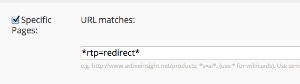

# Umleiten

Mit der RTP Redirect-API können Sie segmentierte Zielgruppen an eine Ziel-URL umleiten.

- Sie müssen Web Personalization-Kunde werden und das [RTP-Tag ](https://experienceleague.adobe.com/en/docs/marketo/using/product-docs/web-personalization/rtp-tag-implementation/deploy-the-rtp-javascript) Ihrer Site bereitstellen lassen, bevor Sie die User Context-API verwenden.
- RTP unterstützt keine Listen mit Account-basierten Marketing-Konten. ABM-Listen und Code beziehen sich nur auf die hochgeladenen Kontolisten (CSV-Dateien), die in RTP verwaltet werden.

## Nutzung

`rtp('send' , 'redirect' , 'field_name' , [ 'values_array' , '...' , '...' ] , 'www.redirect_url.com' , true/false )`

| Parameter | Optional/Erforderlich | Typ | Beschreibung |
|---------------------------|-------------------|---------|-----------------------------|
| &#39;Senden&#39; | Erforderlich | String | Aktion der Methode. |
| &#39;Umleiten&#39; | Erforderlich | String | Methodenname. |
| field_name | Erforderlich | String | Feldname, mit dem abgeglichen werden soll. Beispiel: „abm.name“ (siehe unten). |
| values_array | Erforderlich | Array | Liste der Werte, mit denen das Feld abgeglichen werden soll (Groß-/Kleinschreibung wird nicht beachtet). |
| redirect_url | Erforderlich | String | Ziel-URL für die Umleitung von Besuchern, die der Bedingung entsprachen. |
| redirect_matches_visitors | Optional | Boolesch | Wenn „true“, werden Besucher, die mit der Bedingung übereinstimmen, umgeleitet. Wenn die Bedingung „false“ ist, werden nicht übereinstimmende Besucher umgeleitet. Standard: true. |

Organisation, Branche, ABM-Listen, Standort, ISP, passende Segmente

| Bedingung | Datenhierarchie | Beispiel |
|-------------------------------------------------|----------------------|------------------------------------------------------------------------------------------------------------------|
| Übereinstimmende Segmente (funktioniert nur nach dem ersten Klick) | matchedSegments.name | rtp( &#39;send&#39;, &#39;redirect&#39; , &#39;matchesSegments.name&#39; , [&#39;Fortune 1,000&#39; , &#39;Enterprise&#39;] , &#39;<http://www.marketo.com>&#39;); |
| Übereinstimmende Segmente (funktioniert nur nach dem ersten Klick) | matchedSegments.id | rtp( &#39;send&#39;, &#39;redirect&#39; , &#39;matchesSegments.id&#39; , [106 , 107 , 190] , &#39;<http://www.marketo.com>&#39;); |
| ABM-Listen | abm.name | rtp(&#39;send&#39;, &#39;redirect&#39; , &#39;abm.name&#39; , [&#39;top_key_accounts&#39;, &#39;active_customers&#39;] , &#39;<http://www.marketo.com>&#39;); |
| ABM-Listen | abm.code | rtp( &#39;send&#39;, &#39;redirect&#39; , &#39;abm.code&#39; , [13 , 15] , &#39;<http://www.marketo.com>&#39;); |
| Organisationen | org | rtp(&#39;send&#39;, &#39;redirect&#39; , &#39;org&#39;, [&#39;ebay&#39;], &#39;<http://www.marketo.com>&#39;); |
| Standort | location.country | rtp(&#39;send&#39;, &#39;redirect&#39; , &#39;location.country&#39; [&#39;United States&#39;], &#39;<http://www.marketo.com>&#39;); |
| Standort | location.state | rtp(&#39;send&#39;, &#39;redirect&#39; , &#39;location.state&#39;, [&#39;ca&#39;], &#39;<http://www.marketo.com>&#39;); |
| Standort | location.city | rtp( &#39;send&#39;, &#39;redirect&#39; , &#39;location.city&#39;, [&#39;San Mateo&#39;], &#39;<http://www.marketo.com>&#39;); |
| Branchen | Branchen | rtp(&#39;send&#39;, &#39;redirect&#39; , &#39;industries&#39; , [&#39;education&#39;], &#39;<http://www.marketo.com>&#39;); |
| ISP | ISP | rtp(&#39;send&#39;, &#39;redirect&#39; , isp , [&#39;false&#39;], &#39;<http://www.marketo.com>&#39;); |

## Hinweise

- Wenn die Umleitungsregel/-bedingung auf Firmografiken (Firma, Branche, Standort) basiert, können Sie den Umleitungscode vor dem rtp(&#39;Senden&#39;, &#39;Anzeigen&#39;) und dem rtp(&#39;GET&#39;,&#39;Kampagne&#39;) einfügen, um die Latenz zu reduzieren.
- Die Umleitung über JavaScript ist eine browserseitige Umleitung und hängt vom Laden und der Optimierung der Website ab, um maximale Geschwindigkeit zu erreichen.
- Es empfiehlt sich, den Umleitungs-Code direkt nach dem rtp-Tag festzulegen und in der Kopfzeile zu platzieren.
- Stellen Sie sicher, dass Sie keine Selbstumleitung ausführen (es gibt ein Sicherheitsnetz in RTP, um zyklische Umleitungsaufrufe zu blockieren).

```html
<!DOCTYPE html>
<html lang="en-US">
<head>
<!-- RTP tag -->
<script type='text/javascript'>

// This tag needs to be replaced with your account tag
(function(c,h,a,f,i){c[a]=c[a]||function(){(c[a].q=c[a].q||[]).push(arguments)};
c[a].a=i;var g=h.createElement("script");g.async=true;g.type="text/javascript";
g.src=f+'?rh='+c.location.hostname+'&aid='+i;var b=h.getElementsByTagName("script")[0];b.parentNode.insertBefore(g,b);
})(window,document,"rtp","//xyz.marketo.com/rtp-api/v1/rtp.js","xyz");

// START REDIRECT EXAMPLE
//   - Using a helper redirect function
//   - Redirect based on named account
rtp('send','redirect','org', ['microsoft'],'http://www.marketo.com');

// Redirect based on named account list (ABM)
rtp('send','redirect','abm.name', {
    // Redirect visitors that match 'first_abm' list to www.marketo.com
    'http://www.marketo.com' : ['first_abm'],
    // Redirect visitors that match 'second_abm' list to blog.marketo.com
    'http://blog.marketo.com' : ['second_abm']
});
// END REDIRECT EXAMPLE
rtp('send','view');
rtp('get','campaign');
</script>
<!-- End of RTP tag -->
```

## Weiterleiten getrackter Besucher

1. Fügen Sie einen -Parameter an das Ende der Ziel-URL an: d. h. &lt;www.marketo.com?rtp=redirect>
1. Erstellen Sie ein Segment mit dem Namen „Weitergeleitet von RTP“.
1. Verwenden Sie den Parameter „Bestimmte Seiten“, um Besuchende anzusprechen, die eine beliebige Seite mit dem unten gezeigten Parameter ansehen.



## Definieren von mehr als einer Bedingung mit verschiedenen Ziel-URLs

Der Umleitungsaufruf unterstützt mehrere Aufrufe. Dies ermöglicht eine Umleitung mit mehreren Feldern und die Erstellung komplexer Bedingungen mit unterschiedlichen URLs und Werten.

### Nutzung

`rtp('send', 'redirect', field_name, url_values_map);`

| Parameter | Optional/Erforderlich | Typ | Beschreibung |
|---|---|---|---|
| &#39;Senden&#39; | Erforderlich | String | Aktion der Methode. |
| &#39;Umleiten&#39; | Erforderlich | String | Methodenname. |
| field_name | Erforderlich | String | Feldname, mit dem abgeglichen werden soll. Beispiel: „abm.name“ (siehe oben). |
| url_values_map | Erforderlich | Objekt | Zuordnung zwischen Umleitungs-URL und Werteliste. Beispiel:{&#39;<http://marketo.com>&#39; : [&#39;first_abm&#39;, &#39;second_abm&#39;]} |

#### Beispiel

```javascript
rtp('send','redirect','abm.name', {
    // Redirect visitors that match 'first_abm' list to www.marketo.com
    'http://www.marketo.com' : ['first_abm'],
    // Redirect visitors that match 'second_abm' list to blog.marketo.com
    'http://blog.marketo.com' : ['second_abm']
});
rtp('send','redirect','org', {
    // Redirect visitors from 'Microsoft' to www.marketo.com/enterprise
    'http://www.marketo.com/enterprise' : ['microsoft']
});
```
