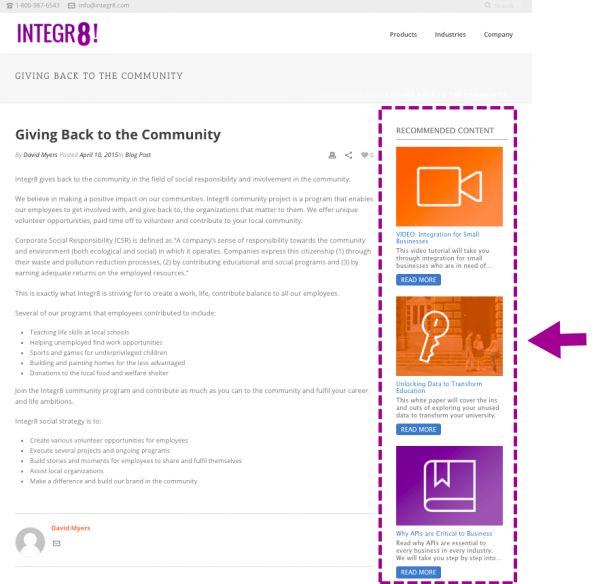

# Rich-Media-Empfehlung

Die folgenden Tags und API-Aufrufe müssen auf der Seite eingerichtet werden, auf der Sie die Rich-Media-Empfehlungsvorlage anzeigen möchten.

1. Im Seitenkopf
   1. Installieren Sie das RTP-Tag
   1. Fügen Sie den GET-Aufruf der Seite hinzu, um die Empfehlungen auszufüllen
   1. Fügen Sie den SET-Aufruf hinzu, um die Vorlage zu konfigurieren
1. Im Hauptteil der Seite
   1. Platzieren Sie das Vorlagen-Tag (div-Klasse) an der Stelle, an der die Vorlage angezeigt werden soll

Weitere Informationen finden Sie [hier](https://experienceleague.adobe.com/en/docs/marketo/using/product-docs/predictive-content/enabling-predictive-content/enable-predictive-content-for-web-rich-media).

## Vorlagen-Tag

| Attribut | Optional/Erforderlich | Beschreibung |
|---|---|---|
| klasse | Erforderlich | Geben Sie an, dass dieses div-HTML-Element RTP-Empfehlungs-div ist. |
| data-rtp-template-id | Erforderlich | Die Vorlagen-ID. Dies bestimmt die Ausrichtung Ihrer Empfehlung. Verwenden Sie „template1“ für die horizontale Ausrichtung, „template2“ für die vertikale Ausrichtung oder „template3“ für die vertikale Ausrichtung, die nur Titel und Beschreibung enthält. Das Skript fügt die übereinstimmende Vorlage in diese `div.Permissible` ein: template1, template2, template3. |

### Beispiele

Verwenden Sie „template1“, um Ihre Empfehlungen horizontal auszurichten.

```html
<div class="RTP_RCMD2" data-rtp-template-id="template1"></div>
```

Um Ihre Empfehlungen vertikal auszurichten, verwenden Sie „template2“.

```html
<div class="RTP_RCMD2" data-rtp-template-id="template2"></div>
```

Um Ihre Empfehlungen vertikal ausgerichtet nur mit Titel und Beschreibung anzuzeigen, verwenden Sie „template3“.

```html
<div class="RTP_RCMD2" data-rtp-template-id="template3"></div>
```

Screenshots von Vorlagenausrichtungen finden Sie [hier](#example_of_rich_media_recommendation_template_1).

## Empfehlung befüllen

Diese Methode füllt alle Rich-Media-`<divs>` auf der Seite mit Empfehlungen.

### Nutzung

`rtp('get', 'rcmd', 'richmedia');`

| Parameter | Optional/Erforderlich | Typ | Beschreibung |
|---|---|---|---|
| &#39;GET&#39; | Erforderlich | String | Aktion der Methode. |
| &#39;rcmd&#39; | Erforderlich | String | Methodenname. |
| &#39;richmedia&#39; | Erforderlich | String | Name der Untermethode. |

## Vorlagenkonfiguration ändern

Diese Methode ändert die Standardkonfiguration für die Vorlage.

Hinweis: Bei Verwendung dieser Methode muss sie vor dem Aufruf von rtp(&#39;get&#39;,&#39;rcmd&#39;, &#39;richmedia&#39;) aufgerufen werden;

### Nutzung

`rtp('set', 'rcmd', 'richmedia', 'template_id', conf_obj);`

| Parameter | Optional/Erforderlich | Typ | Beschreibung |
|---|---|---|---|
| &#39;Satz&#39; | Erforderlich | String | Aktion der Methode. |
| &#39;rcmd&#39; | Erforderlich | String | Methodenname. |
| &#39;richmedia&#39; | Erforderlich | String | Name der Untermethode. |
| template_id | Optional | String | Die Vorlagen-ID für Konfigurationsänderungen. Verwenden Sie , um Änderungen der Einstellungen nur für eine Vorlage anzugeben. |
| conf_obj | Erforderlich | Objekt | Die neue Konfiguration. Das -Objekt enthält alle Konfigurationen als Schlüssel-Wert-Paar. |

### Beispiele

Dieser Codeausschnitt ändert den Titeltext für eine Vorlage.

```javascript
rtp("set", "rcmd", "richmedia","template1",
    {
        "rcmd.title.text": "RECOMMENDED CONTENT"
    }
);
```

Dieser Code-Ausschnitt zeigt das Festlegen von Kategorien mit mehreren Konfigurationen für eine Vorlage.

```javascript
rtp("set", "rcmd", "richmedia",
    {
        "template1":
        {
            "rcmd.title.text": "RECOMMENDED CONTENT",
            "rcmd.general.font.family": "arial",
            "category":
            [
                "webinar",
                "blog posts",
                "pricing_page_category",
                "product_a_category"
            ]
        }
    }
);
```

HINWEIS: Verwenden Sie „Kategorie“, um Inhalte zu filtern, die im Ergebnis von prädiktiven Inhaltsempfehlungen angezeigt werden. Wenn Sie prädiktiven Inhalt auf alle aktivierten Inhaltselemente anwenden möchten, lassen Sie die Kategorie leer. Wenn Sie nur bestimmte Inhalte für die Ausgabe in der Rich-Media-Vorlage empfehlen möchten, fügen Sie eine Kategorie für den Inhalt auf der Seite Inhalt festlegen hinzu und verknüpfen Sie diese Kategorie innerhalb des Code der Empfehlungsvorlage. Kategorisieren relevanter Inhalte nach Abschnitten Ihrer Website (Produkte oder Lösungen).

Dieser Code-Ausschnitt zeigt, wie mehrere Vorlagenkonfigurationen für eine Vorlage festgelegt werden.

```javascript
rtp("set", "rcmd", "richmedia",
    {
        "template1":
        {
            "rcmd.title.text": "RECOMMENDED CONTENT",
            "rcmd.general.font.family": "arial"
        }
    }
);
```

#### Konfigurationseigenschaften

| Konfiguration | Beispiel | Beschreibung |
|---|---|---|
| rcmd.general.font.family | „rcmd.general.font.family“ : „Arial“ | Ändert die Schriftfamilie für den gesamten Text in der Vorlage. Diese Eigenschaft unterstützt alle CSS-Werte nach Browser-Typ. Es ist möglich, eine benutzerdefinierte Schriftfamilie zu verwenden, wenn sie auf der Seite vorhanden ist. |
| rcmd.content.background.color | „rcmd.content.background.color“ : „Schwarz“ | Ändert die Hintergrundfarbe der inneren Vorlagenfelder. Diese Eigenschaft unterstützt alle CSS-Werte nach Browser-Typ. |
| rcmd.title.text | „rcmd.title.text“ : „EMPFOHLENER INHALT“ | Ändert den Vorlagentitel. |
| rcmd.title.background.color | „rcmd.title.background.color“ : „blue“ | Ändert die Hintergrundfarbe des Titelfelds. Diese Eigenschaft unterstützt alle CSS-Farbwerte (Farbname, RGB usw.) |
| rcmd.title.font.size | „rcmd.title.font.size“ : „26px“ | Ändert die Schriftgröße des Titels. Die -Eigenschaft unterstützt alle möglichen CSS-Schriftgrößen (px, em, …) |
| rcmd.title.font.color | „rcmd.title.font.color“ : „Weiß“ | Ändert die Schriftfarbe des Titels. Diese Eigenschaft unterstützt alle Schriftfarbwerte (rgb, hex, …) |
| rcmd.description.font.color | „rcmd.description.font.color“ : „Weiß“ | Ändert die Schriftfarbe der Beschreibung. Diese Eigenschaft unterstützt alle Schriftfarbwerte (rgb, hex, …) |
| rcmd.cta.background.color | „rcmd.cta.background.color“ : „grün“ | Ändert die Hintergrundfarbe der Schaltfläche. Diese Eigenschaft unterstützt den gesamten CSS-Farbwert (Farbname, RGB usw.) |
| rcmd.cta.font.color | „rcmd.cta.font.color“ : „RGB(90, 84, 164)“ | Ändert die Schriftfarbe der Schaltfläche. Diese Eigenschaft unterstützt alle Schriftfarbwerte (rgb, hex, …) |
| rcmd.cta.text | „rcmd.cta.text“ : „Push“ | Ändert den Schaltflächentext. Der Text ist für alle Schaltflächen identisch. |
| Kategorie | „category“ : [ „one category“] | Ändert die Empfehlungskategorie, die diese Vorlage unterstützt. Die Vorlage zeigt nur Empfehlungen mit einer der von dieser Konfiguration festgelegten Kategorien an. |

Hinweis: Die Konfigurationsunterstützung kann sich pro Vorlage ändern.

#### Einfaches Beispiel

Dieses Beispiel enthält eine Vorlage mit drei Empfehlungen. Kopieren Sie dieses Beispiel in eine HTML-Seite und ersetzen Sie dann das RTP-Tag durch Ihr -Tag.

```html
<!DOCTYPE>
<html>
<head>
<meta http-equiv="Content-Type" content="text/html; charset=UTF-8">
<title>RTP recommendation</title>
<!-- RTP tag -->
<script type='text/javascript'>

// This tag needs to be replaced with your account tag
(function(c,h,a,f,i,e){c[a]=c[a]||function(){(c[a].q=c[a].q||[]).push(arguments)};
c[a].a=i;c[a].e=e;var g=h.createElement("script");g.async=true;g.type="text/javascript";
g.src=f+'?aid='+i;var b=h.getElementsByTagName("script")[0];b.parentNode.insertBefore(g,b);
})(window,document,"rtp","//example.rtp.com/rtp-api/v1/rtp.js","account_id");

// Send page view (required by  the recommendation)
rtp('send','view');
// Populate recommendation
rtp('get','rcmd', 'richmedia');
</script>
<!-- End of RTP tag -->
</head>
<body>
<div class="RTP_RCMD2" data-rtp-template-id="template1"></div>
</body>
</html>
```

#### Erweitertes Beispiel

Dieses Beispiel enthält eine Vorlage mit drei Empfehlungen. Der Vorlagentitel lautet „RECOMMENDED CONTENT“ und der Schaltflächentext lautet „Read More“. Kopieren Sie dieses Beispiel in eine HTML-Seite und ersetzen Sie dann das RTP-Tag durch Ihr -Tag.

```html
<!DOCTYPE>
<html>
<head>
<meta http-equiv="Content-Type" content="text/html; charset=UTF-8">
<title>RTP recommendation</title>
<!-- RTP tag -->
<script type='text/javascript'>

// This tag needs to be replaced with your account tag
(function(c,h,a,f,i,e){c[a]=c[a]||function(){(c[a].q=c[a].q||[]).push(arguments)};
c[a].a=i;c[a].e=e;var g=h.createElement("script");g.async=true;g.type="text/javascript";
g.src=f+'?aid='+i;var b=h.getElementsByTagName("script")[0];b.parentNode.insertBefore(g,b);
})(window,document,"rtp","//example.rtp.com/rtp-api/v1/rtp.js","account_id");

// Send page view (required by  the recommendation)
rtp('send','view');
// Populate the recommendation zone
rtp('get', 'campaign',true);
// Change template configuration
rtp('set', 'rcmd', 'richmedia',
    {
        template1 :
        {
            "rcmd.title.text" : "RECOMMENDED CONTENT",
            "rcmd.cta.text" : "Read More"
        }
    }
);
// Populate recommendation
rtp('get','rcmd', 'richmedia');
</script>
<!-- End of RTP tag -->
</head>
<body>
<div class="RTP_RCMD2" data-rtp-template-id="template1"></div>
</body>
</html>
```

#### Beispiel für #1 der Rich-Media-Empfehlungsvorlage

**Name**: template1 **Description**: Horizontaler Inhalt einschließlich Bild, Titel und Beschreibung sowie Schaltfläche &quot;call to action&quot;.


#### Beispiel für #2 der Rich-Media-Empfehlungsvorlage

**Name**: template2 **Beschreibung**: Vertikaler Inhalt einschließlich Bild, Titel und Beschreibung sowie Schaltfläche call to action.



#### Beispiel für #3 der Rich-Media-Empfehlungsvorlage

**Name**: template3 **Beschreibung**: Vertikaler Inhalt, der nur Titel und Beschreibung enthält. Beim Bewegen des Mauszeigers ändert sich die Farbe der Kopfzeile und sie wird mit der Inhalts-URL verknüpft. Die Beschreibung enthält auch Links zu Inhalten ohne Farbänderung. 
