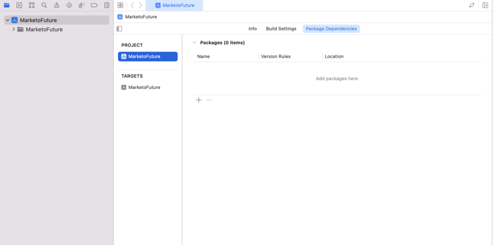
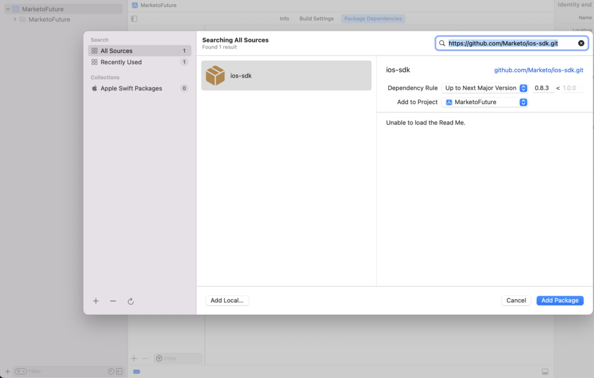
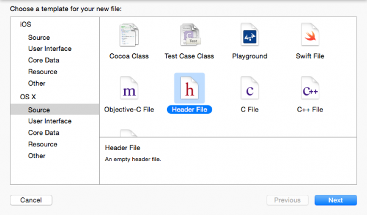
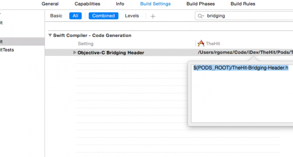

# Installation

Installieren und initialisieren Sie Marketo Mobile SDK, um Push-Benachrichtigungen, In-App-Nachrichten oder beides zu senden.

## Installieren von Marketo SDK auf iOS

### Voraussetzungen

1. [Fügen Sie eine Anwendung in Marketo Admin hinzu](https://experienceleague.adobe.com/de/docs/marketo/using/product-docs/mobile-marketing/admin/add-a-mobile-app) und rufen Sie den geheimen Anwendungsschlüssel und die Munchkin-ID ab.
1. Optional: [Einrichten von Push-Benachrichtigungen](push-notifications.md).

### Installieren von Framework über CocoaPods

1. Installieren Sie CocoaPods. `$ sudo gem install cocoapods`
1. Wechseln Sie in das Projektverzeichnis und erstellen Sie eine Profildatei mit intelligenten Standardwerten. `$ pod init`
1. Öffnen Sie Ihr Profil. `$ open -a Xcode Podfile`
1. Fügen Sie Ihrem Profil die folgende Zeile hinzu. `$ pod 'Marketo-iOS-SDK'`
1. Speichern und schließen Sie Ihr Profil.
1. Laden Sie Marketo iOS SDK herunter und installieren Sie es. `$ pod install`
1. Öffnen Sie den Arbeitsbereich in Xcode. `$ open App.xcworkspace`

### Installieren des Frameworks mithilfe von Swift Package Manager

1. Wählen Sie Ihr Projekt im Projekt-Navigator aus. Wählen Sie unter „Paketabhängigkeit hinzufügen“ &#39;+&#39; aus.

   

1. Fügen Sie das Marketo-Paket aus <https://github.com/Marketo/ios-sdk> hinzu.

   

1. Fügen Sie das Ressourcenpaket hinzu. Suchen Sie `MarketoFramework.XCframework` im Projekt-Navigator und öffnen Sie ihn in der Suche. Ziehen Sie `MKTResources.bundle`, um Bundle-Ressourcen zu kopieren.

### Swift Bridging-Kopfzeile einrichten

1. Gehen Sie zu Datei > Neu > Datei und wählen Sie „Header-Datei“.

   

1. Nennen Sie die Datei &quot;&lt;_ProjectName_>-Bridging-Header“.

1. Gehen Sie zu Projekt > Target > Build-Phasen > Swift-Compiler > Codegenerierung. Fügen Sie den folgenden Pfad zur Kopfzeile „Objective-Bridging“ hinzu:

   `$(PODS_ROOT)/<_ProjectName_>-Bridging-Header.h`

   

## SDK initialisieren

Initialisieren Sie Marketo iOS SDK mit Ihrer Munchkin-Konto-ID und dem geheimen App-Schlüssel. Suchen Sie beide Werte unter „Mobile Apps and Devices“ in Marketo Admin.

1. Öffnen Sie die Datei AppDelegate.m für Objective-C oder die Bridging-Datei für Swift. Importieren Sie die Header-Datei Marketo.h.

   ```
   #import <MarketoFramework/MarketoFramework.h>
   ```

1. Fügen Sie den folgenden Code in die Funktion `application:didFinishLaunchingWithOptions` ein: .

   Übergeben Sie „native“ als Framework-Typ für native Apps.

>[!BEGINTABS]

>[!TAB Ziel C]

```objectivec
Marketo *sharedInstance = [Marketo sharedInstance];

[sharedInstance initializeWithMunchkinID:@"munchkinAccountId" appSecret:@"secretKey" mobileFrameworkType:@"native" launchOptions:launchOptions];
```

>[!TAB Swift]

```swift
let sharedInstance: Marketo = Marketo.sharedInstance()

sharedInstance.initialize(withMunchkinID: "munchkinAccountId", appSecret: "secretKey", mobileFrameworkType: "native", launchOptions: launchOptions)
```

>[!ENDTABS]

1. Ersetzen Sie `munkinAccountId` und `secretKey` durch die &quot;Munchkin-Konto-ID“ und den „Geheimschlüssel“ aus Marketo **[!UICONTROL Admin]** > **[!UICONTROL Mobile Apps und Geräte]**.

## iOS-Testgeräte

1. Wählen Sie Projekt > Target > Info > URL-Typen aus.
1. Kennung ${PRODUCT_NAME} hinzufügen.
1. URL-Schemata auf `mkto-<Secret Key_>` setzen
1. Fügen Sie application:openURL:sourceApplication:annotation: zur Datei AppDelegate.m für Objective-C hinzu.

## Verarbeiten eines benutzerdefinierten URL-Typs in AppDelegate

>[!BEGINTABS]

>[!TAB Ziel C]

```objectivec
- (BOOL)application:(UIApplication *)app
            openURL:(NSURL *)url
            options:(NSDictionary<UIApplicationOpenURLOptionsKey,id> *)options{

    return [[Marketo sharedInstance] application:app
                                         openURL:url
                                         options:options];
}
```

>[!TAB Swift]

```swift
private func application(_ app: UIApplication, open url: URL, options: [UIApplication.OpenURLOptionsKey : Any] = [:]) -> Bool
    {
        return Marketo.sharedInstance().application(app, open: url, options: options)
    }
```

>[!ENDTABS]

## Installieren von Marketo SDK auf Android

### Voraussetzungen

1. [Fügen Sie eine Anwendung in Marketo Admin hinzu](https://experienceleague.adobe.com/de/docs/marketo/using/product-docs/mobile-marketing/admin/add-a-mobile-app) und rufen Sie den geheimen Anwendungsschlüssel und die Munchkin-ID ab.
1. Optional: [Einrichten von Push-Benachrichtigungen](push-notifications.md#android_setup_push).
1. [Herunterladen von Marketo SDK für Android](https://codeload.github.com/Marketo/android-sdk/zip/refs/heads/master)

### Einrichten von Android SDK mit Gradle

1. Fügen Sie in der Datei build.gradle auf Anwendungsebene die Abhängigkeit im Abschnitt dependencies hinzu.

   `implementation 'com.marketo:MarketoSDK:0.8.9'`

1. Fügen Sie die folgende Konfiguration zur `build.gradle` hinzu.

   ```
   buildscript {
       repositories {
           google()
           mavenCentral()
       }
   ```

1. Synchronisieren des Projekts mit den Gradle-Dateien.

### Konfigurieren von Berechtigungen

Öffnen Sie `AndroidManifest.xml` und fügen Sie die folgenden Berechtigungen hinzu. Ihre App muss die Berechtigungen „INTERNET“ und „ACCESS_NETWORK_STATE“ anfordern. Überspringen Sie diesen Schritt, wenn die App sie bereits anfordert.

```xml
<uses‐permission android:name="android.permission.INTERNET"></uses‐permission>
<uses‐permission android:name="android.permission.ACCESS_NETWORK_STATE"></uses‐permission>
```

### SDK initialisieren

1. Öffnen Sie die Klasse Anwendung oder Aktivität . Importieren Sie die Marketo SDK in die Aktivität vor setContentView oder im Anwendungskontext.

   ```java
   // Initialize Marketo
   Marketo marketoSdk = Marketo.getInstance(getApplicationContext());
   marketoSdk.initializeSDK("native","munchkinAccountId","secretKey");
   ```

1. ProGuard Konfiguration (optional)

   Wenn Ihre App ProGuard verwendet, fügen Sie die folgenden Zeilen zur `proguard.cfg` Datei im Projektordner hinzu. Diese Konfiguration schließt die Marketo SDK von der Verschleierung aus.

   ```
   -dontwarn com.marketo.*
   -dontnote com.marketo.*
   -keep class com.marketo.`{ *; }
   ```

## Android-Testgeräte

Fügen Sie „MarketoActivity“ zu `AndroidManifest.xml` im Anwendungs-Tag hinzu.

```xml
<activity android:name="com.marketo.MarketoActivity"  android:configChanges="orientation|screenSize" >
    <intent-filter android:label="MarketoActivity" >
        <action  android:name="android.intent.action.VIEW"/>
        <category  android:name="android.intent.category.DEFAULT"/>
        <category  android:name="android.intent.category.BROWSABLE"/>
        <data android:host="add_test_device" android:scheme="mkto" />
    </intent-filter>
</activity>
```

## Firebase Cloud Messaging-Unterstützung

Die MME SDK für Android unterstützt die direkte Verwendung von Google [Firebase Cloud Messaging](https://firebase.google.com/docs/cloud-messaging/) (FCM).

### Hinzufügen von FCM zu Ihrer Anwendung

1. Integrieren Sie die neueste Marketo Android SDK in die Android-App. Weitere Informationen finden Sie in den Schritten [GitHub](https://github.com/Marketo/android-sdk).
1. Konfigurieren Sie die Firebase-App in der Firebase Console.
   1. Erstellen/Hinzufügen eines Projekts in [&#128279;](https://accounts.google.com/ServiceLogin?passive=1209600&osid=1&continue=https://console.firebase.google.com/&followup=https://console.firebase.google.com/)Firebase Console.
      1. Wählen Sie in [Firebase](https://accounts.google.com/ServiceLogin?passive=1209600&osid=1&continue=https://console.firebase.google.com/&followup=https://console.firebase.google.com/)Konsole“ `Add Project` aus.
      1. Wählen Sie Ihr GCM-Projekt aus der Liste der vorhandenen Google Cloud-Projekte aus und klicken Sie auf `Add Firebase`.
      1. Wählen Sie im Firebase-Begrüßungsbildschirm `Add Firebase to your Android App` aus.
      1. Geben Sie Ihren Paketnamen und SHA-1 an und wählen Sie `Add App`. Eine neue `google-services.json` für Ihre Firebase-App wird heruntergeladen.
      1. Wählen Sie `Continue` aus und befolgen Sie die detaillierten Anweisungen zum Hinzufügen des Google Services-Plug-ins in Android Studio.

   1. Navigieren Sie in der Projektübersicht zu „Projekteinstellungen“
      1. Klicken Sie auf die Registerkarte „Allgemein“. Laden Sie die Datei „google-services.json“ herunter.
      1. Klicken Sie auf die Registerkarte „Cloud Messaging“. Kopieren Sie „Server-Schlüssel“ und „Absender-ID“. Geben Sie diese „Serverschlüssel“ und „Absender-ID“ an Marketo weiter.
   1. Konfigurieren von FCM in der Android-App.
      1. Wechseln Sie zur Projektansicht in Android Studio, um den Projektstammordner anzuzeigen
         1. Verschieben Sie die heruntergeladene Datei „google-services.json“ in den Stammordner des Android-App-Moduls.
         1. Fügen Sie in build.gradle auf Projektebene Folgendes hinzu:

            ```
            buildscript {
              dependencies {
                classpath 'com.google.gms:google-services:4.0.0'
              }
            }
            ```

         1. Fügen Sie in build.gradle auf App-Ebene Folgendes hinzu:

            ```
            dependencies {
              compile 'com.google.firebase:firebase-core:17.4.0'
            }
            // Add to the bottom of the file
            apply plugin: 'com.google.gms.google-services'
            ```

         1. Wählen Sie abschließend **[!UICONTROL Jetzt synchronisieren]** in der Leiste aus, die in der ID angezeigt wird
   1. Bearbeiten Sie das App-Manifest. FCM SDK fügt automatisch die erforderlichen Berechtigungen und Empfängerfunktionen hinzu. Entfernen Sie die folgenden veralteten Elemente, die zu einer Duplizierung der Nachricht führen können:

      ```xml
      <uses-permission android:name="android.permission.WAKE_LOCK" />
      <permission android:name="<your-package-name>.permission.C2D_MESSAGE" android:protectionLevel="signature" />
      <uses-permission android:name="<your-package-name>.permission.C2D_MESSAGE" />
      
      ...
      
      <receiver>
        android:name="com.google.android.gms.gcm.GcmReceiver"
        android:exported="true"
        android:permission="com.google.android.c2dm.permission.SEND"
        <intent-filter>
          <action android:name="com.google.android.c2dm.intent.RECEIVE" />
          <category android:name="<your-package-name> />
        </intent-filter>
      </receiver>
      ```
