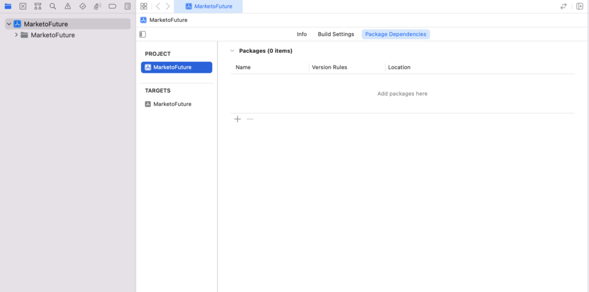

# Installation

Installationsanweisungen für Marketo Mobile SDK. Die folgenden Schritte sind erforderlich, um Push-Benachrichtigungen und/oder In-App-Nachrichten zu senden.

## Installieren von Marketo SDK auf iOS

### Voraussetzungen

1. [Anwendung in Marketo Admin hinzufügen](https://experienceleague.adobe.com/de/docs/marketo/using/product-docs/mobile-marketing/admin/add-a-mobile-app) (Abrufen des geheimen Anwendungsschlüssels und der Munchkin-ID)
1. [Push-Benachrichtigungen einrichten](push-notifications.md) (optional)

### Installieren von Framework über CocoaPods

1. Installieren Sie CocoaPods. `$ sudo gem install cocoapods`
1. Wechseln Sie in das Projektverzeichnis und erstellen Sie eine Profildatei mit intelligenten Standardwerten. `$ pod init`
1. Öffnen Sie Ihr Profil. `$ open -a Xcode Podfile`
1. Fügen Sie Ihrem Profil die folgende Zeile hinzu. `$ pod 'Marketo-iOS-SDK'`
1. Speichern und schließen Sie Ihr Profil.
1. Laden Sie Marketo iOS SDK herunter und installieren Sie es. `$ pod install`
1. Öffnen Sie Workspace in Xcode. `$ open App.xcworkspace`

### Installieren des Frameworks mithilfe von Swift Package Manager

1. Wählen Sie Ihr Projekt im Projekt-Navigator aus und klicken Sie unter „Paketabhängigkeit hinzufügen“ auf &quot;+&quot;, wie unten gezeigt:

   

1. Marketo-Paket aus diesem Repository hinzufügen. Fügen Sie diese URL für dieses Repository hinzu: https://github.com/Marketo/ios-sdk.

   

1. Fügen Sie nun das Ressourcenbündel wie abgebildet hinzu: Suchen Sie `MarketoFramework.XCframework` im Projekt-Navigator und öffnen Sie ihn im Finder. Ziehen Sie `MKTResources.bundle` per Drag-and-Drop, um Bundle-Ressourcen zu kopieren.

### Swift Bridging-Kopfzeile einrichten

1. Gehen Sie zu Datei > Neu > Datei und wählen Sie „Header-Datei“.

   

1. Nennen Sie die Datei &quot;&lt;_ProjectName_>-Bridging-Header“.

1. Gehen Sie zu Projekt > Target > Build-Phasen > Swift-Compiler > Codegenerierung. Fügen Sie den folgenden Pfad zur Kopfzeile „Objective-Bridging“ hinzu:

   `$(PODS_ROOT)/<_ProjectName_>-Bridging-Header.h`

   

## SDK initialisieren

Bevor Sie Marketo iOS SDK verwenden können, müssen Sie es mit Ihrer Munchkin-Konto-ID und dem geheimen App-Schlüssel initialisieren. Sie finden diese im Marketo-Administratorbereich unter „Mobile Apps und Geräte“.

1. Öffnen Sie Ihre Datei AppDelegate.m (Objective-C) oder Bridging (Swift) und importieren Sie die Header-Datei Marketo.h.

   ```
   #import <MarketoFramework/MarketoFramework.h>
   ```

1. Fügen Sie den folgenden Code in die Funktion `application:didFinishLaunchingWithOptions` ein: .

   Beachten Sie, dass wir „nativ“ als Framework-Typ für native Apps übergeben müssen.

>[!BEGINTABS]

>[!TAB Ziel C]

```
Marketo *sharedInstance = [Marketo sharedInstance];

[sharedInstance initializeWithMunchkinID:@"munchkinAccountId" appSecret:@"secretKey" mobileFrameworkType:@"native" launchOptions:launchOptions];
```

>[!TAB Swift]

```
let sharedInstance: Marketo = Marketo.sharedInstance()

sharedInstance.initialize(withMunchkinID: "munchkinAccountId", appSecret: "secretKey", mobileFrameworkType: "native", launchOptions: launchOptions)
```

>[!ENDTABS]

1. Ersetzen Sie `munkinAccountId` und `secretKey` oben durch Ihre &quot;Munchkin-Konto-ID“ und „Geheimschlüssel“, die Sie im Abschnitt &quot;Marketo **[!UICONTROL Admin]** > **[!UICONTROL Mobile Apps und Geräte]** finden.

## iOS-Testgeräte

1. Wählen Sie Projekt > Target > Info > URL-Typen aus.
1. Kennung hinzufügen: ${PRODUCT_NAME}
1. URL-Schemata festlegen: `mkto-<Secret Key_>`
1. Application:openURL:sourceApplication:annotation: in AppDelegate.m-Datei einschließen (Objective-C)

## Verarbeiten eines benutzerdefinierten URL-Typs in AppDelegate

>[!BEGINTABS]

>[!TAB Ziel C]

```
- (BOOL)application:(UIApplication *)app
            openURL:(NSURL *)url
            options:(NSDictionary<UIApplicationOpenURLOptionsKey,id> *)options{
   
    return [[Marketo sharedInstance] application:app
                                         openURL:url
                                         options:options];    
}
```

>[!TAB Swift]

```
private func application(_ app: UIApplication, open url: URL, options: [UIApplication.OpenURLOptionsKey : Any] = [:]) -> Bool
    {
        return Marketo.sharedInstance().application(app, open: url, options: options)
    }
```

>[!ENDTABS]

## Installieren von Marketo SDK auf Android

### Voraussetzungen

1. [Anwendung in Marketo Admin hinzufügen](https://experienceleague.adobe.com/de/docs/marketo/using/product-docs/mobile-marketing/admin/add-a-mobile-app) (Abrufen des geheimen Anwendungsschlüssels und der Munchkin-ID)
1. [Push-Benachrichtigungen einrichten](push-notifications.md#android_setup_push) (optional)
1. [Marketo SDK für Android herunterladen](https://codeload.github.com/Marketo/android-sdk/zip/refs/heads/master)

### Einrichten von Android SDK mit Gradle

1. Fügen Sie in der Datei build.gradle auf Anwendungsebene unter dem Abschnitt „dependencies“ Folgendes hinzu:

`implementation 'com.marketo:MarketoSDK:0.8.9'`

1. Die `build.gradle`-Datei muss

   ```
   buildscript {
       repositories {
           google()
           mavenCentral()
       }
   ```

1. Synchronisieren des Projekts mit Gradle-Dateien

### Konfigurieren von Berechtigungen

Öffnen Sie `AndroidManifest.xml` und fügen Sie die folgenden Berechtigungen hinzu. Ihre App muss die Berechtigungen „INTERNET“ und „ACCESS_NETWORK_STATE“ anfordern. Wenn Ihre Anwendung diese Berechtigungen bereits anfordert, überspringen Sie diesen Schritt.

```xml
<uses‐permission android:name="android.permission.INTERNET"></uses‐permission>
<uses‐permission android:name="android.permission.ACCESS_NETWORK_STATE"></uses‐permission>
```

### SDK initialisieren

1. Öffnen Sie die Anwendungsklasse oder Aktivitätsklasse in Ihrer Anwendung und importieren Sie die Marketo SDK in Ihre Aktivität, bevor Sie ContentView festlegen oder im Anwendungskontext.

   ```java
   // Initialize Marketo
   Marketo marketoSdk = Marketo.getInstance(getApplicationContext());
   marketoSdk.initializeSDK("native","munchkinAccountId","secretKey");
   ```

1. ProGuard Konfiguration (optional)

   Wenn Sie ProGuard für Ihre App verwenden, fügen Sie die folgenden Zeilen in Ihrer `proguard.cfg`-Datei hinzu. Die Datei befindet sich im Projektordner. Durch Hinzufügen dieses Codes wird die Marketo SDK aus dem Verschleierungsprozess ausgeschlossen.

   ```
   -dontwarn com.marketo.*
   -dontnote com.marketo.*
   -keep class com.marketo.`{ *; }
   ```

## Android-Testgeräte

Fügen Sie „MarketoActivity“ zu `AndroidManifest.xml` Datei im Anwendungs-Tag hinzu.

```xml
<activity android:name="com.marketo.MarketoActivity"  android:configChanges="orientation|screenSize" >
    <intent-filter android:label="MarketoActivity" >
        <action  android:name="android.intent.action.VIEW"/>
        <category  android:name="android.intent.category.DEFAULT"/>
        <category  android:name="android.intent.category.BROWSABLE"/>
        <data android:host="add_test_device" android:scheme="mkto" />
    </intent-filter>
</activity>
```

## Firebase Cloud Messaging-Unterstützung

Das MME Software Development Kit (SDK) für Android wurde auf ein moderneres, stabileres und skalierbareres Framework aktualisiert, das mehr Flexibilität und neue Engineering-Funktionen für Ihre Android-App-Entwicklerinnen und -Entwickler enthält.

Entwickler von Android-Apps können jetzt Googles [Firebase Cloud Messaging](https://firebase.google.com/docs/cloud-messaging/) (FCM) direkt mit diesem SDK verwenden.

### Hinzufügen von FCM zu Ihrer Anwendung

1. Integrieren Sie die neueste Marketo Android SDK in die Android-App.  Die Schritte sind unter [GitHub“ ](https://github.com/Marketo/android-sdk).
1. Konfigurieren der Firebase App in der Firebase Console.
   1. Erstellen/Hinzufügen eines Projekts in [&#128279;](https://accounts.google.com/ServiceLogin?passive=1209600&amp;osid=1&amp;continue=https://console.firebase.google.com/&amp;followup=https://console.firebase.google.com/)Firebase Console.
      1. Wählen Sie in [Firebase](https://accounts.google.com/ServiceLogin?passive=1209600&amp;osid=1&amp;continue=https://console.firebase.google.com/&amp;followup=https://console.firebase.google.com/)Konsole“ `Add Project` aus.
      1. Wählen Sie Ihr GCM-Projekt aus der Liste der vorhandenen Google Cloud-Projekte aus und klicken Sie auf `Add Firebase`.
      1. Wählen Sie im Firebase-Begrüßungsbildschirm `Add Firebase to your Android App` aus.
      1. Geben Sie Ihren Paketnamen und SHA-1 an und wählen Sie `Add App`. Eine neue `google-services.json` für Ihre Firebase-App wird heruntergeladen.
      1. Wählen Sie `Continue` aus und befolgen Sie die detaillierten Anweisungen zum Hinzufügen des Google Services-Plug-ins in Android Studio.

   1. Navigieren Sie in der Projektübersicht zu „Projekteinstellungen“
      1. Klicken Sie auf die Registerkarte „Allgemein“. Laden Sie die Datei „google-services.json“ herunter.
      1. Klicken Sie auf die Registerkarte „Cloud Messaging“. Kopieren Sie „Server-Schlüssel“ und „Absender-ID“. Geben Sie diese „Serverschlüssel“ und „Absender-ID“ an Marketo weiter.
   1. Konfigurieren von FCM-Änderungen in der Android-App
      1. Wechseln Sie zur Projektansicht in Android Studio, um den Projektstammordner anzuzeigen
         1. Verschieben Sie die heruntergeladene Datei „google-services.json“ in den Stammordner des Android-App-Moduls.
         1. Fügen Sie in build.gradle auf Projektebene Folgendes hinzu:

            ```
            buildscript {
              dependencies {
                classpath 'com.google.gms:google-services:4.0.0'
              }
            }
            ```

         1. Fügen Sie in build.gradle auf App-Ebene Folgendes hinzu:

            ```
            dependencies {
              compile 'com.google.firebase:firebase-core:17.4.0'
            } 
            // Add to the bottom of the file 
            apply plugin: 'com.google.gms.google-services'
            ```

         1. Klicken Sie abschließend in der Leiste, die in der ID angezeigt wird, auf „Jetzt synchronisieren“
   1. Manifest der App bearbeiten Die FCM-SDK fügt automatisch alle erforderlichen Berechtigungen und die erforderliche Empfängerfunktion hinzu. Entfernen Sie die folgenden veralteten (und potenziell schädlichen, da sie zu einer Duplizierung von Nachrichten führen können) Elemente aus dem Manifest Ihrer App:

      ```xml
      <uses-permission android:name="android.permission.WAKE_LOCK" />
      <permission android:name="<your-package-name>.permission.C2D_MESSAGE" android:protectionLevel="signature" />
      <uses-permission android:name="<your-package-name>.permission.C2D_MESSAGE" />
      
      ...
      
      <receiver>
        android:name="com.google.android.gms.gcm.GcmReceiver"
        android:exported="true"
        android:permission="com.google.android.c2dm.permission.SEND"
        <intent-filter>
          <action android:name="com.google.android.c2dm.intent.RECEIVE" />
          <category android:name="<your-package-name> />
        </intent-filter> 
      </receiver>
      ```
