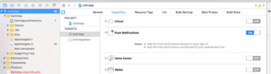

# ionisch

Integrieren des Marketo Cordova-Plug-ins in eine [!DNL Ionic] App. [!DNL Ionic] Kondensator wird derzeit nicht unterstützt.

## Voraussetzungen

1. [Fügen Sie eine Anwendung in Marketo Admin hinzu](https://experienceleague.adobe.com/de/docs/marketo/using/product-docs/mobile-marketing/admin/add-a-mobile-app) und rufen Sie den geheimen Anwendungsschlüssel und die Munchkin-ID ab.
1. Push-Benachrichtigungen für [iOS](push-notifications.md) oder [Android einrichten](push-notifications.md).
1. Installieren Sie [[!DNL Ionic]](https://ionicframework.com/getting-started/) und die [Cordova CLI](https://cordova.apache.org/docs/en/latest/guide/cli/).

## Installationsanweisungen

### Marketo [!DNL Ionic]-Plug-in einrichten

1. Wechseln Sie zum [!DNL Ionic]-Anwendungsverzeichnis und führen Sie den folgenden Befehl aus, um das Marketo-Plug-in hinzuzufügen:

   `$ ionic plugin add https://github.com/Marketo/PhoneGapPlugin.git --variable APPLICATION_SECRET_KEY="YOUR_APPLICATION_SECRET"`

1. Führen Sie den folgenden Befehl aus, um zu bestätigen, dass das Plug-in hinzugefügt wurde:

   `$ ionic plugin list com.marketo.plugin 0.X.0 "MarketoPlugin"`

### Zu neuerer Version migrieren (optional)

1. Um ein vorhandenes Plug-in zu entfernen, führen Sie den folgenden Befehl aus:

   `$ ionic plugin remove com.marketo.plugin`

1. Um das Plug-in erneut hinzuzufügen, führen Sie den folgenden Befehl aus:

   `$ ionic plugin add https://github.com/Marketo/PhoneGapPlugin.git --variable APPLICATION_SECRET_KEY="YOUR_APPLICATION_SECRET"`

### Aktivieren von Push-Benachrichtigungen in xCode

1. Aktivieren der Push-Benachrichtigungsfunktion im xCode-Projekt.

### Push-Benachrichtigungen tracken

Fügen Sie den folgenden Code in die `application:didFinishLaunchingWithOptions:` ein.

>[!BEGINTABS]

>[!TAB Ziel C]

```objectivec
Marketo *sharedInstance = [Marketo sharedInstance];

[sharedInstance trackPushNotification:launchOptions];
```

>[!TAB Swift]

```swift
let sharedInstance: Marketo = Marketo.sharedInstance()

sharedInstance.trackPushNotfication(launchOptions)
```

>[!ENDTABS]

### Marketo-Framework initialisieren

Um das Marketo-Framework beim Start der App zu initialisieren, fügen Sie den folgenden Code unter der `onDeviceReady` in der JavaScript-Hauptdatei hinzu.

Übergeben Sie `ionicCordova` als Framework-Typ für [!DNL Ionic] Cordova-Apps.

#### Syntax

```javascript
// This method will Initialize the Marketo Framework using Your MunchkinId and Secret Key
marketo.initialize(
  function() { console.log("MarketoSDK Init done."); },
  function(error) { console.log("an error occurred:" + error); },
  'YOUR_MUNCHKIN_ID',
  'YOUR_SECRET_KEY',
  'FRAMEWORK_TYPE'
);

// For session tracking, add following.
marketo.onStart(
  function(){ console.log("onStart."); },
  function(error){ console.log("Failed to report onStart." + error); }
);
```

#### Parameter

- Success Callback: Funktion, die ausgeführt wird, wenn das Marketo-Framework erfolgreich initialisiert wurde.
- Failure Callback: Funktion, die ausgeführt wird, wenn das Marketo-Framework nicht initialisiert werden kann.
- MUNCHKIN-ID: Munchkin-ID, die während der Registrierung von Marketo empfangen wurde.
- SECRET KEY: Geheimer Schlüssel, der von Marketo während der Registrierung empfangen wurde.

### Marketo-Push-Benachrichtigung initialisieren

Um Marketo-Push-Benachrichtigungen zu initialisieren, fügen Sie in der JavaScript-Hauptdatei nach der Initialisierungsfunktion den folgenden Code hinzu.

#### Syntax

```javascript
// This function will Enable user notifications (prompts the user to accept push notifications in iOS)
marketo.initializeMarketoPush(
    function() { console.log("Marketo push successfully initialized."); },
    function(error) { console.log("an error occurred:" + error); },
    'YOUR_GCM_PROJECT_ID' // This is required for Android and will be ignored in iOS
);
```

#### Parameter

- Success Callback: Funktion, die ausgeführt wird, wenn die Marketo-Push-Benachrichtigung erfolgreich initialisiert wurde.
- Fehlgeschlagener Rückruf: Funktion, die ausgeführt wird, wenn die Marketo-Push-Benachrichtigung nicht initialisiert werden kann.
- GCM_PROJECT_ID: GCM-Projekt-ID in [Google Developers Console](https://accounts.google.com/ServiceLogin?service=cloudconsole&passive=1209600&osid=1&continue=https://console.cloud.google.com/apis/dashboard&followup=https://console.cloud.google.com/apis/dashboard) nach dem Erstellen der App.

Sie können die Registrierung des Tokens auch bei der Abmeldung aufheben.

```javascript
marketo.uninitializeMarketoPush(
  function() { console.log("Marketo push successfully uninitialized."); } ,
  function(error) { console.log("an error occurred:" + error); }
);
```

## Lead verknüpfen

Rufen Sie die Funktion AssociateLead auf, um einen Marketo-Lead zu erstellen.

### Syntax

```javascript
marketo.associateLead(
  function(){ console.log("MarketoSDK : Lead Added"); },
  function(error){ console.log("an error occurred:" + error); },
  'Lead_Data_JSON_String'
);
```

### Parameter

- Success Callback: Funktion, die ausgeführt wird, wenn das Marketo-Framework den Lead erfolgreich verknüpft.
- Failure Callback: Funktion, die ausgeführt wird, wenn das Marketo-Framework den Lead nicht verknüpfen kann.
- Lead-Daten: Lead-Daten im JSON-Zeichenfolgenformat.

### Beispiel

```javascript
// First create a lead as shown below
var lead = {};
lead[marketo.KEY_FIRST_NAME] = "Ionic";
lead[marketo.KEY_LAST_NAME] = "App";
lead[marketo.KEY_EMAIL] = email;
lead[marketo.KEY_ADDRESS] = "demo address";
lead[marketo.KEY_CITY] = "city";
lead[marketo.KEY_STATE] = "state";
lead[marketo.KEY_COUNTRY] = "country";
lead[marketo.KEY_POSTAL_CODE] = "postalCode";
lead[marketo.KEY_GENDER] = "gender";

// Use associateLead function to associate it.
marketo.associateLead(
  function() { console.log("MarketoSDK : Lead Associated"); },
  function(error) { console.log("an error occurred:" + error); },
  JSON.stringify(lead)
);
```

## Berichtsaktion

Rufen Sie die Funktion `reportaction` auf, um eine Benutzeraktion zu melden.

### Syntax

```javascript
marketo.reportaction(
  function(){ console.log("MarketoSDK : New event sent "); },
  function(error){ console.log("an error occurred:" + error); },
  'Action_Name',
  'Action_Data_JSON_String'
);
```

### Parameter

- Erfolgreicher Rückruf: Funktion, die ausgeführt wird, wenn das Marketo-Framework die Aktion erfolgreich meldet.
- Fehlgeschlagener Rückruf: Funktion, die ausgeführt wird, wenn das Marketo-Framework die Aktion nicht meldet.
- Aktionsname: Aktionsname.
- Aktionsdaten: Aktionsdaten im JSON-Zeichenfolgenformat.

### Beispiel

```javascript
// First create an event as below
var event = {
    "Action Type":"Add To Cart",
    "Action Details":"Adding Product in cart",
    "Action Metric":"10",
    "Action Length":"1"
}

marketo.reportaction(
    function(){ console.log("Reported action successfully."); },
    function(error){ console.log("Failed to report action." + error); },
    "Add To Cart",
    JSON.stringify(event)
);
```

## Sitzungsberichte

Binden Sie die Ereignistypen „Anhalten“ und „Fortsetzen“ an die Start- und Stopp-Ereignisse eines Berichts. Diese Ereignisse verfolgen die in der Mobile App verbrachte Zeit und sind in Android erforderlich.

```javascript
//Add the following code in your www/js/index.js

bindEvents: function() {
   document.addEventListener('pause', this.onStop, false);
   document.addEventListener('resume', this.onStart, false);
},
onStop: function() {
   marketo.onStop(
       function(){ console.log("onStop"); },
       function(error){ console.log("Failed to report onStop." + error); }
   );
},
onStart: function() {
   marketo.onStart(
       function(){ console.log("onStart."); },
       function(error){console.log( "Failed to report onStart." + error); }
   );
},
```

## Leads erstellen

Es gibt drei Möglichkeiten, Leads aus einer Hybrid-App zu erstellen:

1. MARKETO MME SDK
1. Marketo REST-API
1. Formular senden

Die Trigger und Filter, die einen neuen Lead erkennen, hängen von der Erstellungsmethode ab:

- Leads, die mit der MME SDK- oder REST-API erstellt wurden, werden in den Triggern und Filtern „Lead erstellt“ angezeigt.
- Durch Formularübermittlung erstellte Leads werden in den Triggern und Filtern des „ausgefüllten Formulars“ angezeigt.

Verwenden Sie dieselbe Methode zur Lead-Erstellung in der Hybrid-App und der Web-App. Wenn die Web-Anwendung die Formularübermittlung oder die REST-API verwendet, verwenden Sie diese Methode in der Hybrid-App. Wenn die Web-Anwendung keine dieser Methoden verwendet, sollten Sie die Verwendung der MME-SDK zum Erstellen von Leads in Marketo erwägen.
