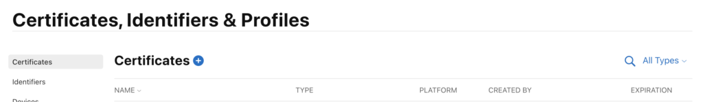
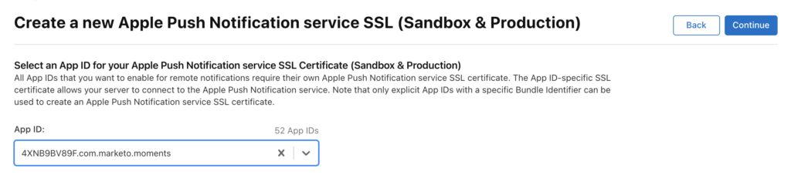
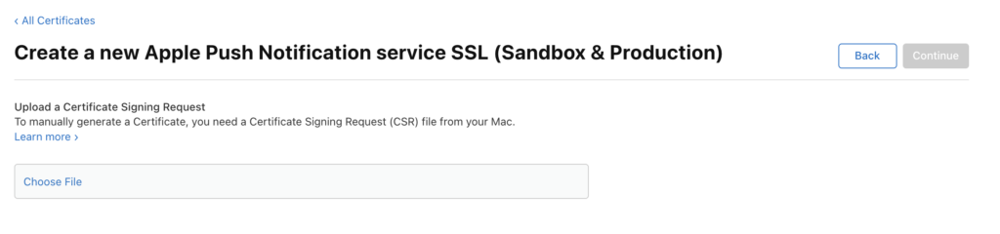
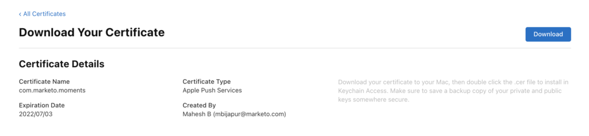
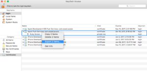
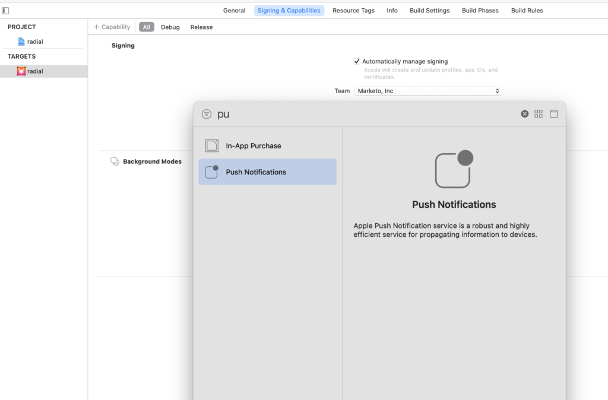
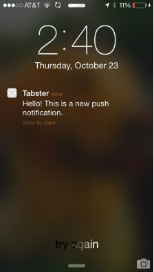
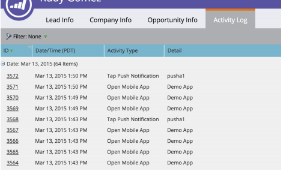
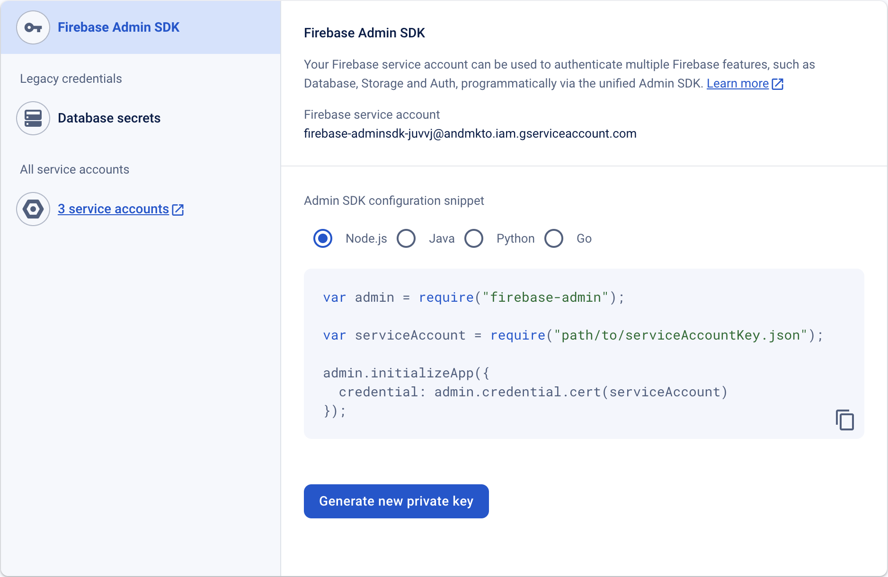

# Push-Benachrichtigungen

Aktivieren Sie Push-Benachrichtigungen für iOS- oder Android-Apps, die die Marketo Mobile SDK verwenden.

## Einrichten einer Push-Benachrichtigung auf iOS

Es gibt drei Schritte zum Aktivieren von Push-Benachrichtigungen:

1. Konfigurieren von Push-Benachrichtigungen in Ihrem Apple-Entwicklerkonto.
1. Aktivieren von Push-Benachrichtigungen in xCode.
1. Aktivieren von Push-Benachrichtigungen in der App mit der Marketo SDK.

### Konfigurieren von Push-Benachrichtigungen im Apple-Entwicklerkonto

1. Melden Sie sich beim Apple Developer [Member Center](https://developer.apple.com/membercenter) an.
1. Wählen Sie „Zertifikate, Kennungen und Profile“ aus.
1. Wählen Sie den Ordner „Zertifikate->Alle“ unter &quot;iOS, tvOS, watchOS“ aus.
1. Klicken Sie auf das &quot;+&quot; neben Zertifikate in der oberen linken Ecke. 
1. Wählen Sie &quot;Apple Push Notification Service SSL (Sandbox &amp; Production)“ aus und klicken Sie dann auf Weiter.
1. Wählen Sie die Anwendungskennung aus, die zum Erstellen der App verwendet wird.
1. Erstellen und hochladen einer CSR, um das Push-Zertifikat zu generieren. 
1. Laden Sie das Zertifikat herunter und doppelklicken Sie zum Installieren darauf. 
1. Öffnen Sie „Schlüsselbund-Zugriff“, klicken Sie mit der rechten Maustaste auf das Zertifikat und exportieren Sie beide Elemente in die `.p12`.
1. Laden Sie diese Datei über Marketo Admin Console hoch, um Benachrichtigungen zu konfigurieren.
1. App-Bereitstellungsprofile aktualisieren.

### Aktivieren von Push-Benachrichtigungen in xCode

Aktivieren der Push-Benachrichtigungsfunktion im xCode-Projekt.

### Aktivieren von Push-Benachrichtigungen in der Mobile App mit Marketo SDK

Fügen Sie der `AppDelegate.m`-Datei den folgenden Code hinzu, um Push-Benachrichtigungen an Kundengeräte zu senden.

**Hinweis** - Wenn Sie die [!DNL Adobe Launch]-Erweiterung verwenden, verwenden Sie `ALMarketo` als Klassennamen.

Fügen Sie den folgenden Import zu `AppDelegate.h` hinzu.

>[!BEGINTABS]

>[!TAB Ziel C]

```objectivec
#import <UserNotifications/UserNotifications.h>
```

>[!TAB Swift]

```swift
import UserNotifications
```

>[!ENDTABS]

Fügen Sie `UNUserNotificationCenterDelegate` wie unten dargestellt zu `AppDelegate` hinzu.

>[!BEGINTABS]

>[!TAB Ziel C]

```objectivec
@interface AppDelegate : UIResponder <UIApplicationDelegate, UNUserNotificationCenterDelegate>
```

>[!TAB Swift]

```swift
class AppDelegate: UIResponder, UIApplicationDelegate , UNUserNotificationCenterDelegate
```

>[!ENDTABS]

Fügen Sie den folgenden Code hinzu, um den Push-Benachrichtigungs-Service zu initialisieren.

>[!BEGINTABS]

>[!TAB Ziel C]

```objectivec
BOOL)application:(UIApplication *)application didFinishLaunchingWithOptions:(NSDictionary *)launchOptions {
UNUserNotificationCenter *center = [UNUserNotificationCenter currentNotificationCenter];
        center.delegate = self;
        [center requestAuthorizationWithOptions:(UNAuthorizationOptionSound | UNAuthorizationOptionAlert | UNAuthorizationOptionBadge) completionHandler:^(BOOL granted, NSError * _Nullable error){
            if(!error){
                dispatch_async(dispatch_get_main_queue(), ^{
                    [[UIApplication sharedApplication] registerForRemoteNotifications];
                });
            }
        }];

    return YES;
}
```

>[!TAB Swift]

```swift
func application(_ application: UIApplication, didFinishLaunchingWithOptions launchOptions: [UIApplication.LaunchOptionsKey: Any]?) -> Bool {

    UNUserNotificationCenter.current().requestAuthorization(options: [.alert, .sound,    .badge]) { granted, error in
            if let error = error {
                print("\(error.localizedDescription)")
            } else {
                DispatchQueue.main.async {
                    application.registerForRemoteNotifications()
                }
            }
        }

        return true
}
```

>[!ENDTABS]

Rufen Sie diese Methode auf, um die Registrierung beim Apple-Push-Service zu starten. Wenn die Registrierung erfolgreich ist, ruft die App die `application:didRegisterForRemoteNotificationsWithDeviceToken:` Methode des App-Delegaten-Objekts auf und übergibt ihr ein Geräte-Token.

Wenn die Registrierung fehlschlägt, ruft die App stattdessen die `application:didFailToRegisterForRemoteNotificationsWithError:`-Methode ihres App-Delegaten auf.

Registrieren Sie das Push-Token bei Marketo. Das Geräte-Token muss registriert sein, um Push-Benachrichtigungen von Marketo empfangen zu können.

>[!BEGINTABS]

>[!TAB Ziel C]

```objectivec
- (void)application:(UIApplication *)application didRegisterForRemoteNotificationsWithDeviceToken:(NSData *)deviceToken {
    // Register the push token with Marketo
    [[Marketo sharedInstance] registerPushDeviceToken:deviceToken];
}
```

>[!TAB Swift]

```swift
func application(_ application: UIApplication, didRegisterForRemoteNotificationsWithDeviceToken deviceToken: Data) {
    // Register the push token with Marketo
    Marketo.sharedInstance().registerPushDeviceToken(deviceToken)
}
```

>[!ENDTABS]

Sie können die Registrierung des Tokens auch aufheben, wenn sich der Benutzer abmeldet.

>[!BEGINTABS]

>[!TAB Ziel C]

```objectivec
[[Marketo sharedInstance] unregisterPushDeviceToken];
```

>[!TAB Swift]

```swift
Marketo.sharedInstance().unregisterPushDeviceToken
```

>[!ENDTABS]

Um das Push-Token erneut zu registrieren, extrahieren Sie den Code aus Schritt 3 in eine AppDelegate-Methode. Rufen Sie diese Methode über die ViewController-Anmeldemethode auf.

Verarbeiten Sie die Push-Benachrichtigung, nachdem Sie das Geräte-Token bei Marketo registriert haben.

>[!BEGINTABS]

>[!TAB Ziel C]

```objectivec
- (void)application:(UIApplication *)application didReceiveRemoteNotification:(NSDictionary *)userInfo
{
    [[Marketo sharedInstance] handlePushNotification:userInfo];
}
```

>[!TAB Swift]

```swift
func application(_ application: UIApplication, didReceiveRemoteNotification userInfo: [AnyHashable : Any]) {
    Marketo.sharedInstance().handlePushNotification(userInfo)
}
```

>[!ENDTABS]

Fügen Sie AppDelegate die folgende Methode hinzu.

Verwenden Sie diese Methode, um einen Warnhinweis anzuzeigen, einen Ton abzuspielen oder das Badge zu erhöhen, während sich die App im Vordergrund befindet. Rufen Sie den entsprechenden completionHandler in dieser Methode auf.

>[!BEGINTABS]

>[!TAB Ziel C]

```objectivec
-(void)userNotificationCenter:(UNUserNotificationCenter *)center
    willPresentNotification:(UNNotification *)notification
        withCompletionHandler:(void (^)(UNNotificationPresentationOptions options))completionHandler{

    completionHandler(UNAuthorizationOptionSound | UNAuthorizationOptionAlert | UNAuthorizationOptionBadge);
}
```

>[!TAB Swift]

```swift
func userNotificationCenter(_ center: UNUserNotificationCenter,
            willPresent notification: UNNotification, withCompletionHandler completionHandler: @escaping (
    UNNotificationPresentationOptions) -> Void) {
    completionHandler([.alert, .sound,.badge])
}
```

>[!ENDTABS]

Verarbeiten Sie neu empfangene Push-Benachrichtigungen in AppDelegate.

Der Delegat ruft diese Methode auf, wenn der Benutzer auf eine Benachrichtigung reagiert, indem er die Anwendung öffnet, die Benachrichtigung verwirft oder eine UNNOTIFICATIONAction auswählt. Legen Sie den Delegaten fest, bevor die Anwendung von applicationIdFinishLaunching: zurückgibt.

>[!BEGINTABS]

>[!TAB Ziel C]

```objectivec
- (void)userNotificationCenter:(UNUserNotificationCenter *)center
didReceiveNotificationResponse:(UNNotificationResponse *)response withCompletionHandler:(void(^)(void))completionHandler {
    [[Marketo sharedInstance] userNotificationCenter:center didReceiveNotificationResponse:response withCompletionHandler:completionHandler];
}
```

>[!TAB Swift]

```swift
func userNotificationCenter(_ center: UNUserNotificationCenter,
                                didReceive response: UNNotificationResponse,
                                withCompletionHandler
                                completionHandler: @escaping () -> Void) {
        Marketo.sharedInstance().userNotificationCenter(center, didReceive: response, withCompletionHandler: completionHandler)
}
```

>[!ENDTABS]

Push-Benachrichtigungen tracken.

Wenn sich die App im Hintergrund befindet oder inaktiv ist, erhält das Gerät eine Push-Benachrichtigung wie unten dargestellt. Marketo verfolgt, wann der Benutzer die Benachrichtigung auswählt.



Wenn das Gerät eine Push-Benachrichtigung erhält, wird die Benachrichtigung an den `application:didReceiveRemoteNotification:` Callback auf dem App-Delegaten weitergeleitet.

Das folgende Marketo-Aktivitätsprotokoll zeigt App-Ereignisse und Push-Benachrichtigungsereignisse.



## Einrichten einer Push-Benachrichtigung auf Android

1. Fügen Sie die folgenden Berechtigungen innerhalb des Anwendungs-Tags hinzu.

   Öffnen Sie `AndroidManifest.xml` und fügen Sie die folgenden Berechtigungen hinzu. Ihre App muss die Berechtigungen „INTERNET“ und „ACCESS_NETWORK_STATE“ anfordern. Überspringen Sie diesen Schritt, wenn die App sie bereits anfordert.

   ```xml
   <uses‐permission android:name="android.permission.INTERNET"/>
   <uses‐permission android:name="android.permission.ACCESS_NETWORK_STATE"/>
   
   <!‐‐Following permissions are required for push notification.‐‐>
   <uses-permission android:name="android.permission.GET_ACCOUNTS"/>
   <!‐‐Keeps the processor from sleeping when a message is received.‐‐>
   <uses-permission android:name="android.permission.WAKE_LOCK"/>
   <permission android:name="<PACKAGE_NAME>.permission.C2D_MESSAGE" android:protectionLevel="signature" />
   <uses-permission android:name="<PACKAGE_NAME>.permission.C2D_MESSAGE" />
   <!-- This app has permission to register and receive data message. -->
   <uses-permission android:name="com.google.android.c2dm.permission.RECEIVE" />
   ```

1. Einrichten von FCM mit HTTPv1.

   - Aktivieren Sie MME FCM HTTPv1 in Marketo Feature Manager. 
   - Laden Sie die JSON-Datei des Service-Kontos für die App in MLM hoch.
   - Laden Sie die JSON-Datei für das Service-Konto von der Firebase Console herunter. 
   - Eine Stunde nach dem Hochladen der JSON-Datei des Service-Kontos in Marketo warten, bevor Push-Benachrichtigungen gesendet werden.

## Android-Testgeräte

Fügen Sie die Marketo-Aktivität zur Manifestdatei im Anwendungs-Tag hinzu.

```xml
<activity android:name="com.marketo.MarketoActivity"  android:configChanges="orientation|screenSize">
    <intent-filter android:label="MarketoActivity">
        <action  android:name="android.intent.action.VIEW"/>
        <category  android:name="android.intent.category.DEFAULT"/>
        <category  android:name="android.intent.category.BROWSABLE"/>
        <data android:host="add_test_device" android:scheme="mkto"/>
    </intent-filter/>
</activity/>
```

## Registrieren des Marketo-Push-Service

1. Fügen Sie den Firebase-Messaging-Dienst vor dem schließenden Anwendungs-Tag zu `AndroidManifest.xml` hinzu.

   ```xml
   <meta-data
       android:name="com.google.android.gms.version"
       android:value="@integer/google_play_services_version" />
   <service android:name=".MyFirebaseMessagingService">
   <intent-filter>
   <action android:name="com.google.firebase.INSTANCE_ID_EVENT"/>
   <action android:name="com.google.firebase.MESSAGING_EVENT"/>
   </intent-filter>
   </service>
   ```

1. Fügen Sie die Marketo SDK-Methoden wie folgt zu `MyFirebaseMessagingService` hinzu.

   ```java
   import com.marketo.Marketo;
   
   public class MyFirebaseMessagingService extends FirebaseMessagingService {
   
       @Override
       public void onNewToken(String s) {
           super.onNewToken(s);
           Marketo marketoSdk = Marketo.getInstance(this.getApplicationContext());
           marketoSdk.setPushNotificaitonToken(s);
           // Add your code here...
       }
   
       @Override
       public void onMessageReceived(RemoteMessage remoteMessage) {
           Marketo marketoSdk = Marketo.getInstance(this.getApplicationContext());
           marketoSdk.showPushNotificaiton(remoteMessage);
           // Add your code here...
       }
   
   }
   ```

   **Hinweis** - Wenn Sie die Adobe-Erweiterung verwenden, fügen Sie den folgenden Code hinzu.

   ```java
   import com.marketo.Marketo;
   
   public class MyFirebaseMessagingService extends FirebaseMessagingService {
   
       @Override
       public void onNewToken(String token) {
           super.onNewToken(token);
           ALMarketo.setPushNotificationToken(token);
           // Add your code here...
       }
   
       @Override
       public void onMessageReceived(RemoteMessage remoteMessage) {
           ALMarketo.showPushNotification(remoteMessage);
           // Add your code here...
       }
   
   }
   ```

**HINWEIS**: FCM SDK fügt automatisch die erforderlichen Berechtigungen und Empfängerfunktionen hinzu. Wenn Sie eine frühere SDK-Version verwendet haben, entfernen Sie die folgenden veralteten Elemente, was zu einer Duplizierung der Nachricht führen kann.

```xml
<receiver android:name="com.marketo.MarketoBroadcastReceiver" android:permission="com.google.android.c2dm.permission.SEND">
    <intent-filter>
        <!‐‐Receives the actual messages.‐‐>
        <action android:name="com.google.android.c2dm.intent.RECEIVE"/>
        <!‐‐Register to enable push notification‐‐>
        <action android:name="com.google.android.c2dm.intent.REGISTRATION"/>
        <!‐‐‐Replace YOUR_PACKAGE_NAME with your own package name‐‐>
        <category android:name="YOUR_PACKAGE_NAME"/>
    </intent-filter>
</receiver>

<!‐‐Marketo service to handle push registration and notification‐‐>
<service android:name="com.marketo.MarketoIntentService"/>
```

1. Marketo Push initialisieren. Erstellen oder öffnen Sie nach dem Speichern der Konfiguration die Application-Klasse und fügen Sie den folgenden Code hinzu. Die Absender-ID aus der Firebase Console abrufen.

   ```java
   Marketo marketoSdk = Marketo.getInstance(getApplicationContext());
   
   // Enable push notification here. The push notification channel name can by any string
   marketoSdk.initializeMarketoPush(SENDER_ID,"ChannelName");
   ```

   Wenn Sie die [!DNL Adobe Launch]-Erweiterung verwenden, verwenden Sie den folgenden Code.

   ```java
   // Enable push notification here. The push notification channel name can by any string
   ALMarketo.initializeMarketoPush(SENDER_ID,"ChannelName");
   ```

   Wenn Sie keine SENDER_ID haben, aktivieren Sie den Google Cloud Messaging-Service, indem Sie die in [diesem Tutorial](https://developers.google.com/cloud-messaging/) beschriebenen Schritte ausführen.

   Sie können die Registrierung des Tokens auch aufheben, wenn sich der Benutzer abmeldet.

   ```java
   marketoSdk.uninitializeMarketoPush();
   ```

   Wenn Sie die [!DNL Adobe Launch]-Erweiterung verwenden, verwenden Sie den folgenden Code.

   ```java
   ALMarketo.uninitializeMarketoPush();
   ```

   Hinweis: Um das Push-Token erneut zu registrieren, extrahieren Sie den Code aus Schritt 3 in eine AppDelegate-Methode. Rufen Sie diese Methode über die ViewController-Anmeldemethode auf.

1. Optional: Legen Sie ein Benachrichtigungssymbol fest. Rufen Sie die folgende Methode auf, um ein benutzerdefiniertes Benachrichtigungssymbol zu konfigurieren.

   ```java
   MarketoConfig.Notification config = new MarketoConfig.Notification();
   // Optional bitmap for honeycomb and above
   config.setNotificationLargeIcon(bitmap);
   
   // Required icon Resource ID
   config.setNotificationSmallIcon(R.drawable.notification_small_icon);
   
   // Set the configuration
   //Use the static methods on ALMarketo class when using Adobe Extension
   Marketo.getInstance(context).setNotificationConfig(config);
   
   // Get the configuration set
   Marketo.getInstance(context).getNotificationConfig();
   ```

## Fehlerbehebung

Wenn mobile Push-Benachrichtigungen nicht wie erwartet funktionieren, überprüfen Sie die allgemeinen Konfigurationsprobleme, bevor Sie die Implementierungsdetails untersuchen.

### Push-Nachricht wird nicht angezeigt

Überprüfen, ob Push-Nachrichten auf dem Gerät deaktiviert sind. Mobile Benutzer können steuern, ob sie Nachrichten für jede App erhalten. Entwickler oder Marketing-Experten können dann Nachrichten während der Entwicklung deaktivieren.

Überprüfen, ob die App geöffnet und aktiv ist. Wenn die App aktiv ist, werden keine mobilen Push-Nachrichten auf dem Bildschirm angezeigt. Sie werden stattdessen im Bereich „Lokale Benachrichtigungen“ der App angezeigt.

### Anzeigen der Aktivitätsprotokolle in Marketo

Verwenden Sie die Aktivitätsprotokolle von Marketo, um zu überprüfen, ob eine Nachricht gesendet wurde.

Überprüfen Sie die Aktivitätsdatensätze auf eine Person, die die Nachricht erhalten haben sollte. Wenn die Nachricht gesendet wurde, enthält das Aktivitätsprotokoll einen Datensatz. Wenn kein Datensatz vorhanden ist, überprüfen Sie die Konfiguration des iOS-Zertifikats oder des Android-API-Schlüssels in Marketo.

### Zertifikat oder Schlüssel ist ungültig

Überprüfen Sie, ob das richtige Zertifikat für Sandbox oder Produktion geladen wurde. Exportieren Sie bei Bedarf die iOS-Zertifikate oder Android-Schlüssel erneut und laden Sie sie in Marketo neu.

### .p12-Datei fehlt ein Zertifikat oder ein Schlüssel (iOS)

Exportieren Sie beim Exportieren des Zertifikats sowohl den Schlüssel als auch das Zertifikat.

### Bereitstellungsprofile veraltet (iOS)

Nachdem Sie ein Gerät hinzugefügt haben, aktualisieren Sie die Bereitstellungsprofile und generieren Sie neue Zertifikate. Lassen Sie das Xcode-Projekt auf die richtigen Profile und Zertifikate verweisen und importieren Sie die Zertifikate in Marketo.

### IOS-Zertifikat kann nicht hochgeladen werden (IOS)

Stellen Sie sicher, dass das zum Exportieren des Zertifikats verwendete Kennwort keine Leerzeichen enthält. Beispiel: stattdessen:

`Hello World 123`

Verwenden Sie diesen:

`HelloWorld123`

### Fehlerbehebung bei iOS-Zertifikaten

Verwenden Sie für Sandbox-Anwendungen das Zertifikat „Entwickler“ oder „universell“. Laden Sie für Produktionsanwendungen ein gültiges „Verteilungs“- oder „universelles“ Zertifikat hoch.

### Push-Bounce/ungültiges Token

Ein Registrierungs-Token kann in den folgenden Szenarien ungültig werden:

- Wenn die Registrierung der Client-App bei GCM aufgehoben wird.
- Wenn die Registrierung der Client-Anwendung automatisch aufgehoben wird, was passieren kann, wenn der Benutzer die Anwendung deinstalliert. Beispiel: Auf iOS, wenn der APNS-Feedback-Service das APNS-Token als ungültig gemeldet hat.
- Wenn das Registrierungs-Token abläuft. Beispielsweise kann Google beschließen, Registrierungs-Token zu aktualisieren, oder das APNS-Token für iOS-Geräte ist abgelaufen.
- Wenn die Client-App aktualisiert wird, die neue Version jedoch nicht für den Empfang von Nachrichten konfiguriert ist.
