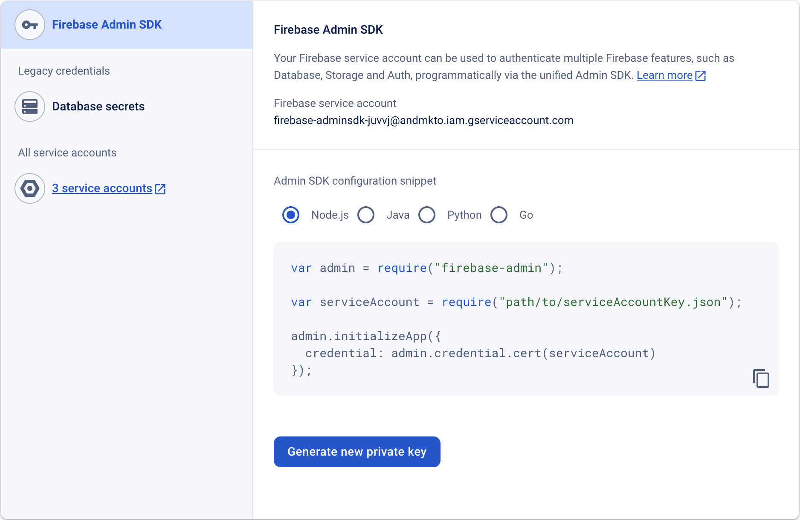

# Push-Benachrichtigungen

Aktivieren von Push-Benachrichtigungen.

## Einrichten einer Push-Benachrichtigung auf iOS

Es gibt drei Schritte zum Aktivieren von Push-Benachrichtigungen:

1. Konfigurieren von Push-Benachrichtigungen im Apple-Entwicklerkonto.
1. Aktivieren von Push-Benachrichtigungen in xCode.
1. Aktivieren von Push-Benachrichtigungen in der Mobile App mit Marketo SDK.

### Konfigurieren von Push-Benachrichtigungen im Apple-Entwicklerkonto

1. Melden Sie sich beim Apple Developer [Member Center](http://developer.apple.com/membercenter) an.
1. Klicken Sie auf „Zertifikate, Kennungen und Profile“.
1. Klicken Sie auf den Ordner „Zertifikate->Alle“ unter &quot;iOS, tvOS, watchOS“.
1. Wählen Sie das &quot;+&quot; auf dem Bildschirm links oben neben Zertifikate 
1. Aktivieren Sie das Kontrollkästchen &quot;Apple Push Notification Service SSL (Sandbox &amp; Production)“ und klicken Sie auf „Weiter“.
1. Wählen Sie die Anwendungskennung aus, die Sie verwenden, um die App zu erstellen.
1. Erstellen und hochladen von CSR, um das Push-Zertifikat zu generieren. 
1. Zertifikat auf lokalen Computer herunterladen und zur Installation doppelklicken. 
1. Öffnen Sie „Schlüsselbund-Zugriff“, klicken Sie mit der rechten Maustaste auf das Zertifikat und exportieren Sie zwei Elemente in die `.p12`.
1. Laden Sie diese Datei über Marketo Admin Console hoch, um Benachrichtigungen zu konfigurieren.
1. App-Bereitstellungsprofile aktualisieren.

### Aktivieren von Push-Benachrichtigungen in xCode

Aktivieren der Push-Benachrichtigungsfunktion in einem xCode-Projekt.

### Aktivieren von Push-Benachrichtigungen in der Mobile App mit Marketo SDK

Fügen Sie der Datei `AppDelegate.m` folgenden Code hinzu, um Push-Benachrichtigungen an die Geräte Ihres Kunden zu senden.

**Hinweis** - Wenn Sie die [!DNL Adobe Launch] verwenden, verwenden Sie `ALMarketo` als Klassennamen

Importieren Sie Folgendes in `AppDelegate.h`.

>[!BEGINTABS]

>[!TAB Ziel C]

```
#import <UserNotifications/UserNotifications.h>
```

>[!TAB Swift]

```
import UserNotifications
```

>[!ENDTABS]

Fügen Sie `UNUserNotificationCenterDelegate` wie unten dargestellt zu `AppDelegate` hinzu.

>[!BEGINTABS]

>[!TAB Ziel C]

```
@interface AppDelegate : UIResponder <UIApplicationDelegate, UNUserNotificationCenterDelegate>
```

>[!TAB Swift]

```
class AppDelegate: UIResponder, UIApplicationDelegate , UNUserNotificationCenterDelegate
```

>[!ENDTABS]

Push-Benachrichtigungs-Service starten. Um die Push-Benachrichtigung zu aktivieren, fügen Sie den folgenden Code hinzu.

>[!BEGINTABS]

>[!TAB Ziel C]

```objectivec
BOOL)application:(UIApplication *)application didFinishLaunchingWithOptions:(NSDictionary *)launchOptions {
UNUserNotificationCenter *center = [UNUserNotificationCenter currentNotificationCenter];
        center.delegate = self;
        [center requestAuthorizationWithOptions:(UNAuthorizationOptionSound | UNAuthorizationOptionAlert | UNAuthorizationOptionBadge) completionHandler:^(BOOL granted, NSError * _Nullable error){
            if(!error){
                dispatch_async(dispatch_get_main_queue(), ^{
                    [[UIApplication sharedApplication] registerForRemoteNotifications];
                });
            }
        }];

    return YES;
}
```

>[!TAB Swift]

```
func application(_ application: UIApplication, didFinishLaunchingWithOptions launchOptions: [UIApplication.LaunchOptionsKey: Any]?) -> Bool {

    UNUserNotificationCenter.current().requestAuthorization(options: [.alert, .sound,    .badge]) { granted, error in
            if let error = error {
                print("\(error.localizedDescription)")
            } else {
                DispatchQueue.main.async {
                    application.registerForRemoteNotifications()
                }
            }
        }

        return true
}
```

>[!ENDTABS]

Rufen Sie diese Methode auf, um den Registrierungsprozess mit dem Apple-Push-Service zu starten. Wenn die Registrierung erfolgreich ist, ruft die App die `application:didRegisterForRemoteNotificationsWithDeviceToken:` Methode Ihres App-Delegate-Objekts auf und übergibt ihr ein Geräte-Token.

Wenn die Registrierung fehlschlägt, ruft die App stattdessen die `application:didFailToRegisterForRemoteNotificationsWithError:`-Methode ihres App-Delegaten auf.

Registrieren Sie das Push-Token bei Marketo. Um Push-Benachrichtigungen von Marketo zu erhalten, müssen Sie das Geräte-Token bei Marketo registrieren.

>[!BEGINTABS]

>[!TAB Ziel C]

```
- (void)application:(UIApplication *)application didRegisterForRemoteNotificationsWithDeviceToken:(NSData *)deviceToken {
    // Register the push token with Marketo
    [[Marketo sharedInstance] registerPushDeviceToken:deviceToken];
}
```

>[!TAB Swift]

```
func application(_ application: UIApplication, didRegisterForRemoteNotificationsWithDeviceToken deviceToken: Data) {
    // Register the push token with Marketo
    Marketo.sharedInstance().registerPushDeviceToken(deviceToken)
}
```

>[!ENDTABS]

Die Registrierung des Tokens kann auch aufgehoben werden, wenn sich der Benutzer abmeldet.

>[!BEGINTABS]

>[!TAB Ziel C]

```
[[Marketo sharedInstance] unregisterPushDeviceToken];
```

>[!TAB Swift]

```
Marketo.sharedInstance().unregisterPushDeviceToken
```

>[!ENDTABS]

Um das Push-Token erneut zu registrieren, extrahieren Sie den Code aus Schritt 3 in eine AppDelegate-Methode und rufen die ViewController-Anmeldemethode auf.

Push-Benachrichtigung verarbeiten. Um Push-Benachrichtigungen von Marketo zu erhalten, müssen Sie das Geräte-Token bei Marketo registrieren.

>[!BEGINTABS]

>[!TAB Ziel C]

```
- (void)application:(UIApplication *)application didReceiveRemoteNotification:(NSDictionary *)userInfo
{
    [[Marketo sharedInstance] handlePushNotification:userInfo];
}
```

>[!TAB Swift]

```
func application(_ application: UIApplication, didReceiveRemoteNotification userInfo: [AnyHashable : Any]) {
    Marketo.sharedInstance().handlePushNotification(userInfo)
}
```

>[!ENDTABS]

Fügen Sie die folgende Methode in AppDelegate hinzu

Mit dieser Methode können Sie entweder einen Warnhinweis, einen Ton oder ein erhöhtes Badge anzeigen, während sich die App im Vordergrund befindet. Sie müssen in dieser Methode CompletionHandler Ihrer Wahl aufrufen.

>[!BEGINTABS]

>[!TAB Ziel C]

```
-(void)userNotificationCenter:(UNUserNotificationCenter *)center
    willPresentNotification:(UNNotification *)notification
        withCompletionHandler:(void (^)(UNNotificationPresentationOptions options))completionHandler{

    completionHandler(UNAuthorizationOptionSound | UNAuthorizationOptionAlert | UNAuthorizationOptionBadge);
}
```

>[!TAB Swift]

```
func userNotificationCenter(_ center: UNUserNotificationCenter,
            willPresent notification: UNNotification, withCompletionHandler completionHandler: @escaping (
    UNNotificationPresentationOptions) -> Void) {
    completionHandler([.alert, .sound,.badge])
}
```

>[!ENDTABS]

Verarbeiten von neu empfangenen Push-Benachrichtigungen in AppDelegate

Die Methode wird auf den Delegaten aufgerufen, wenn der Benutzer auf die Benachrichtigung durch Öffnen der Anwendung, Schließen der Benachrichtigung oder Auswählen einer UNNOTIFICATIONAction geantwortet hat. Der Delegat muss festgelegt werden, bevor die Anwendung von applicationIdFinishLaunching: zurückgibt.

>[!BEGINTABS]

>[!TAB Ziel C]

```
- (void)userNotificationCenter:(UNUserNotificationCenter *)center
didReceiveNotificationResponse:(UNNotificationResponse *)response withCompletionHandler:(void(^)(void))completionHandler {
    [[Marketo sharedInstance] userNotificationCenter:center didReceiveNotificationResponse:response withCompletionHandler:completionHandler];
}
```

>[!TAB Swift]

```
func userNotificationCenter(_ center: UNUserNotificationCenter,
                                didReceive response: UNNotificationResponse,
                                withCompletionHandler
                                completionHandler: @escaping () -> Void) {
        Marketo.sharedInstance().userNotificationCenter(center, didReceive: response, withCompletionHandler: completionHandler)
}
```

>[!ENDTABS]

Push-Benachrichtigungen tracken

Wenn Ihre App im Hintergrund ausgeführt wird (oder nicht aktiv ist), erhält das Gerät eine Push-Benachrichtigung wie unten dargestellt. Marketo verfolgt, wann der Benutzer auf die Benachrichtigung tippt.


Wenn das Gerät eine Push-Benachrichtigung erhält, wird sie an `application:didReceiveRemoteNotification:` Callback auf Ihrem App-Delegaten weitergeleitet.

Im Folgenden finden Sie ein Marketo-Aktivitätsprotokoll von Marketo, das App-Ereignisse und Push-Benachrichtigungsereignisse anzeigt.


## Einrichten einer Push-Benachrichtigung auf Android

1. Fügen Sie im Anwendungs-Tag die folgende Berechtigung hinzu.

   Öffnen Sie `AndroidManifest.xml` und fügen Sie die folgenden Berechtigungen hinzu. Ihre App muss die Berechtigungen „INTERNET“ und „ACCESS_NETWORK_STATE“ anfordern. Wenn Ihre Anwendung diese Berechtigungen bereits anfordert, überspringen Sie diesen Schritt.

   ```xml
   <uses‐permission android:name="android.permission.INTERNET"/>
   <uses‐permission android:name="android.permission.ACCESS_NETWORK_STATE"/>
   
   <!‐‐Following permissions are required for push notification.‐‐>
   <uses-permission android:name="android.permission.GET_ACCOUNTS"/>
   <!‐‐Keeps the processor from sleeping when a message is received.‐‐>
   <uses-permission android:name="android.permission.WAKE_LOCK"/>
   <permission android:name="<PACKAGE_NAME>.permission.C2D_MESSAGE" android:protectionLevel="signature" />
   <uses-permission android:name="<PACKAGE_NAME>.permission.C2D_MESSAGE" />
   <!-- This app has permission to register and receive data message. -->
   <uses-permission android:name="com.google.android.c2dm.permission.RECEIVE" />
   ```

1. Einrichten von FCM mit HTTPv1 (Google hat [veraltetes XMPP-](https://firebase.google.com/docs/cloud-messaging/xmpp-server-ref)) am 12. Juni 2023 veröffentlicht und wird im Juni 2024 entfernt)

- Aktivieren von MME FCM HTTPv1 in Marketo Feature Manager 
   - Laden Sie die JSON-Datei des Service-Kontos für die App in MLM hoch.
   - Sie können die JSON-Datei für das Service-Konto von der Firebase Console herunterladen.   
   - Warten Sie eine Stunde nach dem Hochladen der JSON-Datei des Service-Kontos in Marketo, bevor Sie Push-Benachrichtigungen senden.  

## Android-Testgeräte

Fügen Sie die Marketo-Aktivität in der Manifestdatei im Anwendungs-Tag hinzu.

```xml
<activity android:name="com.marketo.MarketoActivity"  android:configChanges="orientation|screenSize">
    <intent-filter android:label="MarketoActivity">
        <action  android:name="android.intent.action.VIEW"/>
        <category  android:name="android.intent.category.DEFAULT"/>
        <category  android:name="android.intent.category.BROWSABLE"/>
        <data android:host="add_test_device" android:scheme="mkto"/>
    </intent-filter/>
</activity/>
```

## Registrieren des Marketo-Push-Service

1. Um Push-Benachrichtigungen von Marketo zu erhalten, müssen Sie den Firebase Messaging-Dienst zu Ihrem `AndroidManifest.xml` hinzufügen. Fügen Sie vor dem schließenden Anwendungs-Tag hinzu.

   ```xml
   <meta-data
       android:name="com.google.android.gms.version"
       android:value="@integer/google_play_services_version" />
   <service android:name=".MyFirebaseMessagingService">
   <intent-filter>
   <action android:name="com.google.firebase.INSTANCE_ID_EVENT"/>
   <action android:name="com.google.firebase.MESSAGING_EVENT"/>
   </intent-filter>
   </service>
   ```

1. Fügen Sie Marketo SDK-Methoden wie folgt in den `MyFirebaseMessagingService` hinzu

   ```java
   import com.marketo.Marketo;
   
   public class MyFirebaseMessagingService extends FirebaseMessagingService {
   
       @Override
       public void onNewToken(String s) {
           super.onNewToken(s);
           Marketo marketoSdk = Marketo.getInstance(this.getApplicationContext());
           marketoSdk.setPushNotificaitonToken(s);
           // Add your code here...
       }
   
       @Override
       public void onMessageReceived(RemoteMessage remoteMessage) {
           Marketo marketoSdk = Marketo.getInstance(this.getApplicationContext());
           marketoSdk.showPushNotificaiton(remoteMessage);
           // Add your code here...
       }
   
   }
   ```

   **Hinweis** - Fügen Sie bei Verwendung der Adobe-Erweiterung wie folgt hinzu

   ```java
   import com.marketo.Marketo;
   
   public class MyFirebaseMessagingService extends FirebaseMessagingService {
   
       @Override
       public void onNewToken(String token) {
           super.onNewToken(token);
           ALMarketo.setPushNotificationToken(token);
           // Add your code here...
       }
   
       @Override
       public void onMessageReceived(RemoteMessage remoteMessage) {
           ALMarketo.showPushNotification(remoteMessage);
           // Add your code here...
       }
   
   }
   ```

**HINWEIS**: Die FCM-SDK fügt automatisch alle erforderlichen Berechtigungen sowie die erforderliche Empfängerfunktionalität hinzu. Entfernen Sie die folgenden veralteten (und möglicherweise schädlichen, da sie zu einer Duplizierung von Nachrichten führen können) Elemente aus dem Manifest Ihrer App, wenn Sie frühere Versionen von SDK verwendet haben

```xml
<receiver android:name="com.marketo.MarketoBroadcastReceiver" android:permission="com.google.android.c2dm.permission.SEND">
    <intent-filter>
        <!‐‐Receives the actual messages.‐‐>
        <action android:name="com.google.android.c2dm.intent.RECEIVE"/>
        <!‐‐Register to enable push notification‐‐>
        <action android:name="com.google.android.c2dm.intent.REGISTRATION"/>
        <!‐‐‐Replace YOUR_PACKAGE_NAME with your own package name‐‐>
        <category android:name="YOUR_PACKAGE_NAME"/>
    </intent-filter>
</receiver>

<!‐‐Marketo service to handle push registration and notification‐‐>
<service android:name="com.marketo.MarketoIntentService"/>
```

1. Marketo-Push initialisieren Nach dem Speichern der oben genannten Konfiguration müssen Sie Marketo-Push-Benachrichtigungen initialisieren. Erstellen oder öffnen Sie die Anwendungsklasse und kopieren Sie den unten stehenden Code. Sie können Ihre Absender-ID über die Firebase-Konsole abrufen.

   ```java
   Marketo marketoSdk = Marketo.getInstance(getApplicationContext());
   
   // Enable push notification here. The push notification channel name can by any string
   marketoSdk.initializeMarketoPush(SENDER_ID,"ChannelName");
   ```

   Wenn Sie [!DNL Adobe Launch] Erweiterung verwenden, verwenden Sie diese Anweisungen

   ```java
   // Enable push notification here. The push notification channel name can by any string
   ALMarketo.initializeMarketoPush(SENDER_ID,"ChannelName");
   ```

   Wenn Sie keine SENDER_ID haben, aktivieren Sie den Google Cloud Messaging-Service, indem Sie die in [diesem Tutorial](https://developers.google.com/cloud-messaging/) beschriebenen Schritte ausführen.

   Die Registrierung des Tokens kann auch aufgehoben werden, wenn sich der Benutzer abmeldet.

   ```java
   marketoSdk.uninitializeMarketoPush();
   ```

   Wenn Sie [!DNL Adobe Launch] Erweiterung verwenden, verwenden Sie die folgende Anweisung

   ```java
   ALMarketo.uninitializeMarketoPush();
   ```

   Hinweis: Um das Push-Token erneut zu registrieren, extrahieren Sie den Code aus Schritt 3 in eine AppDelegate-Methode und rufen die ViewController-Anmeldemethode auf.

1. Benachrichtigungssymbol festlegen (optional) Um ein benutzerdefiniertes Benachrichtigungssymbol zu konfigurieren, sollte die folgende Methode aufgerufen werden.

   ```java
   MarketoConfig.Notification config = new MarketoConfig.Notification();
   // Optional bitmap for honeycomb and above
   config.setNotificationLargeIcon(bitmap);
   
   // Required icon Resource ID
   config.setNotificationSmallIcon(R.drawable.notification_small_icon);
   
   // Set the configuration
   //Use the static methods on ALMarketo class when using Adobe Extension
   Marketo.getInstance(context).setNotificationConfig(config);
   
   // Get the configuration set
   Marketo.getInstance(context).getNotificationConfig();
   ```

## Fehlerbehebung

Die Einrichtung mobiler Push-Nachrichten umfasst viele Schritte und die Koordination von Entwicklern und Marketern. Wenn Sie Schwierigkeiten haben, gibt es einige einfache Dinge, die Sie überprüfen können.

Nachdem Sie sichergestellt haben, dass die einfachen Dinge korrekt sind, können Sie sich mit den Programmierdetails vertraut machen.

### Push-Nachricht wird nicht angezeigt

Überprüfen Sie zunächst, ob Push-Nachrichten auf dem Mobilgerät deaktiviert sind. Mobile Benutzer können steuern, ob sie Nachrichten für eine bestimmte App erhalten. Oft werden diese Nachrichten von Entwicklern (und Marketern) irgendwann während der Entwicklung deaktiviert. Zunächst müssen Sie also überprüfen, ob der Empfänger Push-Nachrichten für Ihre App deaktiviert hat.

Zweitens, ist die App bereits geöffnet und auf dem Gerät aktiv? Wenn Ihre App die aktive App auf dem Gerät ist, werden keine mobilen Push-Nachrichten auf dem Bildschirm angezeigt. Stattdessen werden sie im Bereich „Lokale Benachrichtigungen“ Ihrer App angezeigt.

### Anzeigen der Aktivitätsprotokolle in Marketo

Der erste Ort, der bei der Fehlersuche berücksichtigt werden sollte, ist in den Marketo-Aktivitätsprotokollen. Sie können Aktivitätsprotokolle verwenden, um zu überprüfen, ob eine Nachricht gesendet wurde.

Überprüfen Sie im Aktivitätsprotokoll die Aktivitätsdatensätze für eine Person, die eine Nachricht erhalten sollte. Wenn die Nachricht gesendet wurde, ist im Aktivitätsprotokoll ein Eintrag vorhanden. Andernfalls ist das Problem wahrscheinlich auf die Konfiguration des iOS-Zertifikats oder des Android-API-Schlüssels in Marketo zurückzuführen.

### Zertifikat oder Schlüssel ist ungültig

Überprüfen Sie Ihre Konfiguration, um sicherzustellen, dass Sie das richtige Zertifikat für Sandbox oder Produktion geladen haben. Manchmal ist es am besten, wenn der Entwickler die Zertifikate (iOS) oder Schlüssel (Android) erneut exportiert und dann in Marketo neu lädt, um sicherzustellen, dass sie korrekt sind.

### .p12-Datei fehlt ein Zertifikat oder ein Schlüssel (iOS)

Stellen Sie beim Exportieren des Zertifikats sicher, dass Sie den Schlüssel (_)_ Zertifikat exportieren.

### Bereitstellungsprofile veraltet (iOS)

Wenn Sie ein neues Gerät hinzufügen, müssen Sie Ihre Bereitstellungsprofile aktualisieren und neue Zertifikate generieren. Vergewissern Sie sich, dass Ihr Xcode-Projekt dann auf die richtigen Profile und Zertifikate verweist, und importieren Sie diese Zertifikate in Marketo.

### IOS-Zertifikat kann nicht hochgeladen werden (IOS)

Stellen Sie sicher, dass das beim Exportieren des Zertifikats verwendete Kennwort keine Leerzeichen enthält.  Beispiel: stattdessen:

`Hello World 123`

Verwenden Sie diesen:

`HelloWorld123`

### Fehlerbehebung bei iOS-Zertifikaten

Für Sandbox-Anwendungen können Sie entweder ein „Entwickler“- oder ein „universelles“ Zertifikat verwenden. Für Produktionsanwendungen müssen Sie jedoch ein gültiges „Verteilungs“- oder „universelles“ Zertifikat hochladen.

### Push-Bounce/ungültiges Token

Ein vorhandenes Registrierungs-Token kann in einer Reihe von Szenarien ungültig werden, darunter:

- Wenn die Registrierung der Client-App bei GCM aufgehoben wird.
- Wenn die Registrierung der Client-Anwendung automatisch aufgehoben wird, was passieren kann, wenn der Benutzer die Anwendung deinstalliert. Beispiel: Auf iOS, wenn der APNS-Feedback-Service das APNS-Token als ungültig gemeldet hat.
- Wenn das Registrierungs-Token abläuft. Beispielsweise kann Google beschließen, Registrierungs-Token zu aktualisieren, oder das APNS-Token für iOS-Geräte ist abgelaufen.
- Wenn die Client-App aktualisiert wird, die neue Version jedoch nicht für den Empfang von Nachrichten konfiguriert ist.
