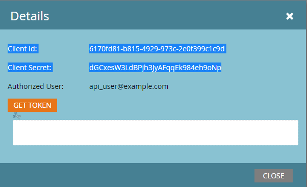

# Authentifizierung

Marketos REST-APIs werden mit 2-beinigem OAuth 2.0 authentifiziert. Client-IDs und Client-Geheimnisse werden von benutzerdefinierten Services bereitgestellt, die Sie definieren. Jeder benutzerdefinierte Dienst ist im Besitz eines Benutzers, der nur über eine API verfügt und der mit einer Reihe von Rollen und Berechtigungen ausgestattet ist, die den Dienst zum Ausführen bestimmter Aktionen autorisieren. Ein Zugriffs-Token ist einem einzelnen benutzerdefinierten Service zugeordnet. Der Ablauf des Zugriffstokens ist unabhängig von Token, die mit anderen benutzerdefinierten Services verknüpft sind, die möglicherweise in einer -Instanz vorhanden sind.

## Erstellen eines Zugriffs-Tokens

Die `Client ID` und `Client Secret` befinden sich im Menü **[!UICONTROL Admin]** > **[!UICONTROL Integration]** > **[!UICONTROL LaunchPoint]**, indem Sie den benutzerdefinierten Service auswählen und auf **[!UICONTROL Details anzeigen]** klicken.




Der `Identity URL` befindet sich im **[!UICONTROL Admin]** > **[!UICONTROL Integration]** > **[!UICONTROL Web-Services]** im Abschnitt REST-API .

Erstellen Sie ein Zugriffs-Token mithilfe einer HTTP-GET-Anfrage (oder POST-Anfrage) wie folgt:

```
GET <Identity URL>/oauth/token?grant_type=client_credentials&client_id=<Client Id>&client_secret=<Client Secret>
```

Wenn Ihre Anfrage gültig war, erhalten Sie eine JSON-Antwort, die der folgenden ähnelt:

```json
{
    "access_token": "cdf01657-110d-4155-99a7-f986b2ff13a0:int",
    "token_type": "bearer",
    "expires_in": 3599,
    "scope": "apis@acmeinc.com"
}
```

Definition der Antwort

- `access_token` - Das Token, das Sie mit nachfolgenden Aufrufen übergeben, um sich bei der Zielinstanz zu authentifizieren.
- `token_type` - Die OAuth-Authentifizierungsmethode.
- `expires_in` : Die verbleibende Lebensdauer des aktuellen Tokens in Sekunden (danach ist sie ungültig). Wenn ein Zugriffs-Token ursprünglich erstellt wurde, beträgt seine Lebensdauer 3.600 Sekunden oder eine Stunde.
- `scope` - Der besitzende Benutzer des benutzerdefinierten Services, der zur Authentifizierung verwendet wurde.

## Verwenden eines Zugriffs-Tokens

Beim Aufrufen von REST-API-Methoden muss jeder Aufruf ein Zugriffstoken enthalten, damit der Aufruf erfolgreich ist.
Das Zugriffstoken muss als HTTP-Kopfzeile gesendet werden.

>[!IMPORTANT]
>
>Die Unterstützung für die Authentifizierung mit dem `access_token` Abfrageparameter wird am 31. Januar 2026 entfernt. Wenn Ihr Projekt einen Abfrageparameter verwendet, um das Zugriffstoken zu übergeben, sollte es so bald wie möglich aktualisiert werden, um den [Autorisierungs](https://experienceleague.adobe.com/en/docs/marketo-developer/marketo/rest/authentication#using-an-access-token)Header zu verwenden. Bei der Neuentwicklung sollte ausschließlich der `Authorization`-Header verwendet werden.

### Wechseln zur Autorisierungs-Kopfzeile

Um von der Verwendung des `access_token` Abfrageparameters zu einer Autorisierungs-Kopfzeile zu wechseln, ist eine kleine Code-Änderung erforderlich.

Wenn Sie CURL als Beispiel verwenden, sendet dieser Code den `access_token` als Formularparameter (das -F-Flag):

```bash
curl ...  -F access_token=<Access Token> <REST API Endpoint Base URL>/bulk/v1/apiCall.json
```

Dieser Code sendet denselben Wert wie der `Authorization: Bearer`-HTTP-Header (das -H-Flag):

```bash
curl ... -H 'Authorization: Bearer <Access Token>' <REST API Endpoint Base URL>/bulk/v1/apiCall.json
```

## Tipps und Best Practices

Die Verwaltung des Ablaufs von Zugriffstoken ist wichtig, um sicherzustellen, dass Ihre Integration reibungslos funktioniert und um zu verhindern, dass während des normalen Betriebs unerwartete Authentifizierungsfehler auftreten. Achten Sie beim Entwerfen der Authentifizierung für Ihre Integration darauf, das Token und den Ablaufzeitraum zu speichern, die in der Identitätsantwort enthalten sind.

Bevor Sie einen REST-Aufruf ausführen, sollten Sie die Gültigkeit des Tokens basierend auf seiner verbleibenden Lebensdauer überprüfen. Wenn das Token abgelaufen ist, verlängern Sie es durch Aufruf des Endpunkts [Identität](https://developer.adobe.com/marketo-apis/api/identity/#tag/Identity/operation/identityUsingGET). Dadurch wird sichergestellt, dass Ihr REST-Aufruf nie aufgrund eines abgelaufenen Tokens fehlschlägt. Auf diese Weise können Sie die Latenz Ihrer REST-Aufrufe auf vorhersehbare Weise verwalten, was für Anwendungen, die auf Endbenutzer ausgerichtet sind, von entscheidender Bedeutung ist.

Wenn ein abgelaufenes Token zur Authentifizierung eines REST-Aufrufs verwendet wird, schlägt der REST-Aufruf fehl und gibt einen 602-Fehler-Code zurück. Wenn zur Authentifizierung eines REST-Aufrufs ein ungültiges Token verwendet wird, wird ein 601-Fehler-Code zurückgegeben. Wenn einer dieser Codes empfangen wird, sollte der Client das Token verlängern, indem er den Identity-Endpunkt aufruft.

Wenn Sie den Identity-Endpunkt aufrufen, bevor Ihr Token abgelaufen ist, wird dasselbe Token und die verbleibende Lebensdauer in der Antwort zurückgegeben.

Denken Sie daran, dass sich Ihre Zugriffs-Token pro benutzerdefiniertem Service und nicht pro Benutzer befinden. Obwohl sich zwei Identitätsantworten auf denselben Benutzer beziehen können, sind die Zugriffstoken und Gültigkeitszeiträume unabhängig voneinander, wenn sie mit Anmeldeinformationen von zwei verschiedenen Services erstellt wurden. Dies sollten Sie beachten, wenn in einem Programm mehrere Sätze von Anmeldeinformationen vorhanden sind. Die Client-ID kann ein nützlicher Schlüssel für die unabhängige Verwaltung sein.
