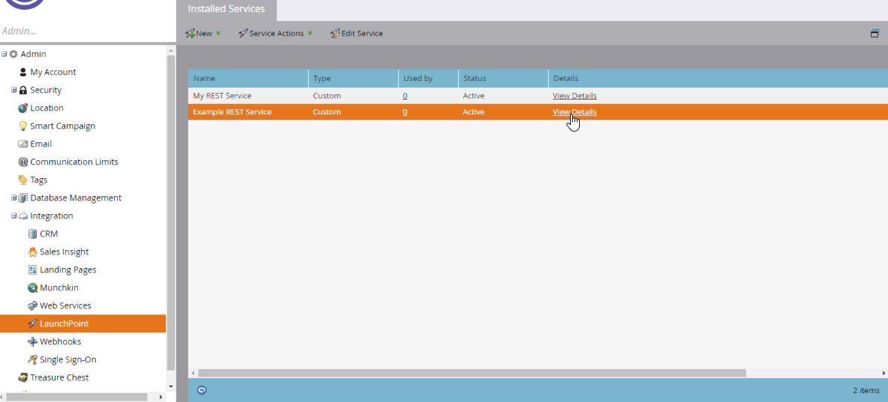
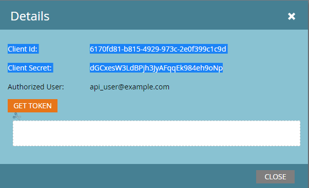

# Authentifizierung

Marketo-REST-APIs verwenden 2-beiniges OAuth 2.0 für die Authentifizierung. Ein benutzerdefinierter Dienst stellt die Client-ID und das Client-Geheimnis bereit, die zum Abrufen eines Zugriffstokens verwendet werden.

Jeder benutzerdefinierte Dienst gehört einem Benutzer, der nur APIs nutzt. Die Rollen und Berechtigungen des Benutzers autorisieren den Service, bestimmte Aktionen auszuführen. Ein Zugriffstoken gehört zu einem einzelnen benutzerdefinierten Service und sein Ablauf ist unabhängig von Token für andere benutzerdefinierte Services in der Instanz.

## Erstellen eines Zugriffs-Tokens

Die `Client ID` und `Client Secret` finden Sie unter **[!UICONTROL Admin]** > **[!UICONTROL Integration]** > **[!UICONTROL LaunchPoint]**. Wählen Sie den benutzerdefinierten Service aus und klicken Sie auf **[!UICONTROL Details anzeigen]**.





Die `Identity URL` finden Sie unter **[!UICONTROL Admin]** > **[!UICONTROL Integration]** > **[!UICONTROL Web Services]**. Die URL wird im Abschnitt REST-API angezeigt.

Erstellen Sie ein Zugriffstoken mit einer HTTP-GET- oder -POST-Anfrage:

```http
GET <Identity URL>/oauth/token?grant_type=client_credentials&client_id=<Client Id>&client_secret=<Client Secret>
```

Wenn Ihre Anfrage gültig war, erhalten Sie eine JSON-Antwort, die der folgenden ähnelt:

```json
{
    "access_token": "cdf01657-110d-4155-99a7-f986b2ff13a0:int",
    "token_type": "bearer",
    "expires_in": 3599,
    "scope": "apis@acmeinc.com"
}
```

Die Antwort enthält die folgenden Felder:

- `access_token`: Das Token, das Sie mit nachfolgenden Aufrufen übergeben, um sich bei der Zielinstanz zu authentifizieren.
- `token_type`: Die OAuth-Authentifizierungsmethode.
- `expires_in`: Die verbleibende Lebensdauer des aktuellen Tokens in Sekunden. Ein neues Zugriffs-Token hat eine Lebensdauer von 3.600 Sekunden oder einer Stunde.
- `scope`: Der Benutzer, dem der benutzerdefinierte Service gehört, der zur Authentifizierung verwendet wird.

## Verwenden eines Zugriffs-Tokens

Jeder REST-API-Aufruf muss ein Zugriffstoken in einer HTTP-Kopfzeile enthalten.

>[!IMPORTANT]
>
>Die Unterstützung für die Authentifizierung mit dem `access_token` Abfrageparameter wird am 31. August 2026 entfernt. Wenn Ihr Projekt einen Abfrageparameter verwendet, um das Zugriffstoken zu übergeben, sollte es so bald wie möglich aktualisiert werden, um den [Autorisierungs](https://experienceleague.adobe.com/de/docs/marketo-developer/marketo/rest/authentication#using-an-access-token)Header zu verwenden. Bei der Neuentwicklung sollte ausschließlich der `Authorization`-Header verwendet werden.

### Wechseln zur Autorisierungs-Kopfzeile

Um den `access_token` Abfrageparameter durch einen Autorisierungs-Header zu ersetzen, aktualisieren Sie, wie die Anfrage das Token sendet.

Im folgenden cURL-Beispiel wird der `access_token` als Formularparameter mit dem `-F`-Flag gesendet:

```bash
curl ...  -F access_token=<Access Token> <REST API Endpoint Base URL>/bulk/v1/apiCall.json
```

Im folgenden Beispiel wird derselbe Wert im `Authorization: Bearer`-HTTP-Header mit dem `-H`-Flag gesendet:

```bash
curl ... -H 'Authorization: Bearer <Access Token>' <REST API Endpoint Base URL>/bulk/v1/apiCall.json
```

## Tipps und Best Practices

Speichern Sie das Zugriffstoken und den Gültigkeitszeitraum aus der Identitätsantwort. Die Verwaltung des Token-Ablaufs hilft, unerwartete Authentifizierungsfehler während des normalen Vorgangs zu vermeiden.

Bevor Sie einen REST-Aufruf ausführen, überprüfen Sie die verbleibende Lebensdauer des Tokens. Wenn das Token abgelaufen ist, verlängern Sie es, indem Sie den Endpunkt [Identität](https://developer.adobe.com/marketo-apis/api/identity/#tag/Identity/operation/identityUsingGET) aufrufen. Die proaktive Verlängerung verhindert Fehler, die durch abgelaufene Token verursacht werden, und macht die REST-Aufruflatenz vorhersehbarer, was für Anwendungen, die auf Endbenutzer ausgerichtet sind, wichtig ist.

Authentifizierungsfehler geben die folgenden Codes zurück:

- `602`: Das Zugriffstoken ist abgelaufen.
- `601`: Das Zugriffstoken ist ungültig.

Wenn der Client einen der Codes erhält, erneuern Sie das Token, indem Sie den Identity-Endpunkt aufrufen.

Wenn Sie den Identity-Endpunkt aufrufen, bevor das Token abläuft, gibt die Antwort dasselbe Token und seine verbleibende Lebensdauer zurück.

Zugriffstoken gehören zu benutzerdefinierten Services, nicht zu Benutzern. Wenn Anmeldeinformationen von zwei verschiedenen Services Identitätsantworten erzeugen, die sich auf denselben Benutzer beziehen, bleiben ihre Zugriffs-Token und Gültigkeitszeiträume unabhängig.

Wenn eine Anwendung mehrere Berechtigungssätze verwendet, verwenden Sie die Client-ID als Schlüssel, um jedes Token unabhängig zu verwalten.
