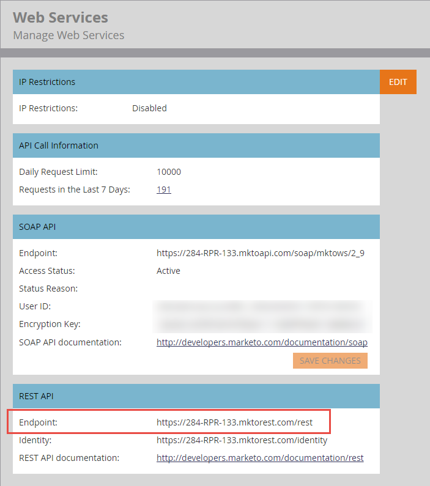

# Basis-URL

Jeder API-Aufruf in der [Endpunktreferenz](endpoint-reference.md) gibt die REST-Methode, den Pfad, die Ressource und die Parameter an. Hängen Sie diese Komponenten an die Basis-URL an, um eine Anfrage zu erstellen.

Im Folgenden finden Sie ein Beispiel für eine gut geformte REST-URL:

`https://284-RPR-133.mktorest.com/rest/v1/lead/318581.json?fields=email,firstName,lastName`

Das Beispiel enthält die folgenden Komponenten:

- **Basis-URL:** `https://284-RPR-133.mktorest.com/rest`
- **path:** `/v1/lead/`
- **Ressource:** `318582.json`
- **Abfrageparameter:** `fields=email,firstName,lastName`

Die Basis-URL enthält die Konto-ID, auch als Munchkin-ID bezeichnet, und ist für jedes Marketo-Abonnement eindeutig.

Um die Basis-URL zu finden, melden Sie sich bei Marketo an und gehen Sie zu **[!UICONTROL Admin]** > **[!UICONTROL Integration]** > **[!UICONTROL Web-Services]**. Die Basis-URL ist im Abschnitt „REST-API“ mit „Endpunkt:“ beschriftet, wie in der folgenden Abbildung dargestellt.

Kopieren Sie die Basis-URL und fügen Sie sie für jeden REST-API-Aufruf in die URL ein.
