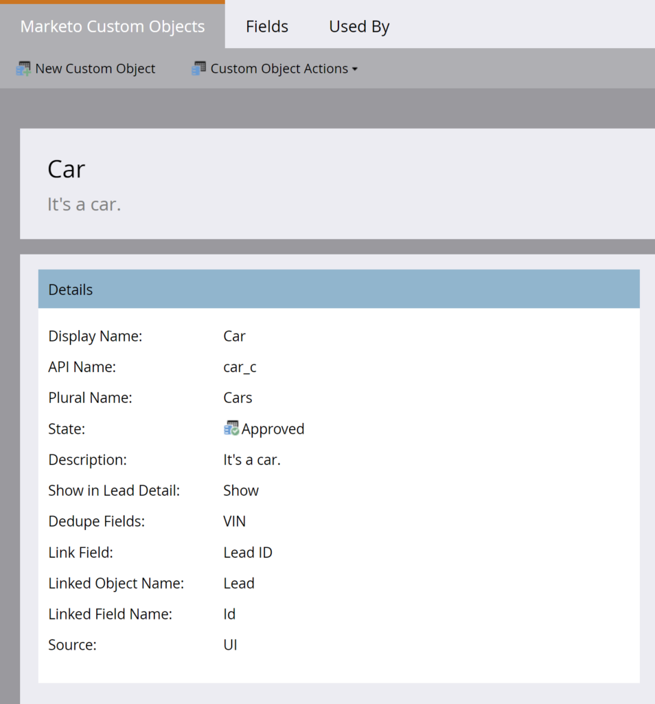
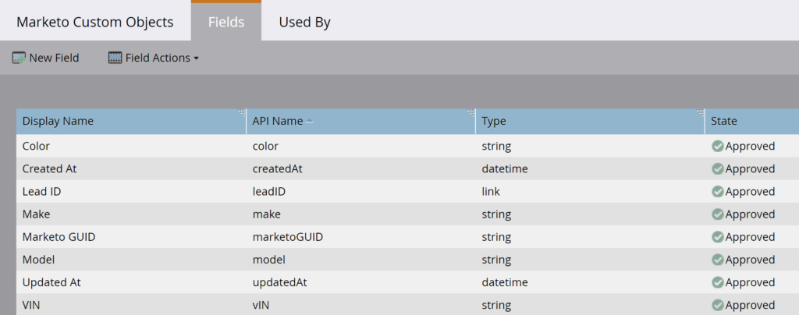

# Massenextraktion benutzerdefinierter Objekte

[Massenreferenz zum Extrahieren benutzerdefinierter Objekte aus Endpunkten](https://developer.adobe.com/marketo-apis/api/mapi#tag/Bulk-Export-Custom-Objects)

Die REST-APIs zur Massenextraktion benutzerdefinierter Objekte rufen große Mengen benutzerdefinierter Objektdatensätze aus Marketo ab. Verwenden Sie diese APIs für den kontinuierlichen Datenaustausch zwischen Marketo und externen Systemen, ETL, Data Warehousing und Archivierung.

Die API exportiert benutzerdefinierte Marketo-Objektdatensätze der ersten Ebene, die direkt mit Leads verknüpft sind. Geben Sie den benutzerdefinierten Objektnamen und eine Liste verknüpfter Leads an. Für jeden Lead schreibt die API übereinstimmende verknüpfte benutzerdefinierte Objektdatensätze als Zeilen in die Exportdatei.

Sie können benutzerdefinierte Objektdaten auf der Registerkarte [Benutzerdefiniertes Objekt“ der Detailseite des Leads in der Marketo-Benutzeroberfläche anzeigen](https://experienceleague.adobe.com/en/docs/marketo/using/product-docs/administration/marketo-custom-objects/understanding-marketo-custom-objects).

## Berechtigungen

Der API-Benutzer muss über eine Rolle mit der schreibgeschützten Berechtigung für benutzerdefinierte Objekte, der Berechtigung für benutzerdefinierte Objekte mit Lese-/Schreibzugriff oder beidem verfügen.

## Filter

Benutzerdefinierte Objektextraktionsfilter geben eine Liste der mit dem benutzerdefinierten Objekt verknüpften Leads an. Wenn ein aufgelisteter Lead mit Datensätzen verknüpft ist, die dem angegebenen benutzerdefinierten Objektnamen entsprechen, schreibt die API diese Datensätze in die Exportdatei.

Geben Sie nur einen Filtertyp pro Exportvorgang an.

| Filtertyp | Datentyp | Hinweise |
| --- | --- | --- |
| `updatedAt` | Datumsbereich | Akzeptiert ein JSON-Objekt mit den Membern `startAt` und `endAt` &amp;nbsp.;`startAt` akzeptiert eine Uhrzeit-/Datumsangabe, die das Niedrigwasserzeichen darstellt, und `endAt` akzeptiert eine Uhrzeit-/Datumsangabe, die das Hochwasserzeichen darstellt. Der Bereich muss 31 Tage oder weniger betragen. Aufträge mit diesem Filtertyp geben alle Datensätze zurück, auf die innerhalb des Datumsbereichs zugegriffen werden kann. Datetimes sollten im ISO-8601-Format sein, ohne Millisekunden. |
| `staticListName` | String | Akzeptiert den Namen einer statischen Liste. Aufträge mit diesem Filtertyp geben alle Datensätze zurück, auf die zugegriffen werden kann und die zu dem Zeitpunkt Mitglieder der statischen Liste sind, zu dem der Auftrag mit der Verarbeitung beginnt. Rufen Sie statische Listennamen mithilfe des Endpunkts „Listen abrufen“ ab. |
| `staticListId` | Ganzzahl | Akzeptiert die ID einer statischen Liste. Aufträge mit diesem Filtertyp geben alle Datensätze zurück, auf die zugegriffen werden kann und die zu dem Zeitpunkt Mitglieder der statischen Liste sind, zu dem der Auftrag mit der Verarbeitung beginnt. Rufen Sie statische Listen-IDs mithilfe des Endpunkts „Listen abrufen“ ab. |
| `smartListName`* | String | Akzeptiert den Namen einer Smart-Liste. Aufträge mit diesem Filtertyp geben alle Datensätze zurück, auf die zugegriffen werden kann und die zu dem Zeitpunkt Mitglieder der Smart-Listen sind, zu dem der Auftrag mit der Verarbeitung beginnt. Abrufen von Smart-Listennamen mithilfe des Endpunkts „Smart-Listen abrufen“. |
| `smartListId`* | Ganzzahl | Akzeptiert die ID einer Smart-Liste. Aufträge mit diesem Filtertyp geben alle Datensätze zurück, auf die zugegriffen werden kann und die zu dem Zeitpunkt Mitglieder der Smart-Listen sind, zu dem der Auftrag mit der Verarbeitung beginnt. Abrufen von Smart-Listen-IDs mit dem Endpunkt „Smart-Listen abrufen“. |

Einige Abonnements unterstützen diesen Filtertyp nicht. Wenn er nicht verfügbar ist, gibt der Endpunkt Exportvorgang erstellen `1035, Unsupported filter type for target subscription` zurück. Wenden Sie sich an den Marketo-Support, um diese Funktion für Ihr Abonnement anzufordern.

## Optionen

Der Endpunkt [Benutzerdefinierten Objektauftrag erstellen](https://developer.adobe.com/marketo-apis/api/mapi#tag/Bulk-Export-Custom-Objects/operation/createExportCustomObjectsUsingPOST) bietet Optionen für:

- Geben Sie die Felder an, die in die Exportdatei aufgenommen werden sollen.
- Benennen Sie die exportierten Spaltenüberschriften um.
- Geben Sie das Exportdateiformat an.

| Parameter | Datentyp | Erforderlich | Hinweise |
| --- | --- | --- | --- |
| `fields` | array[string] | Ja | Array von Zeichenfolgen, das den Wert des benutzerdefinierten Objektattributnamens enthält, der vom Endpunkt „Describe Custom Object“ zurückgegeben wird. Die aufgelisteten Felder sind in der exportierten Datei enthalten. |
| `columnHeaderNames` | Objekt | Nein | Ein JSON-Objekt, das Schlüssel-Wert-Paare von Feld- und Spaltenkopfzeilennamen enthält. Der Schlüssel muss der Name eines Felds sein, das im Exportvorgang enthalten ist. Der Wert ist der Name der exportierten Spaltenüberschrift für dieses Feld. |
| `format` | String | Nein | Akzeptiert eine der folgenden Optionen: CSV, TSV, SSV. Die exportierte Datei wird als kommagetrennte Werte, tabulatorgetrennte Werte oder durch Leerzeichen getrennte Wertedatei gerendert, sofern festgelegt. Die Standardeinstellung ist CSV, wenn nicht festgelegt. |

## Erstellen von Aufträgen

Verwenden Sie den Endpunkt [Benutzerdefinierten Objektvorgang erstellen](https://developer.adobe.com/marketo-apis/api/mapi#tag/Bulk-Export-Custom-Objects/operation/createExportCustomObjectsUsingPOST) um den Exportvorgang zu definieren.

Die Anfrage verwendet die folgenden Parameter:

- `apiName`: Erforderlicher Pfadparameter. Gibt das zu exportierende benutzerdefinierte Marketo-Objekt unter Verwendung des vom Endpunkt [Benutzerdefiniertes Objekt beschreiben“ zurückgegebenen &#x200B;](https://developer.adobe.com/marketo-apis/api/mapi#tag/Custom-Objects/operation/describeUsingGET_1) an. Benutzerdefinierte CRM-Objekte sind nicht zulässig.
- `filter`: Erforderlich. Gibt die verknüpften Leads durch Verweis auf eine statische Liste oder eine Smart-Liste an.
- `fields`: Erforderlich. Gibt die API-Namen der benutzerdefinierten Objektattribute an, die in die Exportdatei aufgenommen werden sollen.
- `format`: Optional. Gibt das Format der Exportdatei an.
- `columnHeaderNames`: Optional. Gibt Namen der Ersatzspaltenkopfzeilen an.

In diesem Beispiel wird ein `Car` benutzerdefiniertes Objekt mit `Color`-, `Make`-, `Model`- und `VIN` verwendet. Das Verknüpfungsfeld ist die Lead-ID und das Deduplizierungsfeld ist die FIN.

Benutzerdefinierte Objektdefinition



Benutzerdefinierte Objektfelder



Rufen Sie [Benutzerdefiniertes Objekt beschreiben](https://developer.adobe.com/marketo-apis/api/mapi#tag/Custom-Objects/operation/describeUsingGET_1) auf, um benutzerdefinierte Objektattribute programmgesteuert zu überprüfen. Die Antwort gibt die Attribute in `fields` zurück.

```http
GET /rest/v1/customobjects/car_c/describe.json
```

```json
{
    "requestId": "148ef#1793e00f64f",
    "result": [
        {
            "name": "car_c",
            "displayName": "Car",
            "description": "It's a car.",
            "createdAt": "2021-05-05T16:14:41Z",
            "updatedAt": "2021-05-05T16:14:42Z",
            "idField": "marketoGUID",
            "dedupeFields": [
                "vIN"
            ],
            "searchableFields": [
                [
                    "vIN"
                ],
                [
                    "marketoGUID"
                ],
                [
                    "leadID"
                ]
            ],
            "relationships": [
                {
                    "field": "leadID",
                    "type": "child",
                    "relatedTo": {
                        "name": "Lead",
                        "field": "Id"
                    }
                }
            ],
            "fields": [
                {
                    "name": "createdAt",
                    "displayName": "Created At",
                    "dataType": "datetime",
                    "updateable": false,
                    "crmManaged": false
                },
                {
                    "name": "marketoGUID",
                    "displayName": "Marketo GUID",
                    "dataType": "string",
                    "length": 36,
                    "updateable": false,
                    "crmManaged": false
                },
                {
                    "name": "updatedAt",
                    "displayName": "Updated At",
                    "dataType": "datetime",
                    "updateable": false,
                    "crmManaged": false
                },
                {
                    "name": "color",
                    "displayName": "Color",
                    "dataType": "string",
                    "length": 255,
                    "updateable": true,
                    "crmManaged": false
                },
                {
                    "name": "leadID",
                    "displayName": "Lead ID",
                    "dataType": "integer",
                    "updateable": true,
                    "crmManaged": false
                },
                {
                    "name": "make",
                    "displayName": "Make",
                    "dataType": "string",
                    "length": 255,
                    "updateable": true,
                    "crmManaged": false
                },
                {
                    "name": "model",
                    "displayName": "Model",
                    "dataType": "string",
                    "length": 255,
                    "updateable": true,
                    "crmManaged": false
                },
                {
                    "name": "vIN",
                    "displayName": "VIN",
                    "dataType": "string",
                    "length": 255,
                    "updateable": true,
                    "crmManaged": false
                }
            ]
        }
    ],
    "success": true
}
```

Verwenden Sie den Endpunkt [Benutzerdefinierte Objekte synchronisieren](https://developer.adobe.com/marketo-apis/api/mapi#tag/Custom-Objects/operation/syncCustomObjectsUsingPOST), um benutzerdefinierte Objektdatensätze zu erstellen und jedes mit einem Lead zu verknüpfen. Ein Lead kann mit mehreren benutzerdefinierten Objektdatensätzen verknüpft werden, wodurch eine Eins-zu-Viele-Beziehung erstellt wird.

```http
POST /rest/v1/customobjects/car_c.json
```

```json
{
   "action":"createOrUpdate",
   "input":[
       {
           "leadId": 11,
           "color": "Pearl White",
           "make": "Tesla",
           "model": "Model S",
           "vIN": "5YJSA1E41FF156789"
       },
       {
           "leadId": 12,
           "color": "Midnight Silver Metallic",
           "make": "Tesla",
           "model": "Model X",
           "vIN": "LRWXB2B41FF198765"
       },
       {
           "leadId": 13,
           "color": "Fusion Red",
           "make": "Tesla",
           "model": "Roadster",
           "vIN": "SFGRC3C41FF154321"
       }
    ]
}
```

```json
{
    "requestId": "50d9#1793e066088",
    "result": [
        {
            "seq": 0,
            "marketoGUID": "d911eaa1-fd0b-4a99-9b71-c6a7233c782c",
            "status": "created"
        },
        {
            "seq": 1,
            "marketoGUID": "20d04ffb-51f0-4336-924c-c783b9bb4215",
            "status": "created"
        },
        {
            "seq": 2,
            "marketoGUID": "e7da4331-8e7a-473b-85c8-047638eb6c7f",
            "status": "created"
        }
    ],
    "success": true
}
```

Die drei Leads in diesem Beispiel gehören zur `Car Buyers` statischen Liste, die eine `id` von 1081 hat. Rufen Sie den Endpunkt [Leads nach Listen-ID abrufen](https://developer.adobe.com/marketo-apis/api/mapi#tag/Static-Lists/operation/getLeadsByListIdUsingGET_1) auf, um die Mitglieder der Liste abzurufen.

```http
GET /rest/v1/lists/1081/leads.json
```

```json
{
    "requestId": "d023#1793e1e982b",
    "result": [
        {
            "id": 11,
            "firstName": "Hanna",
            "lastName": "Crawford",
            "email": "208161Hanna.Crawford@pookmail.com",
            "updatedAt": "2020-01-16T02:38:22Z",
            "createdAt": "2017-07-27T01:38:42Z"
        },
        {
            "id": 12,
            "firstName": "Bertha",
            "lastName": "Fulton",
            "email": "208160Bertha.Fulton@trashymail.com",
            "updatedAt": "2020-01-16T02:38:22Z",
            "createdAt": "2017-07-27T01:38:42Z"
        },
        {
            "id": 13,
            "firstName": "Faith",
            "lastName": "England",
            "email": "208159Faith.England@dodgit.com",
            "updatedAt": "2020-01-16T02:38:22Z",
            "createdAt": "2017-07-27T01:38:42Z"
        }
    ],
    "success": true
}
```

Um diese Datensätze abzurufen, rufen Sie den Endpunkt [benutzerdefinierten Objektauftrag erstellen](https://developer.adobe.com/marketo-apis/api/mapi#tag/Bulk-Export-Custom-Objects/operation/createExportCustomObjectsUsingPOST) auf. Geben Sie die benutzerdefinierten Objektattribute in `fields` und die statische Listen-ID in `filter` an.

```http
POST /bulk/v1/customobjects/car_c/export/create.json
```

```json
{
    "fields": [
        "leadId",
        "color",
        "make",
        "model",
        "vIN"
    ],
    "filter": {
        "staticListId": 1081
    }
}
```

```json
{
    "requestId": "8d2f#1793e289e87",
    "result": [
        {
            "exportId": "f2c03f1d-226f-47c1-a557-357af8c2b32a",
            "format": "CSV",
            "status": "Created",
            "createdAt": "2021-05-05T20:12:01Z"
        }
    ],
    "success": true
}
```

Die Antwort bestätigt, dass der Auftrag erstellt wurde, der Export jedoch nicht automatisch gestartet wird. Übergeben Sie `apiName` und die zurückgegebene `exportId` an den Endpunkt [In die Warteschlange einreihen Benutzerdefinierter Objektauftrag](https://developer.adobe.com/marketo-apis/api/mapi#tag/Bulk-Export-Custom-Objects/operation/enqueueExportCustomObjectsUsingPOST), um den Auftrag zu starten.

```http
POST /bulk/v1/customobjects/car_c/export/f2c03f1d-226f-47c1-a557-357af8c2b32a/enqueue.json
```

```json
{
    "requestId": "cfaf#1793e2a0762",
    "result": [
        {
            "exportId": "f2c03f1d-226f-47c1-a557-357af8c2b32a",
            "format": "CSV",
            "status": "Queued",
            "createdAt": "2021-05-05T20:12:01Z",
            "queuedAt": "2021-05-05T20:13:32Z"
        }
    ],
    "success": true
}
```

Die Enqueue-Antwort gibt zunächst einen `Queued` zurück. Wenn ein Exportsteckplatz verfügbar ist, ändert sich der Status in `Processing`.

## Status des Abrufauftrags

Sie können den Status nur für Aufträge abrufen, die von demselben API-Benutzer erstellt wurden.

Da der Export asynchron ausgeführt wird, verwenden Sie den Endpunkt [Abrufen des benutzerdefinierten Objektauftragsstatus &#x200B;](https://developer.adobe.com/marketo-apis/api/mapi#tag/Bulk-Export-Custom-Objects/operation/getExportCustomObjectsStatusUsingGET), um den Fortschritt abzufragen. Der Status wird nur einmal alle 60 Sekunden aktualisiert, führen Sie daher keine häufigeren Abfragen durch.

Der Status kann `Created`, `Queued`, `Processing`, `Canceled`, `Completed` oder `Failed` sein.

```http
GET /bulk/v1/customobjects/{apiName}/export/{exportId}/status.json
```

```json
{
    "requestId": "14daa#1793e2cf9de",
    "result": [
        {
            "exportId": "f2c03f1d-226f-47c1-a557-357af8c2b32a",
            "format": "CSV",
            "status": "Processing",
            "createdAt": "2021-05-05T20:12:01Z",
            "queuedAt": "2021-05-05T20:13:32Z",
            "startedAt": "2021-05-05T20:14:15Z"
        }
    ],
    "success": true
}
```

Diese Antwort zeigt an, dass der Auftrag noch verarbeitet wird, sodass die Datei nicht verfügbar ist. Wenn sich der Auftragsstatus in `Completed` ändert, kann die Datei heruntergeladen werden.

```json
{
    "requestId": "14daa#1793e2cf9de",
    "result": [
        {
            "exportId": "f2c03f1d-226f-47c1-a557-357af8c2b32a",
            "format": "CSV",
            "status": "Completed",
            "createdAt": "2021-05-05T20:12:01Z",
            "queuedAt": "2021-05-05T20:13:32Z",
            "startedAt": "2021-05-05T20:14:15Z",
            "finishedAt": "2021-05-05T20:14:28Z",
            "numberOfRecords": 3,
            "fileSize": 182,
            "fileChecksum": "sha256:fac0cabc2352229c12e18b2fde03d1f24178bc71e9e926f520ae8d61bbe98c01"
        }
    ],
    "success": true
}
```

## Daten abrufen

Um einen abgeschlossenen benutzerdefinierten Objektexport abzurufen, übergeben Sie `apiName` und `exportId` an den Endpunkt [Benutzerdefinierte Objektdatei exportieren](https://developer.adobe.com/marketo-apis/api/mapi#tag/Bulk-Export-Custom-Objects/operation/getExportCustomObjectsFileUsingGET).

Der Endpunkt gibt die Datei in dem Format zurück, das für den Auftrag konfiguriert wurde. Wenn ein angefordertes benutzerdefiniertes Objektattribut keine Daten enthält, enthält das entsprechende Exportfeld `null`.

```http
GET /bulk/v1/customobjects/car_c/export/f2c03f1d-226f-47c1-a557-357af8c2b32a/file.json
```

```csv
leadId,color,make,model,vIN
11,Pearl White,Tesla,Model S,5YJSA1E41FF156789
12,Midnight Silver Metallic,Tesla,Model X,LRWXB2B41FF198765
13,Fusion Red,Tesla,Roadster,SFGRC3C41FF154321
```

Beim teilweisen oder wiederaufnehmbaren Abrufen unterstützt der Datei-Endpunkt den optionalen HTTP-`Range`-Header mit dem Bereichstyp `bytes`. Wenn Sie die -Kopfzeile nicht festlegen, gibt der Endpunkt die gesamte Datei zurück. Weitere Informationen finden Sie unter [Massenextraktion](bulk-extract.md).

## Abbrechen von Aufträgen

Um einen Auftrag abzubrechen, der falsch konfiguriert oder nicht mehr benötigt wird, rufen Sie den Endpunkt [Export eines benutzerdefinierten Objektauftrags abbrechen](https://developer.adobe.com/marketo-apis/api/mapi#tag/Bulk-Export-Custom-Objects/operation/getExportCustomObjectsFileUsingPOST) auf. Der Antwortstatus gibt an, dass der Vorgang abgebrochen wurde.

```http
POST /bulk/v1/customobjects/car_c/export/f2c03f1d-226f-47c1-a557-357af8c2b32a/cancel.json
```

```json
{
    "requestId": "e5f9#179391286a7",
    "result": [
        {
            "exportId": "4a8cdd80-0d16-4dd6-9923-6ec97e30e91b",
            "format": "CSV",
            "status": "Cancelled",
            "createdAt": "2021-05-04T20:24:33Z"
        }
    ],
    "success": true
}
```
