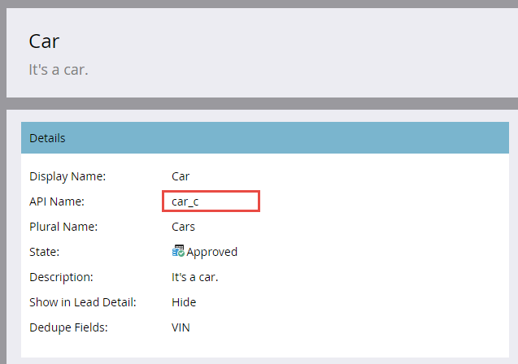
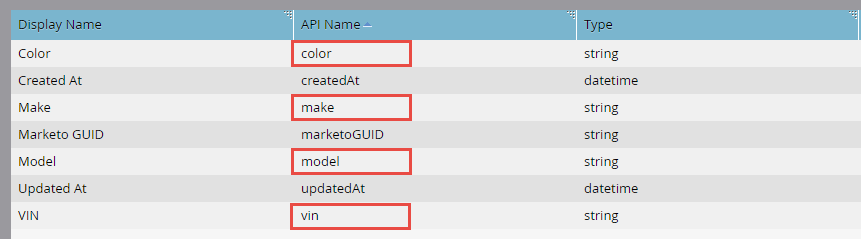

# Massenimport benutzerdefinierter Objekte

[Referenz zum Massenimport benutzerdefinierter Objekte mit Endpunkt](https://developer.adobe.com/marketo-apis/api/mapi#tag/Bulk-Import-Custom-Objects)

Verwenden Sie die Bulk-API, um eine große Anzahl von benutzerdefinierten Objektdatensätzen asynchron zu importieren. Stellen Sie die Datensätze in einer flachen Datei mit Komma, Tabulatoren oder Semikolons bereit, die kleiner als 10 MB ist. Wenn die Datei größer ist, gibt die API einen HTTP-413-Status-Code zurück.

Der Dateiinhalt hängt von der benutzerdefinierten Objektdefinition ab. Die erste Zeile muss eine Kopfzeile sein, und jedes Kopfzeilenfeld muss mit einem API-Namen übereinstimmen. Jede verbleibende Zeile enthält einen Datensatz.

Der Massenimport benutzerdefinierter Objekte unterstützt nur den Datensatzvorgang „Einfügen oder Aktualisieren“.

## Verarbeitungsbeschränkungen

Jede Massenimportanfrage wird als Auftrag zu einer FIFO-Warteschlange (First-In, First-Out) hinzugefügt. Es gelten die folgenden Grenzwerte:

- Es können maximal zwei Aufträge gleichzeitig verarbeitet werden.
- Es können maximal 10 Aufträge in der Warteschlange sein, einschließlich der beiden verarbeiteten Aufträge.

Wenn Sie das Maximum von 10 Aufträgen überschreiten, gibt die API einen `1016, Too many imports` Fehler zurück.

## Beispiel für ein benutzerdefiniertes Objekt

Bevor Sie die Bulk-API verwenden, verwenden Sie die Admin-Benutzeroberfläche von Marketo, um [Ihr benutzerdefiniertes Objekt zu erstellen](https://experienceleague.adobe.com/de/docs/marketo/using/product-docs/administration/marketo-custom-objects/create-marketo-custom-objects).

In diesem Beispiel wird ein `Car` benutzerdefiniertes Objekt mit `Color`-, `Make`-, `Model`- und `VIN` verwendet. Das FIN-Feld wird für die Deduplizierung verwendet. Die Bildschirme der Admin-Benutzeroberfläche markieren die API-Namen, die für Massen-API-Endpunkte erforderlich sind.



Im Folgenden finden Sie die benutzerdefinierten Objektfelder, die in der Admin-Benutzeroberfläche angezeigt werden.



### API-Namen

Um API-Namen programmgesteuert abzurufen, übergeben Sie den benutzerdefinierten Objekt-API-Namen an den Endpunkt [Benutzerdefiniertes Objekt beschreiben](#describe).

```text
/rest/v1/customobjects/{apiName}/describe.json
```

```json
{
    "requestId": "46ff#15a686e66de",
    "result": [
        {
            "name": "car_c",
            "displayName": "Car",
            "description": "It is a car.",
            "createdAt": "2017-02-22T19:55:51Z",
            "updatedAt": "2017-02-22T19:55:51Z",
            "idField": "marketoGUID",
            "dedupeFields": [
                "vin"
            ],
            "searchableFields": [
                [
                    "vin"
                ],
                [
                    "marketoGUID"
                ]
            ],
            "fields": [
                {
                    "name": "createdAt",
                    "displayName": "Created At",
                    "dataType": "datetime",
                    "updateable": false
                },
                {
                    "name": "marketoGUID",
                    "displayName": "Marketo GUID",
                    "dataType": "string",
                    "length": 36,
                    "updateable": false
                },
                {
                    "name": "updatedAt",
                    "displayName": "Updated At",
                    "dataType": "datetime",
                    "updateable": false
                },
                {
                    "name": "color",
                    "displayName": "Color",
                    "dataType": "string",
                    "length": 255,
                    "updateable": true
                },
                {
                    "name": "make",
                    "displayName": "Make",
                    "dataType": "string",
                    "length": 255,
                    "updateable": true
                },
                {
                    "name": "model",
                    "displayName": "Model",
                    "dataType": "string",
                    "length": 255,
                    "updateable": true
                },
                {
                    "name": "vin",
                    "displayName": "VIN",
                    "dataType": "string",
                    "length": 255,
                    "updateable": true
                }
            ]
        }
    ],
    "success": true
}
```

### Datei importieren

Die folgende CSV-Datei enthält drei `Car` benutzerdefinierte Objektdatensätze:

```text
color,make,model,vin
red,bmw,2002,WBA4R7C55HK895912
yellow,bmw,320i,WBA4R7C30HK896061
blue,bmw,325i,WBS3U9C52HP970604
```

Die erste Zeile ist die Kopfzeile. Die Zeilen 2-4 enthalten die Datensätze für benutzerdefinierte Objekte.

## Erstellen von Aufträgen

Um den Massenimportauftrag zu erstellen, fügen Sie den benutzerdefinierten Objekt-API-Namen in den Pfad zum Endpunkt [Benutzerdefinierte Objekte importieren](https://developer.adobe.com/marketo-apis/api/mapi#tag/Identity/operation/identityUsingPOST) ein. Schließen Sie diese Parameter ein:

- `file`: Der Name der Importdatei.
- `format`: Das Dateitrennzeichenformat (`csv`, `tsv` oder `ssv`).

```http
POST /bulk/v1/customobjects/{apiName}/import.json?format=csv
```

```text
Transfer-Encoding: chunked
Content-Type: multipart/form-data; boundary=----WebKitFormBoundaryXjWP6BP8Ciq6bPeo
Content-Length: 290
Host: <munchkinId>.mktorest.com
```

```text
------WebKitFormBoundaryXjWP6BP8Ciq6bPeo
Content-Disposition: form-data; name="file"; filename="custom_object_import.csv"
Content-Type: text/csv

color,make,model,vin
red,bmw,2002,WBA4R7C55HK895912
yellow,bmw,320i,WBA4R7C30HK896061
blue,bmw,325i,WBS3U9C52HP970604
------WebKitFormBoundaryXjWP6BP8Ciq6bPeo--
```

```json
{
    "requestId": "c015#15a68a23418",
    "result": [
        {
            "batchId": 1013,
            "status": "Queued",
            "objectApiName": "car_c"
        }
    ],
    "success": true
}
```

In diesem Beispiel werden das `csv` Format und die Namen der Importdatei `custom_object_import.csv`.

Da der Aufruf asynchron erfolgt, enthält die Antwort eine `batchId` anstelle der einzelnen Erfolge und Fehler, die vom Endpunkt „Benutzerdefinierte Objekte synchronisieren“ zurückgegeben werden. Die `status` kann `Queued`, `Importing` oder `Failed` sein.

Behalten Sie die `batchId` bei, um den Importstatus zu überprüfen und Fehler oder Warnungen nach Abschluss abzurufen. Die `batchId` bleibt sieben Tage gültig.

Mit der folgenden Befehlszeilen-cURL-Anfrage wird der Beispielvorgang gesendet:

```bash
curl -X POST -i -F format='csv' -F file='@custom_object_import.csv' -F access_token='<Access Token>' <REST API Endpoint URL>/bulk/v1/customobjects/car_c/import.json
```

In diesem Beispiel enthält die `custom_object_import.csv`-Datei die folgenden Daten:

```text
color,make,model,vin
red,bmw,2002,WBA4R7C55HK895912
yellow,bmw,320i,WBA4R7C30HK896061
blue,bmw,325i,WBS3U9C52HP970604
```

## Status des Abrufauftrags

Nachdem Sie den Importauftrag erstellt haben, fragen Sie ihn alle 5-30 Sekunden ab. Übergeben Sie den Namen und die `batchId` der benutzerdefinierten Objekt-API im Pfad an den Endpunkt [Get Import Custom Object Status](https://developer.adobe.com/marketo-apis/api/mapi#tag/Bulk-Import-Custom-Objects/operation/getImportCustomObjectStatusUsingGET).

```http
GET /bulk/v1/customobjects/{apiName}/import/{batchId}/status.json
```

```json
{
    "requestId": "2a5#15a68dd9be1",
    "result": [
        {
            "batchId": 1013,
            "operation": "import",
            "status": "Complete",
            "objectApiName": "car_c",
            "numOfObjectsProcessed": 3,
            "numOfRowsFailed": 0,
            "numOfRowsWithWarning": 0,
            "importTime": "2 second(s)",
            "message": "Import succeeded, 3 records imported (3 members)"
        }
    ],
    "success": true
}
```

Diese Antwort zeigt einen abgeschlossenen Import an. Die `status` kann `Complete`, `Queued`, `Importing` oder `Failed` sein.

Wenn der Auftrag abgeschlossen ist, listet die Antwort die Anzahl der verarbeiteten Zeilen auf, die fehlgeschlagen sind und mit Warnungen verarbeitet wurden. Das Attribut `message` kann zusätzliche Auftragsinformationen bereitstellen.

## Fehler

Das Attribut `numOfRowsFailed` in der Antwort [Benutzerdefinierter Objektstatus abrufen](https://developer.adobe.com/marketo-apis/api/mapi#tag/Bulk-Import-Custom-Objects/operation/getImportCustomObjectStatusUsingGET) gibt die Anzahl der fehlgeschlagenen Zeilen an. Ein Wert größer als null bedeutet, dass Fehler aufgetreten sind.

Übergeben Sie den Namen und die `batchId` der benutzerdefinierten Objekt-API im Pfad zum Endpunkt [Abrufen von Fehlern bei benutzerdefinierten Objekten](https://developer.adobe.com/marketo-apis/api/mapi#tag/Bulk-Import-Custom-Objects/operation/getImportCustomObjectFailuresUsingGET). Der Endpunkt gibt eine Datei mit Fehlerdetails zurück. Wenn keine Fehlerdatei vorhanden ist, wird ein HTTP-404-Status-Code zurückgegeben.

Um einen Fehler zu demonstrieren, ändern Sie die Kopfzeile, indem Sie `vin` in ` vin` ändern und ein Leerzeichen zwischen dem Komma und dem `vin` einfügen.

```text
color,make,model, vin
```

Nach dem erneuten Importieren der Datei zeigt die Statusantwort `numRowsFailed`: 3 an, was auf drei Fehler hinweist.

```http
GET /bulk/v1/customobjects/car_c/import/{batchId}/status.json
```

```json
{
    "requestId": "12260#15a68f491ed",
    "result": [
        {
            "batchId": 1016,
            "operation": "import",
            "status": "Complete",
            "objectApiName": "car_c",
            "numOfObjectsProcessed": 0,
            "numOfRowsFailed": 3,
            "numOfRowsWithWarning": 0,
            "importTime": "1 second(s)",
            "message": "Import completed with errors, 0 records imported (0 members), 3 failed"
        }
    ],
    "success": true
}
```

Rufen Sie den Endpunkt für benutzerdefinierte Objektfehler beim Import abrufen auf, um weitere Informationen zu erhalten:

```http
GET /bulk/v1/customobjects/car_c/import/{batchId}/failures.json
```

```text
color,make,model, vin,Import Failure Reason
red,bmw,2002,WBA4R7C55HK895912,missing.dedupe.fields
yellow,bmw,320i,WBA4R7C30HK896061,missing.dedupe.fields
blue,bmw,325i,WBS3U9C52HP970604,missing.dedupe.fields
```

Die Antwort zeigt an, dass das Deduplizierungsfeld `vin` fehlt.

## Warnungen

Das Attribut `numOfRowsWithWarning` in der Antwort Benutzerdefinierter Objektstatus abrufen gibt die Anzahl der Zeilen mit Warnungen an. Ein Wert größer als null bedeutet, dass Warnungen aufgetreten sind.

Übergeben Sie den Namen und die `batchId` der benutzerdefinierten Objekt-API im Pfad zum Endpunkt [Warnungen für benutzerdefinierte Objekte abrufen](https://developer.adobe.com/marketo-apis/api/mapi#tag/Bulk-Import-Custom-Objects/operation/getImportCustomObjectWarningsUsingGET). Der Endpunkt gibt eine -Datei mit Warndetails zurück. Wenn keine Warndatei vorhanden ist, wird ein HTTP 404-Status-Code zurückgegeben.

```http
GET /bulk/v1/customobjects/car_c/import/{batchId}/warnings.json
```
