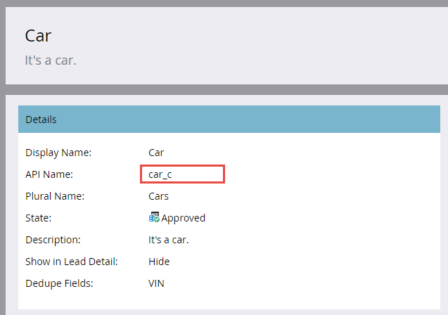

# Massenimport benutzerdefinierter Objekte

[Endpunktreferenz für den Massenimport benutzerdefinierter Objekte](https://developer.adobe.com/marketo-apis/api/mapi/#tag/Bulk-Import-Custom-Objects)

Wenn Sie viele benutzerdefinierte Objektaufzeichnungen zur Verfügung haben  importieren, ist es Best Practice, sie mithilfe der Bulk-API asynchron zu importieren. Importieren Sie dazu eine einfache Datei, die durch Kommas, Tabulatoren oder Semikolons getrennte Datensätze enthält. Die Datei kann eine beliebige Anzahl von Datensätzen enthalten, sofern ihre Größe weniger als 10 MB beträgt (andernfalls ein HTTP  413 Status-Code wird zurückgegeben). Der Inhalt der Datei hängt von Ihrer benutzerdefinierten Objektdefinition ab. Die erste Zeile enthält immer eine Kopfzeile, in der die Felder aufgelistet sind, denen Werte jeder Zeile zugeordnet werden sollen. Alle Feldnamen in der Kopfzeile müssen mit einem API-Namen übereinstimmen (wie unten beschrieben). Die übrigen Zeilen enthalten die zu importierenden Daten, d. h. ein Datensatz pro Zeile. Der Datensatzvorgang ist nur „Einfügen oder Aktualisieren“.

## Verarbeitungsbeschränkungen

Es ist zulässig, innerhalb von Beschränkungen mehr als eine Massenimportanfrage zu senden. Jede Anfrage wird als Auftrag zu einer zu verarbeitenden FIFO-Warteschlange hinzugefügt. Es werden maximal zwei Aufträge gleichzeitig verarbeitet. Es sind maximal zehn Aufträge gleichzeitig in der Warteschlange zulässig (einschließlich der zwei derzeit verarbeiteten). Wenn Sie den Maximalwert von zehn Aufträgen überschreiten, wird der Fehler „1016, Zu viele Importe“ zurückgegeben.

## Beispiel für ein benutzerdefiniertes Objekt

Vor der Verwendung der Bulk-API müssen Sie zunächst die Admin-Benutzeroberfläche von Marketo verwenden, um [Ihr benutzerdefiniertes Objekt zu erstellen](https://experienceleague.adobe.com/de/docs/marketo/using/product-docs/administration/marketo-custom-objects/create-marketo-custom-objects). Angenommen, wir haben ein benutzerdefiniertes „Auto“-Objekt mit den Feldern „Farbe“, „Marke“, „Modell“ und „FIN“ erstellt. Im Folgenden finden Sie Bildschirme der Admin-Benutzeroberfläche mit dem benutzerdefinierten Objekt. Sie können sehen, dass wir das FIN-Feld für die Deduplizierung verwendet haben. Die API-Namen sind hervorgehoben, da sie beim Aufrufen von API-bezogenen Massenendpunkten verwendet werden müssen.



Im Folgenden finden Sie die benutzerdefinierten Objektfelder, die in der Admin-Benutzeroberfläche angezeigt werden.


### API-Namen

Sie können API-Namen programmgesteuert abrufen, indem Sie den benutzerdefinierten Objekt-API-Namen an den Endpunkt [Describe Custom Object](#describe) übergeben.

```
/rest/v1/customobjects/{apiName}/describe.json
```

```json
{
    "requestId": "46ff#15a686e66de",
    "result": [
        {
            "name": "car_c",
            "displayName": "Car",
            "description": "It's a car.",
            "createdAt": "2017-02-22T19:55:51Z",
            "updatedAt": "2017-02-22T19:55:51Z",
            "idField": "marketoGUID",
            "dedupeFields": [
                "vin"
            ],
            "searchableFields": [
                [
                    "vin"
                ],
                [
                    "marketoGUID"
                ]
            ],
            "fields": [
                {
                    "name": "createdAt",
                    "displayName": "Created At",
                    "dataType": "datetime",
                    "updateable": false
                },
                {
                    "name": "marketoGUID",
                    "displayName": "Marketo GUID",
                    "dataType": "string",
                    "length": 36,
                    "updateable": false
                },
                {
                    "name": "updatedAt",
                    "displayName": "Updated At",
                    "dataType": "datetime",
                    "updateable": false
                },
                {
                    "name": "color",
                    "displayName": "Color",
                    "dataType": "string",
                    "length": 255,
                    "updateable": true
                },
                {
                    "name": "make",
                    "displayName": "Make",
                    "dataType": "string",
                    "length": 255,
                    "updateable": true
                },
                {
                    "name": "model",
                    "displayName": "Model",
                    "dataType": "string",
                    "length": 255,
                    "updateable": true
                },
                {
                    "name": "vin",
                    "displayName": "VIN",
                    "dataType": "string",
                    "length": 255,
                    "updateable": true
                }
            ]
        }
    ],
    "success": true
}
```

### Datei importieren

Angenommen, Sie möchten drei benutzerdefinierte Objektdatensätze vom Typ „Car“ importieren. Durch Kommas getrennte Formatierung (CSV) könnte die Datei wie folgt aussehen:

```
color,make,model,vin
red,bmw,2002,WBA4R7C55HK895912
yellow,bmw,320i,WBA4R7C30HK896061
blue,bmw,325i,WBS3U9C52HP970604
```

Zeile 1 ist die Kopfzeile und Zeilen 2-4 sind die Datensätze der benutzerdefinierten Objektdaten.

## Erstellen von Aufträgen

Um die Massenimportanfrage zu stellen, müssen Sie den API-Namen des benutzerdefinierten Objekts in den Pfad zum Endpunkt [Benutzerdefinierte Objekte importieren](https://developer.adobe.com/marketo-apis/api/mapi/#tag/Identity/operation/identityUsingPOST) einschließen. Sie müssen außerdem einen Parameter „file“ angeben, der auf den Namen der Importdatei verweist, und einen Parameter „format“, der angibt, wie die Importdatei abgegrenzt wird („csv“, „tsv“ oder „ssv„).

```
POST /bulk/v1/customobjects/{apiName}/import.json?format=csv
```

```
Transfer-Encoding: chunked
Content-Type: multipart/form-data; boundary=----WebKitFormBoundaryXjWP6BP8Ciq6bPeo
Content-Length: 290
Host: <munchkinId>.mktorest.com
```

```
------WebKitFormBoundaryXjWP6BP8Ciq6bPeo
Content-Disposition: form-data; name="file"; filename="custom_object_import.csv"
Content-Type: text/csv

color,make,model,vin
red,bmw,2002,WBA4R7C55HK895912
yellow,bmw,320i,WBA4R7C30HK896061
blue,bmw,325i,WBS3U9C52HP970604
------WebKitFormBoundaryXjWP6BP8Ciq6bPeo--
```

```json
{
    "requestId": "c015#15a68a23418",
    "result": [
        {
            "batchId": 1013,
            "status": "Queued",
            "objectApiName": "car_c"
        }
    ],
    "success": true
}
```

In diesem Beispiel haben wir das CSV-Format angegeben und unsere Importdatei „custom_object_import.csv“ genannt.

Beachten Sie in der Antwort auf unseren Aufruf, dass es keine Liste von Erfolgen oder Fehlern gibt, wie Sie sie vom Endpunkt „Benutzerdefinierte Objekte synchronisieren“ erhalten würden. Stattdessen erhalten Sie eine `batchId`. Dies liegt daran, dass der Aufruf asynchron ist und einen `status` von „In Warteschlange“, „Import“ oder „Fehlgeschlagen“ zurückgeben kann. Sie sollten die batchId beibehalten, damit Sie den Status des Importvorgangs abrufen oder Fehler und/oder Warnungen nach Abschluss des Vorgangs abrufen können. Die batchId bleibt sieben Tage gültig.

Eine einfache Möglichkeit, die Massenimportanfrage zu replizieren, ist die Verwendung von curl über die Befehlszeile:

```
curl -X POST -i -F format='csv' -F file='@custom_object_import.csv' -F access_token='<Access Token>' <REST API Endpoint URL>/bulk/v1/customobjects/car_c/import.json
```

Die Importdatei „custom_object_import.csv“ enthält Folgendes:

```
color,make,model,vin
red,bmw,2002,WBA4R7C55HK895912
yellow,bmw,320i,WBA4R7C30HK896061
blue,bmw,325i,WBS3U9C52HP970604
```

## Status des Abrufauftrags

Nachdem der Importvorgang erstellt wurde, müssen Sie seinen Status abfragen. Es empfiehlt sich, den Importauftrag alle 5 bis 30 Sekunden abzufragen. Übergeben Sie dazu den API-Namen des benutzerdefinierten Objekts und die `batchId` im Pfad an den Endpunkt [Benutzerdefinierter Objektstatus abrufen](https://developer.adobe.com/marketo-apis/api/mapi/#tag/Bulk-Import-Custom-Objects/operation/getImportCustomObjectStatusUsingGET).

```
GET /bulk/v1/customobjects/{apiName}/import/{batchId}/status.json
```

```json
{
    "requestId": "2a5#15a68dd9be1",
    "result": [
        {
            "batchId": 1013,
            "operation": "import",
            "status": "Complete",
            "objectApiName": "car_c",
            "numOfObjectsProcessed": 3,
            "numOfRowsFailed": 0,
            "numOfRowsWithWarning": 0,
            "importTime": "2 second(s)",
            "message": "Import succeeded, 3 records imported (3 members)"
        }
    ],
    "success": true
}
```

Diese Antwort zeigt einen abgeschlossenen Import an, aber die `status` kann eine der folgenden sein: Abgeschlossen, In Warteschlange, Importieren, Fehlgeschlagen. Wenn der Vorgang abgeschlossen ist, wird eine Liste der verarbeiteten Zeilen mit Fehlern und Warnungen angezeigt. Das Attribut message ist auch ein guter Ort, um nach zusätzlichen Auftragsinformationen zu suchen.

## Fehler

Fehler werden durch das Attribut `numOfRowsFailed` in der Antwort [Benutzerdefinierter Objektstatus abrufen](https://developer.adobe.com/marketo-apis/api/mapi/#tag/Bulk-Import-Custom-Objects/operation/getImportCustomObjectStatusUsingGET) angezeigt. Wenn numOfRowsFailed größer als null ist, gibt dieser Wert die Anzahl der aufgetretenen Fehler an. Rufen Sie [&#x200B; Endpunkt „Importieren von benutzerdefinierten Objektfehlern](https://developer.adobe.com/marketo-apis/api/mapi/#tag/Bulk-Import-Custom-Objects/operation/getImportCustomObjectFailuresUsingGET) auf, um eine Datei mit Fehlerdetails zu erhalten. Auch hier müssen Sie den benutzerdefinierten Objekt-API-Namen und die `batchId` im Pfad übergeben. Wenn keine Fehlerdatei vorhanden ist, wird ein HTTP 404-Status-Code zurückgegeben.

Um mit dem Beispiel fortzufahren, können wir einen Fehler erzwingen, indem wir die Kopfzeile ändern und „vin“ in „vin“ ändern (indem wir ein Leerzeichen zwischen dem Komma und „vin“ einfügen).

```
color,make,model, vin
```

Wenn wir den Status erneut importieren und überprüfen, sehen wir diese Antwort mit `numRowsFailed`: 3. Dies zeigt drei Fehler an.

```
GET /bulk/v1/customobjects/car_c/import/{batchId}/status.json
```

```json
{
    "requestId": "12260#15a68f491ed",
    "result": [
        {
            "batchId": 1016,
            "operation": "import",
            "status": "Complete",
            "objectApiName": "car_c",
            "numOfObjectsProcessed": 0,
            "numOfRowsFailed": 3,
            "numOfRowsWithWarning": 0,
            "importTime": "1 second(s)",
            "message": "Import completed with errors, 0 records imported (0 members), 3 failed"
        }
    ],
    "success": true
}
```

Jetzt führen wir den Endpunktaufruf Benutzerdefinierte Objektfehler importieren durch, um zusätzliche Fehlerdetails zu erhalten:

```
GET /bulk/v1/customobjects/car_c/import/{batchId}/failures.json
```

```
color,make,model, vin,Import Failure Reason
red,bmw,2002,WBA4R7C55HK895912,missing.dedupe.fields
yellow,bmw,320i,WBA4R7C30HK896061,missing.dedupe.fields
blue,bmw,325i,WBS3U9C52HP970604,missing.dedupe.fields
```

Und wir können sehen, dass wir die `vin` unseres Deduplizierungsfelds verpassen.

## Warnungen

Warnungen werden durch das Attribut `numOfRowsWithWarning` in der Antwort „Benutzerdefinierter Objektstatus abrufen“ angezeigt. Wenn numOfRowsWithWarning größer als null ist, gibt dieser Wert die Anzahl der aufgetretenen Warnungen an. Rufen Sie [&#x200B; Endpunkt „Benutzerdefinierte Objektwarnungen importieren](https://developer.adobe.com/marketo-apis/api/mapi/#tag/Bulk-Import-Custom-Objects/operation/getImportCustomObjectWarningsUsingGET) auf, um eine Datei mit Warndetails zu erhalten. Auch hier müssen Sie den benutzerdefinierten Objekt-API-Namen und die `batchId` im Pfad übergeben. Wenn keine Warndatei vorhanden ist, wird ein HTTP 404-Status-Code zurückgegeben.

```
GET /bulk/v1/customobjects/car_c/import/{batchId}/warnings.json
```
