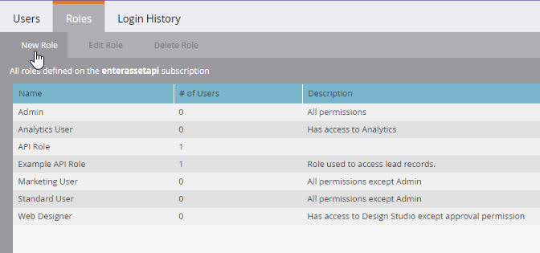
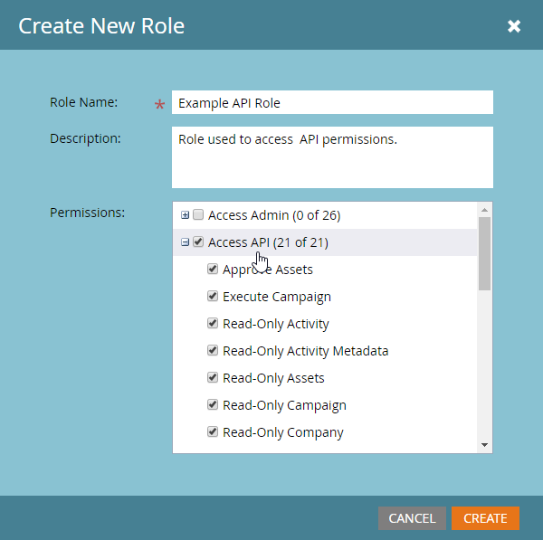
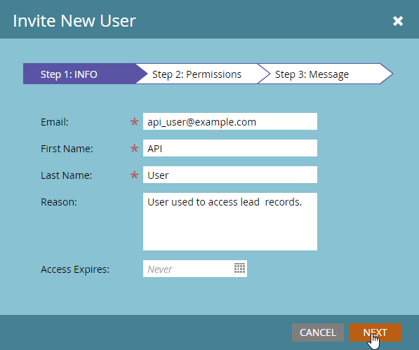
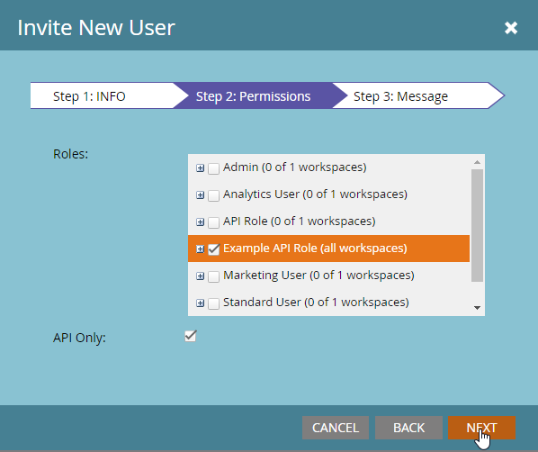
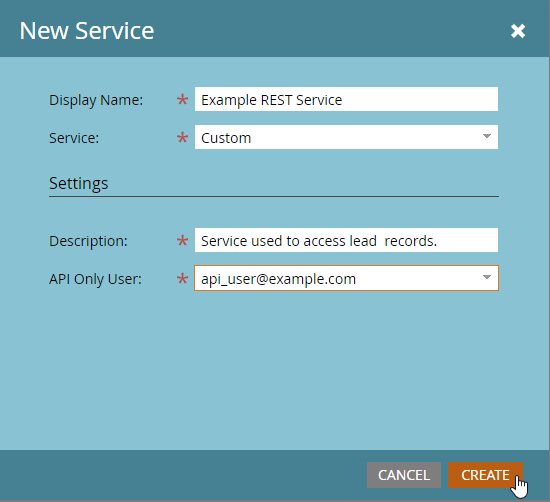
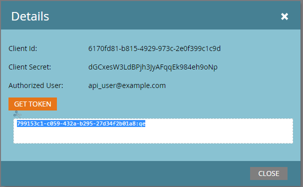

# Benutzerdefinierte Services

Ein benutzerdefinierter Dienst stellt die Anmeldeinformationen bereit, die zur Authentifizierung bei Marketo und zum Abrufen eines Zugriffstokens vom Marketo ([ Service) verwendet ](https://developer.adobe.com/marketo-apis/api/identity/#tag/Identity/operation/identityUsingGET). Jeder benutzerdefinierte Dienst wird auf einen einzigen Benutzer (nur API) beschränkt und leitet seine Berechtigungen von diesem Benutzer ab.

## Rollen

Bevor Sie einen benutzerdefinierten Service erstellen, erstellen Sie eine Rolle, die Sie dem entsprechenden Benutzer „Nur API“ zuweisen. Navigieren Sie **[!UICONTROL Admin]** > **[!UICONTROL Benutzer und Rollen]** > **[!UICONTROL Rollen]**.

Rollen enthalten individuelle Berechtigungen, die den Zugriff auf bestimmte Funktionen ermöglichen oder einschränken. In Abonnements mit aktivierten Arbeitsbereichen und Partitionen werden Berechtigungen pro Arbeitsbereich zugewiesen. Ein Benutzer kann zulässige Aktionen nur in den Arbeitsbereichen ausführen, in denen er über diese Berechtigungen verfügt.

Um eine Rolle zu erstellen, wählen Sie &quot;**[!UICONTROL Rolle“]**.

Geben Sie der Rolle einen beschreibenden Namen. Benutzer, die nur über eine API verfügen, verfügen über einen bestimmten Berechtigungssatz, der von den Standardbenutzerberechtigungen getrennt ist. API-Berechtigungen werden in ihrer eigenen Hierarchie unter der Baumstruktur „Zugriff auf API“ angezeigt.

### Rollenberechtigungen

Nur Berechtigungen in der Gruppe „Zugriff auf API“ gelten für API-Benutzer. Bei der Zuweisung aller Administratorberechtigungen werden einem Benutzer keine API-Berechtigungen gewährt.

Wenn Sie eine Rolle erstellen, identifizieren Sie die Aktionen, die die Anwendung ausführen muss. Weisen Sie nur die für diese Aktionen erforderlichen Mindestberechtigungen zu. Unnötige Berechtigungen können Integrationen erlauben, unerwünschte Aktionen in Ihrem Abonnement durchzuführen.

Verwenden Sie das [Berechtigungs](endpoint-reference.md)Tool, um den Mindestsatz von Berechtigungen festzulegen. Siehe die vollständige Liste von [Berechtigungen](#permission_list).

## Benutzer

Erstellen Sie nach dem Erstellen einer Rolle einen „Nur-API“-Benutzer. Andere Benutzende verwalten Benutzende, die nur über eine API verfügen, und Benutzende, die nur über eine API verfügen, können sich nicht bei Marketo anmelden. Sie können:

- Erstellen benutzerdefinierter Services
- Zugriffsberechtigungen für diese Services
- Zugriff auf REST-APIs

>[!MORELIKETHIS]
>
>Um einen Benutzer nur mit API zu erstellen, gehen Sie zum Menü **[!UICONTROL Admin]** > **[!UICONTROL Benutzer und Rollen]** > **[!UICONTROL Benutzer]** und wählen Sie **[!UICONTROL Neuen Benutzer einladen]**.

Geben Sie dem Benutzer einen beschreibenden Namen und eine E-Mail-Adresse, die auf dem Service und der Anwendung basiert, die das Konto verwenden werden. Die E-Mail-Adresse muss nicht gültig sein. Füllen Sie die erforderlichen Felder aus, aktivieren Sie das Kontrollkästchen **[!UICONTROL Nur API]** und weisen Sie dem Benutzer eine Ihrer API-Rollen zu. Durch diese Aktion wird dem Benutzer der Berechtigungssatz der Rolle zugewiesen.

Wählen Sie **[!UICONTROL Senden]** aus, um den Benutzer „Nur API“ zu erstellen.

Wenn Sie Anmeldeinformationen für ein neues Programm bereitstellen, sollten Sie einen separaten Benutzer für den Service erstellen, auch wenn eine andere Integration denselben Berechtigungssatz verwendet. Statistiken und Fehler zur Nutzung von API-Aufrufen werden pro Benutzer verfolgt.

Ein Anwender für jede Anwendung hilft dabei, Nutzungsszenarien und Probleme auf bestimmte Anwendungen zu beschränken. Diese Trennung ist nützlich, wenn Integrationen die täglichen API-Aufrufbeschränkungen erreichen oder API-Fehler generieren.

## Benutzerdefinierte Services

Benutzerdefinierte Services stellen die Client-ID und das Client-Geheimnis bereit, die für die Authentifizierung bei einer Marketo-Instanz erforderlich sind. Um einen Service bereitzustellen, gehen Sie zu **[!UICONTROL Admin]** > **[!UICONTROL Integrationen]** > **[!UICONTROL LaunchPoint]** und wählen Sie **[!UICONTROL Neuer Service]**.

Geben Sie dem Dienst einen beschreibenden Namen. Wählen Sie in der Liste „Service“ die Option „Benutzerdefiniert“ aus. Geben Sie eine detaillierte Beschreibung ein, wählen Sie den entsprechenden Benutzer aus der Liste Nur API-Benutzer aus und klicken Sie auf **[!UICONTROL Erstellen]**.

Der Service wird in der Liste der LaunchPoint-Services mit der Option „Details anzeigen“ angezeigt. Wählen Sie „Details anzeigen“ aus, um auf die Optionen „Client-ID“, „Client-Geheimnis“, „Eigentümer des Benutzers“ und „Token abrufen“ zuzugreifen.

Verwenden Sie das Token „get“ für kurzfristige Tests. Das Token hat dieselbe Lebensdauer wie Token, die vom [Identity Service](https://developer.adobe.com/marketo-apis/api/identity/#tag/Identity/operation/identityUsingGET) abgerufen wurden, und ist nach der Erstellung 3.600 Sekunden lang gültig.

## Arbeitsbereiche und Partitionen

In Abonnements mit Arbeitsbereichen und Partitionen bestimmen die Rollenberechtigungen eines Benutzers in einem Arbeitsbereich den Zugriff auf Datensätze und Assets. Jeder Arbeitsbereich hat Zugriff auf eine oder mehrere Partitionen und jeder Lead gehört zu einer Partition.

Wenn ein Benutzer, der nur über eine API verfügt, Lead-Datensätze in einem Arbeitsbereich lesen oder schreiben kann, kann der Benutzer auf alle Datensätze in den Partitionen zugreifen, die für diesen Arbeitsbereich verfügbar sind.

Assets gehören zu Arbeitsbereichen. Ein Benutzer kann ein Asset lesen oder schreiben, wenn er über eine Rolle mit der erforderlichen Berechtigung im Arbeitsbereich des Assets verfügt.

## Berechtigungsliste

In der folgenden Tabelle sind die Berechtigungen aufgeführt, die nur für Benutzer mit einer -API verfügbar sind, sowie der Zugriff, den jede Berechtigung gewährt.

| Rollenberechtigung | Gewährt Zugriff auf… |
| --- | --- |
| Assets genehmigen | Assets genehmigen |
| Ausführen von Kampagne | Kampagne anfordern oder planen |
| Schreibgeschützte Aktivität | Lead-Aktivitäten abrufen |
| Metadaten der schreibgeschützten Aktivität | Abrufen von Metadaten der Lead-Aktivität |
| Schreibgeschützte Assets | Abrufen von Asset-Details |
| Schreibgeschützte Kampagne | Abrufen von Kampagnendetails |
| Schreibgeschütztes Unternehmen | Abrufen von Unternehmensdetails |
| Schreibgeschütztes benutzerdefiniertes Objekt | Abrufen benutzerdefinierter Objektdetails |
| Schreibgeschützter Lead | Lead-Details abrufen |
| Schreibgeschütztes benanntes Konto | Abrufen benannter Kontodetails |
| Schreibgeschützte Liste benannter Konten | Abrufen von Details zur Liste benannter Konten |
| Schreibgeschützte Geschäftschance | Opportunity-Details abrufen |
| Schreibgeschützter Verkaufsmitarbeiter | Details zu Vertriebsperson abrufen |
| Aktivität mit Lese-/Schreibzugriff | Abrufen und Erstellen von Lead-Aktivitäten |
| Metadaten der Aktivität mit Lese-/Schreibzugriff | Abrufen und Erstellen von Metadaten der Lead-Aktivität |
| Assets mit Lese-/Schreibzugriff | Abrufen, Erstellen und Aktualisieren von Assets |
| Kampagne mit Lese-/Schreibzugriff | Abrufen, Erstellen und Aktualisieren von Kampagnen |
| Unternehmen mit Lese-/Schreibzugriff | Abrufen, Erstellen und Aktualisieren von Firmen |
| Objekt mit Lese-/Schreibzugriff | Abrufen, Erstellen und Aktualisieren benutzerdefinierter Objekte |
| Lead mit Lese-/Schreibzugriff | Abrufen, Erstellen und Aktualisieren von Lead-Details |
| Benanntes Konto mit Lese-/Schreibzugriff | Abrufen, Erstellen und Aktualisieren von benannten Konten |
| Liste benannter Konten mit Lese-/Schreibzugriff | Abrufen, Erstellen und Aktualisieren von benannten Kontolisten |
| Verkaufschance mit Lese-/Schreibzugriff | Abrufen, Erstellen und Aktualisieren von Opportunities |
| Verkaufsmitarbeiter mit Lese-/Schreibzugriff | Abrufen, Erstellen und Aktualisieren von Vertriebspersonen |
