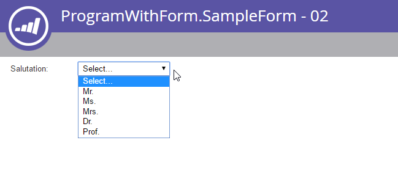

# Formulare

[Forms-Endpunktreferenz](https://developer.adobe.com/marketo-apis/api/asset#tag/Forms)

[Endpunktreferenz für Formularfelder](https://developer.adobe.com/marketo-apis/api/asset#tag/Form-Fields)

Verwenden Sie die Formular-Endpunkte, um Formulare von Remote-Systemen zu verwalten. Ein Formular kann mehrere Objekttypen enthalten:

- Formulare
- Felder
- Feldsätze
- Sichtbarkeitsregeln
- Seitenregeln nachverfolgen

## Abfrage

Forms unterstützt die standardmäßigen Asset-Abrufmethoden: [nach ID](https://developer.adobe.com/marketo-apis/api/asset#tag/Forms/operation/getLpFormByIdUsingGET), [nach Name](https://developer.adobe.com/marketo-apis/api/asset#tag/Forms/operation/getLpFormByNameUsingGET) und durch [Browsen](https://developer.adobe.com/marketo-apis/api/asset#tag/Forms/operation/browseForms2UsingGET). Eine Formularantwort enthält alle Formulareigenschaften mit Ausnahme der Feldliste.

### Nach ID

Übergeben Sie eine `id` als Pfadparameter an [Formular abrufen nach ID](https://developer.adobe.com/marketo-apis/api/asset#tag/Forms/operation/getLpFormByIdUsingGET). Der Endpunkt gibt den entsprechenden Formulardatensatz zurück.

```http
GET /rest/asset/v1/form/{id}.json
```

```json
{
    "success": true,
    "warnings": [],
    "errors": [],
    "requestId": "948f#154e3bad8e3",
    "result": [
        {
            "id": 736,
            "name": "newForm",
            "description": "test",
            "createdAt": "2016-05-24T17:05:54Z+0000",
            "updatedAt": "2016-05-24T17:05:54Z+0000",
            "url": "https://app-devlocal1.marketo.com/#FO736B2",
            "status": "draft",
            "theme": "simple",
            "language": "French",
            "locale": "fr_FR",
            "progressiveProfiling": false,
            "labelPosition": "left",
            "fontFamily": "Helvetica",
            "fontSize": "13px",
            "folder": {
                "type": "Folder",
                "value": 293,
                "folderName": "yyLNLHzgOM"
            },
            "knownVisitor": {
                "type": "form",
                "template": null
            },
            "thankYouList": [
                {
                    "followupType": "none",
                    "followupValue": null,
                    "default": true
                }
            ],
            "buttonLocation": 120,
            "buttonLabel": "Envoyer",
            "waitingLabel": "Veuillez patienter"
        }
    ]
}
```

### Nach Name

Übergeben Sie einen `name` an [Formular nach Namen abrufen](https://developer.adobe.com/marketo-apis/api/asset#tag/Forms/operation/getLpFormByNameUsingGET). Der Endpunkt gibt den entsprechenden Formulardatensatz zurück.

```http
GET /rest/asset/v1/form/byName.json?name=newForm
```

```json
{
    "success": true,
    "warnings": [],
    "errors": [],
    "requestId": "948f#154e3bad8e3",
    "result": [
        {
            "id": 736,
            "name": "newForm",
            "description": "test",
            "createdAt": "2016-05-24T17:05:54Z+0000",
            "updatedAt": "2016-05-24T17:05:54Z+0000",
            "url": "https://app-devlocal1.marketo.com/#FO736B2",
            "status": "draft",
            "theme": "simple",
            "language": "French",
            "locale": "fr_FR",
            "progressiveProfiling": false,
            "labelPosition": "left",
            "fontFamily": "Helvetica",
            "fontSize": "13px",
            "folder": {
                "type": "Folder",
                "value": 293,
                "folderName": "yyLNLHzgOM"
            },
            "knownVisitor": {
                "type": "form",
                "template": null
            },
            "thankYouList": [
                {
                    "followupType": "none",
                    "followupValue": null,
                    "default": true
                }
            ],
            "buttonLocation": 120,
            "buttonLabel": "Envoyer",
            "waitingLabel": "Veuillez patienter"
        }
    ]
}
```

### Durchsuchen

[Forms abrufen](https://developer.adobe.com/marketo-apis/api/asset#tag/Forms/operation/browseForms2UsingGET) folgt dem standardmäßigen Asset-API-Durchsuchungsmuster. Es unterstützt die folgenden optionalen Filter:

- `status`: Filtert nach `approved`, `approved with draft` oder `draft`.
- `maxReturn`: Begrenzt die Anzahl der zurückgegebenen Datensätze.
- `offset`: Blättert durch die Ergebnismenge.

```http
GET /rest/asset/v1/forms.json
```

```json
{
    "success": true,
    "warnings": [],
    "errors": [],
    "requestId": "645d#154e3d499ac",
    "result": [
        {
            "id": 227,
            "name": "aKAUVDfbsX",
            "description": "",
            "createdAt": "2016-05-18T20:36:20Z+0000",
            "updatedAt": "2016-05-18T20:36:20Z+0000",
            "url": "https://app-devlocal1.marketo.com/#FO227B2",
            "status": "draft",
            "theme": "simple",
            "language": "English",
            "locale": "en_US",
            "progressiveProfiling": false,
            "labelPosition": "left",
            "fontFamily": "Helvetica",
            "fontSize": "13px",
            "folder": {
                "type": "Folder",
                "value": 293,
                "folderName": "yyLNLHzgOM"
            },
            "knownVisitor": {
                "type": "form",
                "template": null
            },
            "thankYouList": [
                {
                    "followupType": "none",
                    "followupValue": null,
                    "default": true
                }
            ],
            "buttonLocation": 120,
            "buttonLabel": "Submit",
            "waitingLabel": "Please Wait"
        },
        {
            "id": 695,
            "name": "AoMXgfFbma",
            "description": "",
            "createdAt": "2016-05-19T18:50:40Z+0000",
            "updatedAt": "2016-05-19T18:50:40Z+0000",
            "url": "https://app-devlocal1.marketo.com/#FO695B2",
            "status": "draft",
            "theme": "simple",
            "language": "English",
            "locale": "en_US",
            "progressiveProfiling": true,
            "labelPosition": "left",
            "fontFamily": "Helvetica",
            "fontSize": "13px",
            "folder": {
                "type": "Folder",
                "value": 565,
                "folderName": "WfUvYmlcyT"
            },
            "knownVisitor": {
                "type": "form",
                "template": null
            },
            "thankYouList": [
                {
                    "followupType": "none",
                    "followupValue": null,
                    "default": true
                }
            ],
            "buttonLocation": 120,
            "buttonLabel": "Submit",
            "waitingLabel": "Please Wait"
        }
    ]
}
```

### Feldliste

Rufen Sie die Feldliste für jedes Formular separat ab, indem Sie die Formular-ID übergeben.

```http
GET /rest/asset/v1/form/{id}/fields.json
```

```json
{
    "success": true,
    "warnings": [],
    "errors": [],
    "requestId": "2165#154eee00d01",
    "result": [
        {
            "id": "FirstName",
            "label": "First Name:",
            "dataType": "text",
            "validationMessage": "This field is required.",
            "rowNumber": 0,
            "columnNumber": 0,
            "maxLength": 255,
            "required": false,
            "formPrefill": true,
            "visibilityRules": {
                "ruleType": "alwaysShow"
            }
        },
        {
            "id": "LastName",
            "label": "Last Name:",
            "dataType": "text",
            "validationMessage": "This field is required.",
            "rowNumber": 1,
            "columnNumber": 0,
            "maxLength": 255,
            "required": false,
            "formPrefill": true,
            "visibilityRules": {
                "ruleType": "alwaysShow"
            }
        },
        {
            "id": "Email",
            "label": "Email Address:",
            "dataType": "email",
            "validationMessage": "Must be valid email. <span class='mktoErrorDetail'>example@yourdomain.com</span>",
            "rowNumber": 2,
            "columnNumber": 0,
            "required": false,
            "formPrefill": true,
            "visibilityRules": {
                "ruleType": "alwaysShow"
            }
        },
        {
            "id": "Profiling",
            "dataType": "profiling",
            "rowNumber": 3,
            "columnNumber": 0
        }
    ]
}
```

Bevor Sie Felder aktualisieren oder löschen oder ihr Verhalten ändern, rufen Sie die Feldliste des Formulars ab. Verwenden Sie die zurückgegebene Feld-ID in nachfolgenden Anfragen.

### Feldtypen

| UI-Typ | API-Name |
| --- | --- |
| Kontrollkästchen | Kontrollkästchen |
| Optionsfeld | Funk |
| Textbereich | Textbereich |
| Auswahlliste | Auswahlliste |
| String | string |
| E-Mail | E-Mail |
| Datum | Datum |
| Zahl | number |
| Double | double |
| Telefon | Telefon |
| URL | URL |
| Währung | currency |
| Kontrollkästchen | single_checkbox |
| Schieberegler | Bereich |

### Abhängigkeiten

Übergeben Sie eine `id` als Pfadparameter an [Formular abrufen von](https://developer.adobe.com/marketo-apis/api/asset#tag/Forms/operation/getFormUsedByUsingGET). Der Endpunkt gibt Assets zurück, die vom Formular abhängen.

Die folgenden Asset-Typen können Formulare verwenden:

- Landingpages
- Intelligente Listen
- Intelligente Kampagnen
- Berichte
- E-Mail-Programme

```http
GET /rest/asset/v1/form/{id}/usedBy.json
```

```json
{
    "success": true,
    "errors": [],
    "requestId": "fdf4#17285b25038",
    "warnings": [],
    "result": [
        {
            "id": 1038,
            "name": "LP Redirect Rules Program.LP Test 01",
            "type": "Landing Page",
            "status": "approved",
            "updatedAt": "2020-02-23T01:31:21Z+0000"
        }
    ]
}
```

## Erstellen und aktualisieren

Um [Formular zu erstellen](https://developer.adobe.com/marketo-apis/api/asset#tag/Forms/operation/createLpFormsUsingPOST) geben Sie zwei erforderliche Felder an:

- Der übergeordnete Ordner des Formulars.
- Der Formularname.

Alle anderen Parameter sind optional und haben Standardwerte. Ein neues Formular enthält drei Standardfelder: Vorname, Nachname und E-Mail.

```http
POST /rest/asset/v1/forms.json
```

```text
Content-Type: application/x-www-form-urlencoded
```

```text
name=newForm&description=test&folder={"type": "Folder","id": 293}&language=French
```

```json
{
    "success": true,
    "warnings": [],
    "errors": [],
    "requestId": "948f#154e3bad8e3",
    "result": [
        {
            "id": 736,
            "name": "newForm",
            "description": "test",
            "createdAt": "2016-05-24T17:05:54Z+0000",
            "updatedAt": "2016-05-24T17:05:54Z+0000",
            "url": "https://app-devlocal1.marketo.com/#FO736B2",
            "status": "draft",
            "theme": "simple",
            "language": "French",
            "locale": "fr_FR",
            "progressiveProfiling": false,
            "labelPosition": "left",
            "fontFamily": "Helvetica",
            "fontSize": "13px",
            "folder": {
                "type": "Folder",
                "value": 293,
                "folderName": "yyLNLHzgOM"
            },
            "knownVisitor": {
                "type": "form",
                "template": null
            },
            "thankYouList": [
                {
                    "followupType": "none",
                    "followupValue": null,
                    "default": true
                }
            ],
            "buttonLocation": 120,
            "buttonLabel": "Envoyer",
            "waitingLabel": "Veuillez patienter"
        }
    ]
}
```

Um [Formular zu aktualisieren](https://developer.adobe.com/marketo-apis/api/asset#tag/Forms/operation/updateFormsUsingPOST) übergeben Sie seine ID. Während der Erstellung oder Aktualisierung können Sie die grundlegenden Stilparameter festlegen, die steuern, wie das Formular dem Benutzer angezeigt wird.

```http
POST /rest/asset/v1/form/736.json
```

```text
Content-Type: application/x-www-form-urlencoded
```

```text
name=updated name&description=This is a test for updateapi&language=English&progressiveProfiling=true&locale=en_US
```

```json
{
    "success": true,
    "warnings": [],
    "errors": [],
    "requestId": "6307#154e3cf6efe",
    "result": [
        {
            "id": 736,
            "name": "updated name",
            "description": "This is a test for update api",
            "createdAt": "2016-05-24T17:05:54Z+0000",
            "updatedAt": "2016-05-24T17:28:23Z+0000",
            "status": "draft",
            "theme": "simple",
            "language": "English",
            "locale": "en_US",
            "progressiveProfiling": true,
            "labelPosition": "left",
            "fontFamily": "Helvetica",
            "fontSize": "13px",
            "folder": {
                "type": "Folder",
                "value": 293,
                "folderName": "yyLNLHzgOM"
            },
            "knownVisitor": {
                "type": "form",
                "template": null
            },
            "thankYouList": [
                {
                    "followupType": "none",
                    "followupValue": null,
                    "default": true
                }
            ],
            "buttonLocation": 120,
            "buttonLabel": "Submit",
            "waitingLabel": "Please Wait"
        }
    ]
}
```

Die Formularendpunkte „Erstellen“ und „Aktualisieren“ ändern weder das bekannte Verhalten von Besuchern noch das der Dankeseite. Verwenden Sie die entsprechenden Endpunkte, um diese Verhaltensweisen zu verwalten.

## Feldmetadaten

Rufen Sie vor dem Hinzufügen oder Bearbeiten von Formularfeldern die gültigen Felder für die Zielinstanz ab. Feldvorgänge verwenden die für jedes Feld zurückgegebene `id`-Eigenschaft.

Verwenden Sie für Lead-Felder den [Verfügbare Formularfelder abrufen](https://developer.adobe.com/marketo-apis/api/asset#tag/Form-Fields/operation/getAllFieldsUsingGET)-Endpunkt. Die Antwort enthält den Datentyp der einzelnen Felder und die Standardmetadaten, die angewendet werden, wenn das Feld einem Formular hinzugefügt wird.

```http
GET /rest/asset/v1/form/fields.json
```

```json
{
    "success": true,
    "errors": [],
    "requestId": "176ca#167a9808f4c",
    "warnings": [],
    "result": [
        {
            "id": "AnnualRevenue",
            "isRequired": false,
            "dataType": "currency"
        },
        {
            "id": "City",
            "isRequired": false,
            "dataType": "string",
            "maxLength": 255
        },
        {
            "id": "Company",
            "isRequired": false,
            "dataType": "string",
            "maxLength": 255
        },
        {
            "id": "Country",
            "isRequired": false,
            "dataType": "string",
            "maxLength": 255
        },
        {
            "id": "Description",
            "isRequired": false,
            "dataType": "textarea",
            "maxLength": 32000,
            "visibleRows": 2
        },
        {
            "id": "Email",
            "isRequired": false,
            "dataType": "email"
        },
        {
            "id": "Fax",
            "isRequired": false,
            "dataType": "phone"
        },
        {
            "id": "FirstName",
            "isRequired": false,
            "dataType": "string",
            "maxLength": 255
        },
        {
            "id": "Industry",
            "isRequired": false,
            "dataType": "string",
            "maxLength": 255
        },
        {
            "id": "LastName",
            "isRequired": false,
            "dataType": "string",
            "maxLength": 255
        },
        {
            "id": "LeadSource",
            "isRequired": false,
            "dataType": "string",
            "maxLength": 255
        },
        {
            "id": "MobilePhone",
            "isRequired": false,
            "dataType": "phone"
        },
        {
            "id": "NumberOfEmployees",
            "isRequired": false,
            "dataType": "int"
        },
        {
            "id": "Phone",
            "isRequired": false,
            "dataType": "phone"
        },
        {
            "id": "PostalCode",
            "isRequired": false,
            "dataType": "string",
            "maxLength": 255
        },
        {
            "id": "Rating",
            "isRequired": false,
            "dataType": "string",
            "maxLength": 255
        },
        {
            "id": "Salutation",
            "isRequired": false,
            "dataType": "picklist",
            "picklistValues": "Mr.,Ms.,Mrs.,Dr.,Prof."
        },
        {
            "id": "State",
            "isRequired": false,
            "dataType": "picklist",
            "picklistValues": "AK::AK,AL::AL,AR::AR,AZ::AZ,CA::CA,CO::CO,CT::CT,DE::DE,FL::FL,GA::GA,HI::HI,IA::IA,ID::ID,IL::IL,IN::IN,KS::KS,KY::KY,LA::LA,MA::MA,MD::MD,ME::ME,MI::MI,MN::MN,MO::MO,MS::MS,MT::MT,NC::NC,ND::ND,NE::NE,NH::NH,NJ::NJ,NM::NM,NV::NV,NY::NY,OH::OH,OK::OK,OR::OR,PA::PA,RI::RI,SC::SC,SD::SD,TN::TN,TX::TX,UT::UT,VA::VA,VT::VT,WA::WA,WI::WI,WV::WV,WY::WY"
        },
        {
            "id": "Street",
            "isRequired": false,
            "dataType": "textarea",
            "maxLength": 2000,
            "visibleRows": 2
        },
        {
            "id": "Title",
            "isRequired": false,
            "dataType": "picklist"
        }
    ]
}
```

Rufen Sie für benutzerdefinierte Felder von Programmmitgliedern den Endpunkt [Verfügbare Formular-Programmmitgliedsfelder abrufen](https://developer.adobe.com/marketo-apis/api/asset#tag/Form-Fields/operation/getAllProgramMemberFieldsUsingGET) auf. Die Antwort enthält die benutzerdefinierten Felddatentypen des Programmmitglieds und die Standard-Metadaten.

Um diese Felder verwenden zu können, muss sich das Formular in einem Programm und nicht in Design Studio befinden. Eine Landingpage, die ein Formular mit diesen Feldern enthält, muss sich auch unter einem Programm befinden. Es kann nicht in Design Studio gespeichert oder in dieses geklont werden.

```http
GET /rest/asset/v1/form/programMemberFields.json
```

```json
{
    "success": true,
    "errors": [],
    "requestId": "109c6#16fa0b9c51a",
    "warnings": [],
    "result": [
        {
            "id": "pMCFCustomField01",
            "isRequired": false,
            "dataType": "string",
            "maxLength": 255
        },
        {
            "id": "pMCFCustomField02",
            "isRequired": false,
            "dataType": "string",
            "maxLength": 255
        },
        {
            "id": "myPMCF",
            "isRequired": false,
            "dataType": "string",
            "maxLength": 255
        }
    ]
}
```

### Bearbeitungsfeld

Jedes Formular verfügt über eine bearbeitbare Liste von Feldern, die den Benutzenden beim Laden des Formulars angezeigt wird. Verwenden Sie den entsprechenden Endpunkt, um jeweils ein Feld hinzuzufügen, zu aktualisieren oder zu löschen.

Um [Feld hinzuzufügen](https://developer.adobe.com/marketo-apis/api/asset#tag/Form-Fields/operation/addFieldToAFormUsingPOST) geben Sie die ID des übergeordneten Formulars und die `fieldId` an. Alle anderen Eigenschaften sind leer oder verwenden Standardwerte, die auf dem Datentyp und den Metadaten des Felds basieren.

Senden Sie die Daten als POST-Anfrage mit `application/x-www-form-urlencoded` und nicht als JSON.

```http
POST /rest/asset/v1/form/{id}/fields.json
```

```text
Content-Type: application/x-www-form-urlencoded
```

```text
fieldId=NumberOfEmployees&maxLength=125&defaultValue=this is default&required=true&fieldWidth=100&validationMessage=hey, you there?&label=employee count&hintText=Hint me&minValue=10
```

```json
{
    "success": true,
    "warnings": [],
    "errors": [],
    "requestId": "1826e#154f41b214c",
    "result": [
        {
            "id": "NumberOfEmployees",
            "label": "employee count",
            "fieldWidth": 100,
            "dataType": "number",
            "defaultValue": "this is default",
            "validationMessage": "hey, you there?",
            "rowNumber": 5,
            "columnNumber": 0,
            "required": true,
            "formPrefill": true,
            "fieldMetaData": {
                "minValue": 10,
                "maxValue": null
            },
            "visibilityRules": {
                "ruleType": "alwaysShow"
            },
            "hintText": "Hint me"
        }
    ]
}
```

Eine Aktualisierung kann dieselben Eigenschaften bearbeiten, die beim Hinzufügen eines Felds verwendet wurden. Es sind auch die Formular-ID und der `fieldId` erforderlich, aber der Aktualisierungsendpunkt übergibt `fieldId` als Pfadparameter und nicht als Abfrageparameter.

```http
POST /rest/asset/v1/form/{id}/field/LastName.json
```

```text
Content-Type: application/x-www-form-urlencoded
```

```text
label=enter the last name here
```

```json
{
    "success": true,
    "warnings": [],
    "errors": [],
    "requestId": "5634#15508303abb",
    "result": [
        {
            "id": "LastName",
            "label": "enter the last name here",
            "dataType": "text",
            "validationMessage": "This field is required.",
            "rowNumber": 0,
            "columnNumber": 0,
            "maxLength": 255,
            "required": false,
            "formPrefill": true,
            "visibilityRules": {
                "ruleType": "alwaysShow"
            }
        }
    ]
}
```

Im vorherigen Beispiel wird `LastName` aktualisiert, wobei es sich um ein einfaches Zeichenfolgenfeld handelt. Andere Formularfelder enthalten komplexere Metadaten. Beispiel: `Salutation` ist ein `select` mit einer Liste von Elementen und einem Standardwert.

Wenn Sie ein Auswahlfeld hinzufügen oder aktualisieren, setzen Sie den `isDefault` einer Auswahl auf `true`. Andernfalls hat die erste Auswahl keinen -Wert und ist mit `Select...` gekennzeichnet.



Um die Listenelemente zu aktualisieren, formatieren Sie den `values` wie im folgenden Beispiel gezeigt:

```http
POST /rest/asset/v1/form/{id}/field/Salutation.json
```

```text
Content-Type: application/x-www-form-urlencoded
```

```sql
values=[{"label":"Select...","value":"","isDefault":true,"selected":true}, {"label":"MR","value":"MR"}, {"label":"MS","value":"MS"}, {"label":"MRS","value":"MRS"}, {"label":"DR","value":"DR"}, {"label":"PROF","value":"PROF"}]
```

```json
{
  "success": true,
  "warnings": [ ],
  "errors": [ ],
  "requestId": "71fd#1588d9d1b0c",
  "result": [
    {
      "id": "Salutation",
      "label": "Salutation:",
      "dataType": "select",
      "validationMessage": "This field is required.",
      "rowNumber": 3,
      "columnNumber": 0,
      "required": false,
      "formPrefill": true,
      "fieldMetaData": {
        "multiSelect": false,
        "values": [
          {
            "label": "Select...",
            "value": "",
            "isDefault": true,
            "selected": true
          },
          {
            "label": "MR",
            "value": "MR"
          },
          {
            "label": "MS",
            "value": "MS"
          },
          {
            "label": "MRS",
            "value": "MRS"
          },
          {
            "label": "DR",
            "value": "DR"
          },
          {
            "label": "PROF",
            "value": "PROF"
          }
        ],
        "visibleLines": 1
      },
      "visibilityRules": {
        "ruleType": "alwaysShow"
      }
    }
  ]
}
```

Verwenden Sie die Antwort Feld zum Formular hinzufügen , um zu bestimmen, wie ein komplexes Formularfeld formatiert werden soll.

### Feld wird neu angeordnet

Verwenden Sie den Endpunkt [Formularfeldpositionen ändern](https://developer.adobe.com/marketo-apis/api/asset#tag/Form-Fields/operation/updateFieldPositionsUsingPOST), um alle Formularfelder als eine Einheit neu anzuordnen. Der Endpunkt erfordert `positions`, ein JSON-Array von Objekten mit drei Elementen:

- `columnNumber`
- `rowNumber`
- `fieldName`, das auf die Feld-ID verweist

Formularfelder verwenden eine tabellenartige Anordnung mit bis zu drei Spalten und 10 Zeilen. Zeilen- und Spaltenindizes beginnen bei 0, sodass die erste Zeile und Spalte beide 0 verwenden. Jedes Feld muss eine eindeutige Position einnehmen.

Wenn es sich bei dem Zielfeld um eine Feldgruppe handelt, muss ihr Datensatz in `positions` auch `fieldList` enthalten. Dieser Parameter ist ein Array von Objekten mit denselben `columnNumber`-, `rowNumber`- und `fieldName`.

Die übergeordnete Liste behandelt die Feldgruppe als ein Feld. Die Positionen in `fieldList` bestimmen die Anordnung der untergeordneten Felder.

```http
POST /rest/asset/v1/form/{id}/reArrange.json
```

```text
Content-Type: application/x-www-form-urlencoded
```

```text
positions=[{"columnNumber":0,"rowNumber":0,"fieldName":"FirstName"},{"columnNumber":0,"rowNumber":1,"fieldName":"LastName"}, {"columnNumber":0,"rowNumber":2, "fieldName":"Email"}]
```

```json
{
    "success": true,
    "warnings": [],
    "errors": [],
    "requestId": "bb18#15508ef9c04",
    "result": [
        {
            "id": 764
        }
    ]
}
```

### RTF

Verwenden Sie einen [separaten Endpunkt](https://developer.adobe.com/marketo-apis/api/asset#tag/Form-Fields/operation/addRichTextFieldUsingPOST), um Rich-Text-Felder hinzuzufügen. Übergeben Sie den Inhalt als HTML in einer `multipart/form-data`. Die HTML darf keine Skripte, Meta-Tags oder Link-Tags enthalten.

```http
POST /rest/asset/v1/form/{id}/richText.json
```

```html
Content-Type: multipart/form-data; boundary=---------------------------9051914041544843365972754266
-----------------------------9051914041544843365972754266
Content-Disposition: form-data; name="text"
Content-Type: text/html
<div>Fancy Rich Text Component</div>
-----------------------------9051914041544843365972754266--
```

```json
{
    "success": true,
    "warnings": [],
    "errors": [],
    "requestId": "82c8#154f423bf5c",
    "result": [
        {
            "id": "SHRtbFRleHRfMjAxNi0wNS0yN1QxNDozNDoyNC4xMTVa",
            "labelWidth": 260,
            "dataType": "htmltext",
            "rowNumber": 8,
            "columnNumber": 0,
            "visibilityRules": {
                "ruleType": "alwaysShow"
            },
            "text": "<div>Fancy Rich Text Component</div>"
        }
    ]
}
```

### Feldsatz

Eine Feldgruppe ist eine optionale Feldergruppe. Die Feldliste der obersten Ebene behandelt eine Feldgruppe als ein Feld für Positionierungs- und Sichtbarkeitsregeln. Wenn Sie beispielsweise Ja für ein Feld Kompatibilitätsanforderungen auswählen, kann eine Feldgruppe mit HIPAA- und PCI-Kompatibilitätsfeldern angezeigt werden.

Ein Feld muss im Formular eindeutig sein. Dasselbe Feld kann nicht sowohl in der übergeordneten Feldliste des Formulars als auch in einer untergeordneten Feldgruppe angezeigt werden.

Fügen Sie eine Feldgruppe mit dem Endpunkt [Feldgruppe zu Formular hinzufügen](https://developer.adobe.com/marketo-apis/api/asset#tag/Form-Fields/operation/addFieldSetUsingPOST) hinzu. Die Feldgruppe wird dann in der Antwort [Felder für Formular ](https://developer.adobe.com/marketo-apis/api/asset#tag/Form-Fields/operation/getFormFieldByFormVidUsingGET). Um Felder zum Feldset hinzuzufügen, verwenden Sie [Feldpositionen aktualisieren](https://developer.adobe.com/marketo-apis/api/asset#tag/Form-Fields/operation/updateFieldPositionsUsingPOST), um sie in seine `fieldList` zu verschieben.

Senden Sie für diese Endpunkte die Daten als POST mit `application/x-www-form-urlencoded` und nicht als JSON.

## Sichtbarkeitsregel

Sichtbarkeitsregeln bestimmen, ob ein Besucher ein Feld basierend auf den im Formular eingegebenen Werten sehen kann. Jede Regel vergleicht den Wert eines `subjectField` im Formular mit einer Liste von Werten in der Regel.

Ein Feld kann einen Sichtbarkeitsregeltyp aufweisen: `show`, `hide` oder `alwaysShow`. Die API bewertet die Feldregeln von oben nach unten und wendet die erste Regel an, die als „true“ ausgewertet wird.

Das Ändern der Sichtbarkeitsregeln ist eine destruktive Aktualisierung.

```http
POST /rest/asset/v1/form/{id}/field/Email/visibility.json
```

```text
Content-Type: application/x-www-form-urlencoded
```

```text
visibilityRule={"ruleType":"show", "rules":[{"subjectField": "LastName", "operator": "isNotEmpty", "values": [], "altLabel": "Email:"}]}
```

```json
{
    "success": true,
    "warnings": [],
    "errors": [],
    "requestId": "ab4a#15509030601",
    "result": [
        {
            "formFieldId": "Email",
            "ruleType": "show",
            "rules": [
                {
                    "subjectField": "LastName",
                    "operator": "isNotEmpty",
                    "values": [],
                    "altLabel": "Email:"
                }
            ]
        }
    ]
}
```

Eine vollständige Liste der Operatoren finden Sie unter [Hinzufügen von Sichtbarkeitsregeln für Formularfelder](https://developer.adobe.com/marketo-apis/api/asset#tag/Form-Fields/operation/addFormFieldVisibilityRuleUsingPOST).

## Nachbereitung

Dynamische Folgeregeln können Besucher basierend auf den bei der Übermittlung festgelegten Feldwerten zu einer Seite umleiten oder auf der aktuellen Seite belassen. Dankeseitenregeln und Folgeseitenregeln beziehen sich auf dasselbe Verhalten.

Stellt die Regeln als JSON-Array dar, dessen Datensätze `followupType`, `followupValue`, `operator`, `subjectField`, `values` und `default` enthalten. Für nur einen Datensatz im Array kann der boolesche `default` auf `true` gesetzt werden. Das Formular verwendet diesen Datensatz, wenn sich ein Besucher nicht für eine andere Regel qualifiziert.

Der `followupType` kann `lp` oder `url` sein. Der `lp` gibt an, dass `followupValue` eine Marketo-Landingpage-ID ist. Der `url` gibt an, dass `followupValue` die URL einer anderen Seite ist. Der Operator vergleicht den Wert des Betrefffelds mit den bereitgestellten Werten.

## Senden-Schaltfläche

Verwenden Sie den Endpunkt [Senden-Schaltfläche aktualisieren](https://developer.adobe.com/marketo-apis/api/asset#tag/Forms/operation/updateFormSubmitButtonUsingPOST), um die Formatierung der Senden-Schaltfläche zu ändern. Sie können `buttonPosition`, `buttonStyle`, `label` und `waitingLabel` aktualisieren. Die `waitingLabel` wird angezeigt, während die Übermittlung aussteht.

Dies ist ein destruktives Update.

## Genehmigung

Forms folgt einem vom Entwurf genehmigten Lebenszyklus. Ein Formular kann über eine Entwurfsversion, eine genehmigte Version oder beides verfügen. Aktualisierungen gelten immer für den Entwurf und werden erst nach der Genehmigung live geschaltet.

Durch die Genehmigung eines Formulars wird die vorhandene genehmigte Version, falls vorhanden, durch den aktuellen Entwurf ersetzt. Beim Rückgängigmachen der Genehmigung eines Live-Formulars werden alle aktuellen Entwürfe gelöscht und die genehmigte Version in einen Nur-Entwurf-Status zurückgesetzt. Genehmigung eines Formulars muss immer aufgehoben werden, bevor versucht wird, es zu löschen.

## Progressive Profilerstellung

Wenn die progressive Profilerstellung aktiviert ist, enthält die Formularfeldliste eine Feldgruppe mit dem Namen `Profiling`. Verwenden Sie den Endpunkt Feldpositionen aktualisieren , um Felder zur progressiven Profilliste hinzuzufügen oder daraus zu entfernen.

Dieser Endpunkt führt destruktive Aktualisierungen durch, sodass jede Anfrage alle Felder im Formular enthalten muss. Im folgenden Beispiel wird `Phone` zur Liste der progressiven Profile hinzugefügt.

```http
POST /rest/asset/v1/form/{id}/reArrange.json
```

```text
Content-Type: application/x-www-form-urlencoded
```

```text
positions=[{"columnNumber":0,"rowNumber":0,"fieldName":"Email"},{"columnNumber":0,"rowNumber":1,"fieldName":"LastName"},{"columnNumber":0,"rowNumber":2,"fieldName":"Company"},{"columnNumber":0,"rowNumber":3,"fieldName":"Website"},{"columnNumber":0,"rowNumber":4,"fieldName":"Profiling","fieldList":[{"columnNumber":0,"rowNumber":0,"fieldName":"Phone"}]}]
```

```json
{
    "success": true,
    "errors": [],
    "requestId": "3d6a#164190dbdf2",
    "result": [
        {
            "id": 1031
        }
    ]
}
```
