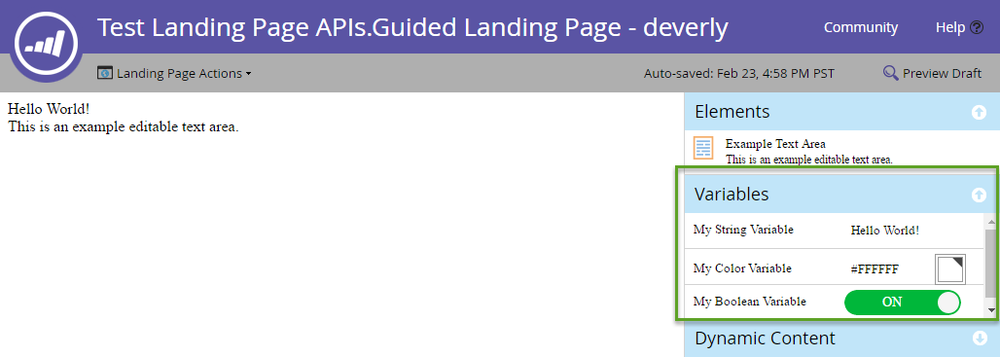

# Landingpages

[Referenz zum Landingpage-Endpunkt](https://developer.adobe.com/marketo-apis/api/asset#tag/Landing-Pages)

Landingpages sind von Marketo gehostete Web-Seiten. Verwenden Sie die REST-APIs für Landingpages, um Metadaten, Inhalte, Lebenszyklus und Vorschau abzufragen und zu verwalten.

## Abfrage

Abfragen von Landingpages [nach &#x200B;](https://developer.adobe.com/marketo-apis/api/asset#tag/Landing-Pages/operation/getLandingPageByNameUsingGET), [nach ID](https://developer.adobe.com/marketo-apis/api/asset#tag/Landing-Pages/operation/getLandingPageByIdUsingGET) oder durch [Browsen](https://developer.adobe.com/marketo-apis/api/asset#tag/Landing-Pages/operation/browseLandingPagesUsingGET). Diese Abfragen geben nur Metadaten zurück. Fragen Sie die Inhaltsabschnitte einer Landingpage separat nach Seiten-ID ab.

Die Abfrage von Landingpage-Inhalten gibt die verfügbaren Inhaltsabschnitte zurück. Ein Abschnitt muss in der Liste angezeigt werden, bevor Sie ihn aktualisieren können.

```http
GET /rest/asset/v1/landingPage/{id}/content.json
```

```json
{
    "success": true,
    "warnings": [],
    "errors": [],
    "requestId": "6307#154ea1689d7",
    "result": [
        {
            "id": "67",
            "type": "Form",
            "index": 1,
            "content": {
                "content": "189",
                "contentType": "Form",
                "contentUrl": "https://app-devlocal1.marketo.com/#FO189A1ZN13LA1"
            },
            "formattingOptions": {
                "zIndex": 15,
                "left": "359px",
                "top": "122px"
            }
        }
    ]
}
```

Geführte Landingpages enthalten Abschnitte, die durch ihre Vorlage definiert sind. Freiformseiten enthalten keine vordefinierten Abschnitte. Fügen Sie daher ihren Inhalt hinzu, bevor Sie ihn bearbeiten.

Das Format des `content`-Attributs hängt vom `type`-Attribut ab und davon, ob das Feld statisch oder dynamisch ist.

## Erstellen und aktualisieren

[Landingpage erstellen](https://developer.adobe.com/marketo-apis/api/asset#tag/Landing-Pages/operation/createLandingPageUsingPOST) aus einer Vorlage. Der Seitenname, die Vorlagen-ID und der Zielordner sind erforderlich. Optionale Metadaten finden Sie in der Endpunkt-Referenz .

Die Endpunkte [Landingpage-](https://developer.adobe.com/marketo-apis/api/asset#tag/Landing-Page-Content)) unterstützen die folgenden Inhaltstypen: `richText`, `HTML`, `Form`, `Image`, `Rectangle` und `Snippet`.

```http
POST rest/asset/v1/landingPages.json
```

```text
Content-Type: application/x-www-form-urlencoded
```

```text
name=createLandingPage&folder={"type": "Folder", "id": 11}&template=1&description=this is a test&workspace=default&title=test create&keywords=awesome&formPrefill=false
```

```json
{
    "success": true,
    "warnings": [],
    "errors": [],
    "requestId": "7a39#154cf7922c6",
    "result": [
        {
            "id": 27,
            "name": "createLandingPage",
            "description": "this is a test",
            "createdAt": "2016-05-20T18:41:43Z+0000",
            "updatedAt": "2016-05-20T18:41:43Z+0000",
            "folder": {
                "type": "Folder",
                "value": 11,
                "folderName": "Landing Pages"
            },
            "workspace": "Default",
            "status": "draft",
            "template": 1,
            "title": "test create",
            "keywords": "awesome",
            "robots": "index, nofollow",
            "formPrefill": false,
            "mobileEnabled": false,
            "URL": "https://app-devlocal1.marketo.com/lp/622-LME-718/createLandingPage.html",
            "computedUrl": "https://app-devlocal1.marketo.com/#LP27B2"
        }
    ]
}
```

Die Metadaten der Landingpage können mit dem Endpunkt [Metadaten der Landingpage aktualisieren“ aktualisiert &#x200B;](https://developer.adobe.com/marketo-apis/api/asset#tag/Landing-Pages/operation/updateLandingPageUsingPOST).

## Genehmigung

Landingpages verwenden das Standardmodell „Entwurf und genehmigt“. Aktualisierungen gelten für den Entwurf und werden erst nach der Genehmigung live geschaltet.

## Löschen

Bevor Sie eine Landingpage löschen, stellen Sie sicher, dass sie nicht genehmigt ist und kein anderes Marketo-Asset darauf verweist. Löschen Sie Seiten einzeln mit dem Endpunkt [Landingpage löschen](https://developer.adobe.com/marketo-apis/api/asset#tag/Landing-Pages/operation/deleteLandingPageByIdUsingPOST). Sie können diese API nicht verwenden, um Seiten mit eingebetteten Social-Media-Schaltflächen zu löschen.

## Klonen

Klonen Sie eine Landingpage mit einer `application/x-www-url-formencoded` POST-Anfrage.

Der Parameter `id` gibt die Quell-Landingpage an.

Der Parameter `name` gibt den neuen Landingpage-Namen an.

Der `folder` gibt den übergeordneten Ordner an. Übergeben Sie sie als eingebettetes JSON-Objekt, das `id` und `type` enthält.

Der `template` gibt die Vorlagen-ID der Quell-Landingpage an.

Der optionale `description`-Parameter beschreibt die neue Landingpage.

```http
POST /rest/asset/v1/landingPage/{id}/clone.json
```

```text
Content-Type: application/x-www-form-urlencoded
```

```text
name=MyNewLandingPage&folder={"type":"Program","id":1119}&template=57
```

```json
{
    "success": true,
    "errors": [],
    "requestId": "1078d#1683e4881c6",
    "warnings": [],
    "result": [
        {
            "id": 3291,
            "name": "MyNewLandingPage",
            "createdAt": "2019-01-11T18:59:25Z+0000",
            "updatedAt": "2019-01-11T18:59:25Z+0000",
            "folder": {
                "type": "Program",
                "value": 1119,
                "folderName": "DefaultProgramWithGuidedLP"
            },
            "workspace": "Default",
            "status": "draft",
            "template": 57,
            "robots": "index, nofollow",
            "formPrefill": false,
            "mobileEnabled": false,
            "URL": "http://na-abm.marketo.com/lp/284-RPR-133/DefaultProgramWithGuidedLPPerkutoTestLP-Clone-1.html",
            "computedUrl": "https://app-abm.marketo.com/#LP3291A1LA1"
        }
    ]
}
```

## Abschnitt „Inhalt verwalten“

Inhaltsabschnitte werden nach ihrer `index`-Eigenschaft sortiert und gemäß den CSS-Regeln des Kunden angezeigt. Verwenden Sie die [Hinzufügen](https://developer.adobe.com/marketo-apis/api/asset#tag/Landing-Page-Content/operation/addLandingPageContentUsingPOST), [Aktualisieren](https://developer.adobe.com/marketo-apis/api/asset#tag/Landing-Page-Content/operation/updateLandingPageContentUsingPOST) und [Löschen](https://developer.adobe.com/marketo-apis/api/asset#tag/Landing-Page-Content/operation/removeLandingPageContentUsingPOST), um Abschnitte zu verwalten. Verwenden Sie [Landingpage-Inhalt abrufen](https://developer.adobe.com/marketo-apis/api/asset#tag/Landing-Page-Content/operation/getLandingPageContentUsingGET) um diese abzufragen.

Jeder Abschnitt verfügt über `type` und `value` Parameter. Die `type` bestimmt die erwartete `value`. Übergeben Sie Daten an diese Endpunkte als POST-`x-www-form-urlencoded`, nicht als JSON.

**Abschnittstypen**

| Typ | Wert |
| --- | --- |
| DynamicContent | Die ID der Segmentierung. |
| Formular | Die ID des Formulars. |
| HTML | Text HTML-Inhalt. |
| Bild | Die ID des Bild-Assets. |
| Rechteck | Leer. |
| RichText | Text HTML-Inhalt.  Darf nur Rich-Text-Elemente enthalten. |
| Ausschnitt | Die ID des Snippets. |
| Schaltfläche „Social“ | Die ID der sozialen Schaltfläche. |
| Video | Die ID des Videos. |

Fügen Sie für Freiformseiten jeden erforderlichen Inhaltsabschnitt hinzu. Marketo bettet sie in das `div` mit der ID `mktoContent` ein.

Geführte Seiten können vordefinierte Elemente enthalten, die von [Landingpage-Inhalt abrufen](https://developer.adobe.com/marketo-apis/api/asset#tag/Landing-Page-Content/operation/getLandingPageContentUsingGET) zurückgegeben werden. Verwenden Sie die entsprechenden Endpunkte, um Elemente hinzuzufügen oder [ihren Inhalt zu aktualisieren](https://developer.adobe.com/marketo-apis/api/asset#tag/Landing-Page-Content/operation/updateLandingPageContentUsingPOST).

### Dynamische Inhalte

Um einen Abschnitt dynamisch zu gestalten, stellen Sie zunächst sicher, dass er in der Inhaltsliste der Landingpage angezeigt wird. Verwenden Sie dann [&#x200B; Abschnitt „Inhalt der Landingpage aktualisieren](https://developer.adobe.com/marketo-apis/api/asset#tag/Landing-Page-Content/operation/updateLandingPageContentUsingPOST), um den Typ auf `DynamicContent` festzulegen.

Marketo erstellt zugrunde liegende dynamische Abschnitte, die den Basistyp und den Inhalt des konvertierten Elements erben.

```http
GET /rest/asset/v1/landingPage/{id}/dynamicContent/RVMtNDg=.json
```

```json
{
  "success": true,
  "warnings": [],
  "errors": [],
  "requestId": "46e#1560fa169d9",
  "result": [
    {
      "createdAt": "2016-07-21",
      "updatedAt": "2016-07-21",
      "segmentation": 1007,
      "segments": [
        {
          "segmentId": 1018,
          "segmentName": "Default",
          "type": "RichText",
          "content": "\n\t\t\t\t\t\t\tAlice was beginning to get very tired of sitting by her sister on the bank, and having nothing to do: once or twice she had peeped into the book her sister was reading, but it had no pictures or conversations in it.\n\t\t\t\t\t\t"
        },
        {
          "segmentId": 1017,
          "segmentName": "New Segment",
          "type": "RichText",
          "content": "\n\t\t\t\t\t\t\tAlice was beginning to get very tired of sitting by her sister on the bank, and having nothing to do: once or twice she had peeped into the book her sister was reading, but it had no pictures or conversations in it.\n\t\t\t\t\t\t"
        }
      ]
    }
  ]
}
```

[Inhalt wird aktualisiert](https://developer.adobe.com/marketo-apis/api/asset#tag/Landing-Page-Content/operation/updateLandingPageDynamicContentUsingPOST) erfolgt für jedes einzelne Segment basierend auf der Segment-ID.

```http
POST /rest/asset/v1/landingPage/{id}/dynamicContent/{dynamicContentId}.json
```

```text
Content-Type: application/x-www-form-urlencoded
```

```text
segment=New Segment&value=New Content
```

```json
 {
  "success": true,
  "warnings": [],
  "errors": [],
  "requestId": "7516#14e08fe7cbbc",
  "result": [
    {
      "id": 1012
    }
  ]
}
```

## Variablen

Geführte Landingpages unterstützen bearbeitbare Variablen, die Elementwerte enthalten. Ändern von Variablen im Landingpage-Editor:



Variablen sind Meta-Tags im `<head>` einer geführten Landingpage-Vorlage. Unterstützte Typen sind „String“, „Color“ und „Boolean“. Im folgenden Beispiel wird eine Variable jedes Typs definiert:

```html
<head>
  <meta charset="utf-8">
  <meta class="mktoString" mktoName="My String Variable" id="stringVar" default="Hello World!">
  <meta class="mktoColor" mktoName="My Color Variable" id="colorVar" default="#ffffff">
  <meta class="mktoBoolean" mktoName="My Boolean Variable" id="boolVar" default="true">
</head>
```

Weitere Informationen finden Sie im Abschnitt „Bearbeitbare Variable“ in der Dokumentation [Erstellen einer geführten Landingpage](https://experienceleague.adobe.com/en/docs/marketo/using/product-docs/demand-generation/landing-pages/landing-page-templates/create-a-guided-landing-page-template).

### Abfrage

Rufen Sie Variablen für eine geführte Landingpage ab, indem Sie die Landingpage-ID an den Endpunkt Landingpage-Variablen abrufen übergeben.

```http
GET /rest/asset/v1/landingPage/{id}/variables.json
```

```json
{
    "success": true,
    "warnings": [],
    "errors": [],
    "requestId": "10843#15a6d7e5fa1",
    "result": [
        {
            "id": "stringVar",
            "value": "Hello World!",
            "type": "string"
        },
        {
            "id": "colorVar",
            "value": "#FFFFFF",
            "type": "color"
        },
        {
            "id": "boolVar",
            "value": "true",
            "type": "boolean"
        }
    ]
}
```

Diese geführte Landingpage enthält drei Variablen: `stringVar`, `colorVar` und `boolVar`.

### Update

Aktualisieren Sie eine Variable für eine geführte Landingpage, indem Sie die Landingpage-ID, die Variable-ID und den Variablenwert übergeben, um den Endpunkt Landingpage-Variablen zu aktualisieren.

```http
POST /rest/asset/v1/landingPage/{id}/variable/{variableId}.json?value={newValue}
```

```json
{
    "success": true,
    "warnings": [],
    "errors": [],
    "requestId": "2b07#15a6db77da3",
    "result": [
        {
            "id": "stringVar",
            "value": "Hello Brave New World!",
            "type": "String"
        }
    ]
}
```

## Vorschau der Landingpage

Verwenden Sie [Landingpage-vollständigen Inhalt abrufen](https://developer.adobe.com/marketo-apis/api/asset#tag/Landing-Pages/operation/getLandingPageFullContentUsingGET) um eine im Browser gerenderte Vorschau abzurufen. Der Landingpage-`id` ist erforderlich. Der Endpunkt akzeptiert außerdem zwei optionale Abfrageparameter:

- `segmentation`: Ein Array von JSON-Objekten, die `segmentationId` und `segmentId` enthalten. Die Vorschau stellt einen Lead dar, der diesen Segmenten entspricht.
- `leadId`: Eine ganzzahlige Lead-ID. Die Vorschau stellt den angegebenen Lead dar.

```http
GET /rest/asset/v1/landingPage/{id}/fullContent.json?leadId=1001&segmentation=[{"segmentationId":1030,"segmentId":1103}]
```

```json
{
  "success": true,
  "errors": [],
  "requestId": "119ab#17692849f1e",
  "warnings": [],
  "result": [
    {
      "id": 1023,
      "content": "<!DOCTYPE html>\n<html>\n <head>\n <meta charset=\"utf-8\">\n \n \n <meta name=\"robots\" content=\"index, nofollow\">\n <title></title>\n <style>\n body {background:#FFFFFF} \n #myConditionalDisplayArea {\n display: true;\n }\n </style>\n <link rel=\"shortcut icon\" href=\"/favicon.ico\" type=\"image/x-icon\" >\n<link rel=\"icon\" href=\"/favicon.ico\" type=\"image/x-icon\" >\n\n\n<style>.mktoGen.mktoImg {display:inline-block; line-height:0;}</style>\n </head>\n <body id=\"bodyId\">\n \n Hello Brave New World!\n <div class=\"mktoText\" id=\"exampleText\"><div>This is an example editable text area.</div>\n<div>Lead Full Name = Hanna Crawford</div>\n<div><br /></div>\n <script type=\"text/javascript\" src=\"//munchkin.marketo.net//munchkin.js\"></script><script>Munchkin.init('123-ABC-456', {customName: 'Test-Landing-Page-APIs_Guided-Landing-Page---deverly', PURL_VISIT_TOKEN, wsInfo: 'j1RR'});</script>\n<div id=\"mktoClickBlockingDiv\"></div>\n </body>\n</html>\n"
    }
  ]
}
```
