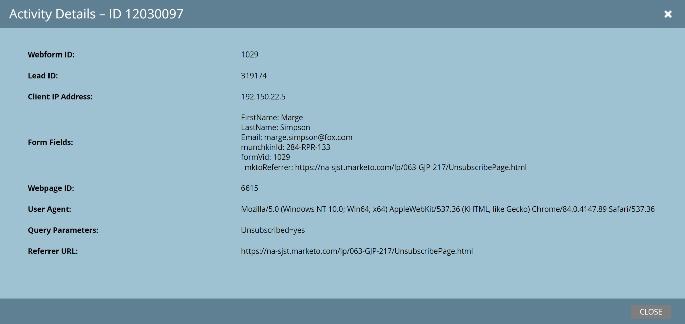

# Leads

[Leads-Endpunkt-Referenz](https://developer.adobe.com/marketo-apis/api/mapi/#tag/Leads)

Die API des Leads von Marketo bietet eine große Anzahl von Funktionen für einfache CRUD-Anwendungen gegen Lead-Datensätze sowie die Möglichkeit, die Zugehörigkeit eines Leads zu statischen Listen und Programmen zu ändern und die intelligente Kampagnenverarbeitung für Leads zu starten.

## beschreiben

Eine der Schlüsselfunktionen der Leads-API ist die Describe-Methode. Verwenden Sie Leads beschreiben , um eine vollständige Liste der Felder abzurufen, die sowohl über die REST-API als auch über Metadaten für die Interaktion verfügbar sind:

* Datentyp
* REST API-Namen
* Länge (falls anwendbar)
* Schreibgeschützt
* Freundliche Kennzeichnung

Describe ist die primäre Quelle der Wahrheit für die Frage, ob Felder zur Verwendung verfügbar sind und Metadaten über diese Felder.

### Anfrage

```
GET /rest/v1/leads/describe.json
```

### Antwort

```json
{
   "requestId":"37ca#1475b74e276",
   "success":true,
   "result":[
      {
         "id":2,
         "displayName":"Company Name",
         "dataType":"string",
         "length":255,
         "rest":{
            "name":"company",
            "readOnly":false
         },
         "soap":{
            "name":"Company",
            "readOnly":false
         }
      }
}
```

Normalerweise enthalten die Antworten eine viel größere Anzahl von Feldern im Ergebnis-Array, aber wir lassen sie zu Demonstrationszwecken aus. Jedes Element im Ergebnis-Array entspricht einem Feld, das im Lead-Datensatz verfügbar ist, und weist mindestens eine ID, einen displayName und einen Datentyp auf. Die untergeordneten REST- und SOAP-Objekte können für ein bestimmtes Feld vorhanden sein oder nicht, und ihr Vorhandensein gibt an, ob das Feld für die Verwendung in den REST- oder SOAP-APIs gültig ist. Die `readOnly`-Eigenschaft gibt an, ob das Feld über die entsprechende API (REST oder SOAP) schreibgeschützt ist. Die Eigenschaft „length“ gibt die maximale Länge des Felds an, falls vorhanden. Die dataType-Eigenschaft gibt den Datentyp des Felds an.

## Abfrage

Es gibt zwei primäre Methoden zum Abrufen von Leads: die Methoden Lead abrufen nach ID und Leads abrufen nach Filtertyp. Lead nach ID abrufen akzeptiert eine einzelne Lead-ID als Pfadparameter und gibt einen einzelnen Lead-Datensatz zurück.

Optional können Sie einen Feldparameter übergeben, der eine kommagetrennte Liste der zurückzugebenden Feldnamen enthält. Wenn der Feldparameter in dieser Anfrage nicht enthalten ist, werden die folgenden Standardfelder zurückgegeben: `email`, `updatedAt`, `createdAt`, `lastName`, `firstName` und `id`. Wenn beim Anfordern einer Liste von Feldern ein bestimmtes Feld angefordert, aber nicht zurückgegeben wird, ist der Wert impliziert null.

### Anfrage

```
GET /rest/v1/lead/{id}.json
```

### Antwort

```json
{
   "requestId": "10226#14d3049e51b",
   "success": true,
   "result": [
      {
         "id": 318581,
         "updatedAt":"2015-05-07T11:47:30-08:00"
         "lastName": "Doe",
         "email": "jdoe@marketo.com",
         "createdAt": "2015-05-01T16:47:30-08:00",
         "firstName": "John"
      }
   ]
}
```

Bei dieser Methode befindet sich immer ein einzelner Datensatz an der ersten Position des Ergebnis-Arrays.

Das Abrufen von Leads nach Filtertyp gibt den gleichen Datensatztyp zurück, kann jedoch bis zu 300 pro Seite zurückgeben. Dazu sind die Abfrageparameter `filterType` und `filterValues` erforderlich.

`filterType` akzeptiert ein benutzerdefiniertes Feld oder die meisten häufig verwendeten Felder. Rufen Sie den `Describe2`-Endpunkt auf, um eine umfassende Liste durchsuchbarer Felder zu erhalten, die für die Verwendung in `filterType` zulässig sind. Bei der Suche nach benutzerdefiniertem Feld werden nur die folgenden Datentypen unterstützt: `string`, `email`, `integer`. Felddetails (Beschreibung, Typ usw.) können Sie mit der oben genannten Describe-Methode abrufen.

`filterValues` akzeptiert bis zu 300 Werte im kommagetrennten Format. Der Aufruf sucht nach Datensätzen, bei denen das Feld des Leads mit einem der enthaltenen `filterValues` übereinstimmt. Wenn die Anzahl der Leads, die mit dem Lead-Filter übereinstimmen, größer als 1.000 ist, wird ein Fehler zurückgegeben: „1003, Zu viele Ergebnisse stimmen mit dem Filter überein“.

Wenn die Gesamtlänge Ihrer GET-Anfrage 8 KB überschreitet, wird ein HTTP-Fehler zurückgegeben: „414, URI zu lang“ (gemäß RFC 7231). Als Problemumgehung können Sie Ihre GET in POST ändern, den Parameter _method=GET hinzufügen und eine Abfragezeichenfolge im Anfragetext platzieren.

### Anfrage

```
GET /rest/v1/leads.json?filterType=id&filterValues=318581,318592
```

### Antwort

```json
{
    "requestId": "12951#15699db5c97",
    "result": [
        {
            "id": 318581,
            "updatedAt": "2016-05-17T22:11:45Z",
            "lastName": "Lincoln",
            "email": "abe@usa.gov",
            "createdAt": "2015-03-17T00:18:40Z",
            "firstName": "Abraham"
        },
        {
            "id": 318592,
            "updatedAt": "2016-05-17T22:20:51Z",
            "lastName": "Washington",
            "email": "george@usa.gov",
            "createdAt": "2015-04-06T16:29:21Z",
            "firstName": "George"
        }
    ],
    "success": true
}
```

Dieser Aufruf sucht nach Datensätzen, die den in `filterValues` enthaltenen IDs entsprechen, und gibt alle übereinstimmenden Datensätze zurück.

Wenn keine Datensätze gefunden werden, zeigt die Antwort Erfolg an, aber das Ergebnis-Array ist leer.

### Antwort

```json
{
"requestId": "177a1#1578b643357",
"result": [],
"success": true
}
```

Sowohl das Abrufen von Leads nach ID als auch das Abrufen von Leads nach Filtertyp akzeptiert auch einen Abfrageparameter für Felder, der eine kommagetrennte Liste von API-Feldern akzeptiert. Wenn dies enthalten ist, enthält jeder Datensatz in der Antwort diese aufgelisteten Felder.  Wenn er ausgelassen wird, wird ein Standardsatz von Feldern zurückgegeben: `id`, `email`, `updatedAt`, `createdAt`, `firstName` und `lastName`.

## ADOBE ECID

Wenn die Adobe Experience Cloud-Zielgruppenfreigabe-Funktion aktiviert ist, wird ein Cookie-Synchronisierungsvorgang ausgeführt, der die Adobe Experience Cloud-ID (ECID) mit Marketo-Leads verknüpft.  Die oben genannten Lead-Abrufmethoden können verwendet werden, um verknüpfte ECID-Werte abzurufen.  Geben Sie dazu im Feld-Parameter `ecids` an. Beispiel: `&fields=email,firstName,lastName,ecids`.

## Erstellen und aktualisieren

Zusätzlich zum Abrufen von Lead-Daten können Sie Lead-Datensätze über die API erstellen, aktualisieren und löschen. Das Erstellen und Aktualisieren von Leads hat denselben Endpunkt wie der in der Anfrage definierte Vorgangstyp. Es können bis zu 300 Datensätze gleichzeitig erstellt oder aktualisiert werden.

>[!NOTE]
>
> Die Aktualisierung von Unternehmensfeldern mit dem Endpunkt [Leads synchronisieren](https://developer.adobe.com/marketo-apis/api/mapi/#tag/Leads/operation/syncLeadUsingPOST) wird nicht unterstützt. Verwenden [ stattdessen den Endpunkt ](https://developer.adobe.com/marketo-apis/api/mapi/#tag/Companies/operation/syncCompaniesUsingPOST)Unternehmen synchronisieren“.

>[!NOTE]
>
> Beim Erstellen oder Aktualisieren des E-Mail-Werts in einem Personendatensatz werden nur ASCII-Zeichen im E-Mail-Adressfeld unterstützt.

### Anfrage

```
POST /rest/v1/leads.json
```

### Textkörper

```json
{
   "action":"createOnly",
   "lookupField":"email",
   "input":[
      {
         "email":"kjashaedd-1@klooblept.com",
         "firstName":"Kataldar-1",
         "postalCode":"04828"
      },
      {
         "email":"kjashaedd-2@klooblept.com",
         "firstName":"Kataldar-2",
         "postalCode":"04828"
      },
      {
         "email":"kjashaedd-3@klooblept.com",
         "firstName":"Kataldar-3",
         "postalCode":"04828"
      }
   ]
}
```

### Antwort

```json
{
   "requestId":"e42b#14272d07d78",
   "success":true,
   "result":[
      {
         "id":50,
         "status":"created"
      },
      {
         "id":51,
         "status":"created"
      },
      {
         "id":52,
         "status":"created"
      }
   ]
}
```

In dieser Anfrage werden zwei wichtige Felder angezeigt: `action` und `lookupField`.  `action` gibt den Vorgangstyp der Anfrage an und kann `createOrUpdate`, `createOnly`, `updateOnly` oder `createDuplicate` sein. Wenn sie ausgelassen wird, wird für die Aktion standardmäßig `createOrUpdate` festgelegt.  Der `lookupField` gibt den Schlüssel an, der verwendet werden soll, wenn die Aktion entweder `createOrUpdate` oder `updateOnly` ist. Wenn `lookupField` weggelassen wird, wird der Standardschlüssel `email`.

Standardmäßig wird die Standardpartition verwendet. Optional können Sie den `partitionName` angeben, der nur funktioniert, wenn die Aktion `createOnly` oder `createOrUpdate` ist. Damit `partitionName` als zusätzliches Deduplizierungskriterium funktioniert, muss es Teil des Quelltyps in benutzerdefinierten Deduplizierungsregeln sein. Wenn während eines Aktualisierungsvorgangs in der angegebenen Partition kein Lead vorhanden ist, wird ein Fehler zurückgegeben. Wenn der Benutzer „Nur API“ nicht berechtigt ist, auf die angegebene Partition zuzugreifen, wird ein Fehler zurückgegeben.

Das `id` Feld kann nur als Parameter bei Verwendung der `updateOnly`-Aktion einbezogen werden, da `id` ein vom System verwalteter eindeutiger Schlüssel ist.

Die Anfrage muss außerdem über einen `input` verfügen, bei dem es sich um ein Array von Lead-Datensätzen handelt. Jeder Lead-Datensatz ist ein JSON-Objekt mit einer beliebigen Anzahl von Lead-Feldern. Die in einem Datensatz enthaltenen Schlüssel sollten für diesen Datensatz eindeutig sein und alle JSON-Zeichenfolgen sollten UTF-8-kodiert sein. Das `externalCompanyId` Feld kann verwendet werden, um den Lead-Datensatz mit einem Firmendatensatz zu verknüpfen. Das `externalSalesPersonId` Feld kann verwendet werden, um den Lead-Datensatz mit einem Verkaufspersonendatensatz zu verknüpfen.

Hinweis: Bei der gleichzeitigen oder schnellen Ausführung von Lead-Upsert-Anfragen können bei mehreren Anfragen mit demselben Schlüsselwert doppelte Datensätze resultieren, wenn vor der ersten Rückgabe ein nachfolgender Aufruf mit demselben Wert erfolgt. Dies kann vermieden werden, indem Sie entweder die `createOnly` oder `updateOnly` verwenden oder indem Sie Aufrufe in die Warteschlange stellen und warten, bis Ihr Aufruf zurückgegeben wird, bevor nachfolgende Upsert-Aufrufe mit demselben Schlüssel durchgeführt werden.

## Felder

Das Lead-Objekt enthält Standardfelder und optional benutzerdefinierte Felder. Standardfelder sind in jedem Marketo Engage-Abonnement vorhanden, während benutzerdefinierte Felder vom Benutzer nach Bedarf erstellt werden. Jede Felddefinition besteht aus einem Satz von Attributen, die das Feld beschreiben. Beispiele für Attribute sind Anzeigename, API-Name und Datentyp. Diese Attribute werden zusammen als Metadaten bezeichnet.

Mit den folgenden Endpunkten können Sie Felder im Lead-Objekt abfragen, erstellen und aktualisieren. Diese APIs erfordern, dass der besitzende API-Benutzer über eine Rolle mit einer oder beiden der Berechtigungen „Schema-Standardfeld lesen/schreiben“ oder „Schema-benutzerdefiniertes Feld lesen/schreiben“ verfügt.

## Abfragefelder

Die Abfrage von Lead-Feldern ist unkompliziert. Sie können ein einzelnes Lead-Feld nach API-Namen abfragen oder den Satz aller Lead-Felder abfragen. Je nach den verwendeten Rollenberechtigungen können sowohl Standardfelder als auch benutzerdefinierte Felder abgerufen werden. Ausgeblendete Felder werden ebenfalls abgerufen.

## Nach Name

Der Endpunkt Lead-Feld nach Name abrufen ruft Metadaten für ein einzelnes Feld im Lead-Objekt ab. Der erforderliche fieldApiName-Pfadparameter gibt den API-Namen des Felds an. Die Antwort ähnelt dem Endpunkt „Lead beschreiben“, enthält jedoch zusätzliche Metadaten wie das Attribut isCustom, das angibt, ob es sich bei dem Feld um ein benutzerdefiniertes Feld handelt.

### Anfrage

```
GET /rest/v1/leads/schema/fields/{fieldApiName}.json
```

### Antwort

```json
{
    "requestId": "cd97#1793ee0fec4",
    "result": [
        {
            "displayName": "Email Address",
            "name": "email",
            "description": null,
            "dataType": "email",
            "length": 255,
            "isHidden": false,
            "isHtmlEncodingInEmail": true,
            "isSensitive": true,
            "isCustom": false
        }
    ],
    "success": true
}
```

## Durchsuchen

Der Endpunkt Lead-Felder abrufen ruft Metadaten für alle Felder im Lead-Objekt ab, einschließlich . Standardmäßig werden maximal 300 Datensätze zurückgegeben. Sie können den `batchSize` Abfrageparameter verwenden, um diese Zahl zu reduzieren. Wenn das Attribut `moreResult` wahr ist, bedeutet dies, dass mehr Ergebnisse verfügbar sind. Rufen Sie diesen Endpunkt so lange auf, bis das `moreResult`-Attribut „false“ zurückgibt. Dies bedeutet, dass keine Ergebnisse verfügbar sind. Die von dieser API zurückgegebene `nextPageToken` sollte immer für die nächste Iteration dieses Aufrufs wiederverwendet werden.

### Anfrage

```
GET /rest/v1/leads/schema/fields.json
```

### Antwort (gekürzt)

```json
{
    "requestId": "142c3#1793eb976d8",
    "result": [
        {
            "displayName": "Salutation",
            "name": "salutation",
            "description": null,
            "dataType": "string",
            "length": 255,
            "isHidden": false,
            "isHtmlEncodingInEmail": true,
            "isSensitive": true,
            "isCustom": false
        },
        {
            "displayName": "First Name",
            "name": "firstName",
            "description": null,
            "dataType": "string",
            "length": 255,
            "isHidden": false,
            "isHtmlEncodingInEmail": true,
            "isSensitive": true,
            "isCustom": false
        },
        {
            "displayName": "Middle Name",
            "name": "middleName",
            "description": null,
            "dataType": "string",
            "length": 255,
            "isHidden": false,
            "isHtmlEncodingInEmail": true,
            "isSensitive": true,
            "isCustom": false
        },
        {
            "displayName": "Last Name",
            "name": "lastName",
            "description": null,
            "dataType": "string",
            "length": 255,
            "isHidden": false,
            "isHtmlEncodingInEmail": true,
            "isSensitive": true,
            "isCustom": false
        },
        {
            "displayName": "Date of Birth",
            "name": "dateOfBirth",
            "description": null,
            "dataType": "date",
            "isHidden": false,
            "isHtmlEncodingInEmail": false,
            "isSensitive": true,
            "isCustom": false
        },
        {
            "displayName": "Email Address",
            "name": "email",
            "description": null,
            "dataType": "email",
            "length": 255,
            "isHidden": false,
            "isHtmlEncodingInEmail": true,
            "isSensitive": true,
            "isCustom": false
        },
        {
            "displayName": "Phone Number",
            "name": "phone",
            "description": null,
            "dataType": "phone",
            "length": 255,
            "isHidden": false,
            "isHtmlEncodingInEmail": true,
            "isSensitive": true,
            "isCustom": false
        },
        {
            "displayName": "Mobile Phone Number",
            "name": "mobilePhone",
            "description": null,
            "dataType": "phone",
            "length": 255,
            "isHidden": false,
            "isHtmlEncodingInEmail": true,
            "isSensitive": true,
            "isCustom": false
        },
        {
            "displayName": "Fax Number",
            "name": "fax",
            "description": null,
            "dataType": "phone",
            "length": 255,
            "isHidden": false,
            "isHtmlEncodingInEmail": true,
            "isSensitive": true,
            "isCustom": false
        },
        {
            "displayName": "Job Title",
            "name": "title",
            "description": null,
            "dataType": "string",
            "length": 255,
            "isHidden": false,
            "isHtmlEncodingInEmail": true,
            "isSensitive": true,
            "isCustom": false
        },
        {
            "displayName": "Unsubscribed",
            "name": "unsubscribed",
            "description": null,
            "dataType": "boolean",
            "isHidden": false,
            "isHtmlEncodingInEmail": false,
            "isSensitive": true,
            "isCustom": false
        },
        ...
    ],
    "success": true,
    "moreResult": false
}
```

## Erstellen von Feldern

Der Endpunkt Lead-Felder erstellen erstellt ein oder mehrere benutzerdefinierte Felder im Lead-Objekt. Dieser Endpunkt bietet Funktionen, die mit denen vergleichbar sind, die in der Marketo Engage-Benutzeroberfläche verfügbar sind. Sie können mit diesem Endpunkt maximal 100 benutzerdefinierte Felder erstellen.
Achten Sie sorgfältig auf jedes Feld, das Sie in Ihrer Produktionsinstanz von Marketo Engage mithilfe der -API erstellen.  Nachdem ein Feld erstellt wurde, können Sie es nicht mehr löschen (Sie können es nur ausblenden). Die Zunahme von nicht verwendeten Feldern ist eine schlechte Praxis, die Ihre Instanz überladen wird.

Der erforderliche Eingabeparameter ist ein Array von Lead-Feld-Objekten. Jedes Objekt enthält ein oder mehrere Attribute. Erforderliche Attribute sind die `displayName`, `name` und `dataType`, die dem Anzeigenamen der Benutzeroberfläche des Felds, dem API-Namen des Felds bzw. dem Feldtyp entsprechen.  Optional können Sie `description`, `isHidden`, `isHtmlEncodingInEmail` und `isSensitive` angeben.

Es gibt einige Regeln für die Benennung von Namen und `displayName`. Das Namensattribut muss eindeutig sein, mit einem Buchstaben beginnen und darf nur Buchstaben, Zahlen oder Unterstriche enthalten. Die `displayName` muss eindeutig sein und darf keine Sonderzeichen enthalten.  Eine gängige Namenskonvention besteht darin, Binnenmajuskeln auf `displayName` anzuwenden, um einen Namen zu erstellen. Ein `displayName` von „Mein benutzerdefiniertes Feld“ würde beispielsweise den Namen „myCustomField“ erzeugen.

### Anfrage

```
POST /rest/v1/leads/schema/fields.json
```

### Textkörper

```json
{
  "input": [
      {
        "displayName": "Acme Access Code",
        "name": "acmeAccessCode",
        "description": "Acme Direct Mail Integration",
        "dataType": "string"
      },
      {
        "displayName": "Acme Mail Date",
        "name": "acmeMailDate",
        "description": "Acme Direct Mail Integration",
        "dataType": "string"
      }
  ]
}
```

### Antwort

```json
{
    "requestId": "d9f1#17943666811",
    "result": [
        {
            "name": "acmeAccessCode",
            "status": "created"
        },
        {
            "name": "acmeMailDate",
            "status": "created"
        }
    ],
    "success": true
}
```

## Feld aktualisieren

Der Endpunkt Lead-Feld aktualisieren aktualisiert ein einzelnes benutzerdefiniertes Feld im Lead-Objekt. Im Großen und Ganzen sind Feldaktualisierungsvorgänge, die mit der Marketo Engage-Benutzeroberfläche durchgeführt werden, mit der -API erreichbar. In der folgenden Tabelle sind einige Unterschiede zusammengefasst.

<table>
<tbody>
<tr>
<td style="width: 26.5306%;" rowspan="2"><strong>Attribut</strong></td>
<td style="width: 35%;" colspan="2"><strong>Standardfeld</strong></td>
<td style="width: 38.2654%;" colspan="2"><strong>Benutzerdefiniertes Feld</strong></td>
</tr>
<tr>
<td style="width: 17.449%;"><strong>Von API aktualisierbar?</strong></td>
<td style="width: 17.551%;"><strong>Von der Benutzeroberfläche aktualisierbar?</strong></td>
<td style="width: 19.3878%;"><strong>Von API aktualisierbar?</strong></td>
<td style="width: 18.8776%;"><strong>Von der Benutzeroberfläche aktualisierbar?</strong></td>
</tr>
<tr>
<td style="width: 26.5306%;">dataType</td>
<td style="width: 17.449%;">nein</td>
<td style="width: 17.551%;">nein</td>
<td style="width: 19.3878%;">nein</td>
<td style="width: 18.8776%;">ja</td>
</tr>
<tr>
<td style="width: 26.5306%;">Beschreibung</td>
<td style="width: 17.449%;">ja</td>
<td style="width: 17.551%;">ja</td>
<td style="width: 19.3878%;">ja</td>
<td style="width: 18.8776%;">ja</td>
</tr>
<tr>
<td style="width: 26.5306%;">displayName</td>
<td style="width: 17.449%;">nein</td>
<td style="width: 17.551%;">nein</td>
<td style="width: 19.3878%;">ja</td>
<td style="width: 18.8776%;">ja</td>
</tr>
<tr>
<td style="width: 26.5306%;">isCustom</td>
<td style="width: 17.449%;">nein</td>
<td style="width: 17.551%;">nein</td>
<td style="width: 19.3878%;">nein</td>
<td style="width: 18.8776%;">nein</td>
</tr>
<tr>
<td style="width: 26.5306%;">isHidden</td>
<td style="width: 17.449%;">nein</td>
<td style="width: 17.551%;">ja</td>
<td style="width: 19.3878%;">Ja (wenn von API erstellt)</td>
<td style="width: 18.8776%;">ja</td>
</tr>
<tr>
<td style="width: 26.5306%;">isHtmlEncodingInEmail</td>
<td style="width: 17.449%;">ja</td>
<td style="width: 17.551%;">ja</td>
<td style="width: 19.3878%;">ja</td>
<td style="width: 18.8776%;">ja</td>
</tr>
<tr>
<td style="width: 26.5306%;">isSensitive</td>
<td style="width: 17.449%;">ja</td>
<td style="width: 17.551%;">ja</td>
<td style="width: 19.3878%;">ja</td>
<td style="width: 18.8776%;">ja</td>
</tr>
<tr>
<td style="width: 26.5306%;">length</td>
<td style="width: 17.449%;">nein</td>
<td style="width: 17.551%;">nein</td>
<td style="width: 19.3878%;">nein</td>
<td style="width: 18.8776%;">nein</td>
</tr>
<tr>
<td style="width: 26.5306%;">name</td>
<td style="width: 17.449%;">nein</td>
<td style="width: 17.551%;">nein</td>
<td style="width: 19.3878%;">nein</td>
<td style="width: 18.8776%;">nein</td>
</tr>
</tbody>
</table>

Der erforderliche `fieldApiName` gibt den API-Namen des zu aktualisierenden Felds an. Der erforderliche Eingabeparameter ist ein -Array, das ein einzelnes Lead-Feld-Objekt enthält.  Das Feldobjekt enthält ein oder mehrere Attribute.

### Anfrage

```
POST /rest/v1/leads/schema/fields/{fieldApiName}.json
```

### Textkörper

```json
{
  "input": [
      {
        "displayName": "Acme Access Code",
        "description": "Acme Direct Mail Integration",
        "isHtmlEncodingInEmail": true
      }
  ]
}
```

### Antwort

```json
{
    "requestId": "9f57#1794324f44c",
    "result": [
        {
            "name": "acmeAccessCode",
            "status": "updated"
        }
    ],
    "success": true
}
```

## Lead zu Marketo pushen

Lead per Push übertragen ist eine Alternative zur Synchronisierung von Leads mit Marketo. In erster Linie wurde sie so konzipiert, dass sie ein höheres Maß an Trigger-Fähigkeit bieten als die standardmäßigen Synchronisierungs-Leads (ähnlich in der Verwendung eines Marketo-Formulars). Zusätzlich zur Synchronisierung von Lead-Feldern ermöglicht dieser Endpunkt die Lead-Zuordnung basierend auf Cookie-Werten, die an den Endpunkt übergeben werden. Dazu können Sie den generierten `mkt_tok`-Wert übergeben, indem Sie durch Klicken auf eine Marketo-E-Mail klicken, oder einen Programmnamen im Aufruf übergeben. Dieser Endpunkt erstellt außerdem eine einzelne auslösbare Aktivität, die mit einem Programm und/oder einer Kampagne in Marketo verknüpft ist. Dies ermöglicht das Auslösen von Lead-Erfassungsereignissen, die einer bestimmten Kampagne oder einem bestimmten Programm zugeordnet sind, um zugehörige Workflows von Marketo aus zu starten.

Die Benutzeroberfläche für Push-Leads ist der für Synchronisierungs-Leads sehr ähnlich. Dieselben Primärschlüssel sind gültig und dieselben API-Namen werden für Felder verwendet (es gibt keinen Aktionsparameter, da dies immer ein upsert-Vorgang ist). Die `programName`- und Eingabeparameter sind erforderlich, die `lookupField`-, `source`- und `reason` sind optional. Der Eingabeparameter ist ein Array von Lead-Objekten. Die resultierende Aktivität wird dem entsprechenden benannten Programm zugeordnet. Die Parameter `source` und `reason` sind beliebige Zeichenfolgenfelder, die der Anfrage hinzugefügt werden können, um diese Werte in die resultierenden Aktivitäten einzubetten. Diese können als Einschränkungen in den entsprechenden Triggern (Lead wird an Marketo gesendet) und Filtern (Lead wurde an Marketo gesendet) verwendet werden.

Hinweis zu anonymen Aktivitäten. Wenn Sie frühere anonyme Aktivitäten mit dem neu erstellten Lead verknüpfen möchten, legen Sie im Lead-Objekt kein Cookie-Attribut fest und rufen Sie „Lead verknüpfen“ nach dem Push-Lead auf. Wenn Sie einen neuen Lead ohne Aktivitätsverlauf erstellen möchten, geben Sie einfach das Cookie-Attribut im Lead-Objekt an.

### Anfrage

```
POST /rest/v1/leads/push.json
```

### Textkörper

```json
{
    "programName": "Big Blue Thing Product Launch",
    "source": "Cool Sales Site",
    "reason": "Downloaded pricing sheet",
    "lookupField": "email",
    "input": [
        {
             "email": "Theresa.May@westminister.gov.uk",
             "country": "united kingdom",
             "firstName": "Theresa",
             "website": "www.brexit.com",
             "leadScore": 45,
             "marketoSocialFacebookProfileURL": "http://www.facebook.com/id/23434456",
             "jobTitle": "Prime Minister"
         },
         {
             "email": "Justin.Trudeau@ottowa.gov.ca",
             "country": "canada",
             "firstName": "Justin",
             "website": "www.take-off-eh.com",
             "leadScore": 92,
             "marketoSocialFacebookProfileURL": "http://www.facebook.com/id/42434",
             "jobTitle": "Sonny"
         }
     ]
}
```

### Antwort

```json
{
    "requestId": "939079529805",
    "success": true,
    "warnings": [],
    "result": [
       {
           "id": 483894,
           "status": "created"
       },
       {
           "id": 1087425,
           "status": "updated"
       },
       {
           "id": 3525,
           "reasons": [
                    {
                        "code": "501",
                        "message": "Bad stuff happened"
                    }
           ]
       }
    ]
}
```

Um den `mkt_tok` zu übergeben, weisen Sie dem mktToken-Element innerhalb eines Lead-Datensatzes im Eingabeparameter den Wert wie folgt zu.

### Textkörper

```json
{
  "programName": "Big Blue Thing Product Launch",
  "source": "Cool Sales Site",
  "reason": "Downloaded pricing sheet",
  "lookupField": "mktToken",
  "input" : [
     {
       "mktToken" : "<tokenValue>",
       "firstName" : "Thelma"
     },
     {
       "mktToken" : "<tokenValue>",
       "firstName" : "Louise"
     }
   ]
}
```

## Formular senden

Übermittlungsformular ist eine Alternative zur Synchronisierung von Leads mit Marketo und bietet die gleiche Funktionalität wie die Übermittlung von Marketo-Formularen. Dies ermöglicht das Auslösen von Lead-Erfassungsereignissen, die einer bestimmten Kampagne oder einem bestimmten Programm zugeordnet sind, um zugehörige Workflows von Marketo aus zu starten.

Der Endpunkt „Formular senden“ unterstützt die folgenden Funktionen:

* Setzt einen Lead-Datensatz mithilfe des E-Mail-Felds als Primärschlüssel hoch
* Erstellt die Aktivität „Formular ausfüllen“, die mit einem Programm und/oder einer Kampagne verknüpft ist.
* Ermöglicht die Lead-Zuordnung basierend auf dem Cookie-Wert
* Formularfeldüberprüfung durchführen

Das Senden eines Formulars folgt dem standardmäßigen Lead-Datenbankmuster. Ein einzelner Objektdatensatz wird im erforderlichen Eingabeelement des JSON-Hauptteils einer POST-Anfrage übergeben. Das erforderliche `formId` enthält die Marketo-Zielformular-ID.

Mit der optionalen `programId` können Sie das Programm angeben, dem der Lead hinzugefügt werden soll, und/oder das Programm angeben, dem benutzerdefinierte Felder für Programmteilnehmer hinzugefügt werden sollen. Wenn `programId` angegeben ist, wird der Lead zum Programm hinzugefügt und alle im Formular vorhandenen Felder für Programmmitglieder werden ebenfalls hinzugefügt. Beachten Sie, dass sich das angegebene Programm im selben Arbeitsbereich wie das Formular befinden muss. Wenn das Formular keine benutzerdefinierten Felder für Programmmitglieder enthält und keine `programId` angegeben sind, wird der Lead nicht zu einem Programm hinzugefügt. Wenn sich das Formular in einem Programm befindet und `programId` nicht angegeben wird, wird dieses Programm verwendet, wenn ein oder mehrere benutzerdefinierte Felder für Programmmitglieder im Formular vorhanden sind.

Innerhalb des Eingabedatensatzes ist das `leadFormFields` erforderlich. Dieses Objekt enthält ein oder mehrere Name/Wert-Paare, die den auszufüllenden Formularfeldern entsprechen.  Alle angegebenen Felder müssen innerhalb des angegebenen Formulars definiert werden. Der Name ist der REST-API-Name für das Feld . Beachten Sie, dass das Feld `email` erforderlich ist.

Das `visitorData`-Elementobjekt ist optional und enthält Name/Wert-Paare, die den Seitenbesuchsdaten entsprechen, einschließlich `pageURL`, `queryString`, `leadClientIpAddress` und `userAgentString`. Kann verwendet werden, um zusätzliche Aktivitätsfelder zum Filtern und Auslösen von Ereignissen auszufüllen.

Die Zeichenfolge des Cookie-Members ist optional und ermöglicht es Ihnen, ein Munchkin-Cookie mit einem Personendatensatz in Marketo zu verknüpfen. Wenn ein neuer Lead erstellt wird, werden alle vorherigen anonymen Aktivitäten mit diesem Lead verknüpft, es sei denn, der Cookie-Wert wurde zuvor mit einem anderen bekannten Datensatz verknüpft. Wenn der Cookie-Wert zuvor zugeordnet wurde, werden neue Aktivitäten anhand des Datensatzes verfolgt, alte Aktivitäten werden jedoch nicht aus dem vorhandenen bekannten Datensatz entfernt. Um einen neuen Lead ohne Aktivitätsverlauf zu erstellen, lassen Sie einfach das Cookie-Mitglied weg.

Neue Leads werden in der primären Partition für den Arbeitsbereich erstellt, in dem sich das Formular befindet.

### Anfrage

```
POST /rest/v1/leads/submitForm.json
```

### Header

```
Content-Type: application/json
```

### Textkörper

```json
{
  "formId": 1029,
  "input": [
    {
      "leadFormFields": {
        "firstName": "Marge",
        "lastName": "Simpson",
        "email": "marge.simpson@fox.com",
        "pMCFField": "PMCF value"
      },
      "visitorData": {
        "pageURL": "https://na-sjst.marketo.com/lp/063-GJP-217/UnsubscribePage.html",
        "queryString": "Unsubscribed=yes",
        "leadClientIpAddress": "192.150.22.5",
        "userAgentString": "Mozilla/5.0 (Windows NT 10.0; Win64; x64) AppleWebKit/537.36 (KHTML, like Gecko) Chrome/84.0.4147.89 Safari/537.36"
      },
      "cookie": "id:063-GJP-217&token:_mch-marketo.com-1594662481190-60776"
    }
  ]
}
```

### Antwort

```json
{
  "requestId": "10667#173bc585ca5",
  "result": [
    {
      "id": 319174,
      "status": "updated"
    }
  ],
  "success": true
}
```

Hier können Sie die entsprechenden Aktivitätsdetails zum Ausfüllen des Formulars von der Marketo Engage-Benutzeroberfläche aus sehen:



## Zusammenführen

Manchmal ist es erforderlich, doppelte Datensätze zusammenzuführen, und Marketo erleichtert dies über die Zusammenführungs-Leads-API. Beim Zusammenführen von Leads werden Aktivitätsprotokolle, Programm-, Kampagnen- und Listenmitgliedschaften sowie CRM-Informationen kombiniert und alle zugehörigen Feldwerte zu einem einzigen Datensatz zusammengeführt. Beim Zusammenführen von Leads wird eine Lead-ID als Pfadparameter und entweder eine einzelne `leadId` als Abfrageparameter oder eine Liste mit kommagetrennten IDs im `leadIds` Parameter verwendet.

### Anfrage

```
POST /rest/v1/leads/{id}/merge.json?leadId=1324
```

### Antwort

```json
{
   "requestId":"e42b#14272d07d78",
   "success":true
}
```

Der im Pfadparameter angegebene Lead ist der erfolgreichste Lead. Wenn also Felder im Konflikt zwischen den zusammengeführten Datensätzen stehen, wird der Wert des Gewinners übernommen, es sei denn, das Feld im erfolgreichsten Datensatz ist leer, das entsprechende Feld im verlorenen Datensatz nicht. Bei den Leads, die im Parameter `leadId` oder `leadIds` angegeben sind, handelt es sich um die verlorenen Leads.

Wenn Sie über ein Abonnement mit aktivierter SFDC-Synchronisierung verfügen, können Sie in Ihrer Anfrage auch den `mergeInCRM`-Parameter verwenden. Wenn dies auf „true“ gesetzt ist, wird auch die entsprechende Zusammenführung in Ihrem CRM durchgeführt. Wenn sich beide Leads in SFDC befinden und einer ein CRM-Lead und der andere ein CRM-Kontakt ist, dann ist der Gewinner der CRM-Kontakt (unabhängig davon, welcher Lead als Gewinner angegeben wird). Wenn sich einer der Leads in SFDC und der andere nur in Marketo befindet, ist der Gewinner der SFDC-Lead (unabhängig davon, welcher Lead als Gewinner angegeben wird).

## Web-Aktivität verknüpfen

Über Lead-Tracking (Munchkin) zeichnet Marketo Web-Aktivitäten für Besucher Ihrer Website und Ihrer Marketo-Landingpages auf. Diese Aktivitäten, Besuche und Klicks, werden mit einem Schlüssel aufgezeichnet, der einem „_mkto_trk“-Cookie entspricht, das im Browser des Leads gesetzt wird, und Marketo verwendet diesen Schlüssel, um die Aktivitäten derselben Person zu verfolgen. Normalerweise erfolgt die Zuordnung zu Lead-Datensätzen, wenn ein Lead von einer Marketo-E-Mail durch klickt oder ein Marketo-Formular ausfüllt. Manchmal kann eine Verknüpfung jedoch durch einen anderen Ereignistyp ausgelöst werden, und Sie können dazu den Endpunkt „Lead zuordnen“ verwenden. Der Endpunkt nimmt die ID des bekannten Lead-Datensatzes als Pfadparameter und den Cookie-Wert „_mkto_trk“ im Cookie-Abfrageparameter.

### Anfrage

```
POST /rest/v1/leads/{id}/associate.json?cookie=id:287-GTJ-838%26token:_mch-marketo.com-1396310362214-46169
```

### Antwort

```json
{
   "requestId":"e42b#14272d07d78",
   "success":true
}
```

Wenn ein Cookie bereits mit einem bekannten Lead-Datensatz verknüpft ist, bewirkt die Verwendung dieser API in einem anderen Lead-Datensatz, dass eine neue Web-Aktivität für diesen Datensatz aufgezeichnet wird. Vorhandene Web-Aktivitäten werden jedoch nicht in den neuen Datensatz verschoben.
Mitgliedschaft

Lead-Datensätze können auch basierend auf der Mitgliedschaft in einer statischen Liste oder einem Programm abgerufen werden. Darüber hinaus können Sie alle statischen Listen, Programme oder Smart-Kampagnen abrufen, bei denen ein Lead Mitglied ist.

Die Antwortstruktur und die optionalen Parameter sind mit denen von Leads abrufen nach Filtertyp identisch, obwohl filterType und filterValues mit dieser API nicht verwendet werden können.
Um über die Marketo-Benutzeroberfläche auf die Listen-ID zuzugreifen, navigieren Sie zur Liste. Die Liste `id` befindet sich in der URL der statischen Liste, `https://app-****.marketo.com/#ST1001A1`. In diesem Beispiel ist 1001 der `id` für die Liste.

### Anfrage

```
GET /rest/v1/list/{listId}/leads.json?batchSize=3
```

### Antwort

```json
{
   "requestId":"e42b#14272d07d78",
   "success":true,
   "nextPageToken":
"PS5VL5WD4UOWGOUCJR6VY7JQO2KUXL7BGBYXL4XH4BYZVPYSFBAONP4V4KQKN4SSBS55U4LEMAKE6===",
    "result":[
       {
            "id":50,
            "email":"kjashaedd@klooblept.com",
            "firstName":"Kataldar",
             "postalCode":"04828"
       },
       {
           "id":2343,
           "email":"kjashaedd@klooblept.com",
           "firstName":"Kataldar",
           "postalCode":"04828"
       },
      {
           "id":88498,
           "email":"kjashaedd@klooblept.com",
           "firstName":"Kataldar",
         "postalCode":"04828"
         }
    ]
}
```

Der Endpunkt Listen nach Lead-ID abrufen nimmt einen Lead-Datensatz `id` Pfadparameter und gibt alle statischen Listendatensätze zurück, denen der Lead angehört.

### Anfrage

```
GET /rest/v1/leads/{id}/listMembership.json?batchSize=3
```

### Antwort

```json
{
    "requestId": "1184b#1706f0ec23f",
    "result": [
        {
            "listId": 3379,
            "createdAt": "2016-05-17T19:32:44Z",
            "updatedAt": "2016-05-17T19:32:44Z"
        },
        {
            "listId": 2792,
            "createdAt": "2009-05-19T18:29:15Z",
            "updatedAt": "2009-05-19T18:29:15Z"
        },
        {
            "listId": 42,
            "createdAt": "2009-04-22T19:24:22Z",
            "updatedAt": "2009-04-22T19:24:22Z"
        }
    ],
    "success": true,
    "nextPageToken": "BFRV7OMVSNJWDVKVTUFS3XHT4E======",
    "moreResult": true
}
```

## Programme

Die Programmmitgliedschaft kann auf ähnliche Weise wie Listen abgerufen werden. Die gleichen optionalen Anfrageparameter sind beim Aufruf des Endpunkts Leads nach Programm-ID abrufen und den `programId` übergeben verfügbar.

Optional können Sie einen Feldparameter übergeben, der eine kommagetrennte Liste der zurückzugebenden Feldnamen enthält. Wenn der Feldparameter in dieser Anfrage nicht enthalten ist, werden die folgenden Standardfelder zurückgegeben: `email`, `updatedAt`, `createdAt`, `lastName`, `firstName`, `membership` und `id`. Wenn beim Anfordern einer Liste von Feldern ein bestimmtes Feld angefordert, aber nicht zurückgegeben wird, ist der Wert impliziert null.

Die Antwortstruktur ist sehr ähnlich, da jedes Element im Ergebnis-Array ein Lead ist, mit dem Unterschied, dass jeder Datensatz auch ein untergeordnetes Objekt namens „Mitgliedschaft“ aufweist. Dieses Mitgliedschaftsobjekt enthält Daten über die Beziehung des Leads zu dem im Aufruf angegebenen Programm und zeigt immer dessen `progressionStatus`, `acquiredBy`, `reachedSuccess` und `membershipDate` an. Wenn das übergeordnete Programm auch ein Interaktionsprogramm ist, verfügt die Mitgliedschaft über Mitglieder `stream`, `nurtureCadence` und `isExhausted`, die ihre Position und Aktivität im Interaktionsprogramm angeben.

### Anfrage

```
GET /rest/v1/leads/programs/{programId}.json?batchSize=3
```

### Antwort

```json
{
    "requestId": "13ad4#1727b748a17",
    "result": [
        {
            "id": 319141,
            "firstName": "Meera",
            "lastName": "Reed",
            "email": "mree@housestark.com",
            "updatedAt": "2020-04-21T16:27:14Z",
            "createdAt": "2020-04-21T16:27:14Z",
            "membership": {
                "id": 1127,
                "progressionStatus": "Visited",
                "progressionStatusType": "Visited",
                "isExhausted": false,
                "acquiredBy": true,
                "reachedSuccess": false,
                "membershipDate": "2020-04-21T16:27:16Z",
                "updatedAt": "2020-04-21T16:27:16Z"
            }
        },
        {
            "id": 319142,
            "firstName": "Jon",
            "lastName": "Umber",
            "email": "jumb@housestark.com",
            "updatedAt": "2020-04-21T16:27:14Z",
            "createdAt": "2020-04-21T16:27:14Z",
            "membership": {
                "id": 1127,
                "progressionStatus": "Visited",
                "progressionStatusType": "Visited",
                "isExhausted": false,
                "acquiredBy": true,
                "reachedSuccess": false,
                "membershipDate": "2020-04-21T16:27:16Z",
                "updatedAt": "2020-04-21T16:27:16Z"
            }
        },
        {
            "id": 319143,
            "firstName": "Lyanna",
            "lastName": "Mormont",
            "email": "lmor@housestark.com",
            "updatedAt": "2020-04-21T16:27:14Z",
            "createdAt": "2020-04-21T16:27:14Z",
            "membership": {
                "id": 1127,
                "progressionStatus": "Visited",
                "progressionStatusType": "Visited",
                "isExhausted": false,
                "acquiredBy": true,
                "reachedSuccess": false,
                "membershipDate": "2020-04-21T16:27:16Z",
                "updatedAt": "2020-04-21T16:27:16Z"
            }
        }
    ],
    "success": true,
    "nextPageToken": "SW3PTMBVFCNHSHJGZ7LQH3ZWNUOHKADJZ3MOQ2LOZZVNO3WEIUPDKPRTTHBSMW756KOCWURTOF2XS==="
}
```

Der Endpunkt „Programme nach Lead-ID abrufen“ nimmt den Pfadparameter für die Lead-Datensatz-ID und gibt alle Programmdatensätze zurück, denen der Lead angehört. Mit den optionalen `filterType`- und `filterValues` können Sie nach Programm-ID filtern.

### Anfrage

```
GET /rest/v1/leads/{id}/programMembership.json
```

### Antwort

```json
{
    "requestId": "12e84#1706f13a379",
    "result": [
        {
            "id": 1044,
            "progressionStatus": "Sent",
            "isExhausted": false,
            "acquiredBy": false,
            "reachedSuccess": false,
            "membershipDate": "2016-05-27T19:50:29Z",
            "updatedAt": "2016-05-27T19:50:29Z"
        }
    ],
    "success": true,
    "moreResult": false
}
```

## Intelligente Kampagnen

Der Endpunkt Smart-Kampagnen nach Lead-ID abrufen nimmt den Pfadparameter ID des Lead-Datensatzes und gibt alle Smart-Kampagnendatensätze zurück, denen der Lead angehört.

### Anfrage

```
GET /rest/v1/leads/{id}/smartCampaignMembership.json?batchSize=3
```

### Antwort

```json
{
    "requestId": "e7b0#1706f163632",
    "result": [
        {
            "smartCampaignId": 3746,
            "createdAt": "2018-06-01T18:00:04Z",
            "updatedAt": "2018-06-01T18:00:06Z"
        },
        {
            "smartCampaignId": 3678,
            "createdAt": "2015-04-06T18:37:30Z",
            "updatedAt": "2015-04-06T18:37:41Z"
        },
        {
            "smartCampaignId": 3680,
            "createdAt": "2015-04-06T18:37:30Z",
            "updatedAt": "2015-04-06T18:37:40Z"
        }
    ],
    "success": true,
    "nextPageToken": "TNGAH3NKDUFDHNXUVGTNBXJCQM======",
    "moreResult": true
}
```

## Löschen

Das Entfernen von Leads ist mit dem Endpunkt Leads löschen einfach.  Geben Sie mithilfe der ID-Attribute im Hauptteil zu löschende Lead-IDs an.  Die maximale Anzahl beträgt 300 Leads pro Anfrage.  Verwenden Sie den Inhaltstyp: application/json-Header.

### Anfrage

```
POST /rest/v1/leads/delete.json
```

### Textkörper

```json
{
   "input":[
      {
         "id": 235
      },
      {
         "id":766
      }
   ]
}
```

### Antwort

```json
{
  "requestId":"3608#16664333670",
  "result":[
    {
      "id":235,
      "status":"deleted"
    },
    {
      "id":766,
      "status":"deleted"
    }
  ],
  "success":true
}
```

## Beziehungen

* Firmen über externes Firmen-ID-Feld im Lead-Datensatz
* SalesPersons über externes Feld SalesPersonId im Lead-Datensatz
* Programme durch Programmmitgliedschaft
* Listen über Listenmitgliedschaft
* Aktivitäten über das Feld leadId in der Aktivität
* Segmentierung durch einzelne Segmentfelder im Lead-Datensatz
* Partitionen durch leadPartitionId im Lead-Datensatz

## Zeitüberschreitungen

Leads-Endpunkte haben eine Zeitüberschreitung von 30 Sekunden, sofern unten nicht anders angegeben:

* Leads synchronisieren: 90er
* Associate Lead: 60er
* Zusammenführen von Leads: 180er
* Lead-Partition aktualisieren: 60s
* Lead auf Marketo pushen: 90er
* Leads nach Filtertyp abrufen: 60s
* Leads abrufen nach Listen-ID: 60 Jahre
