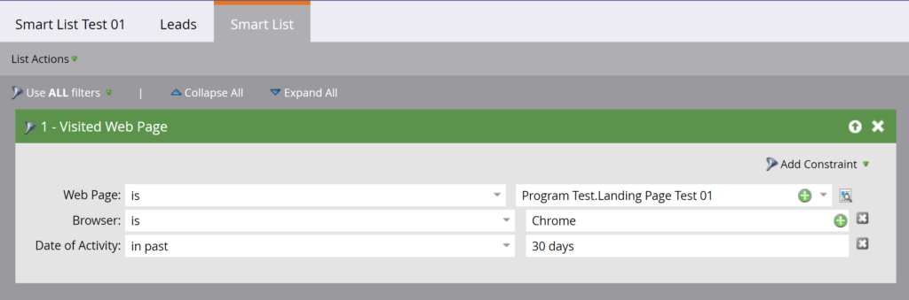

# Intelligente Listen

[Endpunkt-Referenz für Smart Lists](https://developer.adobe.com/marketo-apis/api/asset#tag/Smart-Lists)

Verwenden Sie die REST-APIs für Smart Lists, um Smart Lists abzufragen, zu klonen und zu löschen.

Diese APIs unterstützen nur vom Benutzer erstellte Smart-Listen. Sie unterstützen keine [integrierten oder System-Smart-Listen](https://experienceleague.adobe.com/de/docs/marketo/using/product-docs/core-marketo-concepts/smart-lists-and-static-lists/using-smart-lists/use-built-in-system-smart-lists).

## Abfrage

Abfragen von Smart[Listen &#x200B;](https://developer.adobe.com/marketo-apis/api/asset#tag/Smart-Lists/operation/getSmartListByIdUsingGET)nach ID[&#x200B; (nach &#x200B;](https://developer.adobe.com/marketo-apis/api/asset#tag/Smart-Lists/operation/getSmartListByNameUsingGET)) oder nach [Browsen](https://developer.adobe.com/marketo-apis/api/asset#tag/Smart-Lists/operation/getSmartListsUsingGET).

### Nach ID

[Abfrage nach ID](https://developer.adobe.com/marketo-apis/api/asset#tag/Smart-Lists/operation/getSmartListByIdUsingGET) verwendet einen Smart-Listen-`id`-Pfadparameter und gibt den entsprechenden Datensatz zurück. Legen Sie den optionalen booleschen Parameter `includeRules` fest, um Regeln für Smart-Listen einzuschließen.



```http
GET /rest/asset/v1/smartList/{id}.json?includeRules=true
```

```json
{
    "success": true,
    "errors": [],
    "requestId": "6efc#16c8967a21f",
    "warnings": [],
    "result": [
        {
            "id": 4363,
            "name": "Smart List Test 01",
            "createdAt": "2019-06-03T23:01:13Z+0000",
            "updatedAt": "2019-06-04T17:37:45Z+0000",
            "url": "https://app-sjqe.marketo.com/#SL4363A1LA1",
            "folder": {
                "id": 1041,
                "type": "Program"
            },
            "workspace": "Default",
            "rules": {
                "filterMatchType": "all",
                "triggers": [],
                "filters": [
                    {
                        "id": 459,
                        "name": "Visited Web Page",
                        "ruleTypeId": 1,
                        "ruleType": "Activity",
                        "operator": "occurs",
                        "conditions": [
                            {
                                "activityAttributeId": 1,
                                "activityAttributeName": "Web Page",
                                "operator": "is",
                                "values": [
                                    "Program Test.Landing Page Test 01"
                                ],
                                "isPrimary": true
                            },
                            {
                                "activityAttributeId": 6,
                                "activityAttributeName": "Browser",
                                "operator": "is",
                                "values": [
                                    "Chrome"
                                ],
                                "isPrimary": false
                            },
                            {
                                "activityAttributeId": -101,
                                "activityAttributeName": "Date of Activity",
                                "operator": "in past",
                                "values": [
                                    "30 days"
                                ],
                                "isPrimary": false
                            }
                        ]
                    }
                ]
            }
        }
    ]
}
```

### Nach Smart-Kampagnen-ID

[Abfrage nach intelligenter Kampagnen-ID](https://developer.adobe.com/marketo-apis/api/asset#tag/Smart-Campaigns/operation/getSmartListBySmartCampaignIdUsingGET) verwendet einen Smart-Campaign-`id`-Pfadparameter und gibt dessen Smart-Listen-Datensatz zurück. Legen Sie den optionalen booleschen Parameter `includeRules` fest, um Regeln für Smart-Listen einzuschließen.

```http
GET /rest/asset/v1/smartCampaign/{smartCampaignId}/smartList.json
```

```json
{
    "success": true,
    "errors": [],
    "requestId": "6efc#16c8967a21f",
    "warnings": [],
    "result": [
        {
            "id": 4363,
            "name": "Smart List Test 01",
            "createdAt": "2019-06-03T23:01:13Z+0000",
            "updatedAt": "2019-06-04T17:37:45Z+0000",
            "url": "https://app-sjqe.marketo.com/#SL4363A1LA1",
            "folder": {
                "id": 1041,
                "type": "Program"
            },
            "workspace": "Default"
         }
    ]
}
```

### Nach Programm-ID

[Abfrage nach Programm-ID](https://developer.adobe.com/marketo-apis/api/asset#tag/Programs/operation/getSmartListByProgramIdUsingGET) verwendet einen E-Mail-Programm-`id`-Pfadparameter und gibt dessen Smart-Listen-Datensatz zurück. Legen Sie den optionalen booleschen Parameter `includeRules` fest, um Regeln für Smart-Listen einzuschließen.

```http
GET /rest/asset/v1/program/{programId}/smartList.json
```

```json
{
    "success": true,
    "errors": [],
    "requestId": "6efc#16c8967a21f",
    "warnings": [],
    "result": [
        {
            "id": 4363,
            "name": "Smart List Test 01",
            "createdAt": "2019-06-03T23:01:13Z+0000",
            "updatedAt": "2019-06-04T17:37:45Z+0000",
            "url": "https://app-sjqe.marketo.com/#SL4363A1LA1",
            "folder": {
                "id": 1041,
                "type": "Program"
            },
            "workspace": "Default"
         }
    ]
}
```

### Nach Name

[Abfrage nach Name](https://developer.adobe.com/marketo-apis/api/asset#tag/Smart-Lists/operation/getSmartListByNameUsingGET) verwendet einen Smart-Listen-`name`. Der Endpunkt führt eine exakte Namensübereinstimmung durch und gibt den übereinstimmenden Datensatz zurück.

```http
GET /rest/asset/v1/smartList/byName.json?name=2018 Leads
```

```json
{
    "success": true,
    "errors": [],
    "requestId": "115d7#16423bc13b4",
    "result": [
        {
            "id": 283988,
            "name": "2018 Leads",
            "createdAt": "2008-10-07T15:20:39Z+0000",
            "updatedAt": "2010-04-13T15:34:32Z+0000",
            "url": "https://app-abm.marketo.com/#SL283988A1",
            "folder": {
                "id": 31,
                "type": "Folder"
            },
            "workspace": "Default"
        }
    ]
}
```

### Durchsuchen

Verwenden Sie den Endpunkt „Durchsuchen[&#x200B; zum Abrufen von Smart-Listen in Batches](https://developer.adobe.com/marketo-apis/api/asset#tag/Smart-Lists/operation/getSmartListsUsingGET). Der optionale Parameter `folder` erfasst die Abfrage für einen übergeordneten Ordner. Übergeben Sie sie als JSON-Objekt, das `id` und `type` enthält.

Verwenden Sie `offset` und `maxReturn` für die Paginierung. Verwenden Sie die optionalen `earliestUpdatedAt`- und `latestUpdatedAt`, um nach dem `updatedAt` Datumsbereich zu filtern.

```http
GET /rest/asset/v1/smartLists.json?folder={"id":31,"type":"Folder"}
```

```json
{
    "success": true,
    "errors": [],
    "requestId": "9aa4#16423c0e969",
    "result": [
        {
            "id": 283988,
            "name": "2018 Leads",
            "createdAt": "2008-10-07T15:20:39Z+0000",
            "updatedAt": "2010-04-13T15:34:32Z+0000",
            "url": "https://app-abm.marketo.com/#SL283988A1",
            "folder": {
                "id": 31,
                "type": "Folder"
            },
            "workspace": "Default"
        },
        {
            "id": 299697,
            "name": "Active Prospects",
            "createdAt": "2008-10-17T02:09:49Z+0000",
            "updatedAt": "2010-03-27T18:27:46Z+0000",
            "url": "https://app-abm.marketo.com/#SL299697A1",
            "folder": {
                "id": 31,
                "type": "Folder"
            },
            "workspace": "Default"
        },
        {
            "id": 400517,
            "name": "Leads by Score",
            "createdAt": "2009-01-07T18:52:52Z+0000",
            "updatedAt": "2010-04-13T15:36:09Z+0000",
            "url": "https://app-abm.marketo.com/#SL400517A1",
            "folder": {
                "id": 31,
                "type": "Folder"
            },
            "workspace": "Default"
        }
    ]
}
```

## Klonen

Senden einer `application/x-www-form-urlencoded` POST-Anfrage an [Klonen einer Smart-Liste](https://developer.adobe.com/marketo-apis/api/asset#tag/Smart-Lists/operation/cloneSmartListUsingPOST). Der `id` Pfadparameter identifiziert die Smart-Liste der Quellen.

Übergeben Sie `folder` als JSON-Objekt, das `id` und `type` enthält. Das übergeordnete Element muss ein Programm oder ein Smart-Listen-Ordner sein. Der `name` muss eindeutig sein. Der optionale `description`-Parameter beschreibt die neue Liste.

```http
POST /rest/asset/v1/smartList/{id}/clone.json
```

```text
Content-Type: application/x-www-form-urlencoded
```

```text
folder={"id":31,"type":"Folder"}&name=2018 Leads Qualified
```

```json
{
    "success": true,
    "errors": [],
    "requestId": "a672#16423d755ed",
    "result": [
        {
            "id": 788645,
            "name": "2018 Leads Qualified",
            "createdAt": "2018-06-21T19:34:32Z+0000",
            "updatedAt": "2018-06-21T19:34:32Z+0000",
            "url": "https://app-abm.marketo.com/#SL788645A1",
            "folder": {
                "id": 31,
                "type": "Folder"
            },
            "workspace": "Default"
        }
    ]
}
```

## Löschen

Um [Smart-Liste zu löschen](https://developer.adobe.com/marketo-apis/api/asset#tag/Smart-Lists/operation/deleteSmartListByIdUsingPOST) übergeben Sie die `id` als Pfadparameter.

```http
POST /rest/asset/v1/smartList/{id}/delete.json
```

```json
{
    "success": true,
    "errors": [],
    "requestId": "8f5#16423dd0fbe",
    "result": [
        {
            "id": 788645
        }
    ]
}
```
