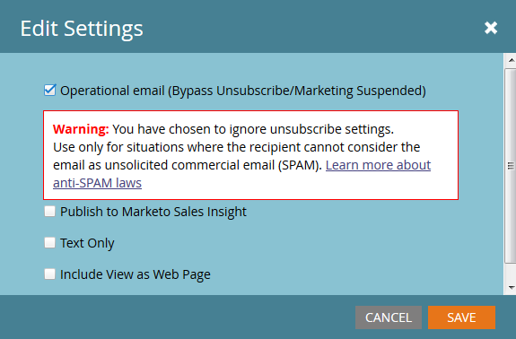
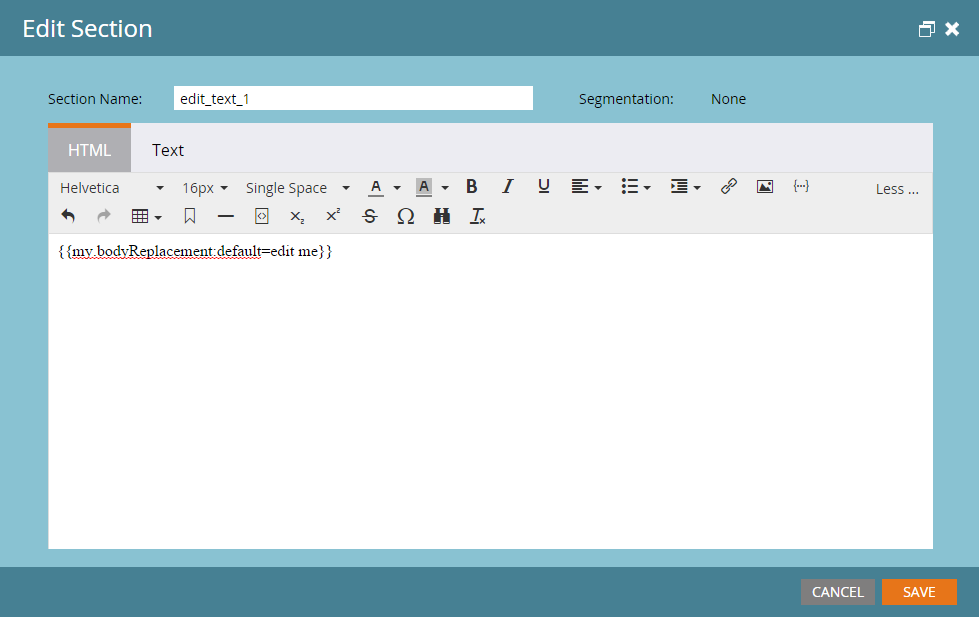

# Transaktions-Email

Ein gängiges Nutzungsszenario für die Marketo-API besteht darin, das Senden von Transaktions-E-Mails an bestimmte Datensätze über den API-Aufruf [Anforderungskampagne](https://developer.adobe.com/marketo-apis/api/mapi/#tag/Campaigns/operation/triggerCampaignUsingPOST) Trigger. Es gibt einige Konfigurationsanforderungen in Marketo, um den erforderlichen Aufruf mit der Marketo REST-API auszuführen.

- Der Empfänger muss einen Datensatz in Marketo haben
- In Ihrer Marketo-Instanz muss eine Transaktions-E-Mail erstellt und genehmigt sein.
- Es muss eine aktive Trigger-Kampagne mit dem Hinweis &quot;Kampagne ist angefordert, 1. Source: Web Service-API&quot;, die zum Senden der E-Mail eingerichtet ist

Erstellen und validieren Sie zunächst Ihre E-Mail ](https://experienceleague.adobe.com/docs/marketo/using/home.html?lang=de). [ Wenn es sich bei der E-Mail um eine echte Transaktions-E-Mail handelt, müssen Sie sie wahrscheinlich für den Betrieb einstellen, stellen Sie aber sicher, dass sie rechtlich als funktionsfähig gilt. Dies wird über den Bearbeitungsbildschirm unter E-Mail-Aktionen > E-Mail-Einstellungen konfiguriert:




Validieren Sie sie und wir sind bereit, unsere Kampagne zu erstellen:


Wenn Sie mit dem Erstellen von Kampagnen noch nicht vertraut sind, lesen Sie den Artikel [Neue Smart-Kampagne erstellen](https://experienceleague.adobe.com/docs/marketo/using/product-docs/core-marketo-concepts/smart-campaigns/creating-a-smart-campaign/create-a-new-smart-campaign.html) . Nachdem Sie Ihre Kampagne erstellt haben, müssen wir diese Schritte durchlaufen. Konfigurieren Sie Ihre Smart-Liste mit dem Trigger Kampagne ist angefordert :


Jetzt müssen wir den Fluss so konfigurieren, dass ein Schritt E-Mail senden auf unsere E-Mail verweist:


Vor der Aktivierung müssen Sie auf der Registerkarte Planung einige Einstellungen festlegen. Wenn diese E-Mail nur einmal an einen bestimmten Datensatz gesendet werden soll, lassen Sie die Qualifizierungseinstellungen unverändert. Wenn es erforderlich ist, dass sie die E-Mail mehrmals erhalten, möchten Sie dies jedoch entweder jedes Mal oder an eine der verfügbaren Cadences anpassen:

Jetzt können Sie Folgendes aktivieren:


## Senden der API-Aufrufe

**Hinweis:** In den folgenden Java-Beispielen verwenden wir das [minimal-json-Paket](https://github.com/ralfstx/minimal-json), um JSON-Darstellungen in unserem Code zu verarbeiten.

Der erste Teil des Versands einer Transaktions-E-Mail über die API besteht darin sicherzustellen, dass in Ihrer Marketo-Instanz ein Datensatz mit der entsprechenden E-Mail-Adresse vorhanden ist und dass wir Zugriff auf seine Lead-ID haben. Für die Zwecke dieses Beitrags gehen wir davon aus, dass sich die E-Mail-Adressen bereits in Marketo befinden und wir nur die Kennung des Datensatzes abrufen dürfen. Dazu verwenden wir den Aufruf [Leads nach Filtertyp abrufen](https://developer.adobe.com/marketo-apis/api/mapi/#tag/Leads/operation/getLeadsByFilterUsingGET) . Sehen wir uns unsere Hauptmethode für an, um die Kampagne anzufordern:

```java
package dev.marketo.blog_request_campaign;

import com.eclipsesource.json.JsonArray;

public class App 
{
    public static void main( String[] args )
    {
        //Create an instance of Auth so that we can authenticate with our Marketo instance
        Leads leadsRequest = new Leads(auth).setFilterType("email").addFilterValue("requestCampaign.test@marketo.com");

        //Create and parameterize an instance of Leads
        //Set your email filterValue appropriately
        Leads leadsRequest = new Leads(auth).setFilterType("email").addFilterValue("test.requestCamapign@example.com");

        //Get the inner results array of the response
        JsonArray leadsResult = leadsRequest.getData().get("result").asArray();

        //Get the id of the record indexed at 0
        int lead = leadsResult.get(0).asObject().get("id").asInt();

        //Set the ID of your campaign from Marketo
        int campaignId = 0;
        RequestCampaign rc = new RequestCampaign(auth, campaignId).addLead(lead);

        //Send the request to Marketo
        rc.postData();
    }
}
```

Um zu diesen Ergebnissen aus der JSONObject-Antwort von leadRequest zu gelangen, müssen wir Code schreiben. Um das erste Ergebnis im Array abzurufen, müssen wir das Array aus dem JsonObject extrahieren und das Objekt bei 0 indizieren:

```java
JsonArray leadsResult = leadsRequest.getData().get("result").asArray();
int leadId = leadsResult.get(0).asObject().get("id").asInt();
```

Von hier aus müssen wir nur noch den Kampagnenaufruf anfordern. Dazu sind die erforderlichen Parameter die ID in der URL der Anfrage und ein Array von JSON-Objekten, die ein Mitglied enthalten, &quot;id&quot;. Sehen wir uns dazu den Code an:

```java
package dev.marketo.blog_request_campaign;
import java.io.IOException;
import java.io.InputStream;
import java.io.InputStreamReader;
import java.io.OutputStreamWriter;
import java.io.Reader;
import java.net.MalformedURLException;
import java.net.URL;
import java.util.ArrayList;
import javax.net.ssl.HttpsURLConnection;
import com.eclipsesource.json.JsonArray;
import com.eclipsesource.json.JsonObject;

public class RequestCampaign {
    private String endpoint;
    private Auth auth;
    public ArrayList leads = new ArrayList();
    public ArrayList tokens = new ArrayList();
    
    public RequestCampaign(Auth auth, int campaignId) {
        this.auth = auth;
        this.endpoint = this.auth.marketoInstance + "/rest/v1/campaigns/" + campaignId + "/trigger.json";
    }
    public RequestCampaign setLeads(ArrayList leads) {
        this.leads = leads;
        return this;
    }
    public RequestCampaign addLead(int lead){
        leads.add(lead);
        return this;
    }
    public RequestCampaign setTokens(ArrayList tokens) {
        this.tokens = tokens;
        return this;
    }
    public RequestCampaign addToken(String tokenKey, String val){
        JsonObject jo = new JsonObject().add("name", tokenKey);
        jo.add("value", val);
        tokens.add(jo);
        return this;
    }
    public JsonObject postData(){
        JsonObject result = null;
        try {
            JsonObject requestBody = buildRequest(); //builds the Json Request Body
            System.out.println("Executing RequestCampaign call\n" + "Endpoint: " + endpoint + "\nRequest Body:\n"  + requestBody);
            URL url = new URL(endpoint);
            HttpsURLConnection urlConn = (HttpsURLConnection) url.openConnection(); //Return a URL connection and cast to HttpsURLConnection
            urlConn.setRequestMethod("POST");
            urlConn.setRequestProperty("Content-type", "application/json");
            urlConn.setRequestProperty("accept", "text/json");
            urlConn.setDoOutput(true);
            OutputStreamWriter wr = new OutputStreamWriter(urlConn.getOutputStream());
            wr.write(requestBody.toString());
            wr.flush();
            InputStream inStream = urlConn.getInputStream(); //get the inputStream from the URL connection
            Reader reader = new InputStreamReader(inStream);
            result = JsonObject.readFrom(reader); //Read from the stream into a JsonObject
            System.out.println("Result:\n" + result);
        } catch (MalformedURLException e) {
            e.printStackTrace();
        } catch (IOException e) {
            e.printStackTrace();
        }
        return result;
    }
    
    private JsonObject buildRequest(){
        JsonObject requestBody = new JsonObject(); //Create a new JsonObject for the Request Body
        JsonObject input = new JsonObject();
        JsonArray leadsArray = new JsonArray();
        for (int lead : leads) {
            JsonObject jo = new JsonObject().add("id", lead);
            leadsArray.add(jo);
        }
        input.add("leads", leadsArray);
        JsonArray tokensArray = new JsonArray();
        for (JsonObject jo : tokens) {
            tokensArray.add(jo);
        }
        input.add("tokens", tokensArray);
        requestBody.add("input", input);
        return requestBody;
    }

}
```

Diese Klasse hat einen Konstruktor, der eine Auth verwendet, und die Kennung der Kampagne. Leads werden zum Objekt hinzugefügt, indem entweder ein `ArrayList<Integer>` übergeben wird, das die IDs der zu setLeads zu verwendenden Datensätze enthält, oder indem addLead verwendet wird, was eine Ganzzahl benötigt und sie an die vorhandene ArrayList in der Lead-Eigenschaft anhängt. Um den API-Aufruf zum Übergeben der Lead-Datensätze an die Kampagne Trigger, muss postData aufgerufen werden. Dadurch wird ein JsonObject zurückgegeben, das die Antwortdaten aus der Anfrage enthält. Wenn die Anfragekampagne aufgerufen wird, wird jeder an den Aufruf übergebene Lead von der Zielkampagne des Triggers in Marketo verarbeitet und die zuvor erstellte E-Mail gesendet. Herzlichen Glückwunsch! Sie haben eine E-Mail über die Marketo REST API ausgelöst. Sehen Sie sich Teil 2 genau an, in dem wir uns mit der dynamischen Anpassung des Inhalts einer E-Mail durch Anforderungskampagne beschäftigen.

### E-Mail erstellen

Um unseren Inhalt anzupassen, müssen wir zunächst ein [Programm](https://experienceleague.adobe.com/docs/marketo/using/product-docs/core-marketo-concepts/programs/creating-programs/create-a-program.html) und eine [E-Mail](https://experienceleague.adobe.com/docs/marketo/using/home.html?lang=de) in Marketo konfigurieren. Um unseren benutzerdefinierten Inhalt zu erstellen, müssen wir Token innerhalb des Programms erstellen und sie dann in die E-Mail einfügen, die wir senden werden. Aus Gründen der Einfachheit verwenden wir in diesem Beispiel nur ein Token, Sie können jedoch eine beliebige Anzahl von Token in einer E-Mail, in der Von-E-Mail, im Von-Name, in der Antwort oder in einem beliebigen Inhalt in der E-Mail ersetzen. Erstellen wir also ein Token Rich Text für den Ersatz und nennen es &quot;bodyReplacement&quot;. Rich Text ermöglicht es uns, alle Inhalte im Token durch beliebige HTML zu ersetzen, die wir eingeben möchten.


Token können nicht gespeichert werden, wenn sie leer sind. Fügen Sie daher hier Platzhaltertext ein. Jetzt müssen wir unser Token in die E-Mail einfügen:



Dieses Token kann jetzt über einen Kampagnenaufruf für Anfragen ersetzt werden. Dieses Token kann so einfach sein wie eine einzelne Textzeile, die pro E-Mail ersetzt werden muss, oder fast das gesamte Layout der E-Mail einschließen.

### Der Code

```java
package dev.marketo.blog_request_campaign;

import com.eclipsesource.json.JsonArray;

public class App 
{
    public static void main( String[] args )
    {
        //Create an instance of Auth so that we can authenticate with our Marketo instance
        Auth auth = new Auth("Client ID - CHANGE ME", "Client Secret - CHANGE ME", "Host - CHANGE ME");
        
        //Create and parameterize an instance of Leads
        Leads leadsRequest = new Leads(auth).setFilterType("email").addFilterValue("requestCampaign.test@marketo.com");
        
        //get the inner results array of the response
        JsonArray leadsResult = leadsRequest.getData().get("result").asArray();
        
        //get the id of the record indexed at 0
        int lead = leadsResult.get(0).asObject().get("id").asInt();
        
        //Set the ID of our campaign from Marketo
        int campaignId = 1578;
        RequestCampaign rc = new RequestCampaign(auth, campaignId).addLead(lead);

        //Create the content of the token here, and add it to the request
        String bodyReplacement = "<div class=\"replacedContent\"><p>This content has been replaced</p></div>";
        rc.addToken("{{my.bodyReplacement}}", bodyReplacement);
        rc.postData();
    }
}
```

Wenn der Code vertraut aussieht, liegt das daran, dass er nur zwei zusätzliche Zeilen von der oben genannten Hauptmethode hat. Diesmal erstellen wir den Inhalt unseres Tokens in der Variablen bodyReplacement und verwenden dann die Methode addToken , um ihn zur Anfrage hinzuzufügen. addToken verwendet einen Schlüssel und einen Wert, erstellt dann eine JsonObject -Darstellung und fügt sie zum internen Token-Array hinzu. Dies wird dann während der postData-Methode serialisiert und erstellt einen Text, der wie folgt aussieht:

```json
{
    "input":
    {
        "leads": [
            {
                "id": 1
            }
        ],
        "tokens": [
            {
                "name": "{{my.bodyReplacement}}",
                "value": "<div class=\"replacedContent\"><p>This content has been replaced</p></div>"
            }
        ]
    }
}
```

In Kombination sieht unsere Konsolenausgabe wie folgt aus:

```bash
Token is empty or expired. Trying new authentication
Trying to authenticate with ...
Got Authentication Response: {"access_token":"19d51b9a-ff60-4222-bbd5-be8b206f1d40:st","token_type":"bearer","expires_in":3565,"scope":"apiuser@mktosupport.com"}
Executing RequestCampaign call
Endpoint: .../rest/v1/campaigns/1578/trigger.json
Request Body:
{"input":{"leads":[{"id":1}],"tokens":[{"name":"{{my.bodyReplacement}}","value":"<div class=\"replacedContent\"><p>This content has been replaced</p></div>"}]}}
Result:
{"requestId":"1e8d#14eadc5143d","result":[{"id":1578}],"success":true}
```

## Aufwischen

Diese Methode ist auf vielfältige Weise erweiterbar, indem Inhalt in E-Mails innerhalb einzelner Layoutabschnitte oder außerhalb von E-Mails geändert wird, sodass benutzerdefinierte Werte an Aufgaben oder interessante Momente weitergegeben werden können. Jedes Objekt, das innerhalb eines Programms verwendet werden kann, kann mit dieser Methode angepasst werden. Ähnliche Funktionen sind auch mit dem Aufruf [Kampagne planen](https://developer.adobe.com/marketo-apis/api/mapi/#tag/Campaigns/operation/scheduleCampaignUsingPOST) verfügbar, mit dem Sie Token für eine gesamte Batch-Kampagne verarbeiten können. Diese können nicht pro Lead angepasst werden, sind jedoch für die Anpassung von Inhalten über einen breiten Satz von Leads hinweg nützlich.
