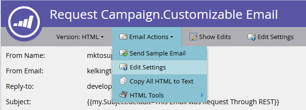

# Transaktions-E-Mail

Ein gängiges Anwendungsbeispiel für die Marketo-API ist der Trigger des Versands von Transaktions-E-Mails an bestimmte Datensätze über den API-Aufruf [Kampagne anfragen](https://developer.adobe.com/marketo-apis/api/mapi/#tag/Campaigns/operation/triggerCampaignUsingPOST). Es gibt einige Konfigurationsanforderungen in Marketo, um den erforderlichen Aufruf mit der Marketo REST-API auszuführen.

- Die Empfängerin bzw. der Empfänger muss einen Datensatz in Marketo haben
- In Ihrer Marketo-Instanz muss eine Transaktions-E-Mail erstellt und genehmigt sein.
- Es muss eine aktive Kampagnenkampagne mit dem Trigger „Kampagne ist angefordert, 1. Source: Web Service API“, das zum Senden der E-Mail eingerichtet ist

Zunächst [E-Mail erstellen und &#x200B;](https://experienceleague.adobe.com/docs/marketo/using/home.html?lang=de). Wenn die E-Mail wirklich eine Transaktion ist, müssen Sie sie wahrscheinlich auf „betriebsbereit“ setzen, aber sicherstellen, dass sie rechtlich als funktionsfähig eingestuft wird. Dies wird über den Bildschirm Bearbeiten unter E-Mail-Aktionen > E-Mail-Einstellungen konfiguriert:




Genehmigen Sie ihn, und wir sind bereit, unsere Kampagne zu erstellen:


Wenn Sie mit dem Erstellen von Kampagnen noch nicht vertraut sind, lesen Sie den Artikel [Erstellen einer neuen intelligenten Kampagne](https://experienceleague.adobe.com/docs/marketo/using/product-docs/core-marketo-concepts/smart-campaigns/creating-a-smart-campaign/create-a-new-smart-campaign.html?lang=de) . Nachdem Sie Ihre Kampagne erstellt haben, müssen wir diese Schritte durchlaufen. Konfigurieren Sie Ihre Smart-Liste mit dem Trigger Kampagne ist angefordert :


Jetzt müssen wir den Fluss so konfigurieren, dass er auf den Schritt „E-Mail senden“ zu unserer E-Mail verweist:


Vor der Aktivierung müssen Sie einige Einstellungen auf der Registerkarte Zeitplan festlegen. Wenn diese E-Mail nur einmal an einen bestimmten Datensatz gesendet werden soll, lassen Sie die Qualifizierungseinstellungen unverändert. Wenn sie die E-Mail jedoch mehrmals erhalten müssen, können Sie dies entweder auf jedes Mal oder auf eine der verfügbaren Kadenzen anpassen:

Jetzt können wir Folgendes aktivieren:


## API-Aufrufe senden

**Hinweis:** In den unten stehenden Java-Beispielen verwenden wir das Paket [minimal-json](https://github.com/ralfstx/minimal-json), um JSON-Darstellungen in unserem Code zu verarbeiten.

Beim Senden einer Transaktions-E-Mail über die API müssen Sie zunächst sicherstellen, dass in Ihrer Marketo-Instanz ein Datensatz mit der entsprechenden E-Mail-Adresse vorhanden ist und wir Zugriff auf die Lead-ID haben. Für diesen Beitrag gehen wir davon aus, dass sich die E-Mail-Adressen bereits in Marketo befinden und wir nur die ID des Datensatzes abrufen müssen. Dazu verwenden wir den Aufruf [Leads nach Filtertyp abrufen](https://developer.adobe.com/marketo-apis/api/mapi/#tag/Leads/operation/getLeadsByFilterUsingGET). Sehen wir uns die Hauptmethode für die Anfrage der Kampagne an:

```java
package dev.marketo.blog_request_campaign;

import com.eclipsesource.json.JsonArray;

public class App
{
    public static void main( String[] args )
    {
        //Create an instance of Auth so that we can authenticate with our Marketo instance
        Leads leadsRequest = new Leads(auth).setFilterType("email").addFilterValue("requestCampaign.test@marketo.com");

        //Create and parameterize an instance of Leads
        //Set your email filterValue appropriately
        Leads leadsRequest = new Leads(auth).setFilterType("email").addFilterValue("test.requestCamapign@example.com");

        //Get the inner results array of the response
        JsonArray leadsResult = leadsRequest.getData().get("result").asArray();

        //Get the id of the record indexed at 0
        int lead = leadsResult.get(0).asObject().get("id").asInt();

        //Set the ID of your campaign from Marketo
        int campaignId = 0;
        RequestCampaign rc = new RequestCampaign(auth, campaignId).addLead(lead);

        //Send the request to Marketo
        rc.postData();
    }
}
```

Um diese Ergebnisse aus der JsonObject-Antwort von leadRequest zu erhalten, müssen wir Code schreiben. Um das erste Ergebnis im Array abzurufen, müssen wir das Array aus dem JsonObject extrahieren und das -Objekt bei 0 indizieren lassen:

```java
JsonArray leadsResult = leadsRequest.getData().get("result").asArray();
int leadId = leadsResult.get(0).asObject().get("id").asInt();
```

Ab hier müssen wir nur noch den Aufruf Kampagne anfragen ausführen. Zu diesem Zweck sind die erforderlichen Parameter die ID in der URL der Anfrage und ein Array von JSON-Objekten, die ein Element „id“ enthalten. Sehen wir uns den Code dafür an:

```java
package dev.marketo.blog_request_campaign;
import java.io.IOException;
import java.io.InputStream;
import java.io.InputStreamReader;
import java.io.OutputStreamWriter;
import java.io.Reader;
import java.net.MalformedURLException;
import java.net.URL;
import java.util.ArrayList;
import javax.net.ssl.HttpsURLConnection;
import com.eclipsesource.json.JsonArray;
import com.eclipsesource.json.JsonObject;

public class RequestCampaign {
    private String endpoint;
    private Auth auth;
    public ArrayList leads = new ArrayList();
    public ArrayList tokens = new ArrayList();

    public RequestCampaign(Auth auth, int campaignId) {
        this.auth = auth;
        this.endpoint = this.auth.marketoInstance + "/rest/v1/campaigns/" + campaignId + "/trigger.json";
    }
    public RequestCampaign setLeads(ArrayList leads) {
        this.leads = leads;
        return this;
    }
    public RequestCampaign addLead(int lead){
        leads.add(lead);
        return this;
    }
    public RequestCampaign setTokens(ArrayList tokens) {
        this.tokens = tokens;
        return this;
    }
    public RequestCampaign addToken(String tokenKey, String val){
        JsonObject jo = new JsonObject().add("name", tokenKey);
        jo.add("value", val);
        tokens.add(jo);
        return this;
    }
    public JsonObject postData(){
        JsonObject result = null;
        try {
            JsonObject requestBody = buildRequest(); //builds the Json Request Body
            System.out.println("Executing RequestCampaign call\n" + "Endpoint: " + endpoint + "\nRequest Body:\n"  + requestBody);
            URL url = new URL(endpoint);
            HttpsURLConnection urlConn = (HttpsURLConnection) url.openConnection(); //Return a URL connection and cast to HttpsURLConnection
            urlConn.setRequestMethod("POST");
            urlConn.setRequestProperty("Content-type", "application/json");
            urlConn.setRequestProperty("accept", "text/json");
            urlConn.setDoOutput(true);
            OutputStreamWriter wr = new OutputStreamWriter(urlConn.getOutputStream());
            wr.write(requestBody.toString());
            wr.flush();
            InputStream inStream = urlConn.getInputStream(); //get the inputStream from the URL connection
            Reader reader = new InputStreamReader(inStream);
            result = JsonObject.readFrom(reader); //Read from the stream into a JsonObject
            System.out.println("Result:\n" + result);
        } catch (MalformedURLException e) {
            e.printStackTrace();
        } catch (IOException e) {
            e.printStackTrace();
        }
        return result;
    }

    private JsonObject buildRequest(){
        JsonObject requestBody = new JsonObject(); //Create a new JsonObject for the Request Body
        JsonObject input = new JsonObject();
        JsonArray leadsArray = new JsonArray();
        for (int lead : leads) {
            JsonObject jo = new JsonObject().add("id", lead);
            leadsArray.add(jo);
        }
        input.add("leads", leadsArray);
        JsonArray tokensArray = new JsonArray();
        for (JsonObject jo : tokens) {
            tokensArray.add(jo);
        }
        input.add("tokens", tokensArray);
        requestBody.add("input", input);
        return requestBody;
    }

}
```

Diese Klasse verfügt über einen Konstruktor, der eine Authentifizierung akzeptiert, und die ID der Kampagne. Leads werden dem -Objekt entweder durch Übergabe eines `ArrayList<Integer>` mit den IDs der zu setzenden Datensätze oder durch Verwendung von addLead hinzugefügt, das eine Ganzzahl benötigt und an die vorhandene ArrayList in der Leads-Eigenschaft angehängt wird. Um den API-Aufruf zum Übergeben der Lead-Datensätze an die Kampagne Trigger, muss postData aufgerufen werden, das ein JsonObject zurückgibt, das die Antwortdaten aus der Anfrage enthält. Wenn die Anfragekampagne aufgerufen wird, wird jeder Lead, der an den Aufruf weitergeleitet wird, von der Zielkampagne in Marketo verarbeitet und die zuvor erstellte E-Mail wird an den Trigger gesendet. Herzlichen Glückwunsch! Sie haben über die Marketo-REST-API eine E-Mail ausgelöst. Sehen Sie sich Teil 2 an, in dem der Inhalt einer E-Mail über die Anfragekampagne dynamisch angepasst wird.

### E-Mail erstellen

Um unseren Inhalt anzupassen, müssen wir zunächst ein [Programm](https://experienceleague.adobe.com/docs/marketo/using/product-docs/core-marketo-concepts/programs/creating-programs/create-a-program.html?lang=de) und eine [E-Mail](https://experienceleague.adobe.com/docs/marketo/using/home.html?lang=de) in Marketo konfigurieren. Um unsere benutzerdefinierten Inhalte zu generieren, müssen wir Token innerhalb des Programms erstellen und sie dann in der E-Mail platzieren, die wir senden werden. Der Einfachheit halber verwenden wir in diesem Beispiel nur ein Token, aber Sie können eine beliebige Anzahl von Token in einer E-Mail ersetzen, in der Absender-E-Mail, im Absendernamen, in der Antwortadresse oder in einem beliebigen Inhalt in der E-Mail. Erstellen wir also ein Rich-Text-Token für die Ersetzung und nennen es „bodyReplacement“. Rich-Text ermöglicht es uns, alle Inhalte im Token durch beliebige HTML zu ersetzen, die wir eingeben möchten.


Token können nicht gespeichert werden, wenn sie leer sind. Fügen Sie daher hier Platzhaltertext ein. Jetzt müssen wir unser Token in die E-Mail einfügen:


Dieses Token kann jetzt über einen Kampagnenanforderungsaufruf ersetzt werden. Dieses Token kann so einfach sein wie eine einzelne Textzeile, die pro E-Mail ersetzt werden muss, oder fast das gesamte Layout der E-Mail enthalten.

### Der Code

```java
package dev.marketo.blog_request_campaign;

import com.eclipsesource.json.JsonArray;

public class App
{
    public static void main( String[] args )
    {
        //Create an instance of Auth so that we can authenticate with our Marketo instance
        Auth auth = new Auth("Client ID - CHANGE ME", "Client Secret - CHANGE ME", "Host - CHANGE ME");

        //Create and parameterize an instance of Leads
        Leads leadsRequest = new Leads(auth).setFilterType("email").addFilterValue("requestCampaign.test@marketo.com");

        //get the inner results array of the response
        JsonArray leadsResult = leadsRequest.getData().get("result").asArray();

        //get the id of the record indexed at 0
        int lead = leadsResult.get(0).asObject().get("id").asInt();

        //Set the ID of our campaign from Marketo
        int campaignId = 1578;
        RequestCampaign rc = new RequestCampaign(auth, campaignId).addLead(lead);

        //Create the content of the token here, and add it to the request
        String bodyReplacement = "<div class=\"replacedContent\"><p>This content has been replaced</p></div>";
        rc.addToken("{{my.bodyReplacement}}", bodyReplacement);
        rc.postData();
    }
}
```

Wenn der Code bekannt aussieht, liegt das daran, dass er nur zwei zusätzliche Zeilen von der oben genannten Hauptmethode hat. Dieses Mal erstellen wir den Inhalt unseres Tokens in der bodyReplacement-Variablen und verwenden dann die addToken-Methode, um ihn der Anfrage hinzuzufügen. addToken nimmt einen Schlüssel und einen Wert, erstellt dann eine JsonObject-Darstellung und fügt sie dem internen Token-Array hinzu. Diese wird dann während der postData-Methode serialisiert und erstellt einen Hauptteil, der wie folgt aussieht:

```json
{
    "input":
    {
        "leads": [
            {
                "id": 1
            }
        ],
        "tokens": [
            {
                "name": "{{my.bodyReplacement}}",
                "value": "<div class=\"replacedContent\"><p>This content has been replaced</p></div>"
            }
        ]
    }
}
```

In Kombination sieht unsere Konsolenausgabe wie folgt aus:

```bash
Token is empty or expired. Trying new authentication
Trying to authenticate with ...
Got Authentication Response: {"access_token":"19d51b9a-ff60-4222-bbd5-be8b206f1d40:st","token_type":"bearer","expires_in":3565,"scope":"apiuser@mktosupport.com"}
Executing RequestCampaign call
Endpoint: .../rest/v1/campaigns/1578/trigger.json
Request Body:
{"input":{"leads":[{"id":1}],"tokens":[{"name":"{{my.bodyReplacement}}","value":"<div class=\"replacedContent\"><p>This content has been replaced</p></div>"}]}}
Result:
{"requestId":"1e8d#14eadc5143d","result":[{"id":1578}],"success":true}
```

## Verpackung

Diese Methode ist auf eine Vielzahl von Arten erweiterbar, indem der Inhalt in E-Mails innerhalb einzelner Layout-Abschnitte oder außerhalb von E-Mails geändert wird, sodass benutzerdefinierte Werte an Aufgaben oder interessante Momente weitergegeben werden können. Überall dort, wo ein Token innerhalb eines Programms verwendet werden kann, kann mit dieser Methode angepasst werden. Ähnliche Funktionen sind auch beim Aufruf [Kampagne planen](https://developer.adobe.com/marketo-apis/api/mapi/#tag/Campaigns/operation/scheduleCampaignUsingPOST) verfügbar, mit dem Sie Token für eine gesamte Batch-Kampagne verarbeiten können. Diese können nicht pro Lead angepasst werden, sind jedoch für die Anpassung von Inhalten für eine Vielzahl von Leads nützlich.
