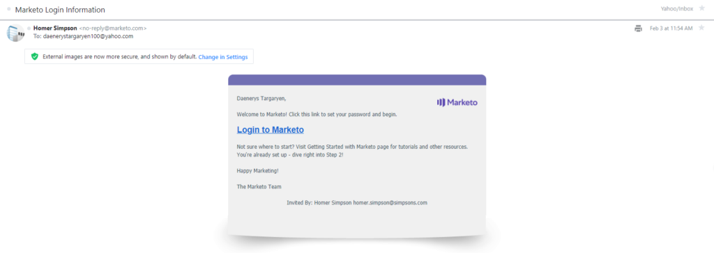

# Benutzerverwaltung

[User Management-Endpunktreferenz](https://developer.adobe.com/marketo-apis/api/user/)

Marketo User Management-Endpunkte führen CRUD-Vorgänge für Benutzerdatensätze aus. Um einen Benutzer zu erstellen, senden Sie eine Einladung. Der Benutzer legt dann ein Kennwort fest und greift zum ersten Mal auf Marketo zu.

Im Gegensatz zu anderen Marketo-REST-APIs sollten Sie bei der Verwendung der User Management-APIs Folgendes beachten:

- Senden Sie das Zugriffstoken in einer HTTP-Kopfzeile. Das Zugriffstoken kann nicht als Abfragezeichenfolgenparameter übergeben werden. Siehe [Authentifizierungshandbuch](authentication.md).
- Wählen Sie beim Erstellen der Benutzerrolle für eine REST[API (Benutzerdefinierter Service](https://experienceleague.adobe.com/en/docs/marketo/using/product-docs/administration/additional-integrations/create-a-custom-service-for-use-with-rest-api) eine Berechtigung aus jeder dieser Gruppen aus:
  1. Berechtigung „Zugriff auf Benutzer“ aus der Gruppe [Zugriff auf Admin](https://experienceleague.adobe.com/en/docs/marketo/using/product-docs/administration/users-and-roles/descriptions-of-role-permissions)
  1. „Zugriff auf User Management-API“ aus der Gruppe [Zugriff-API](https://experienceleague.adobe.com/en/docs/marketo/using/product-docs/administration/users-and-roles/descriptions-of-role-permissions)
- Wertet den HTTP-Antwort-Status-Code aus, da die Antworttexte nicht das boolesche Attribut „success“ enthalten. Bei einem erfolgreichen Aufruf wird der Status-Code 200 zurückgegeben. Bei einem fehlgeschlagenen Aufruf werden ein Nicht-200-Status-Code und das standardmäßige Array „Fehler“ mit einem Fehler-Code und einer beschreibenden Meldung zurückgegeben.
- Formatieren Sie Datums-/Uhrzeitzeichenfolgen als `yyyyMMdd'T'HH:mm:ss.SSS't'+|-hhmm`. Dieses Format gilt für `createdAt`, `updatedAt` und `expiresAt`.
- Stellen Sie den Endpunkten der User Management-API kein &quot;/rest“ voran.

## Abfrage

User Management-Abfragen können alle Benutzer, Rollen und Arbeitsbereiche abrufen. Sie können auch einen Benutzer oder die zugehörigen Rollen- und Arbeitsbereichsdatensätze nach Benutzer-ID abrufen.

### Benutzer nach ID

Der Endpunkt [Benutzer nach ID abrufen](https://developer.adobe.com/marketo-apis/api/user/#tag/User-Management/operation/getUserUsingGET) nimmt einen einzelnen `userid`-Pfadparameter und gibt einen einzelnen Benutzerdatensatz für einen Benutzer zurück, der seine Einladung akzeptiert hat.

```http
GET /userservice/management/v1/users/{userid}/user.json
```

```json
{
  "userid": "jamie@houselannister.com",
  "firstName": "Jamie",
  "lastName": "Lannister",
  "emailAddress": "jamie@lannister.com",
  "optedIn": false,
  "failedLogins": 0,
  "failedDeviceCode": 0,
  "isLocked": false,
  "lockedReason": null,
  "id": 0,
  "apiOnly": false,
  "userRoleWorkspaces": [
    {
      "accessRoleId": 1,
      "accessRoleName": "Admin",
      "workspaceId": 0,
      "workspaceName": "AllZones"
    },
    {
      "accessRoleId": 2,
      "accessRoleName":
      "Standard User",
      "workspaceId": 1008,
      "workspaceName": "World"
    }
  ],
  "expiresAt": "2020-12-31T08:00:00.000t+0000",
  "lastLoginAt": "2020-02-05T01:02:23.000t+0000"
}
```

### Eingeladener Benutzer nach ID

Der Endpunkt [Eingeladenen Benutzer nach ID abrufen](https://developer.adobe.com/marketo-apis/api/user/#tag/User-Management/operation/getInvitedUserUsingGET) nimmt einen einzelnen `userid`-Pfadparameter und gibt einen einzelnen Benutzerdatensatz für einen „ausstehenden“ Benutzer zurück (hat die Einladung noch nicht angenommen).

```http
GET /userservice/management/v1/users/{userid}/invite.json
```

```json
{
    "id": 25112,
    "firstName": "Jamie",
    "lastName": "Lannister",
    "emailAddress": "jamie@lannister.com",
    "userId": "jamie@lannister.com",
    "subscriptionId": 3381,
    "status": "pending",
    "expiresAt": "20200807T20:49:54.0t+0000",
    "createdAt": "20200731T20:49:54.0t+0000",
    "updatedAt": "20200731T20:49:54.0t+0000"
}
```

### Rollen und Arbeitsbereiche nach ID

Der Endpunkt [Rollen und Arbeitsbereiche nach ID abrufen](https://developer.adobe.com/marketo-apis/api/user/#tag/User-Management/operation/getUserRolesAndWorkspacesUsingGET) nimmt einen `userid` Pfadparameter und gibt die Rollen- und Arbeitsbereichsdatensätze des Benutzers zurück. Jedes Objekt im Antwort-Array enthält die Rollen- und Workspace-ID sowie den Namen.

```http
GET /userservice/management/v1/users/{userid}/roles.json
```

```json
[
  {
    "accessRoleId": 1,
    "accessRoleName": "Admin",
    "workspaceId": 0,
    "workspaceName": "AllZones"
  },
  {
    "accessRoleId": 2,
    "accessRoleName": "Standard User",
    "workspaceId": 1008,
    "workspaceName": "World"
  }
]
```

### Benutzer durchsuchen

Der Endpunkt [Benutzer abrufen](https://developer.adobe.com/marketo-apis/api/user/#tag/User-Management/operation/getUsersUsingGET) gibt alle Benutzerdatensätze zurück. Sie unterstützt die folgenden optionalen ganzzahligen Parameter:

- `pageSize` gibt die maximale Anzahl an zurückzugebenden Einträgen an. Der Standardwert ist 20 und der Höchstwert 200.
- `pageOffset` gibt an, wo mit dem Abrufen von Einträgen begonnen werden soll. Der Standardwert ist 0 und kann mit `pageSize` verwendet werden.

```http
GET /userservice/management/v1/users/allusers.json
```

```json
[
  {
    "userid": "jamie@lannister.com",
    "firstName": "Jamie",
    "lastName": "Lannister",
    "emailAddress": "jamie@houselannister.com",
    "id": 6785,
    "apiOnly": false
  },
  {
    "userid": "jeoffery@housebaratheon.com",
    "firstName": "Jeoffery",
    "lastName": "Baratheon",
    "emailAddress": "jeoffery@housebaratheon.com",
    "id": 7718,
    "apiOnly": false
  },
  {
    "userid": "rickon@housestark.com",
    "firstName": "Rickon",
    "lastName": "Stark",
    "emailAddress": "rickon@housestark.com",
    "id": 8612,
    "apiOnly": false
  }
]
```

>[!NOTE]
>
>Im obigen Code-Beispiel ist der angezeigte `userid` für einen Kunden, der zu Adobe IMS migriert wurde. Für Kunden, die noch nicht migriert haben, wird im Feld `userid` eine reguläre E-Mail-Adresse angezeigt.

### Rollen durchsuchen

Der Endpunkt [Rollen abrufen](https://developer.adobe.com/marketo-apis/api/user/#tag/User-Management/operation/getRolesUsingGET) gibt eine Liste aller Rollendatensätze zurück.

```http
GET /userservice/management/v1/users/roles.json
```

```json
[
    {
        "id": 1,
        "name": "Admin",
        "description": "All permissions",
        "type": "system",
        "hidden": false,
        "onlyAllZones": true,
        "createdAt": "20100327T18:27:42.0t+0000",
        "updatedAt": "20100327T18:27:42.0t+0000"
    },
    {
        "id": 2,
        "name": "Standard User",
        "description": "All permissions except Admin",
        "type": "system",
        "hidden": false,
        "onlyAllZones": false,
        "createdAt": "20100327T18:27:42.0t+0000",
        "updatedAt": "20180423T02:33:29.0t+0000"
    },
    {
        "id": 24,
        "name": "RTP Launcher",
        "description": "Role required for launcher in RTP",
        "type": "system",
        "hidden": false,
        "onlyAllZones": false,
        "createdAt": "20151024T01:45:40.0t+0000",
        "updatedAt": "20171024T23:41:24.0t+0000"
    },
    {
        "id": 25,
        "name": "RTP Editor",
        "description": "Role required for editor in RTP",
        "type": "system",
        "hidden": false,
        "onlyAllZones": false,
        "createdAt": "20151024T01:45:40.0t+0000",
        "updatedAt": "20171024T23:41:24.0t+0000"
    },
    {
        "id": 101,
        "name": "Analytics User",
        "description": "Has access to Analytics",
        "type": "custom",
        "hidden": false,
        "onlyAllZones": false,
        "createdAt": "20100327T18:27:42.0t+0000",
        "updatedAt": "20180423T02:33:29.0t+0000"
    },
    {
        "id": 102,
        "name": "Marketing User",
        "description": "All permissions except Admin",
        "type": "custom",
        "hidden": false,
        "onlyAllZones": false,
        "createdAt": "20100327T18:27:42.0t+0000",
        "updatedAt": "20100327T18:27:42.0t+0000"
    },
    {
        "id": 103,
        "name": "Web Designer",
        "description": "Has access to Design Studio except approval permission",
        "type": "custom",
        "hidden": false,
        "onlyAllZones": false,
        "createdAt": "20100327T18:27:42.0t+0000",
        "updatedAt": "20180423T02:33:29.0t+0000"
    }
]
```

### Durchsuchen von Arbeitsbereichen

Der Endpunkt [Arbeitsbereiche abrufen](https://developer.adobe.com/marketo-apis/api/user/#tag/User-Management/operation/getWorkspacesUsingGET) gibt eine Liste aller Arbeitsbereich-Datensätze zurück.

```http
GET /userservice/management/v1/users/workspaces.json
```

```json
[
  {
    "id": 1,
    "name": "Default",
    "description": "Initial workspace for Marketing Activities, Design Studio, and so on.",
    "globalViz": 0,
    "status": "active",
    "currencyInfo": null,
    "createdAt": "20160910T23:08:05.0t+0000",
    "updatedAt": "20160910T23:08:05.0t+0000"
  },
  {
    "id": 1008,
    "name": "World",
    "description": "",
    "globalViz": 0,
    "status": "active",
    "currencyInfo": null,
    "createdAt": "20181119T21:59:36.0t+0000",
    "updatedAt": "20181119T21:59:36.0t+0000"
  },
  {
    "id": 1009,
    "name": "Reproduction - US English - All Leads",
    "description": "A Workspace for recreating customer-reported problems.",
    "globalViz": 1,
    "status": "active",
    "currencyInfo": null,
    "createdAt": "20190129T23:36:37.0t+0000",
    "updatedAt": "20190129T23:36:37.0t+0000"
  },
  {
    "id": 1010,
    "name": "US",
    "description": "United States - Qualified Leads",
    "globalViz": 0,
    "status": "active",
    "currencyInfo": null,
    "createdAt": "20190322T15:55:40.0t+0000",
    "updatedAt": "20190322T15:55:40.0t+0000"
  }
]
```

## Benutzer einladen

Bei [Adobe IMS-integrierten Abonnements](https://experienceleague.adobe.com/de/docs/marketo/using/product-docs/administration/marketo-with-adobe-identity/adobe-identity-management-overview) unterstützt dieser Endpunkt nur Einladungen von [nur API-](https://experienceleague.adobe.com/en/docs/marketo/using/product-docs/administration/users-and-roles/create-an-api-only-user)). Um [Standardbenutzer](https://experienceleague.adobe.com/en/docs/marketo/using/product-docs/administration/users-and-roles/managing-marketo-users) einzuladen, verwenden Sie stattdessen die [Adobe User Management-](https://developer.adobe.com/umapi/).

Der Endpunkt [Benutzer einladen](https://developer.adobe.com/marketo-apis/api/user/#tag/User-Management/operation/inviteUserUsingPOST) sendet eine E-Mail-Einladung „Willkommen bei Marketo&quot; an einen neuen Benutzer. Die E-Mail enthält den Link „Bei Marketo anmelden“. Der Empfänger wählt den Link aus, erstellt ein Kennwort und erhält Zugriff auf Marketo.

Solange der Empfänger die Einladung nicht annimmt, ist der Status „Ausstehend“ und der Benutzerdatensatz kann nicht bearbeitet werden. Eine ausstehende Einladung läuft sieben Tage nach ihrem Versand ab. Weitere Informationen finden Sie in der Dokumentation zur Benutzerverwaltung [&#128279;](https://experienceleague.adobe.com/en/docs/marketo/using/product-docs/administration/users-and-roles/managing-marketo-users) Marketo.

Übergeben Sie Parameter im Anfragetext im `application/json`.

Die erforderlichen Parameter sind `emailAddress`, `firstName`, `lastName` und `userRoleWorkspaces`. Der `userRoleWorkspaces` ist ein Array von Objekten, die `accessRoleId`- und `workspaceId` enthalten.

Der `userid` ist die eindeutige Benutzerkennung, die für die Anmeldung verwendet wird, und muss als E-Mail-Adresse formatiert sein. Wenn in der Anfrage `userid` ausgelassen wird, wird standardmäßig der Wert von `emailAddress` verwendet.

Der boolesche `apiOnly` gibt an, ob es sich bei dem Benutzer um einen [API-only-Benutzer) &#x200B;](https://experienceleague.adobe.com/en/docs/marketo/using/product-docs/administration/users-and-roles/create-an-api-only-user). Der `expiresAt` gibt an, wann die Benutzeranmeldung abläuft, und verwendet das W3C ISO-8601-Format ohne Millisekunden. Wenn die Anfrage keine `expiresAt` enthält, läuft die Benutzerin bzw. der Benutzer nie ab. Der Parameter `reason` beschreibt den Grund für die Einladung.

Der Endpunkt gibt „true“ zurück, wenn die Einladung erfolgreich ist. Andernfalls wird eine Fehlermeldung zurückgegeben.

```http
POST /userservice/management/v1/users/invite.json
```

```text
Content-Type: application/json
```

```json
{
  "emailAddress": "daenerys@housetargaryen.com",
  "firstName": "Daenerys",
  "lastName": "Targaryen",
  "expiresAt": "2020-12-31T23:59:59-05:00",
  "reason": "Keeper of dragons",
  "userRoleWorkspaces": [
    {
      "accessRoleId": 1,
      "workspaceId": 0
    }
  ]
}
```

```text
true
```

Die folgende Abbildung zeigt die E-Mail „Willkommen bei Marketo&quot;, die an den neuen Benutzer gesendet wurde. Das Thema lautet &quot;Marketo-Anmeldeinformationen“. Der Absender ist die E-Mail-Adresse des Benutzers, der nur über eine API verfügt und mit dem [REST API Custom Service) verknüpft &#x200B;](https://experienceleague.adobe.com/en/docs/marketo/using/product-docs/administration/additional-integrations/create-a-custom-service-for-use-with-rest-api). Die Parameter firstName, lastName und emailAddress geben den Empfänger an.



Der Benutzer nimmt die Einladung an, indem er zweimal ein Passwort eingibt und die Schaltfläche „PASSWORT ERSTELLEN“ anklickt. Der Benutzer erhält dann Zugriff auf Marketo.

## Benutzer aktualisieren

Sie können Benutzerattribute aktualisieren oder einen Benutzer löschen, nachdem der Benutzer die Einladung angenommen hat. Übergeben Sie Attribute als Parameter im Anfragetext im application/json-Format.

### Benutzerattribute aktualisieren

Bei [Adobe IMS-integrierten Abonnements](https://experienceleague.adobe.com/de/docs/marketo/using/product-docs/administration/marketo-with-adobe-identity/adobe-identity-management-overview) unterstützt dieser Endpunkt nur die Aktualisierung von Attributen [nur API-](https://experienceleague.adobe.com/en/docs/marketo/using/product-docs/administration/users-and-roles/create-an-api-only-user) Benutzer. Um Attribute für [Standardbenutzer“ zu aktualisieren](https://experienceleague.adobe.com/en/docs/marketo/using/product-docs/administration/users-and-roles/managing-marketo-users) verwenden Sie stattdessen die [Adobe User Management-](https://developer.adobe.com/umapi/).

Der [Endpunkt Benutzerattribute aktualisieren](https://developer.adobe.com/marketo-apis/api/user/#tag/User-Management/operation/updateUserAttributeUsingPOST) nimmt einen einzelnen `userid` und gibt einen einzelnen Benutzerdatensatz zurück. Der Anfragetext enthält ein oder mehrere zu aktualisierende Benutzerattribute: `emailAddress`, `firstName`, `lastName`, `expiresAt`.

```http
POST /userservice/management/v1/users/{userid}/update.json
```

```text
Content-Type: application/json
```

```json
{
  "firstName": "JAMIE",
  "lastName": "LANISTER",
  "expiresAt": "20211231T08:00:00.000t+0000"
}
```

```json
{
  "userid": "jamie@houselannister.com",
  "firstName": "JAMIE",
  "lastName": "LANISTER",
  "emailAddress": "jamie@houselannister.com",
  "optedIn": false,
  "failedLogins": 0,
  "failedDeviceCode": 0,
  "isLocked": false,
  "lockedReason": null,
  "id": 0,
  "apiOnly": false,
  "userRoleWorkspaces": [
    {
      "accessRoleId": 1,
      "accessRoleName": "Admin",
      "workspaceId": 0,
      "workspaceName": "AllZones"
    },
    {
      "accessRoleId": 2,
      "accessRoleName":
      "Standard User",
      "workspaceId": 1008,
      "workspaceName": "World"
    }
  ],
  "expiresAt": "2021-12-31T08:00:00.000t+0000"
  "lastLoginAt": "2020-02-05T01:02:23.000t+0000"
}
```

#### Benutzer löschen

Bei [Adobe IMS-integrierten Abonnements](https://experienceleague.adobe.com/de/docs/marketo/using/product-docs/administration/marketo-with-adobe-identity/adobe-identity-management-overview) unterstützt dieser Endpunkt nur das Löschen von [Nur-API-](https://experienceleague.adobe.com/en/docs/marketo/using/product-docs/administration/users-and-roles/create-an-api-only-user)). Um [Standardbenutzer](https://experienceleague.adobe.com/en/docs/marketo/using/product-docs/administration/users-and-roles/managing-marketo-users) zu löschen, verwenden Sie stattdessen die [Adobe User Management-](https://developer.adobe.com/umapi/).

Der [Delete User](https://developer.adobe.com/marketo-apis/api/user/#tag/User-Management/operation/deleteUserUsingPOST)-Endpunkt verwendet einen einzelnen `userid` und löscht den entsprechenden Benutzer aus der -Instanz. Dies ist ein destruktiver Löschvorgang und kann nicht rückgängig gemacht werden. Bei Erfolg wird ein Status-Code von 200 zurückgegeben. Andernfalls wird eine Fehlermeldung zurückgegeben.

```http
POST /userservice/management/v1/users/{userid}/delete.json
```

#### Eingeladenen Benutzer löschen

Der Endpunkt [Eingeladenen Benutzer löschen](https://developer.adobe.com/marketo-apis/api/user/#tag/User-Management/operation/deleteInvitedUserUsingPOST) verwendet einen einzelnen `userid`-Pfadparameter und löscht den entsprechenden „ausstehenden“ Benutzer aus der Instanz (der Benutzer hatte die Einladung noch nicht angenommen). Dies ist ein destruktiver Löschvorgang und kann nicht rückgängig gemacht werden. Bei Erfolg wird ein Status-Code von 200 zurückgegeben. Andernfalls wird eine Fehlermeldung zurückgegeben.

```http
POST /userservice/management/v1/users/{userid}/invite/delete.json
```

## Aufgabengebiete aktualisieren

Sie können Rollen hinzufügen oder löschen. Übergeben Sie Attribute als Parameter im Anfragetext im application/json-Format.

## Funktionen hinzufügen

Der Endpunkt [Rollen hinzufügen](https://developer.adobe.com/marketo-apis/api/user/#tag/User-Management/operation/addRolesUsingPOST) nimmt einen einzelnen `userid` und fügt dem entsprechenden Benutzer eine oder mehrere Benutzerrollen hinzu. Der Anfragetext enthält eine Liste eines oder mehrerer Objekte, von denen jedes ein `accessRoleId` und ein `workspaceId` enthält. Bei Erfolg wird die gesamte Liste der `accessRoleId/workspaceId` für den angegebenen Benutzer zurückgegeben.

```http
POST /userservice/management/v1/users/{userid}/roles/create.json
```

```text
Content-Type: application/json
```

```json
[
  {
    "accessRoleId": 2,
    "workspaceId": 1008
  }
]
```

```json
[
  {
    "accessRoleId": 1,
    "accessRoleName": "Admin",
    "workspaceId": 0,
    "workspaceName": "AllZones"
  },
  {
    "accessRoleId": 2,
    "accessRoleName": "Standard User",
    "workspaceId": 1008,
    "workspaceName": "World"
  }
]
```

## Rollen löschen

Der [Delete Roles](https://developer.adobe.com/marketo-apis/api/user/#tag/User-Management/operation/deleteRolesUsingPOST)-Endpunkt nimmt einen einzelnen `userid` und löscht eine oder mehrere Benutzerrollen aus dem entsprechenden Benutzer. Der Anfragetext enthält eine Liste eines oder mehrerer Objekte, von denen jedes ein `accessRoleId` und ein `workspaceId` enthält. Bei Erfolg wird die verbleibende Liste der accessRoleId/workspaceId-Paare für den angegebenen Benutzer zurückgegeben.

```http
POST /userservice/management/v1/users/{userid}/roles/delete.json
```

```text
Content-Type: application/json
```

```json
[
  {
    "accessRoleId": 2,
    "workspaceId": 1008
  }
]
```

```json
[
  {
    "accessRoleId": 1,
    "accessRoleName": "Admin",
    "workspaceId": 0,
    "workspaceName": "AllZones"
  }
]
```
