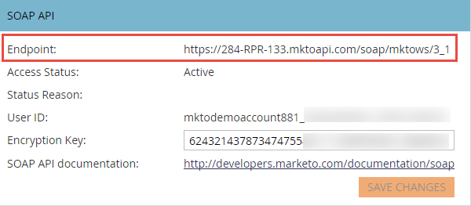
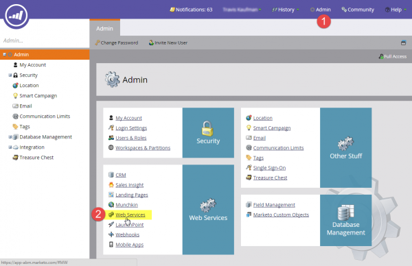
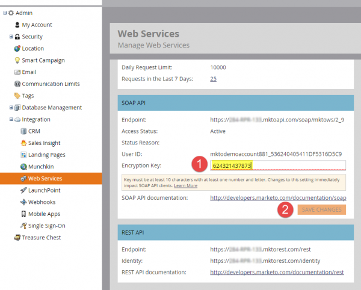

# SOAP-API

Die SOAP-API wird nicht mehr unterstützt und ist nach dem 31. Juli 2026 nicht mehr verfügbar. Alle neuen Entwicklungen sollten mit der Marketo [REST-API](../rest-api/rest-api.md) durchgeführt werden, und bestehende Services sollten bis zu diesem Datum migriert werden, um Unterbrechungen im Service zu vermeiden. Wenn Sie über einen Service verfügen, der die SOAP-API verwendet, finden Sie im SOAP-API[Migrationshandbuch](./migration.md) Informationen zur Migration.

## SOAP WSDL

Um das SOAP-WSDL-Dokument abzurufen, rufen Sie Ihren SOAP-API-Endpunkt über das Menü **[!UICONTROL Admin]** > **[!UICONTROL Integration]** > **[!UICONTROL Web-Services]** ab.

Ihre WSDL-URL lautet:

`<SOAP API Endpoint> + ?WSDL`

Verwenden Sie nicht den in der WSDL definierten Endpunkt. Jede Marketo-Instanz verfügt über einen eindeutigen Endpunkt, an den Sie Aufrufe ausführen können.

## Beschränkungen

- **Tägliches Kontingent:** Die meisten Abonnements erhalten 10.000 API-Aufrufe pro Tag (die täglich um 12 % :00AM zurückgesetzt werden). Sie können Ihr tägliches Kontingent über Ihren Account Manager erhöhen.
- **Ratenlimit:** API-Zugriff pro Instanz beschränkt auf 100 Aufrufe pro 20 Sekunden.
- **Parallelitätslimit:** maximal zehn gleichzeitige API-Aufrufe.

Unsere Empfehlung lautet, dass die Losgrößen nicht größer als 300 sind. Größere Größen werden nicht unterstützt und können zu Zeitüberschreitungen und in extremen Fällen zu Einschränkungen führen.

## SOAP-API-Einstellungen in Marketo

1. Gehen Sie zum Abschnitt **[!UICONTROL Admin]** und wählen Sie **[!UICONTROL Web-Services]** aus.

1. Legen Sie einen geeigneten [!UICONTROL Verschlüsselungsschlüssel] fest, wählen Sie **[!UICONTROL Änderungen speichern]** und verwenden Sie die Werte für die SOAP-API [!UICONTROL Endpunkt], [!UICONTROL Benutzer-ID] und [!UICONTROL Verschlüsselungsschlüssel], um für jeden SOAP-API-Aufruf die richtige [Authentifizierungssignatur](authentication-signature.md) zu generieren.

