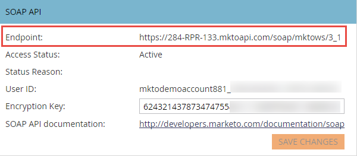

# SOAP-API

Die SOAP-API wird nicht mehr aktiv entwickelt. Die Aufrufe funktionieren weiterhin, aber unsere Entwicklung konzentriert sich auf die zukünftige Verwendung von [REST](https://developer.adobe.com/marketo-apis/).

Die Marketo SOAP API ermöglicht das Erstellen, Abrufen und Entfernen von Entitäten und Daten, die in Marketo gespeichert sind. Sie finden das [Marketo-SOAP-SDK](https://github.com/Marketo/SOAP-API-Java-Client) auf GitHub. Es gibt auch [Client-Bibliotheken](https://github.com/Marketo/Community-Supported-Client-Libraries), um Zeit zu sparen.

Neueste API-Version: 3_1

## SOAP WSDL

Um das SOAP WSDL-Dokument abzurufen, rufen Sie Ihren SOAP-API-Endpunkt über das Menü **[!UICONTROL Admin]** > **[!UICONTROL Integration]** > **[!UICONTROL Webdienste]** ab.

Ihre WSDL-URL lautet:

`<SOAP API Endpoint> + ?WSDL`

Verwenden Sie nicht den in der WSDL definierten Endpunkt. Jede Marketo-Instanz verfügt über einen eindeutigen Endpunkt, an den Aufrufe durchgeführt werden können.

## Beschränkungen

- **Tägliches Kontingent:** Die meisten Abonnements erhalten 10.000 API-Aufrufe pro Tag (die täglich um 12.00 Uhr CST zurückgesetzt werden). Sie können Ihr tägliches Kontingent über Ihren Kundenbetreuer erhöhen.
- **Ratenlimit:** API-Zugriff pro Instanz begrenzt auf 100 Aufrufe pro 20 Sekunden.
- **Begrenzung der Parallelität:**  Maximal zehn gleichzeitige API-Aufrufe.

Wir empfehlen, dass die Stapelgrößen nicht größer als 300 sind. Größere Größen werden nicht unterstützt und können dazu führen, dass Timeouts auftreten und in Extremfällen gedrosselt werden.

## SOAP API-Einstellungen in Marketo

1. Wechseln Sie zum Abschnitt **[!UICONTROL Admin]** und klicken Sie auf **[!UICONTROL Webdienste]**.

1. Legen Sie einen geeigneten [!UICONTROL Verschlüsselungsschlüssel] fest, klicken Sie auf **[!UICONTROL Änderungen speichern]** und verwenden Sie die Werte für die SOAP-API [!UICONTROL Endpoint], [!UICONTROL Benutzer-ID] und den [!UICONTROL Verschlüsselungsschlüssel], um die richtige [Authentifizierungssignatur](authentication-signature.md) für jeden SOAP API-Aufruf zu generieren.

