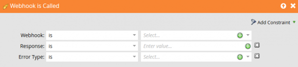

# Fehler

Auf dieser Seite werden Fehlerantwort-Codes für Marketo-Webhooks beschrieben und der Umgang mit Webhook-Fehlern erläutert.

Marketo generiert die Fehlercodes 1000 und 1001. Das vom Marketo-Webhook aufgerufene System gibt Antwort-Codes von 2xx bis 5xx zurück.

Marketo ordnet einem Feld nur dann Antwortwerte zu, wenn der Webservice einen 2xx-Antwort-Code zurückgibt. Wenn mit einer Webhook-Antwort Werte in einem Marketo-Lead-Datensatz geändert werden sollen, veranlassen alle anderen Antwort-Codes Marketo, die Antwort für Feldaktualisierungen zu ignorieren.

| Antwortcode | Beschreibung |
| --- | --- |
| 1.000 | Dies zeigt an, dass die Flussaktion „Webhook aufrufen“ in einer Batch-Kampagne gespeichert wird. Webhooks können nur aus Trigger-Kampagnen ausgelöst werden. |
| 1001 | Dies zeigt an, dass der Webservice einen leeren Antworttext ausgegeben hat. |

## Webhook-Fehler abfangen

Verwenden Sie den **[!UICONTROL Webhook wird aufgerufen]**-Trigger, um Webhook-Fehler zu erfassen und zu behandeln:

* **Response** - Die literale Antwort-Payload, die von der Anfrage empfangen wurde.
* **Fehlertyp** - Die Reason-Phrase der HTTP-Statusmeldung.

Verwenden Sie diese Werte, um auf vorhersehbare Fehler und Ausnahmen zu reagieren. Je nach integriertem Service können Sie automatisch einige Fehlerklassen wiederherstellen und Warnungen für unerwartete Fehler erstellen.
