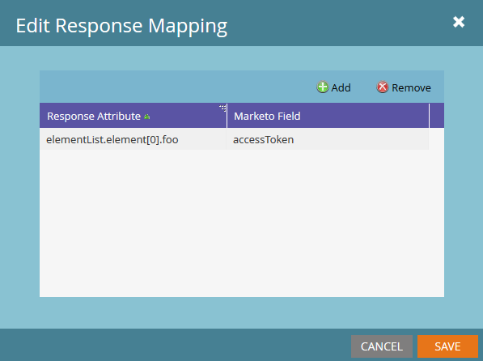

# Response Mappings

Marketo kann Daten, die von einem Webhook empfangen werden, aus zwei Inhaltstypen übersetzen und diese Werte an ein Lead-Feld zurückgeben: JSON und XML. Der Marketo-Feldparameter verwendet immer den [SOAP-API-Namen](../rest-api/fields.md) des Felds. Jeder Webhook kann über eine unbegrenzte Anzahl von Antwortzuordnungen verfügen, die hinzugefügt und bearbeitet werden, indem Sie auf die Schaltfläche [!UICONTROL Bearbeiten] im Bereich „Antwortzuordnungen“ Ihres Webhooks klicken:



Antwort-Mappings werden über eine Paarung aus einem „Antwort-Attribut“, dem Pfad zur gewünschten Eigenschaft im XML- oder JSON-Dokument und dem &quot;Marketo-Feld“ erstellt, das das Lead-Feld angibt, in das der Wert aus dem Antwort-Attribut geschrieben wurde.

Schlüssel für -Eigenschaften müssen aus alphanumerischen Zeichen, Bindestrichen (-), Unterstrichen (_), Doppelpunkt (:) und Leerzeichen bestehen, damit der Zugriff über Marketo-Antwortzuordnungen erfolgt.

## JSON-Zuordnungen

Der Zugriff auf JSON-Eigenschaften erfolgt mit Punktnotation, Array-Notation und -Notation. Die Array-Notation in Marketo akzeptiert keine Zeichenfolgen als Eingabe und nur Ganzzahlen. Um Daten aus einem JSON-Dokument abzurufen, muss der Antworttyp auf JSON festgelegt sein:

```json
{ "foo":"bar"}
```

Um in einer Antwortzuordnung auf die `foo`-Eigenschaft zuzugreifen, verwenden Sie die `name` der Eigenschaft, da sie sich auf der ersten Ebene des JSON-Objekts befindet, `foo`. So sieht das in Marketo aus:


Hier ist ein komplizierteres Beispiel mit einem Array:

```json
{
    "profileId" : 1234,
    "firstName" : "Jane",
    "lastName" : "Doe",
    "orders" : [
        {
            "orderId" : 5678,
            "orderDate" : "2015-01-01",
            "orderProductId" : "4982"
        },
        {
            "orderId" : 5678,
            "orderDate" : "2014-05-07",
            "orderProductId" : "4982"
        }
    ]
}
```

Wir möchten vom ersten Element des order-Arrays aus auf das orderDate zugreifen. Um auf diese Eigenschaft zuzugreifen, verwenden Sie Folgendes: `orders[0].orderDate`

## XML-Zuordnungen

Der Zugriff auf Werte ist über einzelne Elemente in XML-Dokumenten möglich. Diese verwendet Punktnotation ähnlich den JSON-Zuordnungen. Sehen wir uns dieses einfache Beispiel an:

```xml
<?xml version="1.0" encoding="UTF-8"?>
<example>
    <foo>bar</foo>
</example>
```

Um hier auf die foo-Eigenschaft zuzugreifen, verwenden Sie Folgendes: `example.foo`

Das Beispielelement muss vor dem Zugriff auf `foo` referenziert werden. Um auf eine Eigenschaft zuzugreifen, müssen alle Elemente in der Hierarchie in der Zuordnung referenziert werden. XML-Dokumente mit Arrays sind etwas komplizierter. Im folgenden Beispiel:

```xml
<?xml version="1.0" encoding="UTF-8"?>
<elementList>
    <element>
        <foo>baz</foo>
    </element>
    <element>
        <foo>bar</foo>
    </element>
    <element>
        <foo>bar</foo>
    </element>
</elementList>
```

Das Dokument besteht aus dem übergeordneten Array `elementList` mit untergeordneten Elementen, das eine Eigenschaft enthält: `foo`. Für Marketo-Antwortzuordnungen wird auf das -Array als `elementList.element` verwiesen, sodass der Zugriff auf die untergeordneten Elemente von elementList über `elementList.element[i]` erfolgt. Um den Wert „foo“ aus dem ersten untergeordneten Element von elementList abzurufen, verwenden wir das folgende Antwortattribut: `elementList.element[0].foo` Dadurch wird der Wert „baz“ an das angegebene Feld zurückgegeben. Der Versuch, auf Eigenschaften in Elementen zuzugreifen, die sowohl eindeutige als auch nicht eindeutige Elementnamen enthalten, führt zu undefiniertem Verhalten. Jedes Element muss eine einzelne Eigenschaft oder ein Array sein. Die Typen können nicht vermischt werden.

## Typen

Beim Zuordnen von Attributen zu Feldern müssen Sie sicherstellen, dass der Typ in Ihrer Webhook-Antwort mit dem Zielfeld kompatibel ist. Wenn der Wert in der Antwort beispielsweise eine Zeichenfolge ist und das ausgewählte Feld vom Typ Ganzzahl ist, wird der Wert nicht geschrieben. Informationen zu [Feldtypen](../rest-api/field-types.md).
