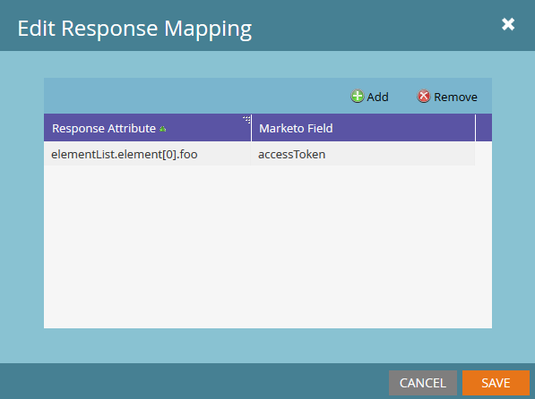
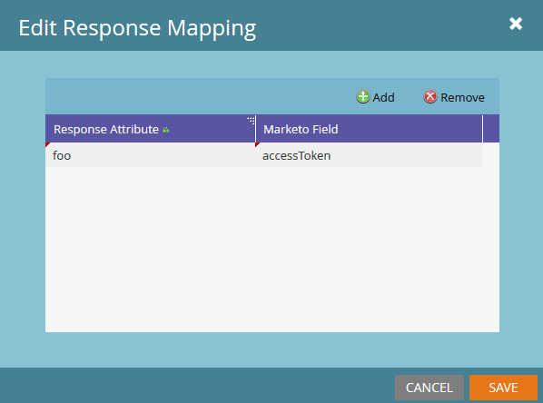

# Response Mappings

Marketo kann Webhook-Daten aus JSON oder XML übersetzen und die Werte in Lead-Felder schreiben. Der Marketo-Feldparameter verwendet immer den [SOAP-API-Namen des Felds](../rest-api/fields.md).

Jeder Webhook kann über eine unbegrenzte Anzahl von Antwortzuordnungen verfügen. Um Zuordnungen hinzuzufügen oder zu bearbeiten, wählen [!UICONTROL Bearbeiten] im Bereich Antwortzuordnungen des Webhooks aus:



Eine Antwort-Zuordnung paart diese Werte:

- „Antwort-Attribut“: Der Pfad zur gewünschten Eigenschaft im XML- oder JSON-Dokument.
- &quot;Marketo-Feld“: Das Lead-Feld, in das Marketo den Wert des Antwortattributs schreibt.

Um über Marketo-Antwortzuordnungen auf eine Eigenschaft zuzugreifen, darf ihr Schlüssel nur alphanumerische Zeichen, Bindestriche (-), Unterstriche (_), Doppelpunkte (:) und Leerzeichen enthalten.

## JSON-Zuordnungen

Greifen Sie auf JSON-Eigenschaften mit Punktnotation und Array-Notation zu. Die Marketo-Array-Notation akzeptiert nur Ganzzahlen, keine Zeichenfolgen.

Um Daten aus einem JSON-Dokument abzurufen, setzen Sie den Antworttyp auf JSON:

```json
{ "foo":"bar"}
```

Die `foo` befindet sich auf der ersten Ebene des JSON-Objekts. Verwenden Sie `foo` seine `name` im Antwort-Mapping:



Das folgende Beispiel enthält ein -Array:

```json
{
    "profileId" : 1234,
    "firstName" : "Jane",
    "lastName" : "Doe",
    "orders" : [
        {
            "orderId" : 5678,
            "orderDate" : "2015-01-01",
            "orderProductId" : "4982"
        },
        {
            "orderId" : 5678,
            "orderDate" : "2014-05-07",
            "orderProductId" : "4982"
        }
    ]
}
```

Um vom ersten Element des order-Arrays aus auf orderDate zuzugreifen, verwenden Sie `orders[0].orderDate`.

## XML-Zuordnungen

Greifen Sie mithilfe der Punktnotation auf Werte aus einzelnen XML-Elementen zu, ähnlich wie bei JSON-Zuordnungen. Sehen Sie sich dieses Beispiel an:

```xml
<?xml version="1.0" encoding="UTF-8"?>
<example>
    <foo>bar</foo>
</example>
```

Um auf die foo-Eigenschaft zuzugreifen, verwenden Sie `example.foo`.

Verweisen Sie auf das Beispielelement, bevor Sie auf `foo` zugreifen. Eine Zuordnung muss auf jedes Element in der Eigenschaftshierarchie verweisen.

Betrachten Sie das folgende Beispiel für ein XML-Dokument mit einem -Array:

```xml
<?xml version="1.0" encoding="UTF-8"?>
<elementList>
    <element>
        <foo>baz</foo>
    </element>
    <element>
        <foo>bar</foo>
    </element>
    <element>
        <foo>bar</foo>
    </element>
</elementList>
```

Das übergeordnete Array ist `elementList`. Jedes untergeordnete Element enthält die `foo`. Marketo-Antwortzuordnungen verweisen auf das -Array als `elementList.element` und greifen über `elementList.element[i]` auf seine untergeordneten Elemente zu.

Um den Wert von „foo“ aus dem ersten untergeordneten Element von „elementList“ abzurufen, verwenden Sie das Antwortattribut `elementList.element[0].foo`. Diese Zuordnung gibt den Wert „base“ an das angegebene Feld zurück.

Der Zugriff auf Eigenschaften in Elementen, die sowohl eindeutige als auch nicht eindeutige Elementnamen enthalten, führt zu undefiniertem Verhalten. Jedes Element muss entweder eine einzelne Eigenschaft oder ein Array sein. Die Typen nicht mischen.

## Typen

Stellen Sie beim Zuordnen von Attributen zu Feldern sicher, dass der Webhook-Antworttyp mit dem Zielfeld kompatibel ist. Marketo schreibt beispielsweise keinen Zeichenfolgenantwortwert in ein Feld vom Typ Ganzzahl. Weitere Informationen finden Sie unter [Feldtypen](../rest-api/field-types.md).
