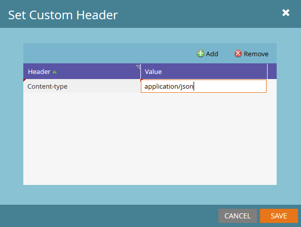

# Webhooks

Marketo-Webhooks kommunizieren mit Webdiensten von Drittanbietern. Ein Webhook verwendet das GET- oder POST-HTTP-Verb, um Daten an eine bestimmte URL zu senden oder von dieser abzurufen.

Anweisungen zum Erstellen eines Webhooks und Hinzufügen eines Webhooks zu einer Smart-Kampagne finden Sie unter:

- [Erstellen eines Webhooks](https://experienceleague.adobe.com/de/docs/marketo/using/product-docs/administration/additional-integrations/create-a-webhook)
- [Webhook aufrufen](https://experienceleague.adobe.com/de/docs/marketo/using/product-docs/core-marketo-concepts/smart-campaigns/flow-actions/call-webhook)
- [Verwenden eines Webhooks in einer intelligenten Kampagne](https://experienceleague.adobe.com/de/docs/marketo/using/product-docs/core-marketo-concepts/smart-campaigns/flow-actions/use-a-webhook-in-a-smart-campaign)

Konfigurieren Sie jeden Webhook mit den folgenden Eigenschaften:

- **[!UICONTROL URL]** - Die URL, an die Sie die Webdienstanfrage senden.
- **[!UICONTROL Request Type]** - die HTTP-Methode.
- **[!UICONTROL Payload-Vorlage]** - Die Vorlage für Informationen, die im POST-Textkörper gesendet werden. Verwenden Sie ein beliebiges Datenformat, das HTTP-POST unterstützt, einschließlich XML, JSON oder SOAP. Das Serialisierungsformat muss doppelte Anführungszeichen um Zeichenfolgen zulassen. Um ein Token einzufügen, wählen Sie **[!UICONTROL Token einfügen]**. Marketo schließt Token vom Typ Zeichenfolge automatisch in doppelte Anführungszeichen ein.
- **[!UICONTROL Request Token Encoding]** - Das Anfrageformat, JSON oder Formular/URL, das zum Codieren von Token-Werten verwendet wird, die Sonderzeichen wie ein kaufmännisches Und-Zeichen, &#39;&amp;&#39; enthalten. Wählen Sie die richtige Textcodierung aus, damit der Webhook korrekt mit dem Webservice kommuniziert.
- **[!UICONTROL Antworttyp]** - Das Antwortformat, JSON oder XML. Wählen Sie den richtigen Typ aus, um die Antworteigenschaften Lead-Feldern in Marketo zuzuordnen.
- **[!UICONTROL Benutzerdefinierte Kopfzeilen]** - Schlüssel-Wert-Paare, die als HTTP-Kopfzeilen über **[!UICONTROL Webhooks-Aktionen]** > **[!UICONTROL Benutzerdefinierte Kopfzeile festlegen]** hinzugefügt werden. Sie können eine beliebige Anzahl benutzerdefinierter Kopfzeilen hinzufügen.

Verwenden [Antwort-Zuordnungen](response-mappings.md) um Daten aus Web-Service-Antworten zurück in Leads zu schreiben.

## Token

Alle ausgehenden Webhook-Felder, einschließlich URL, Vorlage und benutzerdefinierte Kopfzeilen, füllen Token-Inhalte im selben Kontext wie der Flussschritt.

Lead- und System-Token sind immer verfügbar. Trigger-, Kampagnen- und Programm-Token sind in ihren jeweiligen Bereichen verfügbar. Weitere Informationen finden Sie unter:

- [Token – Übersicht](https://experienceleague.adobe.com/de/docs/marketo/using/product-docs/demand-generation/landing-pages/personalizing-landing-pages/tokens-overview)
- [Glossar zu System-Token](https://experienceleague.adobe.com/de/docs/marketo/using/product-docs/email-marketing/general/using-tokens/system-tokens-glossary)
- [Token für interessante Momente](https://experienceleague.adobe.com/de/docs/marketo/using/product-docs/marketo-sales-insight/msi-for-salesforce/features/tabs-in-the-msi-panel/interesting-moments/trigger-tokens-for-interesting-moments)

Wenn beispielsweise ein Programm oder eine Kampagne einer Drittanbieterressource zugeordnet ist, legen Sie eine ID auf Programmebene als `My Token` fest. Übergeben Sie dann die ID als Token in die Webhook-Anfrage.

## Benutzerdefinierte Header

Webhooks können mit einer ausgehenden Anfrage eine beliebige Anzahl an benutzerdefinierten Header-Feldern senden. Kopfzeilen über **[!UICONTROL Webhooks-Aktionen]** > **[!UICONTROL Benutzerdefinierte Kopfzeile festlegen]** hinzufügen.

Jede Kopfzeile ist ein Schlüssel-Wert-Paar und kann Token enthalten.

## Tipps

- Verwenden Sie den Schritt Webhook-Fluss aufrufen nur in Trigger-Kampagnen.
- Antwort-Mappings aktualisieren einen Datensatz nur, wenn der Webservice einen 2xx-HTTP-Antwort-Code zurückgibt.
- Sie können Webservices verwenden, um benutzerdefinierte Datenanreicherung, Validierung oder Normalisierung von internen oder externen Services aus durchzuführen.
- Die Webhook-Ausführungszeit hängt von der Antwortzeit des Services ab und kann zu langen Verzögerungen bei der Kampagnenausführung führen. Selbst wenn die Ausführung eines Services nur 50 ms dauert, dauern 100.000 Ausführungen 1,5 Stunden.
- Marketo wartet bis zu 30 Sekunden auf einen bestimmten Service-Aufruf, bevor der Aufruf beendet wird (auch als Zeitüberschreitung bezeichnet).
- Marketo übergibt die Zeichen im URL-Feld als geschrieben. Beispielsweise wird &quot;&amp;&quot; als &quot;&amp;&quot; und &quot;%26“ als &quot;%26“ gesendet.
  - Um ein Prozentzeichen an den Empfängerserver zu senden, müssen Sie explizit die Zeichenfolge übergeben, die dieses Zeichen darstellt.
